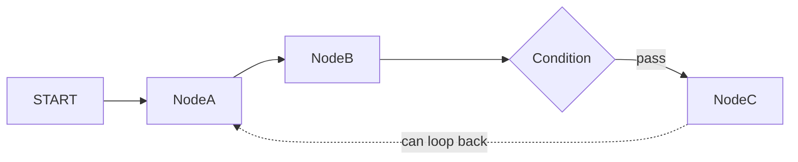
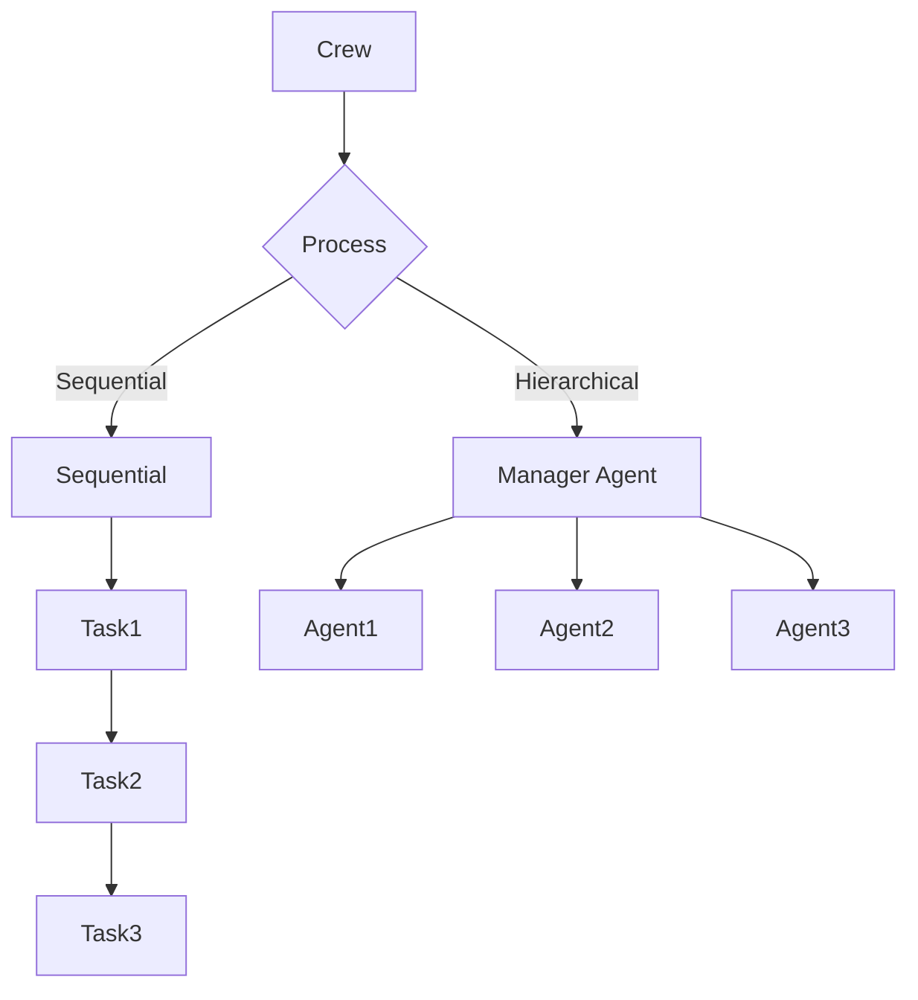
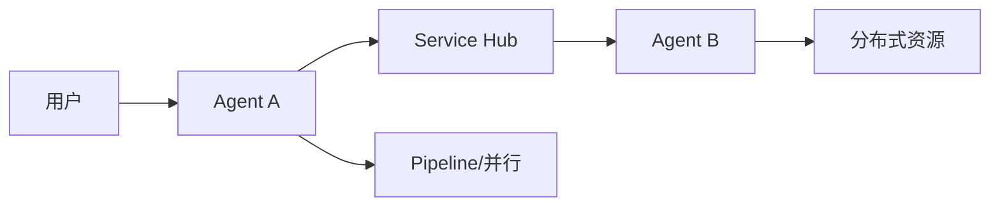
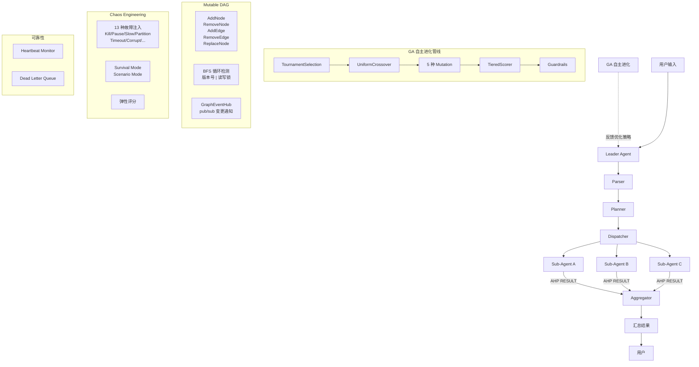
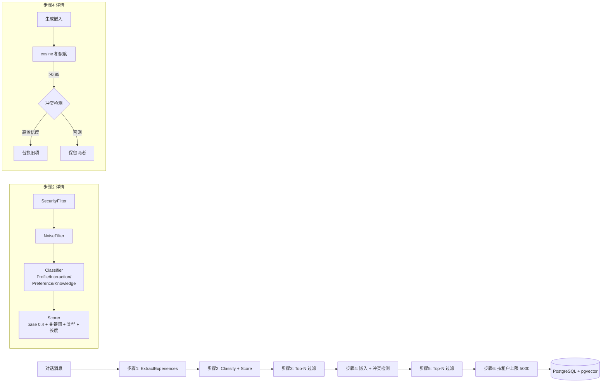
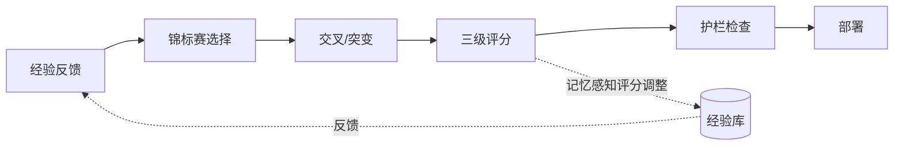
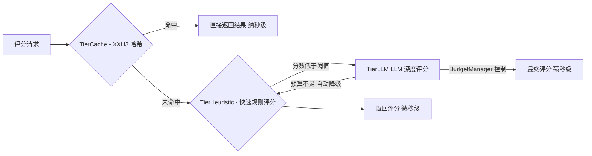
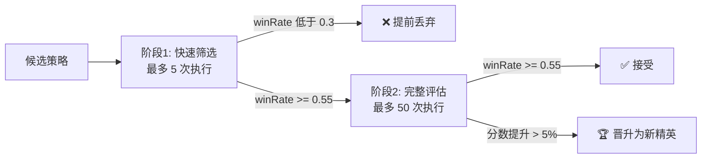
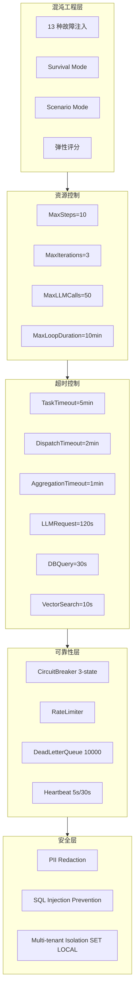
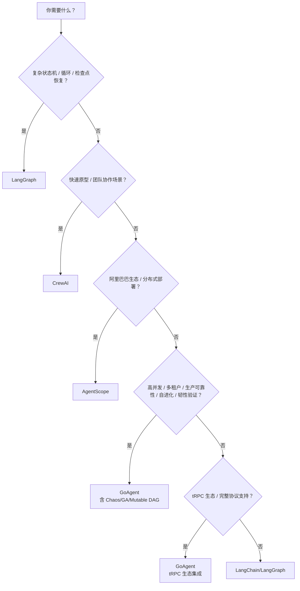

# 多智能体框架深度对比

> LangChain vs CrewAI vs AgentScope vs GoAgent (ARES) vs tRPC-Agent-Go

***

## 1. 概述

本文档对五个主流 AI Agent 框架进行真实、全面的技术对比：**LangChain（含 LangGraph）**、**CrewAI**、**AgentScope**、**GoAgent（ARES）** 和 **tRPC-Agent-Go**。对比维度涵盖技术栈、架构设计、工作流编排、多 Agent 协作、记忆系统、稳健性/生产就绪度、部署能力和社区成熟度。

***

## 2. 技术栈对比

| 维度 | LangChain / LangGraph | CrewAI | AgentScope | GoAgent (ARES) | tRPC-Agent-Go |
| ----------- | --------------------------------------------------------------------------- | ------------------------------------------------ | -------------------------------------- | --------------------------------------------- | --------------------------------------------- |
| **主要语言** | Python（主）、JavaScript/TypeScript | Python | Python | Go (1.26+) | Go (1.23+) |
| **核心依赖** | pydantic, langchain-core, langgraph, langserve | pydantic, crewaillm, langchain | alibaba/mpip (Kubernetes), Flask, etcd | pgx, gorilla/websocket, sqlite, mmh3, blake2b | tRPC 框架, otel, langfuse |
| **LLM 提供商** | 50+（OpenAI, Anthropic, Google, Cohere 等） | OpenAI, Anthropic, Google, Ollama, Groq 等 | OpenAI, ModelScope, DashScope 等 | OpenAI, Ollama, OpenRouter 等（plugin 扩展） | OpenAI, Ollama 等 |
| **向量数据库** | 30+（Pinecone, Chroma, Weaviate, Qdrant 等） | LanceDB, Chroma | 内置向量数据库 | PostgreSQL + pgvector (ivfflat 索引) | 内置存储、知识检索 |
| **文档加载器** | 100+（PDF, HTML, Markdown, CSV, JSON 等） | 少量内置 | 一般 | 无（面向代码/任务） | 无 |
| **通信协议** | REST (LangServe), SSE, gRPC 有限支持 | 进程内函数调用 | Service Hub 消息传递, gRPC | AHP 协议 | tRPC, A2A, AG-UI, MCP |
| **依赖管理** | 分层包 | 单包 | 单包 + 分布式依赖 | 单模块 + Go modules | tRPC-Go 模块 |

### 2.1 关键技术栈差异

**LangChain** 拥有最庞大的生态（1000+ 集成），这是其核心优势也是负担。分层包设计使得安装和依赖管理复杂化。

**CrewAI** 依赖轻量，强调开箱即用。底层使用了部分 LangChain 组件（如 LLM 调用）。

**AgentScope** 依托阿里巴巴技术栈，内置分布式通信能力（RPC、消息传递），对 Kubernetes 有良好支持。

**GoAgent** 完全使用 Go 编写，零 Python 依赖。利用 Go 的静态编译和 goroutine 并发模型，启动开销极低（毫秒级），无需 Python 运行时环境。

***

## 3. 架构设计

### 3.1 核心抽象对比

| 框架             | 核心抽象                         | 设计哲学             | 架构风格      |
| -------------- | ---------------------------- | ---------------- | --------- |
| **LangGraph**  | StateGraph（有环有向图）            | 图计算模型，节点=函数，边=转换 | 有状态图执行引擎  |
| **CrewAI**     | Crew + Agent + Task          | 团队协作隐喻，角色驱动      | 线性/层级管线   |
| **AgentScope** | Agent + Service Hub          | 分布式消息传递，服务化      | 分布式消息驱动   |
| **GoAgent (ARES)** | Leader-Sub Agent + DAG + AHP | 分布式任务编排，协议驱动 | 领导者-从属者架构 |
| **tRPC-Agent-Go** | GraphAgent + Runner + Agent | 服务友好，tRPC 原生 | Go 原生运行时 + 图工作流 |

### 3.2 架构示意图

#### LangGraph — 有环有向图



LangGraph 的核心是**有向图**。节点是处理步骤，边是控制流，支持**条件分支**和**循环**。检查点机制允许任意节点暂停和恢复。

#### CrewAI — 团队协作管线



CrewAI 以"团队"为组织单位。Crew 定义 Agent 集合和 Process 类型：

- **Sequential**: 任务按顺序执行，输出链式传递
- **Hierarchical**: 经理 Agent 动态分配任务并管理
- **Flow**: `@start`/`@listen` 装饰器驱动的事件化流程

#### AgentScope — 分布式消息传递



AgentScope 通过 Service Hub 实现 Agent 间的消息路由和解耦。支持单机多进程和分布式多节点部署。内置管道（Pipeline）模式实现有向无环图执行。

#### ARES — 领导者-从属者 + MutableDAG + Chaos + GA



GoAgent 采用领导者-从属者（Leader-Sub）架构，通过 AHP（Agent Heartbeat Protocol）协议进行通信。Leader 负责规划、分发和聚合结果；Sub-Agent 并行执行具体任务。

### 3.3 架构设计差异关键点

**LangGraph** 的图模型最灵活，支持复杂的状态机、循环和条件路由。代价是学习曲线陡峭，易用性较低。

**CrewAI** 的团队隐喻最直观，非技术人员也能理解。但灵活性受限，复杂场景需要 Hacks。

**AgentScope** 的分布式架构设计更适合企业级部署。但社区较小，中文文档为主，国际采用度有限。

**GoAgent** 的领导者-从属者模式最适合确定性任务分发。AHP 协议提供心跳检测和死信队列，这是其他三个框架都缺乏的**协议级可靠性保障**。

***

## 4. 工作流编排

### 4.1 工作流能力对比

| 能力              | LangGraph                | CrewAI                    | AgentScope    | GoAgent                                                                                  | tRPC-Agent-Go                         |
| --------------- | ------------------------ | ------------------------- | ------------- | ---------------------------------------------------------------------------------------- | ------------------------------------- |
| **DAG 支持**      | 原生支持                     | 仅 Sequential/Hierarchical | Pipeline 模式   | 原生 DAG                                                                                   | GraphAgent（Pregel 风格图，6 种节点类型）     |
| **条件分支**        | `add_conditional_edges`  | 无                         | Pipeline 条件节点 | 无（待实现）                                                                                   | `ConditionalFunc` / `MultiConditionalFunc` 路由 |
| **循环/环路**       | 原生支持                     | 不支持                       | 不支持           | 不允许（DAG 循环检测）                                                                            | ChainAgent（顺序链）、CycleAgent（带逃逸函数的循环）、ParallelAgent（并行） |
| **并行执行**        | 同一 super-step 内并行        | `async_execution=True`    | Pipeline 并行   | errgroup + semaphore                                                                     | sync.WaitGroup + mutex 并发                  |
| **子图嵌套**        | 支持（节点=子图）                | Flow 嵌套 Crew              | 不支持           | 不支持（待实现）                                                                                 | 支持（StateGraph 中 Agent 作为节点）              |
| **拓扑排序**        | 隐式（图遍历）                  | 不需要                       | 隐式            | Kahn 算法（显式）                                                                              | 隐式（Pregel 通道图遍历）                       |
| **热更新**         | 不支持                      | 不支持                       | 不支持           | fsnotify 文件监听 + 轮询                                                                       | 未记录                                     |
| **循环检测**        | 不检测（允许循环）                | 不检测                       | 不检测           | DFS + 递归栈                                                                                | 不需要（GraphAgent 支持循环）                    |
| **运行中图突变**      | 不支持                      | 不支持                       | 不支持           | 5 种操作 (AddNode/RemoveNode/AddEdge/RemoveEdge/ReplaceNode)，BFS 循环检测，GraphEventHub pub/sub | 不支持                                     |
| **人机交互 (HITL)** | `interrupt_before/after` | `human_input=True`        | 支持            | InterruptHandler + InterruptStore（持久化暂停恢复）                                               | 支持（基于会话的中断）                            |
| **步骤恢复策略**      | 不内置                      | 不内置                       | 不内置           | retry / replace\_node / fail\_fast 三种策略                                                  | 未记录                                     |
| **自进化**         | 不支持                      | 不支持                       | 不支持           | 完整 GA 流水线（6.4 节）                                                                          | Hermes 风格 SKILL.md 进化管线，5 个质量门控          |
| **MCP 支持**       | 不支持（可通过自定义工具）          | 不支持（可通过自定义工具）           | 不支持           | 不内置                                                                                     | 原生 mcptool 集成                            |
| **协议支持**        | REST（LangServe）, SSE       | 进程内函数调用                   | gRPC, Service Hub | AHP 协议                                                                                  | tRPC, A2A, AG-UI, MCP, OpenAI 兼容 API, Evaluation, PromptIter |

### 4.2 GoAgent DAG 特点

GoAgent 的 DAG 引擎具有以下特性：

- **显式循环检测**: 使用 DFS + 递归栈在构建时检测环，确保执行图始终有效
- **Kahn 拓扑排序**: 显式计算执行顺序，支持依赖分析和并行度优化
- **Semaphore 并发控制**: 同一层级无依赖的节点可并行执行，由信号量控制并发度
- **死锁检测**: 5 秒超时自动检测和回滚
- **热更新**: 通过 fsnotify 文件监听自动重载工作流配置，无需重启

```go
// DFS 循环检测
func (d *DAG) hasCycle() bool {
    visited := make(map[string]bool)
    recStack := make(map[string]bool)
    // ...
    for _, neighbor := range d.Edges[node] {
        if recStack[neighbor] { return true }  // 回边 → 环
        if !visited[neighbor] && dfs(neighbor) { return true }
    }
    // ...
}

// Kahn 算法拓扑排序
func (d *DAG) GetExecutionOrder() ([]string, error) {
    // 计算入度 → 从 0 入度节点开始 BFS
    // 结果数量 != 节点数量 → 环检测
}
```

#### 4.2.1 可变 DAG（Mutable DAG）

GoAgent 的 MutableDAG 在基础 DAG 之上增加了**运行时图突变**能力，这是其他三个框架完全不具备的特性：

```go
type MutableDAG struct {
    mu      sync.RWMutex
    dag     *DAG
    steps   map[string]*Step
    version uint64
    hub     *GraphEventHub
}
```

**5 种突变操作**：

| 操作            | 描述                  | 安全保证                           |
| ------------- | ------------------- | ------------------------------ |
| `AddNode`     | 添加步骤节点，验证依赖存在性并检查循环 | 失败时自动回滚已添加的边                   |
| `RemoveNode`  | 移除节点及其边，检查是否有其他节点依赖 | 有依赖者时返回 `ErrNodeHasDependents` |
| `AddEdge`     | 添加依赖边，检测循环          | BFS 循环检测，失败时回滚                 |
| `RemoveEdge`  | 移除依赖边               | 边不存在时返回 `ErrEdgeNotFound`      |
| `ReplaceNode` | 替换节点（热迁移）           | 保留依赖关系，无缝切换                    |

**循环检测**：使用 BFS（广度优先搜索）进行循环检测，避免 DFS 递归栈溢出风险。

**事件总线**：每次突变通过 GraphEventHub 发布 `GraphEvent`，支持实时监控和响应。

**应用模式**：

- **ApplyAtCheckpoint**（默认）：每个步骤完成后重新计算执行顺序，适合批处理场景
- **ApplyImmediate**：每个步骤开始前重新计算执行顺序，适合实时响应场景

**对比**：LangChain、CrewAI、AgentScope **全都不具备**运行时图突变能力。GoAgent 的 Mutable DAG 是唯一支持在运行中动态更改工作流拓扑的框架。

### 4.3 LangGraph 检查点机制

LangGraph 的状态管理是四个框架中最先进的：

- **检查点持久化**: 每执行一个 super-step，自动将状态保存到 PostgreSQL/SQLite
- **状态回放**: 可以从任意检查点恢复执行
- **人机交互**: 通过 `interrupt_before` / `interrupt_after` 暂停执行等待人工输入
- **3 种持久化级别**: `durable`（每次写入）、`recent`（最新写入）、`off`（不持久化）

这是 GoAgent 当前的主要差距——状态在内存中，崩溃即丢失。

### 4.4 GoAgent 动态执行器与恢复

GoAgent 的 DynamicExecutor 扩展了基础执行器，支持**运行中图突变 + 步骤级恢复**：

```go
type DynamicExecutor struct {
    *Executor
    applyMode       ApplyMode
    hitlHandler     InterruptHandler
    hitlStore       InterruptStore
    recoveryHandler StepRecoveryHandler
}
```

**步骤恢复处理器**——三种策略：

| 策略                | 行为                  | 适用场景              |
| ----------------- | ------------------- | ----------------- |
| **retry**         | 按指数退避重试失败步骤（最多 3 次） | 临时错误（网络抖动、LLM 超时） |
| **replace\_node** | 用备用步骤替换失败节点并继续执行    | 某个 Agent 或工具不可用时  |
| **fail\_fast**    | 立即报告失败并停止整个执行       | 业务关键步骤不可跳过时       |

**人机交互（HITL）**——支持在任意步骤暂停等待人工审批，InterruptStore 持久化暂停状态，使 HITL 能在崩溃后恢复：

```go
type InterruptPoint struct {
    StepID  string
    Message string
    Payload map[string]any
}

type InterruptResult struct {
    Approved bool
    Feedback string
    Data     map[string]any
}
```

***

## 5. 多 Agent 协作模式

### 5.1 协作模式对比

| 模式          | LangGraph | CrewAI               | AgentScope     | GoAgent               | tRPC-Agent-Go                              |
| ----------- | --------- | -------------------- | -------------- | --------------------- | ------------------------------------------ |
| **监督者/协调者** | 子图组合      | Hierarchical Process | Service Hub    | Leader Agent          | Runner + 链/并行/循环 Agent 组合                  |
| **点对点通信**   | 共享状态      | 任务输出链式传递             | 消息路由           | AHP 点对点               | 子 Agent 组合，A2A 远程 Agent 协议                  |
| **任务分发**    | 图节点调度     | 经理 Agent 动态分配        | Pipeline 分发    | Dispatcher + errgroup | 链式/并行/循环执行模式                              |
| **结果聚合**    | 状态合并      | 任务输出链式传递             | 消息聚合           | Aggregator（去重+排序）     | Runner 通过事件通道收集结果                          |
| **确定性**     | 高（图结构定义）  | 低（LLM 动态决策）          | 中（Pipeline 定义） | 高（关键词触发分发）            | 高（类型安全图，确定性路由）                             |

### 5.2 协作确定性对比

**GoAgent** 的协作模式确定性最高：

- Leader 基于**触发关键词**（`trigger_on`）进行 Agent 选择
- Planner 依据**规则**而非 LLM 进行任务规划
- Aggregator 使用**确定性算法**（去重+排序）而非 LLM 进行结果合并

**CrewAI** 的协作确定性最低：

- 经理 Agent 使用 LLM 动态分配任务
- 输出格式取决于 LLM 生成质量
- 任务之间的上下文依赖链复杂且不可控

**LangGraph** 的图结构提供了确定性控制流，但节点内部的 LLM 调用仍不具确定性。

**AgentScope** 通过 Pipeline 提供中等确定性，消息传递路径可预定义。

### 5.3 AHP 协议通信

GoAgent 的 AHP 协议是四个框架中**唯一提供协议级通信保障**的：

| 消息类型      | 用途                | 频率     |
| --------- | ----------------- | ------ |
| TASK      | Leader 向 Sub 分发任务 | 按需     |
| RESULT    | Sub 向 Leader 返回结果 | 按需     |
| PROGRESS  | Sub 报告任务进展        | 可选，可配置 |
| ACK       | 消息确认              | 每消息    |
| HEARTBEAT | 保活检测              | 每 5 秒  |

**心跳检测**: 每 5 秒发送心跳，30 秒无响应则标记为离线，触发任务重分发。
**死信队列 (DLQ)**: 失败消息进入 DLQ（上限 10000），DLQProcessor 执行重试或记录异常。

***

## 6. 记忆系统

### 6.1 记忆能力对比

| 维度        | LangChain/LangGraph     | CrewAI                            | AgentScope | GoAgent                | tRPC-Agent-Go                        |
| --------- | ----------------------- | --------------------------------- | ---------- | ---------------------- | ------------------------------------ |
| **短期记忆**  | 检查点状态                   | 当前运行上下文                           | 会话消息历史     | Session Memory（内存）     | 会话状态（10+ 后端）                        |
| **长期记忆**  | Store (PostgresStore 等) | LanceDB 向量存储                      | 内置存储       | PostgreSQL + pgvector  | 记忆服务，12 个后端                         |
| **实体记忆**  | 不支持                     | Knowledge Graph                   | 不支持        | MemoryProfile 类型       | 制品系统，知识库                            |
| **去重**    | 不支持                     | cosine > 0.85 LLM 决策              | 不支持        | cosine > 0.85 冲突检测     | 未记录                                  |
| **重要性评分** | 不支持                     | `0.5*sim + 0.3*recency + 0.2*llm` | 不支持        | 关键词+类型+长度规则            | 未记录                                  |
| **知识蒸馏**  | 不支持                     | 不支持                               | 不支持        | 6 步自动管线                | 未记录                                  |
| **多租户隔离** | namespace 元组            | 不支持                               | 不支持        | PostgreSQL `SET LOCAL` | 会话隔离，按用户/应用分割                       |

### 6.2 GoAgent 记忆蒸馏管线

GoAgent 的自动记忆蒸馏管线是独特优势：



**步骤2 详情**: SecurityFilter → NoiseFilter → Classifier (Profile/Interaction/Preference/Knowledge) → Scorer (base 0.4 + 关键词 + 类型 + 长度)

**步骤4 详情**: 生成嵌入 → cosine 相似度 → >0.85 触发冲突检测 → 高置信度替换旧项 / 否则保留两者

### 6.3 CrewAI 记忆召回

```python
# 复合评分: 0.5*语义相似度 + 0.3*时间衰减 + 0.2*LLM 评估
score = 0.5 * semantic_similarity + 0.3 * recency_decay + 0.2 * llm_importance
```

**关键差异**:

- GoAgent 的函数记忆是**自动管线**（规则驱动，纳秒级），CrewAI 是 **LLM 辅助**（更准确但更慢、更贵）
- GoAgent 有多**租户隔离**（PostgreSQL `SET LOCAL`），其他框架不具备
- LangGraph 的 Store 最灵活（namespace 元组），但无自动蒸馏
- AgentScope 的记忆系统最基础

***

### 6.4 GoAgent 自主进化（遗传算法流水线）

GoAgent 是**唯一**内置完整遗传算法（GA）自主进化能力的框架，通过 `ares_evolution` 包实现策略的自动优化和演化：



**锦标赛选择**（TournamentSelection）：随机抽取 k 个候选，返回最优者，重复 n 次。k=3 为默认，增大 k 增加选择压力。

**均匀交叉**（UniformCrossover）：每个参数以 50% 概率从父 A 或父 B 继承，支持三种 Prompt 继承模式：`PromptInherit`（继承高分父代）、`PromptHalfSplit`（前/后半句拼接）、`PromptUniform`（随机等概率选择）。

**5 种突变类型**：

| 类型            | 影响范围   | 描述                                             |
| ------------- | ------ | ---------------------------------------------- |
| **Parameter** | LLM 参数 | 改变 temperature、top\_k、max\_steps 等（从预定义范围随机选取） |
| **Prompt**    | 行为提示   | 对 PromptTemplate 进行文本变换                        |
| **Tool**      | 工具配置   | 替换工具的参数配置                                      |
| **Crossover** | 基因组合   | 两个父策略组合产生子策略                                   |
| **Root**      | 初始基线   | 起点策略，非突变产生                                     |

**自适应分布**（AdaptiveDistribution）：根据种群多样性动态调整突变率。多样性低时强制提高突变率（最高 2.5x），高时衰减。FitnessSharing 通过共享适应度惩罚相似个体，维持种群多样性。

**三级评分器**（TieredScorer）——三种成本渐进的评分层级：



**记忆感知评分**（MemoryAwareScorer）：在三级评分基础上，根据历史经验库添加证据奖励和成本/延迟惩罚：

```
最终得分 = 基础分 + 0.2 × evidenceBonus - 0.1 × strategyCost - 0.05 × latencyPenalty
```

**Dream Cycle 两阶段评估**：



未通过阶段 1 的候选直接被丢弃，节省 LLM 调用成本。

**进化护栏**（EvolutionGuardrails）：在每个进化周期前后运行安全检查：

| 规则    | 触发条件           | 动作               |
| ----- | -------------- | ---------------- |
| 基线回归  | 新策略分数低于基线的 80% | Critical 告警，停止进化 |
| 停滞检测  | 连续 10 代无改进     | Warning 告警，建议调参  |
| 分数波动  | 后代分数标准差 > 0.3  | Info 提示          |
| 最大世代数 | 达到配置上限         | 停止进化，归档          |

**谱系追踪**（Lineage）：每个子策略记录父策略 ID、突变类型、胜率和分数增量，形成完整的进化族谱：

```
ParentID → ChildID → MutationType → WinRate → ScoreImprovement → Timestamp
```

**对比**：LangChain、CrewAI、AgentScope **全都不具备**任何形式的自主进化或遗传算法能力。GoAgent 的这一特性使其能够在生产环境中持续自我优化，无需人工调参。

***

## 7. 工具调用与可靠性

### 7.1 错误处理机制对比

| 机制       | LangGraph      | CrewAI                         | AgentScope | GoAgent                                        | tRPC-Agent-Go                            |
| -------- | -------------- | ------------------------------ | ---------- | ---------------------------------------------- | ---------------------------------------- |
| **重试**   | `with_retry()` | `max_retry_limit=2`            | 基础重试       | 3 次指数退避                                        | 通过进化管线支持                                 |
| **超时**   | 不内置            | `max_execution_time`           | 不内置        | 分层超时 (LLM 120s, DB 30s, Vector 10s)            | 未记录                                      |
| **输出验证** | 不内置            | `output_pydantic` + Guardrails | 不内置        | Schema Validator                               | 基于模式的输出验证                               |
| **降级策略** | `fallbacks`    | 不内置                            | 不内置        | FailoverClient (多供应商 + 限流冷却)                   | 未记录                                      |
| **熔断器**  | 不支持            | 不支持                            | 不支持        | 3 状态机 (Closed/Open/HalfOpen)                   | 未记录                                      |
| **死信队列** | 不支持            | 不支持                            | 不支持        | DLQ + DLQProcessor                             | 支持（通过 Runner 事件路由）                        |
| **人机交互** | `interrupt()`  | `human_input=True`             | 支持         | HITL（InterruptHandler + InterruptStore，崩溃后可恢复） | 支持                                       |
| **混沌工程** | 不支持            | 不支持                            | 不支持        | 13 种故障注入 + Survival 模式 + Scenario 模式 + 做市混沌    | 未记录                                      |

### 7.2 GoAgent 熔断器实现

```go
func (cb *CircuitBreaker) AllowRequest() bool {
    switch cb.state {
    case StateClosed:
        return true
    case StateOpen:
        if time.Since(cb.lastFailure) > cb.timeout {
            // CAS 原子转换到 HalfOpen
            atomic.CompareAndSwapInt32(&cb.state, StateOpen, StateHalfOpen)
            return true  // 允许探测请求
        }
        return false
    case StateHalfOpen:
        // CAS 确保只有一个请求通过
        return atomic.CompareAndSwapInt32(&cb.halfOpenInflight, 0, 1)
    }
}
```

### 7.3 GoAgent 重试与验证

```go
func (e *taskExecutor) executeWithLLM(ctx context.Context, task *models.Task) (*models.TaskResult, error) {
    for attempt := 0; attempt < e.maxRetries; attempt++ {
        result, err := e.llmClient.Generate(ctx, task.Prompt)
        if err != nil { continue }

        if err := e.validator.Validate(result); err != nil {
            if e.strictMode { return nil, err }
            if e.retryOnFail { continue }
        }
        return result, nil
    }
    return e.executeByType(ctx, task)  // 降级
}
```

**结论: GoAgent 在工具调用可靠性方面领先其他框架一个身位**。熔断器、死信队列、分层超时、自动降级这四项能力，其他三个框架完全不具有。

### 7.4 GoAgent 混沌工程（Chaos Engineering）

GoAgent 是**唯一**内置混沌工程层的框架，通过 `ares_arena` 包实现系统韧性的主动验证。这不仅是测试工具，而是与运行时深度集成的生产级混沌工程平台：

**13 种故障注入类型**：

| 类型         | 常量                       | 影响                  |
| ---------- | ------------------------ | ------------------- |
| 杀死领导 Agent | `ActionKillLeader`       | 停止 Leader，触发重新选举    |
| 杀死子 Agent  | `ActionKillAgent`        | 按 ID 停止指定 Sub-Agent |
| 移除 DAG 节点  | `ActionRemoveNode`       | 从工作流图中删除步骤          |
| 移除 DAG 边   | `ActionRemoveEdge`       | 从工作流图中删除依赖边         |
| 暂停 Agent   | `ActionPauseAgent`       | 暂停 Agent 但不停止       |
| 恢复 Agent   | `ActionResumeAgent`      | 恢复已暂停的 Agent        |
| 慢化 Agent   | `ActionSlowAgent`        | 注入人为延迟，模拟慢响应        |
| 杀死编排器      | `ActionKillOrchestrator` | 停止编排层，测试降级          |
| 网络分区       | `ActionNetworkPartition` | 模拟网络隔离              |
| 工具超时       | `ActionToolTimeout`      | 模拟工具调用超时            |
| 内存损坏       | `ActionMemoryCorrupt`    | 模拟内存状态异常            |
| MCP 断开     | `ActionMCPDisconnect`    | 模拟 MCP 连接中断         |
| LLM 故障     | `ActionLLMFailure`       | 模拟 LLM 调用失败         |

**两种运行模式**：

**Survival 模式**（生存模式）：在指定时间段内以固定间隔随机注入故障，测试系统在持续攻击下的自愈能力：

```go
func (s *Service) RunSurvival(ctx context.Context, cfg SurvivalConfig) SurvivalReport
// cfg.Duration 默认 30 分钟，Interval 默认 10 秒
// 返回 ResilienceScore（弹性评分）+ 完整时间线
```

**Scenario 模式**（场景模式）：通过 YAML 文件精确定义故障注入场景，支持依赖关系和结果验证：

```yaml
name: "leader-failover-test"
actions:
  - delay: 5s
    action:
      type: kill_leader
  - delay: 2s
    action:
      type: kill_agent
      target_id: "sub-oracle"
    expect_success: true
  - delay: 30s
    action:
      type: kill_orchestrator
```

**做市混沌**（Market-making Chaos）：在 `api/marketmaking/chaos.go` 中，针对做市系统的特殊故障注入（延迟注入、拒绝注入、数据过期注入、网络分区），验证交易系统韧性。

**弹性评分**：每次执行后生成 ResilienceScore（0-100），综合通过率、恢复时间和影响范围。

**对比**：LangChain、CrewAI、AgentScope **全都不具备**任何形式的混沌工程能力。GoAgent 是唯一能够在生产环境中系统性验证 Agent 系统韧性的框架。

***

## 8. 生产就绪度

### 8.1 生产级特性对比

| 特性            | LangChain/LangGraph | CrewAI  | AgentScope    | GoAgent                                            | tRPC-Agent-Go                                    |
| ------------- | ------------------- | ------- | ------------- | -------------------------------------------------- | ------------------------------------------------ |
| **语言**        | Python              | Python  | Python        | Go                                                 | Go                                               |
| **并发模型**      | asyncio             | asyncio | asyncio + 多进程 | goroutine + channel                                | goroutine + channel + 协程池 (ants/v2)            |
| **连接池**       | 通过 psycopg 等        | 不支持     | 内置连接管理        | 自定义池 (MaxOpen=25)                                  | tRPC 连接池                                        |
| **熔断器**       | 不支持                 | 不支持     | 不支持           | 3 状态机                                              | 未记录                                              |
| **限流**        | 不内置                 | 不支持     | 不内置           | TokenBucket/SlidingWindow/Semaphore                | 未记录                                              |
| **多租户隔离**     | namespace           | 不支持     | 不支持           | PostgreSQL RLS + SET LOCAL                         | 会话隔离，按用户分割                                     |
| **PII 脱敏**    | 不内置                 | 不内置     | 不内置           | 正则脱敏 (API key/email/phone/SSN)                     | 未记录                                              |
| **SQL 注入防护**  | N/A                 | N/A     | N/A           | 表名正则 + 关键词检测                                       | N/A                                               |
| **可观测性**      | LangSmith（付费）       | 基础日志    | 基础日志          | Tracer + Metrics (Prometheus)                      | OpenTelemetry（链路+指标）+ Langfuse 追踪，7 个子包         |
| **混沌工程**      | 不支持                 | 不支持     | 不支持           | ares\_arena: 13 种故障注入 + Survival + Scenario + 弹性评分 | 未记录                                              |
| **自主进化 (GA)** | 不支持                 | 不支持     | 不支持           | 锦标赛选择 + 均匀交叉 + 5 种突变 + 三级评分 + Dream Cycle          | Hermes 风格 SKILL.md 进化管线，5 个质量门控                |
| **部署方式**      | LangGraph Platform  | 本地/容器   | Kubernetes 优先 | Docker 容器化                                         | tRPC 服务部署，6 个协议服务器                              |
| **启动开销**      | 高（加载LangChain生态）    | 中       | 中             | 低（原生 Go 编译）                                        | 低（原生 Go 编译）                                     |
| **错误包装**      | 无专门机制               | 无专门机制   | 无专门机制         | 错误包装 (69ns/op, 0 alloc)                            | tRPC 错误处理约定                                     |

### 8.2 GoAgent 多层防护栈



### 8.3 可观测性

**LangChain/LangGraph**: LangSmith 提供最完善的可观测性——全链路追踪、评估管理、模型对比、回放调试。但这是**付费**服务。

**CrewAI**: 仅有基础日志，无专门可观测性平台。

**AgentScope**: 提供基础日志和监控能力。

**GoAgent**: 内置 OpenTelemetry 链路追踪 + Prometheus 指标（counters/histograms/gauges/summary）+ 成本追踪。全部开源免费。

***

## 9. 社区与生态成熟度

| 指标               | LangChain                         | CrewAI   | AgentScope | GoAgent    | tRPC-Agent-Go                            |
| ---------------- | --------------------------------- | -------- | ---------- | ---------- | ---------------------------------------- |
| **GitHub Stars** | \~100,000+                        | \~40,000 | \~4,000    | 早期         | \~1,500                                  |
| **主要贡献者**        | 1,200+                            | 300+     | \~50       | 1          | \~20                                     |
| **许可证**          | MIT                               | MIT      | Apache 2.0 | Apache 2.0 | Apache 2.0                               |
| **首次发布**         | 2022年10月                          | 2023年    | 2024年      | 2026年      | 2025年                                   |
| **当前版本**         | v0.3.x (Python)                   | v0.8x+   | v0.x       | v0.2.3     | v0.x                                     |
| **集成生态**         | 1,000+ 官方+社区                      | 50+ 内置工具 | 有限         | 可扩展插件      | MCP 工具、函数工具、20+ 内置工具                   |
| **月下载量**         | >1500万                            | >500万    | 未知         | 未知         | 未知                                      |
| **融资背景**         | Benchmark A轮 $2500-3500万          | 独立开发     | 阿里巴巴集团     | 开源项目       | tRPC Group（腾讯）                           |
| **企业采用**         | JPMorgan, IBM, Salesforce, Airbnb | 中小团队为主   | 阿里内部+合作伙伴  | 待增长        | tRPC 生态用户                               |
| **文档质量**         | 广泛但不一致（新旧API混用）                   | 清晰，入门友好  | 中文文档为主     | 中英文文档      | 中英文文档                                  |

***

## 10. 优劣势总结

### 10.1 LangChain/LangGraph

**优势**:

- 最大的生态（1000+ 集成），极致的模型无关性
- LCEL `|` 管道语法优雅直观
- LangGraph 最先进的状态管理（检查点、回放、人机交互）
- RAG 管线最全面，支持所有主流策略
- 社区规模最大，学习和解决问题的资源最多

**劣势**:

- 抽象层过多，报错信息难以追踪
- API 破坏性变更频繁，维护成本高
- 性能开销大（多层抽象增加调用栈深度）
- "万金油"模式：广度足够但深度不足
- LangSmith 收费

### 10.2 CrewAI

**优势**:

- 入门门槛低，团队隐喻直观
- 角色驱动设计让 Agent 行为更可理解
- 内置 50+ 工具，开箱即用
- Flow 模式（`@start`/`@listen`）提升了灵活性

**劣势**:

- 确定性低，LLM 决策结果不可控
- 缺乏熔断器、DLQ 等生产级特性
- Python GIL 限制并发性能
- 复杂场景下灵活性不足
- 记忆系统依赖 LLM，成本高

### 10.3 AgentScope

**优势**:

- 分布式架构原生支持多机部署
- 与阿里云/ModelScope 生态深度集成
- 消息驱动设计适合松耦合系统
- Pipeline 模式对确定性任务友好

**劣势**:

- 社区较小，国际影响力有限
- 文档以中文为主
- 缺少生产级可靠性机制（熔断、DLQ 等）
- 函数记忆系统较基础
- 非阿里巴巴生态用户集成困难

### 10.4 GoAgent (ARES)

**优势**:

- **Go 原生并发**: goroutine + channel，充分利用多核，无 GIL 限制
- **AHP 协议**: 唯一协议级通信保障——心跳检测 + 死信队列 + 消息确认
- **生产就绪度最高**: 熔断器、限流器、PII 脱敏、SQL 注入防护、多租户隔离——全部内置
- **自动记忆蒸馏**: 6 步规则管线，纳秒级延迟，无 LLM 调用成本
- **低启动开销**: Go 静态编译，毫秒级启动
- **热更新**: fsnotify 文件监听，无需重启
- **混沌工程**: 内置 ares\_arena 混沌工程层，13 种故障注入 + Survival/Scenario 模式 + 做市混沌 + 弹性评分，唯一具备生产级韧性验证的框架
- **自主进化 (GA)**: 完整遗传算法流水线——锦标赛选择、均匀交叉、5 种突变类型、自适应分布、引导突变、三级评分（Cache/Heuristic/LLM）、记忆感知评分、Dream Cycle 两阶段评估、FitnessSharing、进化护栏和谱系追踪
- **可变 DAG**: 5 种运行时图突变操作（AddNode/RemoveNode/AddEdge/RemoveEdge/ReplaceNode）、BFS 循环检测、GraphEventHub 事件总线、DynamicExecutor 双模式、StepRecoveryHandler 三种恢复策略、HITL 人机交互

**劣势**:

- **项目早期**: v0.2.3，2 名贡献者，生态远未建立
- **缺少状态检查点**: 状态在内存中，崩溃即丢失
- **缺少循环支持**: DAG 禁止环路，无法实现 LangGraph 的 Agent 循环
- **自主进化尚在早期**: 遗传算法流水线处于 v0.1 阶段，大规模生产验证尚在进行中
- **条件边未完全实现**: 工作流动态路由能力有限
- **社区小**: 学习资源、第三方集成、插件生态远不如 LangChain

***

### 10.5 tRPC-Agent-Go

**定位**: Go 原生生产级 Agent 框架，与 tRPC 微服务生态深度集成。

**优势**:
- **Go 原生**: 完整的 goroutine 并发模型，静态编译，无 GIL 限制
- **tRPC 生态集成**: 原生 tRPC 协议支持，与 tRPC-Go 微服务无缝集成
- **丰富的 Agent 类型**: 6 种内置类型（GraphAgent、LLMAgent、ChainAgent、ParallelAgent、CycleAgent、A2AAgent）覆盖所有主流多 Agent 模式
- **Pregel 风格图引擎**: 6 种节点类型、SHA-256 屏障同步、条件路由、完整状态图（30+ 选项）
- **生产级可观测性**: OpenTelemetry + Langfuse 追踪、Prometheus 指标，7 个可观测性子包
- **完整工具系统**: 3 层接口（Tool/CallableTool/StreamableTool）、20+ 内置工具、MCP 原生集成
- **12 个记忆后端**: inmemory、mysql/mysqlvec、pgvector/postgres、redis、sqlite/sqlitevec、tencentdb、mem0、extractor、tool
- **6 个协议服务器**: A2A、AG-UI、OpenAI 兼容、Evaluation、PromptIter、tRPC——完整协议覆盖
- **完整基础设施**: 评估框架（10 个子包）、会话管理（10+ 后端）、技能/进化系统

**劣势**:
- **早期阶段**: 2025 年首次发布，社区和生态远小于成熟框架
- **LLM 提供商有限**: 主要为 OpenAI/Ollama，集成数量远少于 LangChain 的 50+
- **无文档加载器**: 无内置文档处理能力（面向代码/任务）
- **部分可靠性特性未记录**: 熔断器、限流、重试/超时等细节未充分文档化
- **依赖 tRPC 生态**: 在 tRPC-Go 服务基础设施中才能发挥最大价值

***

## 11. 选型建议

### 决策树



### 一句话定位

| 框架                      | 定位             | 最适合                            | 不擅长          |
| ----------------------- | -------------- | ------------------------------ | ------------ |
| **LangChain/LangGraph** | 最大生态的图计算引擎     | 复杂有状态工作流、RAG 管线                | 轻量场景（太重）     |
| **CrewAI**              | 团队协作模拟器        | 快速原型、角色扮演                      | 生产部署、高确定性    |
| **AgentScope**          | 分布式 Agent 框架   | 阿里生态、多机部署                      | 非阿里环境、国际团队   |
| **tRPC-Agent-Go**        | Go 原生生产级 Agent 框架   | tRPC 生态团队、A2A/MCP 协议需求 | 需要循环/状态回滚的场景 |
| **GoAgent**             | 分布式 Agent 编排引擎 | 高并发、多租户、协议级通信、混沌工程、自主进化、可变 DAG | 需要循环/状态回滚的场景 |

***

## 12. 2026 年行业趋势

| 趋势               | 描述                                                               |
| ---------------- | ---------------------------------------------------------------- |
| **Python → 多语言** | SK 已支持 C#/Python/Java，GoAgent 的选择符合方向                            |
| **单节点 → 分布式**    | AutoGen 0.4 加入分布式运行时，GoAgent 的 AHP 原生支持                          |
| **对话 → 工作流**     | CrewAI 从 Crew 扩展到 Flow，图模型成为终极形式                                 |
| **记忆成为核心**       | 所有框架在加强记忆能力，仅 GoAgent 有自动化蒸馏                                     |
| **可观测性标准化**      | LangSmith 绑定 LangGraph，开源替代方案涌现                                  |
| **安全从可选到必需**     | PII 脱敏、注入检测、沙箱执行成为标配                                             |
| **自主进化 (GA)**    | GoAgent 是唯一内置 GA 流水线的框架——锦标赛选择、均匀交叉、5 种突变、三级评分、Dream Cycle 两阶段评估 |
| **运行时图突变**       | Mutable DAG 实现运行中添加/删除/替换节点和边，BFS 循环检测，GraphEventHub 实时事件通知      |
| **混沌工程集成**       | 13 种故障注入 + Survival/Scenario 模式，韧性验证成为 Agent 框架新维度               |

### GoAgent 的差异化定位

GoAgent 拥有其他框架**完全不具有**的三个独特特性：**混沌工程（Chaos Engineering）**、**自主进化（GA）**、**可变 DAG（Mutable DAG）**。加上 Go 的并发优势，定位为 **"生产级韧性 + 自进化 Agent 编排引擎"**：

> **高可靠性 + 多租户隔离 + 协议级通信保障 + 运行时图突变 + 自主进化 + 混沌工程韧性验证**

GoAgent 现在的差距（状态检查点、条件边）可以通过借鉴其他框架的经验逐步补齐，而其**混沌工程、自主进化、可变 DAG、熔断器、心跳、DLQ、自动蒸馏、多租户隔离**等特性是其他框架短期乃至长期内难以复制的。

同样值得关注的是 **tRPC-Agent-Go**，作为 GoAgent 的 tRPC 生态版本，其 tRPC 生态集成优势使其在企业级采用中具有独特定位，特别是对于已经使用 tRPC-Go 微服务框架的团队。tRPC-Agent-Go 继承了 GoAgent 的核心 Agent 类型和 Pregel 图引擎，同时深度集成 tRPC 协议栈、连接池和服务治理能力，为腾讯云用户提供开箱即用的 Agent 开发体验。

***

## 附录: 关键代码文件索引

| 领域                | 文件路径                                                        |
| ----------------- | ----------------------------------------------------------- |
| DAG 定义            | `internal/workflow/engine/types.go`                         |
| DAG 执行器           | `internal/workflow/engine/executor.go`                      |
| 热更新               | `internal/workflow/engine/reloader.go`                      |
| AHP 消息            | `internal/ares_protocol/ahp/message.go`                          |
| 心跳检测              | `internal/ares_protocol/ahp/heartbeat.go`                        |
| 死信队列              | `internal/ares_protocol/ahp/dlq.go`                              |
| Leader Agent      | `internal/agents/leader/agent.go`                           |
| 任务分发器             | `internal/agents/leader/dispatcher.go`                      |
| 结果聚合器             | `internal/agents/leader/aggregator.go`                      |
| Sub Agent         | `internal/agents/sub/agent.go`                              |
| 任务执行器             | `internal/agents/sub/executor.go`                           |
| 熔断器               | `internal/storage/postgres/circuit_breaker.go`              |
| 限流器               | `internal/ratelimit/`                                       |
| 安全脱敏              | `internal/security/sanitizer.go`                            |
| 记忆蒸馏器             | `internal/ares_memory/distillation/`                        |
| 多租户隔离             | `internal/storage/postgres/tenant_guard.go`                 |
| 混沌工程注入器           | `internal/ares_arena/injector.go`                           |
| 混沌工程场景            | `internal/ares_arena/scenario.go`                           |
| 混沌工程生存模式          | `internal/ares_arena/survival.go`                           |
| 混沌工程评分器           | `internal/ares_arena/scorer.go`                             |
| 做市混沌测试            | `api/marketmaking/chaos.go`                                 |
| 可变 DAG            | `internal/workflow/engine/mutable_dag.go`                   |
| 动态执行器             | `internal/workflow/engine/dynamic_executor.go`              |
| 图事件总线             | `internal/workflow/engine/graph_events.go`                  |
| 人机交互              | `internal/workflow/engine/hitl.go`                          |
| GA 种群管理           | `internal/ares_evolution/genome/population.go`              |
| GA 锦标赛选择          | `internal/ares_evolution/genome/selection.go`               |
| GA 均匀交叉           | `internal/ares_evolution/genome/crossover.go`               |
| GA FitnessSharing | `internal/ares_evolution/genome/adaptive.go`                |
| 突变引擎              | `internal/ares_evolution/mutation/types.go`                 |
| 自适应分布             | `internal/ares_evolution/mutation/adaptive_distribution.go` |
| 引导突变器             | `internal/ares_evolution/mutation/guided_mutator.go`        |
| 三级评分器             | `internal/ares_evolution/scoring/tiered_scorer.go`          |
| 记忆感知评分            | `internal/ares_evolution/scoring/memory_aware_scorer.go`    |
| Dream Cycle       | `internal/ares_evolution/dream_cycle.go`                    |
| 进化护栏              | `internal/ares_evolution/guardrails.go`                     |
| 进化调度器             | `internal/ares_evolution/scheduler.go`                      |
| 基因组接线             | `internal/ares_evolution/genome_wiring.go`                  |

