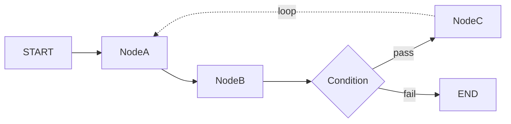
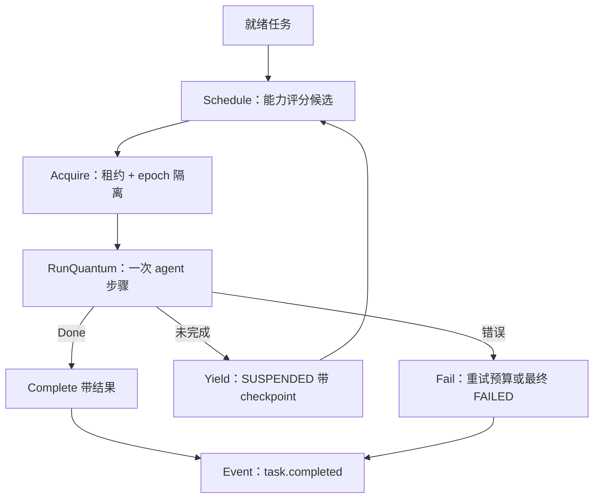

# 多智能体框架深度对比

> LangChain vs CrewAI vs AgentScope vs ARES vs tRPC-Agent-Go

---

## 1. 概述

本文档对五个主流 AI Agent 框架进行客观对比：**LangChain（含 LangGraph）**、**CrewAI**、**AgentScope**、**ARES** 和 **tRPC-Agent-Go**。对比维度涵盖技术栈、架构设计、工作流编排、多 Agent 协作、记忆系统、生产可靠性、部署能力和社区成熟度。

**范围说明**：ARES 是一个处于活跃开发中的研究型 Agent OS（dev 分支，约 1300 次提交）。本文描述的部分功能已在代码中实现但尚未接入生产路径，文中尽可能区分「已实现」与「已接入生产」。

---

## 2. 技术栈对比

| 维度 | LangChain / LangGraph | CrewAI | AgentScope | ARES | tRPC-Agent-Go |
|-----------|----------------------|--------|------------|------|---------------|
| **主要语言** | Python（主）、JavaScript/TypeScript | Python | Python | Go (1.26+) | Go (1.21+) |
| **核心依赖** | pydantic, langchain-core, langgraph, langserve | pydantic, crewaillm, langchain | alibaba/mpip (Kubernetes), Flask, etcd | pgx, gorilla/websocket, sqlite, mmh3, blake2b | openai-go, otel, ants/v2, zap |
| **LLM 提供商** | 50+（OpenAI, Anthropic, Google, Cohere, Hugging Face, AWS Bedrock 等） | OpenAI, Anthropic, Google, Ollama, Groq, Azure 等 | OpenAI, ModelScope, DashScope 等 | OpenAI, Ollama（插件式） | OpenAI, Ollama 等 |
| **向量数据库** | 30+（Pinecone, Chroma, Weaviate, Qdrant, FAISS, Milvus, PGVector 等） | LanceDB, Chroma | 内置 | PostgreSQL + pgvector (ivfflat 索引) | 内置存储、SQLite 向量扩展 |
| **文档加载器** | 100+（PDF, HTML, LaTeX, Markdown, CSV, JSON, DB, S3, Web） | 少量内置 | 一般 | 无（面向代码/任务） | 无 |
| **通信协议** | REST (LangServe), SSE, gRPC 有限支持 | 进程内函数调用 | Service Hub 消息传递, gRPC | AHP（遗留）、agentipc（现行） | tRPC, A2A, AG-UI, MCP, OpenAI 兼容 API |
| **依赖管理** | 分层包 | 单包 | 单包 + 分布式依赖 | 单模块 + Go modules | tRPC-Go 模块 |

### 关键技术栈差异

**LangChain** 拥有最庞大的生态（1000+ 集成），这是核心优势也是负担。分层包设计使依赖管理复杂。

**CrewAI** 依赖轻量，强调开箱即用，底层使用部分 LangChain 组件。

**AgentScope** 依托阿里巴巴技术栈，内置分布式通信，对 Kubernetes 支持良好。

**ARES** 纯 Go、零 Python 依赖。Go 静态编译带来快速启动，但代价是生态极小——没有文档加载器、LLM 提供商少、没有预置 RAG 管线。代码库处于活跃开发中（dev 分支约 1300 次提交）。

**tRPC-Agent-Go** 是腾讯 tRPC 生态中的 Go 原生框架。

---

## 3. 架构设计

### 3.1 核心抽象对比

| 框架 | 核心抽象 | 设计哲学 | 架构风格 |
|-----------|---------|-----------|---------|
| **LangGraph** | StateGraph（有环有向图） | 图计算模型，节点=函数，边=转换 | 有状态图执行引擎 |
| **CrewAI** | Crew + Agent + Task | 团队协作隐喻，角色驱动 | 线性/层级管线 |
| **AgentScope** | Agent + Service Hub | 分布式消息传递，服务化 | 分布式消息驱动 |
| **ARES（dev）** | Peer Agent + Kernel Scheduler + Task Fabric | Agent OS：agent 是可丢弃的执行线程，任务是持久的，调度器负责派发 | 扁平对等、能力调度、事件溯源 |
| **tRPC-Agent-Go** | GraphAgent + Runner + Agent | 服务友好，tRPC 原生 | Go 原生运行时 + 图工作流 |

### 3.2 ARES 架构（现行，dev 分支）

当前 ARES（goagent dev 分支）已用扁平对等架构取代了遗留的 Leader-Sub 模型：

```
用户提交任务 → Task Fabric（持久任务状态机）
                    ↓
            Kernel Scheduler（能力评分、租约、量子）
                    ↓
          ┌── peer agent A（code）──┐
          │  peer agent B（review） │  并行执行
          │  peer agent C（test）  │  agentipc IPC
          └─────────────────────────┘
                    ↓
        aresrecovery（租约过期 → 重新入队 → checkpoint 续跑）
                    ↓
        introspect 面板（观测：调度决策、事件流）
```

生产 serve 中的核心组件：
- **taskfabric**：持久任务状态机（Create/Acquire/Yield/Complete/Checkpoint），带事件溯源
- **agentfabric**：agent 生命周期（Spawn/Kill/Suspend/Recover），动态种群
- **kernelscheduler**：drain 循环、能力候选评分、租约/epoch 隔离、量子执行
- **aresrecovery**：崩溃恢复（租约过期 → 重新入队 → 替代 agent → checkpoint 续跑）
- **agentipc**：对等消息总线，真实 agent 协作
- **introspect**：6 页观测面板（Overview/Tasks/Agents/Scheduler/Execution/Events）

遗留的 Leader-Sub 架构（v0.2.x）已删除。当前代码没有 `leader` 包、没有 dispatcher/aggregator、生产路径没有死信队列。

### 3.3 LangGraph — 有环有向图


```mermaid
flowchart LR
    START --> NodeA
    NodeA --> NodeB
    NodeB --> Condition{Condition}
    Condition -->|pass| NodeC
    Condition -->|fail| END
    NodeC -.->|loop| NodeA
```

LangGraph 的核心是有向图，支持条件分支和循环，检查点允许任意节点暂停/恢复。

### 3.4 ARES 调度器（dev 分支）


```mermaid
flowchart TD
    Ready[就绪任务] --> Schedule[Schedule：能力评分候选]
    Schedule --> Acquire[Acquire：租约 + epoch 隔离]
    Acquire --> Quantum[RunQuantum：一次 agent 步骤]
    Quantum -->|Done| Complete[Complete 带结果]
    Quantum -->|未完成| Yield[Yield：SUSPENDED 带 checkpoint]
    Quantum -->|错误| Fail[Fail：重试预算或最终 FAILED]
    Yield --> Schedule
    Complete --> Event[Event：task.completed]
    Fail --> Event
```

### 3.5 架构关键差异

- **LangGraph** 的图模型最灵活，支持复杂状态机、循环、条件路由，但学习曲线陡峭。
- **CrewAI** 的团队隐喻最直观，但灵活性有限。
- **AgentScope** 的分布式架构适合企业部署，但社区小、文档以中文为主。
- **ARES** 的扁平对等 + 内核调度在这些框架中独树一帜——把 agent 视为可丢弃的执行线程而非固定角色。代价是架构仍在演进（dev 分支，约 1300 次提交），生态极小。
- **tRPC-Agent-Go** 在 tRPC 生态内最服务友好。

---

## 4. 工作流编排

### 4.1 工作流能力

| 能力 | LangGraph | CrewAI | AgentScope | ARES (dev) | tRPC-Agent-Go |
|-----------|-----------|--------|------------|------------|---------------|
| **DAG 支持** | 原生 | 仅顺序/层级 | Pipeline 模式 | task fabric 依赖（节点 DAG） | GraphAgent (Pregel 风格) |
| **条件边** | `add_conditional_edges` | 无 | Pipeline 条件节点 | 运行时路由（内核派发） | ConditionalFunc 路由 |
| **循环/环** | 原生 | 不支持 | 不支持 | 不支持（无任意环） | CycleAgent（循环 + EscalationFunc） |
| **并行执行** | 同层节点 | `async_execution=True` | Pipeline 并行 | 调度器 maxConcurrent（goroutine） | sync.WaitGroup 并发 |
| **子图嵌套** | 支持（节点=子图） | Flow 包裹 Crews | 不支持 | 生产路径无 | 支持 |
| **热更新** | 不支持 | 不支持 | 不支持 | 配置热加载（仅 cfgStore） | 未文档化 |
| **运行时图变更** | 不支持 | 不支持 | 不支持 | 生产路径无 | 不支持 |
| **人机交互** | `interrupt()` | `human_input=True` | 支持 | 生产路径无 | 支持（会话式） |
| **步骤恢复** | Checkpoint 回放 | 不支持 | 不支持 | aresrecovery（租约过期→重新入队） | 未文档化 |
| **自我进化** | 非原生 | 不支持 | 不支持 | 两个 evolution 包（旧 v0.2.9、新 `internal/ares_evolution`）均部分接入 | SKILL.md 进化管线 |
| **MCP 支持** | 经 LangChain MCP | 非原生 | 非原生 | 原生 WithMCP | 原生 mcptool |
| **协议支持** | LangServe | 无 | gRPC | AHP（遗留）、agentipc（现行） | tRPC, A2A, AG-UI, MCP, OpenAI 兼容 |

### 4.2 ARES 工作流说明

ARES 的工作流能力分属两个包：

1. **生产路径（task fabric + kernel scheduler）**：真实生产用 `taskfabric` 做任务状态机、`kernelscheduler` 做派发。任务有 DAG 依赖、epoch、租约、checkpoint。这是 `ares serve` 的引擎。

2. **未接入生产（workflow/engine）**：`internal/workflow/engine` 包（MutableDAG、DynamicExecutor、HITL、LoopConfig、Subgraph）已实现但**未接入生产**——它作为演化系统 DAG 变异 patch 的能力储备存在。v0.3.0 review 记录其为「零生产调用」（outstanding_tasks.md 开放回路清单）。

演化系统有两个包：`internal/evolution`（v0.2.9 六基因组管线，正在被替换）和 `internal/ares_evolution`（较新，部分接入）。两者都未经大规模生产验证。

---

## 5. 多 Agent 协作

### 5.1 协作模式

| 模式 | LangGraph | CrewAI | AgentScope | ARES (dev) | tRPC-Agent-Go |
|---------|-----------|--------|------------|------------|---------------|
| **监督/编排** | 子图组合 | 层级 Process | Service Hub | 无编排（扁平对等） | Runner + agents |
| **对等通信** | 共享状态节点 | 任务输出链式 | 消息路由 | agentipc 总线（真实 IPC） | A2A 远程 agent 协议 |
| **任务分配** | 图节点调度 | Manager Agent 分配 | Pipeline 派发 | 内核调度器（能力评分） | Chain/parallel/cycle 模式 |
| **结果聚合** | 状态合并 | 任务输出链式 | 消息聚合 | 调度器独立完成各任务 | Runner 结果收集 |

### 5.2 ARES 协作

ARES 的对等协作使用 `agentipc.Bus` —— 真实进程内消息总线，提供 Send/Request/Reply/Delegate/Handoff/Subscribe 原语。agent 之间通过直接 IPC 消息通信，不经过编排器。该路径已接入生产 serve。

遗留的 AHP（Agent Heartbeat Protocol）位于 `internal/ares_protocol/ahp`，目前仅用于演化 IPC 桥接，不参与生产调度。AHP 的心跳和 DLQ（死信队列）已实现但**未接入生产**——DLQ 在生产代码中零调用点。

---

## 6. 记忆系统

### 6.1 记忆能力

| 维度 | LangChain/LangGraph | CrewAI | AgentScope | ARES | tRPC-Agent-Go |
|-----------|-------------------|--------|------------|------|---------------|
| **短期** | Checkpoint 状态 | 当前运行上下文 | 会话消息历史 | 会话记忆（内存） | 会话状态（10+ 后端） |
| **长期** | Store（PostgresStore 等） | LanceDB 向量存储 | 内置存储 | PostgreSQL + pgvector | 记忆服务（12 后端） |
| **实体记忆** | 不支持 | Knowledge Graph | 不支持 | MemoryProfile 类型 | 制品系统、知识库 |
| **去重** | 不支持 | cosine > 0.85 + LLM 决策 | 不支持 | cosine > 0.85 冲突检测 | 未文档化 |
| **重要性评分** | 不支持 | `0.5*sim + 0.3*recency + 0.2*llm` | 不支持 | 规则式（关键词+类型+长度） | 未文档化 |
| **蒸馏** | 不支持 | 不支持 | 不支持 | 6 步自动化管线 | 未文档化 |
| **多租户** | namespace 元组 | 不支持 | 不支持 | 应用层 tenantID 谓词 | 会话隔离 |

### 6.2 ARES 记忆蒸馏

ARES 有自动化记忆蒸馏管线（6 步：抽取 → 分类+评分 → 过滤 → 嵌入+冲突 → 过滤 → 上限）。该管线是规则驱动（每步不调 LLM），因此快但不准。评分用关键词 + 类型 + 长度规则，基准分 0.4。

有些资料把该管线称为「纳秒级延迟」，这是误导——管线涉及 SQLite 读写和嵌入生成，耗时是毫秒级而非纳秒级。

### 6.3 多租户

ARES 使用应用层 tenantID 谓词（每个 `KnowledgeRepository.*`、`ExperienceRepository.*` 等都带 tenantID 参数）。此前基于 PostgreSQL RLS（`SET LOCAL`）的方案已在 v0.3.1 移除（tenant_isolation.md，#36 已 descope）。

---

## 7. 可靠性 & 生产特性

### 7.1 错误处理

| 机制 | LangGraph | CrewAI | AgentScope | ARES | tRPC-Agent-Go |
|-----------|-----------|--------|------------|------|---------------|
| **重试** | 无内置 | `max_retry_limit=2` | 基础重试 | 3 次指数退避（任务执行器） | 经演化管线支持 |
| **超时** | 无内置 | `max_execution_time` | 无内置 | 分层（LLM 120s, DB 30s, 向量 10s） | 未文档化 |
| **输出校验** | 无内置 | `output_pydantic` + Guardrails | 无内置 | Schema 校验器 | Schema 输出校验 |
| **降级** | Fallbacks 参数 | 无内置 | 无内置 | FailoverClient（多提供商 + 限流冷却） | 未文档化 |
| **熔断器** | 不支持 | 不支持 | 不支持 | LLM failover（冷却式） | 未文档化 |
| **死信队列** | 不支持 | 不支持 | 不支持 | AHP 中已实现（DLQ）但未接入生产 | 未文档化 |
| **人机交互** | `interrupt()` | `human_input=True` | 支持 | workflow/engine 有实现但未接入生产 | 支持 |
| **混沌工程** | 不支持 | 不支持 | 不支持 | `ares_arena`（13 种故障类型）— 经 cmd/ares/arena.go 接入 | 未文档化 |

### 7.2 ARES 可靠性说明

- **FailoverClient**：ARES 有多提供商 LLM failover 客户端，带冷却式熔断。某个提供商报错（如 429 限流）后被冷却，尝试下一个。该机制已接入生产 `ares serve`。
- **熔断器**：`internal/storage/postgres/circuit_breaker.go` 是 PostgreSQL 检索保护专用熔断器，不是通用机制。
- **DLQ**：AHP 死信队列在 `internal/ares_protocol/ahp/dlq.go` 实现，但除 AHP 包自身外生产代码零调用点。
- **混沌工程**：`internal/ares_arena` 有 13 种故障注入类型和生存/场景模式。`cmd/ares/arena.go` 入口将其中一部分接入 serve 二进制。
- **混沌隔离**（v0.3.1）：影子沙箱模式（scratch fabric，零生产影响）+ 实时模式六道护栏（限流、冷却、fail-safe 闩锁、GA 静默窗口、目标白名单、急停）。已接入 `ares serve`。

---

## 8. 社区与生态

| 指标 | LangChain | CrewAI | AgentScope | ARES | tRPC-Agent-Go |
|--------|----------|--------|------------|------|---------------|
| **GitHub Stars** | ~100,000+ | ~40,000 | ~4,000 | 私有/早期 | ~1,500 |
| **主要贡献者** | 1,200+ | 300+ | ~50 | 2 | ~20 |
| **License** | MIT | MIT | Apache 2.0 | Apache 2.0 | Apache 2.0 |
| **首发时间** | 2022 年 10 月 | 2023 | 2024 | 2025 | 2025 |
| **当前版本** | v0.3.x (Python) | v0.8x+ | v0.x | dev 分支（v0.3.x） | v0.x |
| **集成生态** | 1,000+ 官方+社区 | 50+ 内置工具 | 有限 | ~20 内置工具、MCP 插件 | MCP 工具、20+ 内置工具 |
| **月下载量** | >15M | >5M | 未知 | 未知 | 未知 |
| **融资/支持** | Benchmark A $25-35M | 独立开发 | 阿里巴巴集团 | 开源项目（2 名贡献者） | tRPC Group (腾讯) |
| **企业采用** | JPMorgan, IBM, Salesforce, Airbnb | 以中小企业为主 | 阿里内部 + 合作伙伴 | 早期 | tRPC 生态用户 |
| **文档** | 广但不一致（新旧 API） | 清晰、新手友好 | 以中文为主 | 改善中（EN + CN），有限 | EN + CN |

---

## 9. 实事求是评估

### 9.1 LangChain/LangGraph

**优势**：
- 最大生态（1000+ 集成），模型无关性最强
- 最先进的状态管理（checkpoint、回放、HITL）
- 最全面的 RAG 管线
- 最大社区、最多学习资源

**劣势**：
- 抽象层过多，错误难追溯
- API 频繁破坏性变更，维护负担重
- 深度抽象调用栈带来性能开销
- LangSmith 收费

### 9.2 CrewAI

**优势**：
- 入门门槛低，团队隐喻直观
- 角色驱动设计使行为可理解
- 50+ 内置工具，开箱即用

**劣势**：
- 确定性低，LLM 决策不可控
- 无生产级可靠性特性
- Python GIL 限制并发性能
- 复杂场景灵活性不足

### 9.3 AgentScope

**优势**：
- 原生分布式架构，支持多节点部署
- 与阿里云 / ModelScope 生态深度集成
- 消息驱动设计适合松耦合系统

**劣势**：
- 社区小，国际影响力有限
- 文档以中文为主
- 缺少生产可靠性机制
- 阿里生态外难以集成

### 9.4 ARES

**优势**：
- **Go 原生并发**：goroutine + channel，无 GIL
- **独特架构**：扁平对等 agent + 内核调度 + 任务织物持久化 + 事件溯源——这与角色驱动的团队模型确实不同
- **可观测性**：6 页 introspect 面板实时展示调度决策、任务状态机、agent 生命周期、事件流——全部开源免费
- **崩溃恢复**：租约过期 → 重新入队 → checkpoint 续跑，已接入生产
- **真实 agent IPC**：agentipc 总线对等协作（非编排）
- **混沌隔离**：影子沙箱验证模式 + 六道护栏，已接入生产
- **LLM failover 客户端**：多提供商 + 冷却，已接入生产

**劣势（诚实陈述）**：
- **生态极小**：2 名贡献者，~20 内置工具，无文档加载器，LLM 提供商少。LangChain 有 1000+ 集成，ARES 基本没有第三方集成。
- **非常早期**：dev 分支，2025 首发，架构仍在演进。`ares serve` 命令近几个月才稳定。
- **大量功能「已实现但未接入」**：workflow 引擎（MutableDAG、HITL、Subgraph、LoopConfig）、AHP DLQ、部分演化系统都在代码中存在但不在生产路径。v0.3.0 review 记录了约 20 个此类「开放回路」。
- **无 RAG 管线**：与 LangChain 不同，ARES 没有内置文档加载、分块、检索增强生成管线。
- **LLM 支持有限**：仅 OpenAI 和 Ollama 经过充分测试。无 Anthropic、Google、Cohere 统一 API 支持。
- **文档有限**：2 名贡献者，文档远少于任何成熟框架。
- **演化系统未在规模上验证**：两个 evolution 包均未在大型生产负载上验证。

### 9.5 tRPC-Agent-Go

**优势**：
- Go 原生，完整 goroutine 并发模型
- 6 种内置 agent 类型
- 6 个协议服务器（A2A, AG-UI, OpenAI 兼容等）
- 12 个记忆后端
- 生产级可观测性（OpenTelemetry + Langfuse）

**劣势**：
- 早期，社区较小
- LLM 提供商有限
- 无文档加载器
- 在 tRPC 生态内价值最大

---

## 10. 选型指南

| 场景 | 推荐框架 | 原因 |
|----------|---------|-----|
| 复杂状态工作流、RAG、大生态 | LangChain/LangGraph | 1000+ 集成，最佳状态管理 |
| 快速原型、团队协作隐喻 | CrewAI | 门槛最低 |
| 阿里生态、分布式部署 | AgentScope | 原生 Kubernetes 支持 |
| 高并发、崩溃恢复、可观测性 | ARES | 独特的 peer 调度器、持久任务、免费可观测性 |
| tRPC 生态、Go 原生、A2A/MCP 协议 | tRPC-Agent-Go | tRPC 生态集成 |
| **需要第三方集成** | **不要选 ARES** | ARES 几乎没有生态 |
| **需要文档处理 / RAG** | **不要选 ARES** | ARES 无文档加载器或 RAG 管线 |
| **需要稳定、生产验证的框架** | **LangChain 或 CrewAI** | ARES 太早期 |

---

## 11. 附录：ARES 关键功能实现状态

| 功能 | 已实现 | 已接入生产 | 说明 |
|---------|------------|-----------------|-------|
| 内核调度器（task fabric） | ✅ | ✅ | `ares serve` 生产路径 |
| Agent Fabric（生命周期） | ✅ | ✅ | `ares serve` 生产路径 |
| 崩溃恢复（aresrecovery） | ✅ | ✅ | `ares serve` 生产路径 |
| Agent IPC（agentipc） | ✅ | ✅ | `ares serve` 生产路径 |
| Introspect 面板（6 页） | ✅ | ✅ | `ares serve` 生产路径 |
| 混沌隔离（shadow/live） | ✅ | ✅ | `ares serve` 生产路径 |
| LLM Failover 客户端 | ✅ | ✅ | `ares serve` 生产路径 |
| 记忆蒸馏 | ✅ | ✅ | Bootstrap 接线 |
| 事件溯源 | ✅ | ✅ | task fabric + event store |
| Mutable DAG（workflow/engine） | ✅ | ❌ | 零生产调用点 |
| HITL（workflow/engine） | ✅ | ❌ | 零生产调用点 |
| AHP DLQ | ✅ | ❌ | 除 AHP 外无生产调用点 |
| 演化（v0.2.9 六基因组） | ✅ | 部分 | 正在被替换 |
| 演化（internal/ares_evolution） | ✅ | 部分 | 部分接入 |
| Leader-Sub 遗留 | ❌ | N/A | v0.3.x 已移除 |
| 多租户 RLS（SET LOCAL） | ❌ | N/A | 已 descope，改为应用层谓词 |