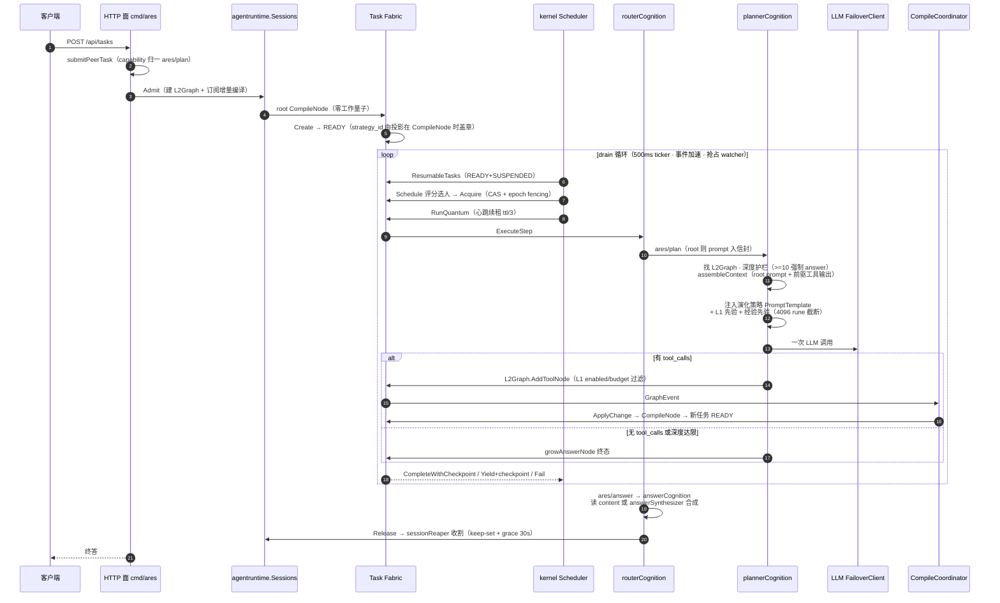
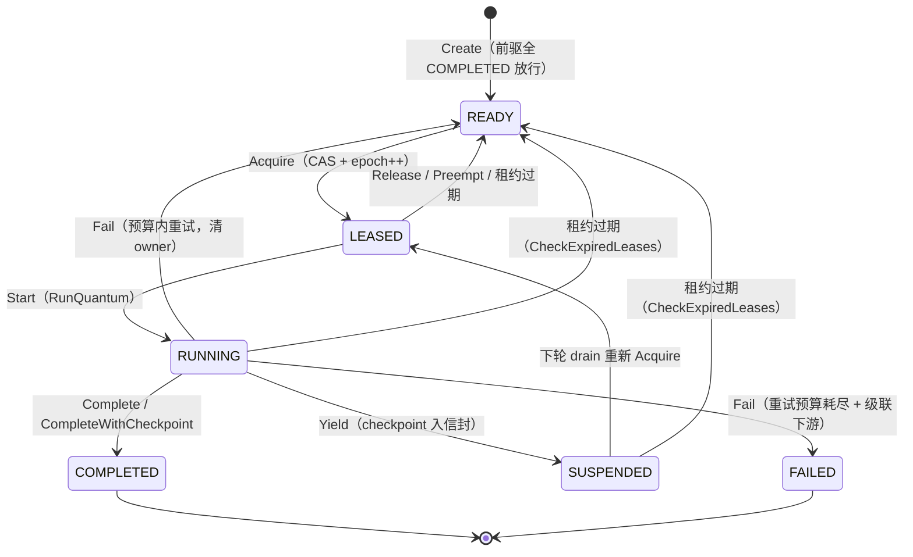
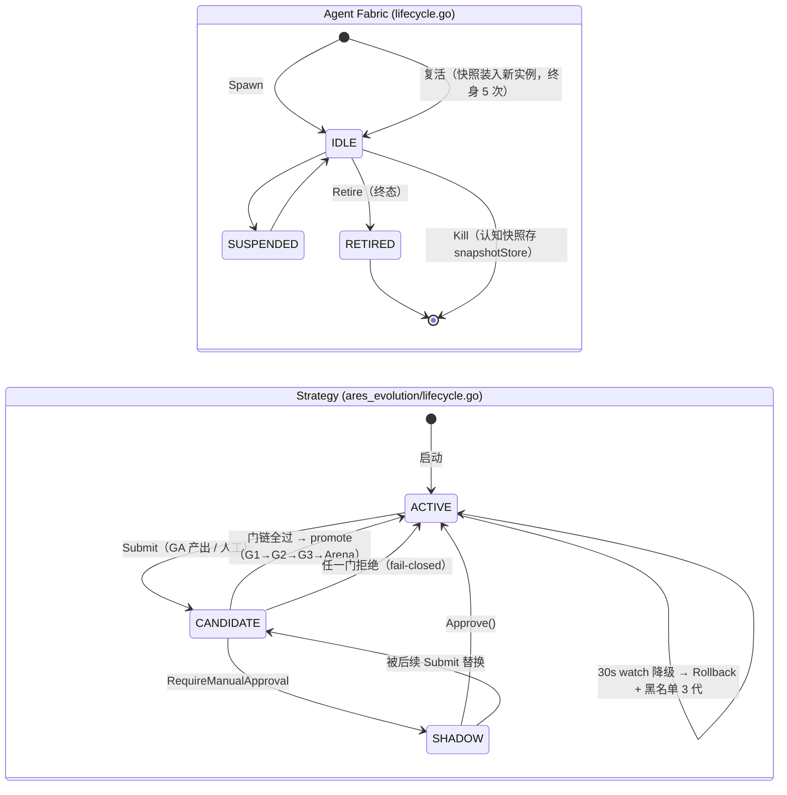
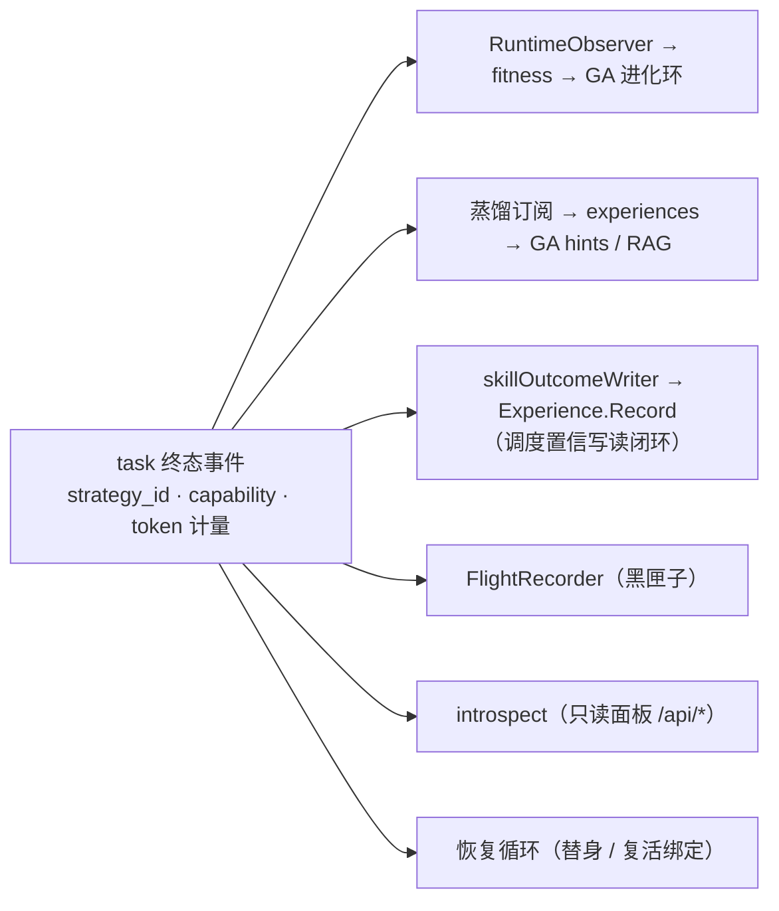
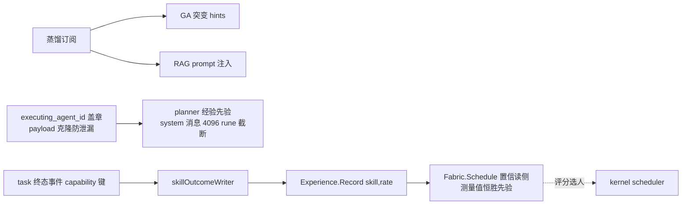
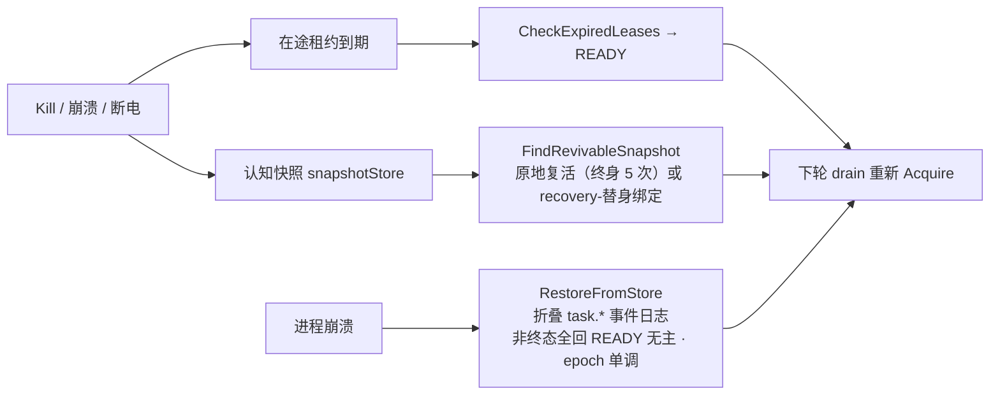
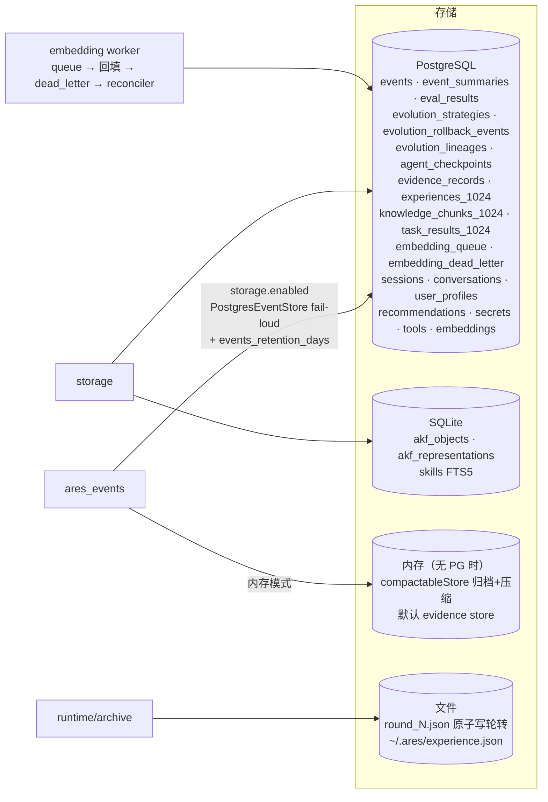
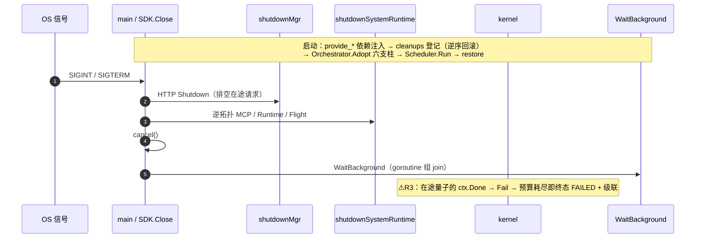

# ARES 0.3.1 — 最终发布评审 · 终极架构图 · 数据流图

> **评审日期**：2026-09-13
> **基线**：`dev` @ `b41936a7`（VERSION 0.3.1）· 工作区 **不 clean**（17 改动 + 1 未跟踪）
> **规模**：136 个 Go 包，`internal/` 下 731 个非测试 Go 文件
> **方法**：全量实测（build / vet / golangci / `-race -short` 全仓）+ 两个并行子代理分模块精读（kernel+fabric / runtime+storage+sdk+cmd）+ 关键结论逐条读码复核（含证伪过滤）
> **本文定位**：取代锚在 `2aeaf942` 的 `ARCHITECTURE_DIAGRAM.md`（已落后 HEAD 10 个提交）与两份结论互相矛盾的既有报告（`docs/reviews/0.3.1-architecture-report.md` ✅ / `docs/reviews/0.3.1-final-deep-review.md` ⚠️，后者未入库）

---

## 〇、结论：**不能直接发布**

**⚠️ 不建议以当前工作区状态打 tag。** 不是"编译不过 / 测试全红"——实测门禁全绿。阻塞点是 **6 项已读码证实的实质缺陷 + 一批未提交的修复在工作区里悬空**。

| # | 阻塞项 | 位置 | 性质 |
|---|--------|------|------|
| **R1** | 工作区不 clean：17 个改动文件 + 1 个未跟踪测试从未提交 | `git status` | 向量回读丢失 / 密钥 metadata 丢失 / 会话消息无界增长等**真实修复**悬空在工作区，tag 会漏掉它们 |
| **R2** | 密钥 `Export` 解密失败时把**密文**当明文写出 | `secret_repository.go:526-530` | 备份文件静默损坏 + 密文入备份；回灌 `Import` 会二次加密致永久不可读 |
| **R3** | 调度器优雅停机把在途量子变成**持久化 FAILED 级联** | `scheduler_quantum.go:74-75` → `quantum.go:75-79` → `fabric_lifecycle.go:222-245` | 停机消耗重试预算；`MaxRetries=0` 的任务直落终态 FAILED 并级联下游整片；事件存储落盘后跨重启不可恢复 |
| **R4** | LLM FailoverClient：调用方取消会**毒化全部 provider** | `failover.go:215-263`（Chat/Stream 同构） | 一次用户取消 → 全链进入冷却 → 约 20s 内所有请求 `"no provider available"` |
| **R5** | `Config.Redacted()` 漏脱敏；`LoadFromEnv` 漏读标准 key | `ares_config/redacted.go:18-55` · `config.go:245-298` | `kernel.chaos.stop_token`、`llm.extra` 经 `/api/runtime/config` 明文外泄；不读 `OPENAI_API_KEY`/`ANTHROPIC_API_KEY` |
| **R6** | `ConversationRepository.GetByID` 无租户过滤 | `conversation_repository.go:126-135` | 跨租户读（当前无生产调用方，属潜伏地雷；与仓内其他 `GetByID(ctx, tenantID, id)` 签名不一致） |

**放行所需最小动作（预计 0.5–1.5 天）**：

1. **先提交工作区**（R1）——这批改动本身是对的，必须进 0.3.1。
2. R2：`Export` 在解密失败时**跳过该条目并记错误**，绝不写密文。
3. R3：`RunQuantum` 对 `context.Canceled`/`DeadlineExceeded` **不走 `Fail`**，改走 `Release`/`Yield`（保留 checkpoint、不消耗 `Attempts`）。
4. R4：`generateAttempting`/`chatAttempting`/`GenerateStream` 在 `ctx.Err() != nil` 时**立即 break，不 markCooldown**。
5. R5：`Redacted()` 补 `StopToken` + `LLM.Extra`；`LoadFromEnv` 补 `OPENAI_API_KEY`/`ANTHROPIC_API_KEY` 回退。
6. R6：`GetByID` 加 `tenantID` 参数与谓词。

完成 1–6 后，本文第4节的非阻塞项可原样写进 release note 放行。

---

## 一、实测证据

| 检查项 | 命令 | 结果 |
|--------|------|------|
| 编译 | `go build ./...` | ✅ exit 0 |
| 静态检查 | `go vet ./...` | ✅ exit 0 |
| Lint | `golangci-lint run --timeout=10m` | ⚠️ 1 个 gci（`tool_repository.go` import 分组，属 R1 未提交改动的一部分）→ **本评审已修** |
| 全量测试（含 race） | `go test -race -short -count=1 ./...` | ✅ 127 包全绿 |
| 收敛冻结 | `scripts/check_convergence_freeze.sh` | ✅ `freeze-check OK`（examples/ 与 internal/ 均无新增） |
| B1 flaky 复现 | `go test -run TestL2Graph_BurstGrowthConvergesThroughEvents -count=3 ./internal/kernel` | ✅ 2.7s 通过（**本次未复现**；既有报告称全仓负载下 3 跑 1 挂，仍建议 CI 观察） |
| 覆盖率抽样 | task fabric 87.2% · kernel 85.2% · planprojection 87.9% · agent fabric 84.3% | 良好 |

**关于既有两份报告的矛盾**：`docs/reviews/0.3.1-architecture-report.md`（2026-09-12，✅ 可发布）与 `docs/reviews/0.3.1-final-deep-review.md`（2026-09-13，⚠️ 不可发布，**未入库**）基线相同。本文结论与后者一致，并新增 R2/R3/R4 三项其未覆盖的缺陷。

---

## 二、阻塞项证据（逐条读码核实）

### R2 — 密钥备份静默损坏

```go
// internal/storage/postgres/repositories/secret_repository.go:526-530
if plain, dErr := r.decrypt(encrypted); dErr == nil {
    e.Value = string(plain)
} else {
    e.Value = string(encrypted)   // ← 密文被当作明文写出
}
```

进程 AES key 与库存不一致时（换 key 未走 `RotateKey`、部分轮换、异地还原 DB），`decrypt` 失败，**原始密文字节**写进导出文件的 `value`。`Import:653` 对 `item.Value` 再加密 → 双重加密 → 永久不可读，且全程无告警。同时意味着可还原的密钥材料落入备份文件。现有 `TestSecretRepository_ExportImport_RoundTrip` 只测 happy path，**解密失败分支零覆盖**。

### R3 — 停机把在途工作变成持久化失败

```go
// internal/kernel/scheduler_quantum.go:74-75  —— 停机时在途量子返回 error
case <-ctx.Done():
    return nil, false, fmt.Errorf("quantum aborted by scheduler shutdown: %w", ctx.Err())

// internal/fabric/task/quantum.go:75-79  —— 无条件走 Fail
if stepErr != nil {
    if failErr := f.Fail(taskID, agentID, epoch); failErr != nil { ... }

// internal/fabric/task/fabric_lifecycle.go:222-244  —— Fail 烧预算 + 终态级联
t.RetryPolicy.Attempts++
if t.CanRetry() { /* requeue */ }
t.transition(StateFailed)
f.cascadeFailureLocked(t.ID, &pending)
```

对比：同文件 `endQuantumOutcome`（`scheduler_quantum.go:230-235`）已明确豁免 `context.Canceled` 不做置信度归因——但 **fabric 状态转换已经先发生了**。`Create()` 路径默认 `MaxRetries=0`，因此停机即终态 FAILED，并级联 FAILED 到所有传递就绪的下游。`task.failed` 是 must-persist 事件，`RestoreFromStore` 会把它还原为终态——**重启后工作永久丢失**。无任何测试断言 ctx 取消后的 fabric 任务状态。

### R4 — 取消毒化 failover

```go
// internal/llm/failover.go:218-256
for _, client := range fc.clients {
    ...
    resp, err := call(client, cctx)
    if err == nil { fc.clearCooldown(key); return resp, nil }
    lastErr = err
    cd := fc.cooldownForError(err)
    fc.markCooldown(key, cd)      // ← 无 ctx.Err() 早退，取消也进冷却
}
```

循环无 `ctx.Err()` 判断。调用方取消（用户中止、上游超时）时，每个 provider 的 `call` 都返回 `context.Canceled`，非 rate-limit → 短冷却（`cooldownDuration/3`，`:180-192`），并逐个 `markCooldown`。忙时一次用户取消即可让后续约 20s 的无关请求全部 `no provider available (all N cooled down)`。`failover_test.go` 覆盖了 429 与 stream 握手，**取消路径零覆盖**。

### R5 — 配置脱敏缺口

`Redacted()` 仅脱敏 4 项（LLM key/回退、Storage.Password、JWTSecret、Introspect.Token）。`ChaosConfig.StopToken`（`config_server.go:44`，POST /api/chaos/stop 的 bearer token）与 `LLMConfig.Extra map[string]string`（`config_server.go:129`，常用于放 API key）**原样输出**到 `/api/runtime/config`。`LoadFromEnv`（`config.go:245-298`）只认 `LLM_API_KEY`/`OPENROUTER_API_KEY`，不认业界标准的 `OPENAI_API_KEY`/`ANTHROPIC_API_KEY`。

### R1 — 工作区悬空的修复（必须入库）

未提交改动是**正确且必要**的一批修复：

| 文件 | 修的是什么 |
|------|-----------|
| `runtime/memory/context/session.go` | 会话消息无界增长（新增 500 条存储上限 + `GetMessages` 刷新 TTL，防长会话被清扫） |
| `storage/postgres/repositories/*`（tool/experience/knowledge/task_result） | `GetByID`/`List*` 从不扫描 `embedding` 列 → 读-改-写路径会把向量写成 NULL（`CorrectKnowledge` 会**静默损坏向量**）；`tools.tags` 改 `pq.Array`；`experiences.usage_count`/`strategies.is_active` 漏扫描 |
| `models/experience.go` + `experience_repository.go` | `Constraints` 字段只在 struct 上、表无该列 → 写入即丢；新增 `MetadataForStorage()` 折叠进 metadata |
| `secret_repository.go` + `secret_adapter.go` | Export/Import 往返丢 metadata；Export 产出的裸数组无法被 Import 消费 |
| `sdk/agent.go` | `Stream` 标注 `Deprecated`（实为 run-then-replay，非真流式） |
| `strategy_repository_test.go` | **未跟踪**新测试文件 |

---

## 三、终极架构图（锚定 `b41936a7`）

### 3.1 一句话架构

**Agent 是被调度的进程**：对话历史 = 可迁移的进程状态（checkpoint envelope，schema v4）；调度靠 lease + epoch fencing；任务图由 planner 自生长 → 增量编译 → 无领导者调度；进化 / 经验 / 恢复三环闭合。

### 3.2 分层总图

```mermaid
flowchart TB
    %% ============ 外部世界 ============
    subgraph EXT["外部世界"]
        direction LR
        CLIENT["客户端"]
        LLP["LLM Providers<br/>OpenAI · Anthropic · OpenRouter · Ollama"]
        MCPS["MCP Servers"]
        PG[("PostgreSQL + pgvector")]
        SQLITE[("SQLite<br/>AKG objects · skills FTS5")]
        FS[("文件<br/>round_N.json · experience.json")]
    end

    %% ============ L0 入口层 ============
    subgraph L0["L0 入口面（3 个，同一引擎）"]
        direction LR
        CLI["cmd/ares — 唯一用户 CLI<br/>main · serve · kernel · agent · evolution<br/>（0.3.1 已按域拆成 18 个非测试文件）"]
        SDK["sdk/ — 嵌入库<br/>Agent.Run/Submit/Graph = 共享 L2 执行核"]
        EMBSVC["services/embedding<br/>独立 sidecar"]
    end

    %% ============ L1 装配层 ============
    subgraph L1["L1 装配层"]
        BOOT["ares_bootstrap — 唯一装配根<br/>bootstrap.go:239 · builder 逆序 cleanups<br/>provide_{llm,memory,mcp,evolution,distillation,discovery}<br/>门禁装配 G1→G2→G3→Arena<br/>embedding_worker · maintenance_worker · knowledge_akg"]
    end

    %% ============ L2 共享执行核 ============
    subgraph L2CORE["L2 共享执行核 internal/agentruntime（0.3.1 新）"]
        direction LR
        A_SESS["Sessions session.go:33<br/>Admit · ReleaseQuietly · Harvest"]
        A_SUBM["Submitter submit.go:34<br/>Submit · Seed · MaxRestoredSeq"]
        A_EXEC["Execution execution.go:54<br/>NewExecution:73"]
    end

    %% ============ L3A 调度内核 ============
    subgraph L3A["调度 internal/kernel（唯一内核）"]
        direction TB
        SCHED["scheduler.go:355 Run · :489 drain<br/>500ms ticker + 任务事件加速 + 抢占 watcher<br/>drainLimit auto = max(静态注册表, fabric 空闲候选)"]
        CAND["executor_registry.go:129 buildCandidates<br/>能力重叠 × (1−load) × confidence × (1+priority)<br/>hybridPreferStatic:171 · LookupExecutor:256"]
        QMGR["scheduler_quantum.go<br/>量子边界 · ctx 取消 → ⚠R3 Fail"]
        FABEX["fabric_executor.go:16<br/>kernel → fabric 唯一桥"]
        LOAD["load_tracker.go:23<br/>TryBegin:82 · ConfidenceFor:206"]
        ORCH["Orchestrator — 系统运行时控制面<br/>orchestrator.go:37 · component.go:14 · registry.go:22<br/>Adopt 六支柱 · 逆拓扑 30s 预算停机<br/>GoBackground recover+component.failed"]
    end

    %% ============ L3B 编排织物 ============
    subgraph L3B["编排 internal/fabric"]
        direction TB
        subgraph AFAB["agent/ — Agent Fabric"]
            ROUTER["l2graph.go:278 routerCognition 四路分发<br/>ares/plan · tool/x · ares/answer · ares/root"]
            PLANNER["planner_cognition.go:206<br/>规划者不执行工具只长图 · 深度护栏 10<br/>assembleContext + 策略/经验注入"]
            SESSREG["session_registry.go<br/>InitSession 建 L2Graph + 订阅增量编译<br/>answerSynthesizer 终答合成"]
            LIFE["lifecycle.go:69 Spawn/Kill/Retire<br/>认知快照 + 终身 5 次复活"]
        end
        subgraph TFAB["task/ — Task Fabric"]
            TSTATE["fabric.go:290 Acquire · :556 Schedule<br/>状态机 + lease/epoch fencing<br/>ownerLocked:712（Owner+持租+Epoch 三者匹配）"]
            QUANT["quantum.go:58 RunQuantum<br/>checkpoint envelope schema v4 · token 累计"]
            RSTR["restore.go RestoreFromStore 跨重启重建<br/>epoch 单调 · 租约不恢复全回 READY"]
            LOOP["plan_loop.go PlanLoop<br/>DAG 级 round 循环 · WithLoopLifetime"]
            REAPR["reaper.go CheckExpiredLeases"]
        end
        MDAG["workflow/engine/mutable_dag.go:34<br/>全仓唯一任务图载体<br/>wouldCreateCycle BFS 可达性检测"]
        PROJC["planprojection/coordinator.go:68<br/>图事件 → 增量编译 → reconcile → CompileNode"]
    end

    %% ============ L4 生命周期 ============
    subgraph L4["生命周期 internal/runtime"]
        direction LR
        BUS["bus.go PluginBus 热插拔<br/>Register:84 · Unregister:176 · Stop:290"]
        MGR["manager.go · manager_lifecycle.go<br/>manager_chaos.go"]
        EVOA["ares_evolution GA 接线<br/>fitness 聚合 · 门链 · watch 回滚"]
        EVOB["evolution GA 引擎<br/>genome·mutation·patch·coordinator"]
        MEMW["memory 工作记忆 + 蒸馏<br/>⚠ 写路径钉死构造期 tenant（H3）"]
        EVALW["eval G3 判分（默认强度）"]
        ARENAW["arena 回归门 A/B + Welch t<br/>tri-state 默认 AUTO-ARMED"]
        OBS["observability<br/>tracer·cost·prometheus·flight recorder"]
    end

    %% ============ L5 基础设施 ============
    subgraph L5["基础设施层"]
        direction LR
        EVT["ares_events 事件溯源中枢<br/>OCC 追加 · 订阅分发"]
        LLMP["llm · llmcore · llmservice<br/>FailoverClient · 429 冷却降级<br/>⚠R4 取消毒化"]
        TOOLP["tools · apitools<br/>web_search·calculator·regex·json·file<br/>+ mcp.* 动态发现 · envcap 能力搜索"]
        KNW["knowledge · knowledgeapi<br/>AKG 三层对象 · 混合检索<br/>compiler·linker·pipeline·retriever"]
        STGP["storage 迁移 · WriteBuffer"]
        EMBP["embedding 异步回填<br/>queue + dead_letter + reconciler<br/>（实现住 storage/postgres）"]
        IPCP["agentipc 总线承载协作主题<br/>delegate-task·pipeline-stage·orchestrate-worker"]
        SYSP["agentsyscall<br/>身份来自 kernelctx，不信 LLM 参数"]
        RECP["aresrecovery 恢复 + 混沌"]
        MISC["ares_security·ares_ratelimit·ares_config<br/>ares_shutdown·introspect·evidence<br/>feedback·discovery·detector·errors·logger"]
    end

    %% ============ 边 ============
    CLIENT -->|"POST /api/tasks（JWT）"| CLI
    SDK --> BOOT
    EMBSVC --> EMBP

    BOOT --> L2CORE
    BOOT --> ORCH
    BOOT --> BUS
    BOOT --> MISC

    ORCH -->|"Adopt 六支柱"| SCHED
    SCHED --> CAND --> FABEX
    FABEX <-->|"调度桥接"| TSTATE
    QUANT -->|"ExecuteStep"| ROUTER
    ROUTER -->|"ares/plan"| PLANNER
    ROUTER -->|"tool/x → 一次 CallTool"| TOOLP
    ROUTER -->|"ares/answer → 合成 + 释放会话"| SESSREG
    PLANNER -->|"读 GetActiveStrategy"| EVOA
    PLANNER -->|"一次 LLM 调用"| LLMP
    PLANNER -.->|"RAG 检索（retriever_wiring）"| KNW
    PLANNER -->|"AddToolNode（L1 enabled/budget 过滤）"| MDAG
    MDAG -->|"GraphEvent"| PROJC
    PROJC -->|"ApplyChange → CompileNode → READY"| TSTATE

    TSTATE --> EVT
    EVT -.->|"任务事件加速 drain"| SCHED
    BUS --> EVT
    BUS --> OBS
    EVOA --> EVALW
    EVOA --> ARENAW
    EVOA --> MEMW
    EVOA --- EVOB
    EVOB --> IPCP

    EVT -->|"storage.enabled → PostgresEventStore（fail-loud）"| PG
    EVT -.->|"内存模式 compactableStore + round 归档"| FS
    STGP --> PG
    STGP --> SQLITE
    EMBP --> PG
    KNW --> STGP
    LLMP --> LLP
    TOOLP --> MCPS
```



**0.3.1 相对 `ARCHITECTURE_DIAGRAM.md`（2aeaf942）的形态变化**：

| 变化 | 证据 |
|------|------|
| `internal/api/`、`internal/compat/` 两棵树**已删除** | 目录不存在；`93d80381` |
| `internal/runtime/memory`（含 ProductionMemoryManager PG 半边）**已删除** | 目录不存在；`e37058ed` |
| 新增 `internal/agentruntime` 共享 L2 执行核 | `execution.go` / `session.go` / `submit.go`；`8d91fb94` `03ea5e59` |
| SDK 与 serve **共用同一条 L2 执行路径** | CHANGELOG "One execution engine" |
| `cmd/ares` 从巨型文件按域拆分 | `kernel.go` / `kernel_loop.go` / `kernel_dispatch.go` / `agent_kernel.go` / `agent_routes_*`；`93ba3f41` |
| Orchestrator 六支柱 `Adopt` + `GoBackground` 统一后台循环 | `orchestrator.go:37` |

### 3.3 分层规则（架构测试强制锁定）

| 规则 | 测试 |
|------|------|
| kernel 不 import `internal/runtime` / `workflow/engine` | `internal/kernel/architecture_test.go:18-63` |
| fabric/task 顶层 + agent + planprojection 禁 import `internal/runtime` | `internal/fabric/task/architecture_test.go:29-68` |
| 接口定义在消费者侧（如 `CapabilityExecutor` 住 kernel） | 全仓惯例 |
| kernel（调度）⊄ fabric（编排），`fabric_executor.go` 是唯一桥 | 上述两条 |

> **已知测试盲区**：`kernel/architecture_test.go:43` 跳过子目录，`kernel/ctx/` 未被扫描。

---

## 四、数据流图

### 4.1 主执行链（POST → 终答，一条线）



**关键事实**：**任务的最大来源是 planner 自己长图**，不是用户。所有提交归一到 `ares/plan` 首量子，L2 router 是唯一生产执行路径。

### 4.2 任务状态机（`fabric/task`）



所有持权操作过 `ownerLocked` 校验（Owner + 持租 Lease 非 nil + Epoch 三者匹配）；过期持有者的 complete/release 被 `ErrEpochMismatch` 拒绝；DAG 成环在提交时以 BFS 可达性检测拒绝（`wouldCreateCycle`；Kahn 只用于拓扑排序）。

> **R3 缺口**：`RUNNING → FAILED` 这条边当前对 `context.Canceled` 也生效——优雅停机会把它当真实失败走完。

### 4.3 Agent Fabric / Strategy 状态机



生产 agent 一生 IDLE（RUNNING 无人驱动）；**Agent 可弃，Task 持久**。`ACTIVE` 是驻留态，`CANDIDATE` 是门链瞬时态；`DEGRADED` 枚举存在但生产路径从不赋值。

### 4.4 终态事件的六路消费者



### 4.5 进化环（GA 自我改进）

```mermaid
flowchart LR
    TE["task.completed/failed<br/>带 strategy_id"] --> OBSV["RuntimeObserver<br/>fitness 1.0/0.0<br/>latency 惩罚 1/(1+t/30s)<br/>token 惩罚 1/(1+tokens/100k)"]
    OBSV --> EVID["evidence source=strategy"]
    EVID --> AGG["RuntimeFitnessAggregator<br/>strategy .40 · dimension_eval .25<br/>workflow .15 · scheduler .15 · recovery .05"]
    AGG --> LC["lifecycle.Submit"]
    LC --> G1["G1 护栏门 fail-closed"]
    G1 --> G2["G2 shadow 门 fail-closed"]
    G2 --> G3["G3 eval 门 默认强度"]
    G3 --> RG["Arena 回归门<br/>A/B + Welch t，默认 AUTO-ARMED"]
    RG --> PROM["promote → StrategyStore.SetActive"]
    PROM --> PP["planner 下一量子读 GetActiveStrategy<br/>新 PromptTemplate 生效（无重启无推送）"]
    PP -.->|"下一批任务"| TE
    PROM -.->|"30s watch 降级监测"| LC
```



全链 fail-closed 已核实：`shadow_gate_wiring.go:64-73`、`eval_gate_wiring.go:111-127`、`regression_gate_wiring.go`、`bootstrap_evolution.go:741-761`、`lifecycle.go:541,549`。唯一无条件 promote 是**一次性 seed 部署**（`lifecycle_promotion.go:42-56`），属设计意图。

### 4.6 经验环（四路闭合）



> **H3 缺口**：`DistillationRepo.Create/Update/Delete`（`adapters.go:234-295`）一律用 `r.DefaultTenant`，`SetDefaultTenantID` 只改读侧。多租户部署下会跨租户写。

### 4.7 恢复环（Agent 可弃，Task 持久）



`RestoreFromStore` 的 epoch 扫描**跨全部事件**（非仅 must-persist），否则 Acquire 记录的 `task.acquired`（observability-only）会丢，重建后重发旧 token。租约永不恢复——非终态一律折叠为 READY 无主。

### 4.8 存储数据流



| 模式 | 事件总线 | 说明 |
|---|---|---|
| `storage.enabled=true` | PostgresEventStore | 表即持久历史；跨重启可 `RestoreFromStore` 重建 |
| 内存模式 | compactableStore | round 文件归档 + 压缩；重启丢事件流与 fitness 证据 |

> `*_1024` 是 1024 维向量表命名的一部分；`evidence_records` 由 evidence 包自建（不在 storage migrations 内）。**注意**：`sessions` / `recommendations` / `user_profiles` 三张表**无 `tenant_id` 列**（M2）。

### 4.9 启动 / 停机数据流



`SDK.Close`（`sdk.go:299-345`）顺序：cancel scheduler → subscriber → bootstrap ctx → `WaitBackground` → pool → llm → memory → MCP。逆序正确，无"启动未停"组件。

---

## 五、非阻塞项（建议写入 release note）

| ID | 严重 | 位置 | 说明 |
|----|------|------|------|
| H3 | HIGH（条件） | `adapters.go:234-295` + `manager_impl.go:824-836` | 蒸馏写路径钉死构造期 tenant。**仅当明确声明 0.3.1 为单租户时可接受**；`README_CN.md:143` 与框架对比文档已对外宣称多租户（knowledge namespace 维度） |
| N1 | HIGH | `scheduler_dispatch.go:289-296` · `executor_registry.go:324-328` | `freeCapableAgents`/`Capabilities()` 无锁读 `Agent.Capabilities`，与 `AddCapabilities`（`fabric/agent/fabric.go:136-158`，SDK 热注册路径 `sdk/l2.go:242`）构成数据 race。`-race` 无并发覆盖 |
| N2 | HIGH | `scheduler.go:282-300` + `fabric_schedule.go:81-97` | 优先级抢占后，陈旧量子的 goroutine 仍在跑（心跳停但不 abort step），下轮 drain ≤500ms 内重新 Acquire → **同一任务并发重复执行**，外部副作用（tool/LLM）双跑 |
| N3 | MEDIUM | `orchestrator.go:522-547` | `GoBackground` 读 `stopped` 后释锁再 `eg.Go`，与 `Shutdown` 的 `Wait` 构成 TOCTOU，窄窗口可漏 join 一个后台循环 |
| M1 | MEDIUM | `conversation_repository.go:126-135` | 见 R6（当前无生产调用方） |
| M2 | MEDIUM | `migrate.go:39-71` | `sessions`/`recommendations`/`user_profiles` 无 `tenant_id` 列 |
| M3 | MEDIUM | `cmd/ares/serve.go:263-268` | `validateServeConfig` 只做 nil 检查，但 `serve_wiring.go:161-162` 注释声称"已强制 Memory 组件"——注释失实 |
| M4 | MEDIUM | `migrate_storage.go:45,151,...` | RLS 已 ENABLE 但 app 路径不设 GUC、不 FORCE，纯装饰。租户隔离**仅靠手写 `WHERE tenant_id=$n`** |
| M5 | MEDIUM | `serve_wiring.go:510-511` | 通配 bind + auth 关闭只 WARN 不阻止启动（M-S1 有意为之，但可无鉴权暴露 introspect） |
| M6 | LOW | `migrate.go:217` | 无 `schema_migrations` 版本表，迁移无法真正回滚 |
| M7 | LOW | `agentipc/primitives.go:39` | `from` 字段未认证（capability token TODO） |
| M8 | LOW | `introspect/control.go:353` | `/api/anomalies` 之外的 insights 显式 `not implemented` |

**已知可接受（有理由记录，非缺陷）**：

- 持久化追加超时跳过（`fabric_events.go:222-240`）：陈旧 store 丢单条事件换活性，已测且不污染 barrier。
- executor panic 后任务留 RUNNING 至 TTL 重排（`scheduler_execute.go:282-300`）：心跳被 recover 停掉，租约过期回收，无槽位泄漏。
- 停机时挂死 executor 泄漏一个 goroutine（`scheduler_quantum.go:58-68`）：有界且已注释。
- `sdk.WithMaxTokens` 在共享 L2 路径**不生效**（仅 API 兼容保留）——README 已明示。
- 0.3.1 计划项（`plan/0.3.1plan/outstanding_tasks.md`）全部闭环：监控重设计 #14、chaos 隔离 #12、多租户方案 B #36、异步 embedding A1 #13。

---

## 六、架构不变量（重构不得违反）

| 不变量 | 实现位置 |
|---|---|
| 一个内核：所有调度决策经过 `internal/kernel` | `kernel/scheduler.go`；kernel 不 import runtime |
| 一张图：`MutableDAG` 是全仓唯一任务图载体 | `fabric/task/workflow/engine/mutable_dag.go:34` |
| 一条主线：cmd/ares 唯一用户 CLI；L2 router 唯一生产执行路径 | `internal/agentruntime/` + `fabric/agent/l2graph.go:278` |
| 无领导者调度：就绪由织物状态机推导 | `fabric/task/dag.go` |
| 执行量子可恢复：yield 即 checkpoint | `fabric/task/quantum.go:58` |
| Epoch fencing：过期持有者不能驱动已易主任务 | `fabric.go:290 Acquire` / `:712 ownerLocked` |
| 协作式抢占：只在量子边界 | `fabric_schedule.go Preempt` |
| 规划者不执行工具，只生长图（深度上限 10） | `planner_cognition.go:206` |
| syscall 身份来自 kernelctx，绝不信任 LLM 参数 | `agentsyscall/syscall.go`；`l2graph.go:420` 盖章 |
| 接口定义在消费者侧 | 全仓惯例 |
| Agent 可弃，Task 持久 | `lifecycle.go:69` + `internal/aresrecovery/` |
| fabric 核心不得 import runtime | `fabric/task/architecture_test.go` |

**两个 "runtime" 不要混淆**（`kernel/component.go:5-8` 明确区分）：

- `internal/runtime.Manager` — agent 生命周期 + 插件总线
- `internal/kernel.Orchestrator` — 系统组件图的控制面（`component.go`/`orchestrator.go`/`registry.go`/`state.go`/`snapshot.go` 都在 **kernel** 包）

---

## 七、与既有文档的关系

| 文档 | 状态 | 本文关系 |
|------|------|---------|
| `ARCHITECTURE_DIAGRAM.md` | 锚 `2aeaf942`，落后 10 提交 | **本文取代其架构图部分**；建议将本文第3节–第4节回填或把该文件改为指向本文 |
| `ARCHITECTURE.md` | 设计依据与路线图 | 仍有效；本文管"现在怎么跑" |
| `RUNTIME.md` | 运行时实况（file:line 锚点） | 仍有效，但需随 HEAD 复核锚点 |
| `docs/reviews/0.3.1-architecture-report.md` | ✅ 可发布（已入库） | 结论与本文冲突；其"全量测试全绿"一项被后续报告复现为 flaky |
| `docs/reviews/0.3.1-final-deep-review.md` | ⚠️ 不可发布（**未入库**） | 结论一致；本文新增 R2/R3/R4 三项其未覆盖的缺陷 |
| `CHANGELOG.md` `[0.3.1]` | 已覆盖 SDK 收敛等 | 完整，无缺口 |
| `plan/0.3.1plan/` | 全部闭环（2026-08-27） | 计划层无遗留；后续 review 发现的是**计划之外的新缺陷** |
