# ARES 0.3.1 架构与发布就绪报告

> **日期**：2026-09-12
> **基线**：分支 `dev`，工作区未提交变更（`git status` 快照）
> **方法**：全模块源码核查 + 编译/vet/test/race 验证 + 0.3.1 计划文档交叉核对
> **结论**：✅ **可以发布 0.3.1**（原"冻结清单需更新"项已修复；CHANGELOG 收敛条目与活文档漂移已于 2026-09-12 补齐，见 §12 更新）

---

## 一、执行摘要

ARES 是一个 **Agent 操作系统**：Agent 不是被编排的工作流节点，而是**被调度的进程**——对话历史是可序列化、可迁移、可恢复的进程状态，由 checkpoint + lease + epoch fencing 三件套坐实。

0.3.1 是一次**架构收敛版本**：删除了旧的 `internal/agentloop` 引擎，统一到 `internal/agentruntime` 共享执行核；SDK 与 serve 共用同一条 L2 执行路径；七轮深度 review 的 63 项缺陷全部闭环。

| 验证项 | 结果 |
|--------|------|
| `go build ./...` | ✅ clean |
| `go vet ./internal/... ./sdk/... ./cmd/...` | ✅ clean |
| `go test -short -count=1 ./...` | ✅ 全绿（135 包） |
| `go test -race ./internal/{agentruntime,kernel,fabric}... ./sdk/...` | ✅ 全绿 |
| 收敛冻结 `check_convergence_freeze.sh` | ✅ 已修复（manifest 现含 `agentruntime`，freeze-check OK） |
| 0.3.1 计划文档 | ✅ 全部闭环 |

---

## 二、全模块分层总图

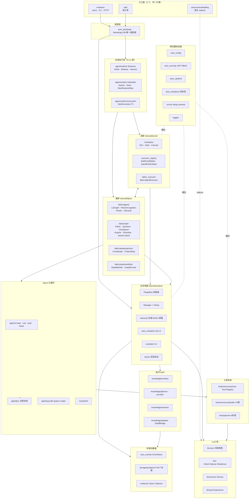

---

## 三、核心架构不变量

| 不变量 | 实现位置 | 验证方式 |
|--------|---------|---------|
| 一个内核：所有调度决策经过 `internal/kernel` | `kernel/scheduler.go` | `runtime/architecture_test.go` 锁定 kernel 不 import runtime |
| 一张图：`MutableDAG` 是全仓唯一任务图载体 | `fabric/task/workflow/engine/mutable_dag.go:34` | 架构测试 |
| 一条主线：L2 router 是唯一生产执行路径 | `internal/agentruntime/` | `sdk/l2_wiring_test.go` 验证装配完整性 |
| 无领导者调度："B 完成→C 就绪"由织物状态机推导 | `fabric/task/dag.go` | 调度器测试 |
| 执行量子可恢复 | `fabric/task/quantum.go:58` | checkpoint 持久化测试 |
| Epoch fencing：过期持有者不能驱动已易主任务 | `fabric/task/fabric.go:290` Acquire / `:712` ownerLocked | lease fencing 测试 |
| 协作式抢占，只在量子边界 | `fabric/task/fabric.go:613` Preempt | preempt 测试 |
| 规划者不执行工具，只生长图 | `fabric/agent/planner_cognition.go:235` | planner 测试 |
| syscall 调用者身份来自 kernel ctx，绝不信任 LLM 参数 | `agentsyscall/syscall.go` + `l2graph.go:420` WithCallerID | syscall 测试 |
| 接口定义在消费者侧 | 全仓惯例 | — |
| Agent 可弃，Task 持久 | `fabric/agent/lifecycle.go:69` + `internal/aresrecovery/` | recovery 测试 |
| fabric 核心不得 import runtime | `fabric/task/architecture_test.go:63` | 架构测试 |

---

## 四、0.3.1 核心变更：agentloop → agentruntime 统一

### 4.1 变更背景

0.3.1 之前，SDK 和 serve 有各自的执行循环：
- SDK 走 ReAct 循环（`internal/agentloop/engine.go`）
- serve 走 L2 router cognition（`fabric/agent/l2graph.go`）

0.3.1 将两者统一为**一条 L2 执行路径**，`internal/agentloop` 整包删除，由 `internal/agentruntime` 取代。

### 4.2 统一执行核 `internal/agentruntime`

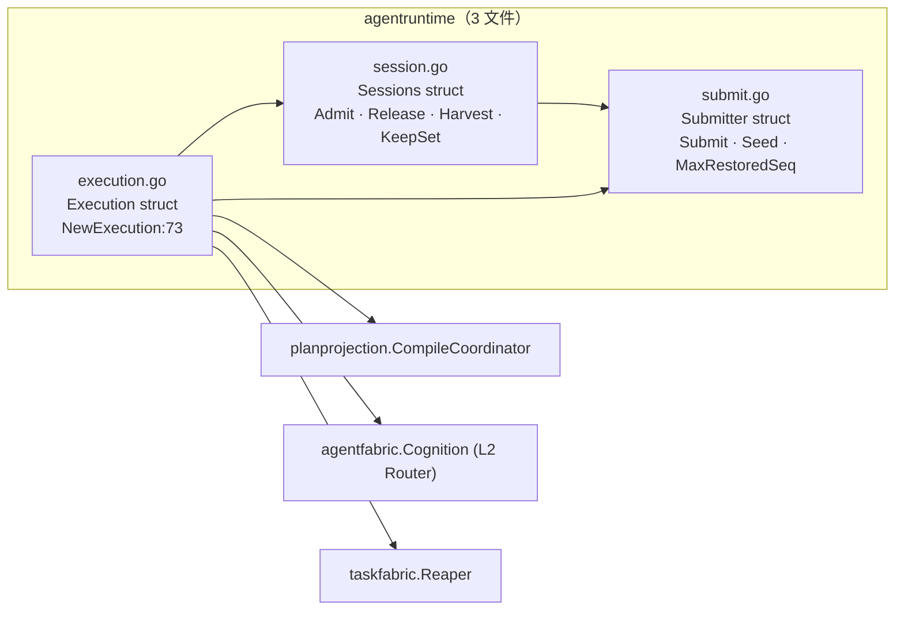

| 类型 | 位置 | 职责 |
|------|------|------|
| `Sessions` | `session.go:33` | 会话准入/释放/收割。三字段注入后只读，并发安全。`Admit` 四步：拒斜杠→幂等查→InitSession+订阅→编译 root |
| `Submitter` | `submit.go:34` | **实例级** seq（非包级全局）。`Submit` 自动准入会话 + 归一化 capability 为 `ares/plan` + 铸 `peer-plan-N` ID |
| `Execution` | `execution.go:54` | serve 和 SDK 的共同构造点。字段：Sessions · Compile · Router · Reaper · Submitter · SessionIdleTTL |

### 4.3 SDK 与 serve 的装配差异

| | cmd/ares (serve) | sdk/ |
|---|---|---|
| 装配根 | `bootstrap.go:239` | `New` + `bootstrap_runtime.go` |
| fabric | `kernel.fabric`（持久，`RestoreFromStore`） | `r.sdkFabric`（内存） |
| L2 核 | `agent_kernel.go:319` `NewExecution` | `l2.go:135` `ensureL2` 惰性 |
| 提交入口 | `submitPeerTask:660`（薄胶水） | `submitThroughScheduler:62`（同步等终答） |
| 调度模式 | peer（fabric 唯一候选源） | hybrid（`WithStaticPoolHybrid:318`） |
| ID 序列 | `Submitter` + `Seed:346` | SDK 自己 Execution 的 `Submitter` |
| 混沌 | `wireChaos` | 无 |
| 环境探测 | 无（配置驱动） | `detector.Detect` 零配置 |

**关键点**：两者使用**同一个** `agentruntime.NewExecution` 构造函数，**同一个** `agentfabric.NewRouterCognitionWithPlanner` router，**同一个** `Submitter.Submit` 提交路径。差异仅在胶水层。

---

## 五、数据流：四条闭环

### 5.1 主执行流：任务 → 量子 → 终态

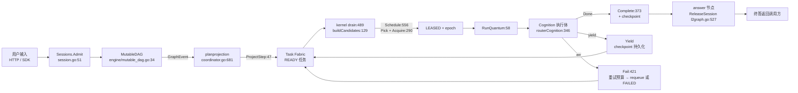

**执行体分发**（`l2graph.go:346` `routerCognition.ExecuteStep`）：
- `ares/root` → `rootCognition`（会话根，只 Yield）
- `ares/plan` → `plannerCognition`（调 LLM，长 tool/answer 节点，不执行工具）
- `tool/*` → `toolCognition`（盖章 callerID，调 ToolBinder，执行工具）
- `ares/answer` → `answerCognition`（读 content，ReleaseSession）

### 5.2 反馈流：执行结果 → 经验 → 下一轮先验

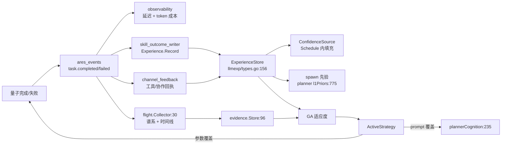

### 5.3 知识流：对话 → AKG → 检索回注

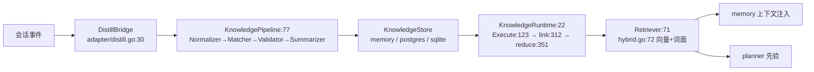

### 5.4 演化流：候选 → 门禁 → 部署

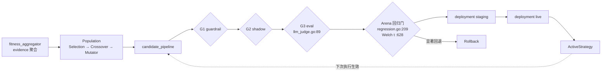

---

## 六、模块串联完整性核查

### 6.1 全链路串联矩阵

| 起点 | → 途径 | → 终点 | 串联状态 |
|------|--------|--------|---------|
| HTTP `POST /api/tasks` | `agent_routes_tasks.go:48` → `agent_kernel.go:660` → `agentruntime.Submitter.Submit` | Task Fabric READY | ✅ |
| SDK `Submit` | `task.go:74` → `scheduler.go:62` → `l2_submit.go:50` → `agentruntime.Submitter.Submit` | Task Fabric READY | ✅ |
| SDK `Agent.Run` | `agent.go:189` → `ensureL2` → `submitThroughL2` | session answer | ✅ |
| READY Task | `scheduler.go:489` drain → `fabric.go:556` Schedule → `Acquire:290` | LEASED + epoch | ✅ |
| LEASED Task | `scheduler.go:997` → `fabric_executor.go:60` → `l2graph.go:346` router | Cognition 执行 | ✅ |
| Plan Cognition | `planner_cognition.go:235` → LLM Chat → `growToolNodes:610` | 新 tool/answer 节点 | ✅ |
| Tool Cognition | `l2graph.go:415` → `WithCallerID:420` → `binder.CallTool` | 工具执行结果 | ✅ |
| Answer Cognition | `l2graph.go:510` → `ReleaseSession:527` | 终答返回 | ✅ |
| 量子完成 | `quantum.go:58` → Complete/Yield/Fail → `ares_events.Emit` | 事件 + checkpoint | ✅ |
| 事件消费 | `ares_events` → `skill_outcome_writer` / `flight.Collector` / `DistillBridge` | 经验/谱系/知识 | ✅ |
| Agent 死亡 | `aresrecovery/recovery.go:21` → `RequeueExpiredLeases` → `RecoverTaskCheckpoint` → `Acquire(epoch)` | 恢复执行 | ✅ |
| GA 演化 | `dream_cycle.go:186` → `Population.Evolve` → `candidate_pipeline` → 门禁链 → `deployment` | `ActiveStrategy` 生效 | ✅ |
| 知识回注 | `DistillBridge` → `KnowledgePipeline` → `KnowledgeStore` → `KnowledgeRuntime.Execute` → `Retriever` | prompt 注入 | ✅ |

### 6.2 架构边界测试（编译时锁定）

| 测试文件 | 锁定什么 | 状态 |
|---------|---------|------|
| `runtime/architecture_test.go` | kernel 不得 import runtime | ✅ |
| `fabric/task/architecture_test.go:63` | fabric 核心不得 import runtime | ✅ |
| `workflow/engine/architecture_test.go` | DAG 引擎依赖边界 | ✅ |
| `runtime/bus_test.go` | 热插拔注册/拔出/失败自动拔 | ✅ |
| `kernel/hybrid_pool_test.go` | 静态执行器赢自己 capability | ✅ |
| `agentruntime/submit_test.go` | MaxRestoredSeq 四族 ID、Seed grow-only | ✅ |
| `sdk/l2_session_test.go` | 多轮续聊各答各、含 `/` session ID 快败 | ✅ |
| `sdk/l2_wiring_test.go` | L2 核装配完整性、无 LLM 不半接线 | ✅ |
| `sdk/arch_test.go` | SDK 架构不变量 | ✅ |

---

## 七、0.3.1 发布就绪评估

### 7.1 计划闭环状态

依据 `plan/0.3.1plan/outstanding_tasks.md`（最后更新 2026-08-27）：

| 类别 | 项数 | 状态 |
|------|------|------|
| P0 — #36 多租户隔离 | 1 | ✅ 方案 B 定案（纯应用层谓词），Phase 2/3 descope |
| P2 — #13 异步 embedding 管线 | 1 | ✅ A2 决策不切，A1 已接 |
| P2 — #7 剩余表过期清理 | 1 | ✅ 随 #13 定案，当前架构无需清理 |
| P2 — #14 监控 DAG 无界增长 | 1 | ✅ Phase 0-4 全部完成 |
| P3 — 长尾低优先 | 16 | ✅ 全部已修 |
| N 系列（启动/并发复审） | 11 | ✅ 全部闭环 |
| 追加闭环（2026-08-26/27） | 15 | ✅ 全部闭环 |

**0.3.1 计划已无遗留待办。**

### 7.2 编译与测试验证

```
$ go build ./...                                           # ✅ clean
$ go vet ./internal/... ./sdk/... ./cmd/...                # ✅ clean
$ go test -short -count=1 ./...                            # ✅ 全绿（135 包）
$ go test -race -count=1 ./internal/agentruntime/...
    ./sdk/... ./internal/kernel/... ./internal/fabric/...  # ✅ 全绿
```

### 7.3 ~~唯一待处理项：冻结清单更新~~（已修复，2026-09-12）

```
$ bash scripts/check_convergence_freeze.sh
freeze-check OK: no new examples/ entries.
freeze-check OK: no new internal/ entries.
```

`docs/convergence/freeze-manifest.txt:27` 现为 `agentruntime`（`agentloop` 已移除），冻结检查通过。本节保留为记录。

### 7.4 工作区变更概览

当前 `dev` 分支有未提交的变更（`git status` 快照），主要涉及：

| 变更类型 | 文件 | 说明 |
|---------|------|------|
| 删除 | `internal/agentloop/doc.go` `engine.go` `engine_test.go` `engine_edges_test.go` | 旧 ReAct 引擎整包删除 |
| 新增 | `internal/agentruntime/submit.go` `submit_test.go` | 共享 L2 提交路径 |
| 新增 | `sdk/l2.go` `l2_submit.go` `l2_session_test.go` `l2_wiring_test.go` `errors.go` `arch_test.go` | SDK L2 统一 |
| 新增 | `internal/kernel/hybrid_pool_test.go` | 混合池架构测试 |
| 修改 | `sdk/sdk.go` `agent.go` `task.go` `scheduler.go` `options.go` `syscall.go` 等 | SDK 统一到 L2 |
| 修改 | `internal/kernel/scheduler.go` `executor_registry.go` `fabric_executor.go` | 调度器适配 |
| 修改 | `internal/fabric/agent/fabric.go` | 编排层适配 |
| 修改 | `internal/runtime/bus.go` `bus_test.go` `errors.go` | 总线适配 |
| 删除 | `sdk/chaos_recovery_test.go` `discovery_test.go` `discovery_fallback_test.go` | 过时测试清理 |

### 7.5 开放回路（非阻塞，已登记）

以下"实现但未接生产"的子系统不阻塞 0.3.1，已登记在 `outstanding_tasks.md` 的开放回路清单中：

- `llm/streaming` 路径（`GenerateStream`）零生产调用 — 非发布阻塞
- `workflow/scheduler` 族 / HITL plugin 零生产调用 — 能力储备
- 旧 `evolution` 包除 `LLMAdapter` 外仅 examples/tests 可达 — 已被 `ares_evolution` 取代
- `storage/ExecWithTenant` / `QueryWithTenant` 零生产调用 — #36 Phase 2/3 descope
- `ares_security` 的 `VerifyJWT` / `Wrap` / `SanitizeJSON` 仅测试可达 — 生产用 `Verify` 直连

---

## 八、调度器内核详解

### 8.1 调度循环

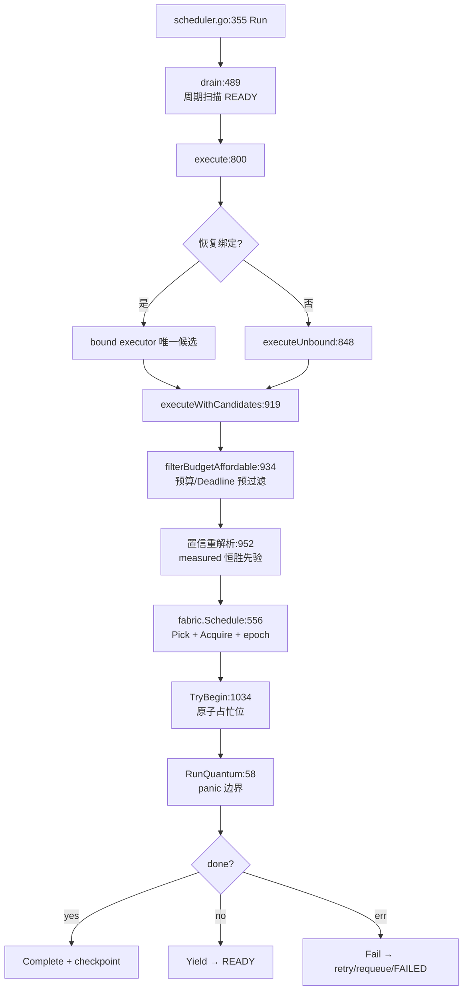

### 8.2 候选构建（`executor_registry.go:129`）

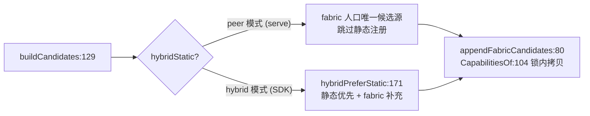

### 8.3 量子执行（`quantum.go:58`）

```
RunQuantum(taskID, agentID, epoch, step)
  1. Start(taskID, agentID, epoch)        // 状态机 READY→RUNNING
  2. t.Quantum++                           // 量子计数（跨持有者累加）
  3. checkpoint, done, err = runStepRecovered(step)  // panic 边界
  4. switch:
     err  → Fail(retry budget → requeue or FAILED)  + 返回 err
     done → CompleteWithCheckpoint(checkpoint)       + 返回 nil
     !done → Yield(checkpoint)                       + 返回 nil
```

**panic 安全**：`runStepRecovered` 用 `defer recover()` 将 panic 转为 step error，确保 fabric 状态机不遗留 RUNNING 状态。

---

## 九、Agent Fabric 与 Task Fabric

### 9.1 双织物模型

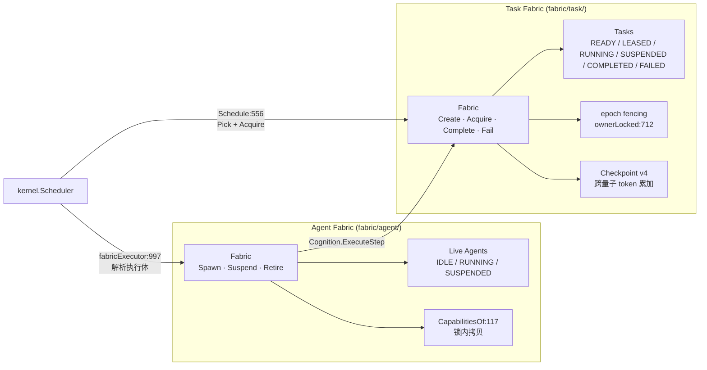

### 9.2 Epoch Fencing

```
Acquire(taskID, agentID, ttl)
  → 检查 task.State == READY
  → task.Owner = agentID
  → task.Epoch = f.epoch++     // 单调递增
  → task.LeaseExpiry = now + ttl
  → return epoch

ownerLocked(taskID, agentID, epoch)
  → task.Owner == agentID && task.Epoch == epoch
  → 否则 ErrNotOwner / ErrEpochMismatch
```

过期持有者的任何操作（Complete/Yield/Fail）都被 `ownerLocked` 挡住。

---

## 十、记忆与知识子系统

### 10.1 记忆层次

```mermaid
flowchart TD
    subgraph "Session Memory（回答发生了什么）"
        SM["MemoryManager<br/>CreateSession · AddMessage · BuildContext"]
        SM --> DISTILL["DistillationService<br/>批量提炼 → 经验"]
    end

    subgraph "Experience（回答什么有效）"
        EXP["ExperienceStore<br/>llmexp/types.go:156"]
        EXP --> RANK["RankingService"]
        EXP --> FEEDBACK["FeedbackService"]
    end

    subgraph "RAG"
        RAG["ContextRetriever:63<br/>MemoryRetriever:78"]
        RAG --> EMBED["EmbeddingPipeline:13"]
    end

    DISTILL --> EXP
    EXP --> RAG
```

### 10.2 知识图谱（AKG）

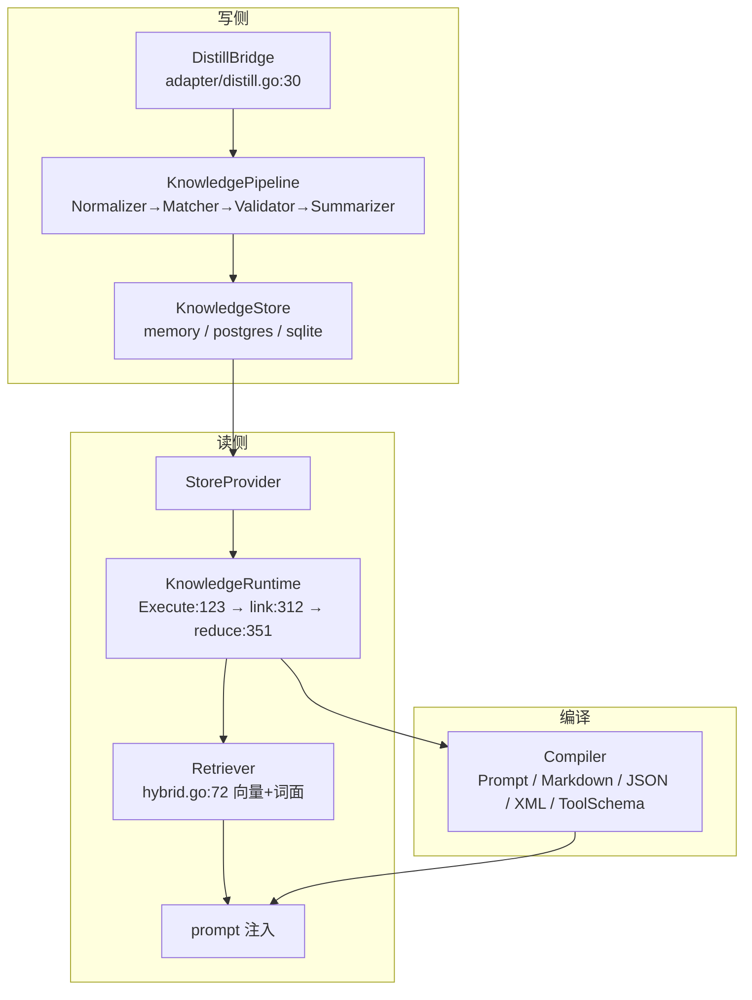

---

## 十一、演化系统

### 11.1 GA v1 信任根（`runtime/ares_evolution/`）

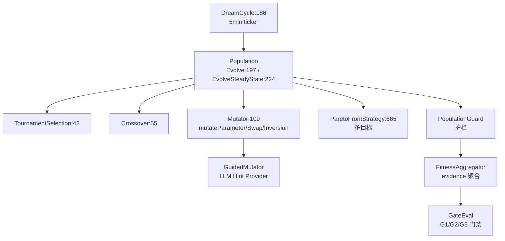

### 11.2 门禁链

```
G1 guardrail → G2 shadow → G3 eval (llm_judge)
  → Arena 回归门 (regression.go:209, Welch t-test :628)
  → staging → live deployment
  → ActiveStrategy (下次执行生效)
  → 显著回退 → Rollback
```

---

## 十二、发布建议

### ✅ 可以发布 0.3.1

**依据**：

1. **编译验证**：`go build ./...` clean，无错误
2. **静态检查**：`go vet` clean
3. **全量测试**：`go test -short ./...` 135 包全绿
4. **竞态测试**：`go test -race` 核心包全绿
5. **计划闭环**：0.3.1 全部待办项（63 项）已闭环
6. **架构测试**：所有架构边界测试通过

### 发布前建议操作

1. ~~**更新冻结清单**~~：已修复——manifest 现含 `agentruntime`，`check_convergence_freeze.sh` 通过
2. ~~**CHANGELOG 收敛条目**~~：已补——`### Changed` 首条（SDK 并入共享 L2 执行核、死锁根因、治理平价、arch 测试锁定）+ `### Removed (breaking)` 首条（`internal/agentloop` 整包退役）
3. ~~**活文档/注释漂移**~~：已清——`RUNTIME.md` A1 行、`ARCHITECTURE_DIAGRAM.md` SDK 行、`sdk/{options,l2,sdk,graph_run}.go` 注释，及 `toolsource`/`kernel/ctx`/`strategy`/`llmsvcapi`/`tool_events`/`l2graph`/`archive` 共 8 处活代码注释的 agentloop 引用
4. **提交工作区变更**：当前 dev 分支有大量未提交变更（agentloop 删除 + agentruntime 新增 + SDK L2 统一 + 本次文档/CHANGELOG 补齐），应提交后再打 tag
5. **可选**：运行 `go test -count=1 ./...`（不带 `-short`）跑完整测试套件确认无 flaky

### 不阻塞但可后续改进的项

- LLM streaming 路径未接生产（`GenerateStream` 零调用）
- 旧 evolution 包的 Candidate→Verify→Promote pipeline 仅 examples 可达
- `storage/ExecWithTenant` / `QueryWithTenant` 零生产调用（#36 Phase 2/3 descope）
- `ares_security` 的部分 API 仅测试可达

---

## 十三、依赖方向总结

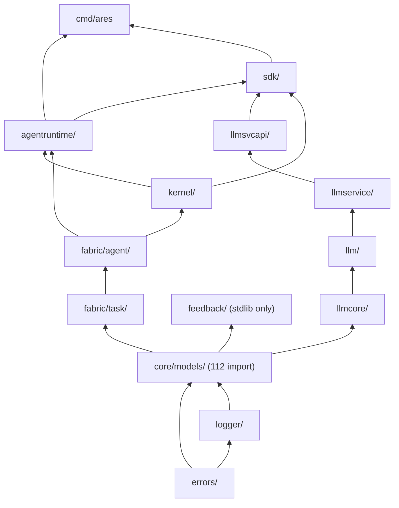

**依赖方向规则**：
- `errors` 与 `logger` 在最底层
- `core/models` 是被引最多的领域类型（112 个 import）
- `feedback` 特意只用 stdlib，保持 `agentipc`（产）↔ `ares_evolution`（消）无环
- `fabric/task` 不 import `runtime`（架构测试锁定）
- `kernel` 不 import `runtime`（架构测试锁定）

---

*报告完毕。所有结论基于源码核查 + 编译/测试验证。*
