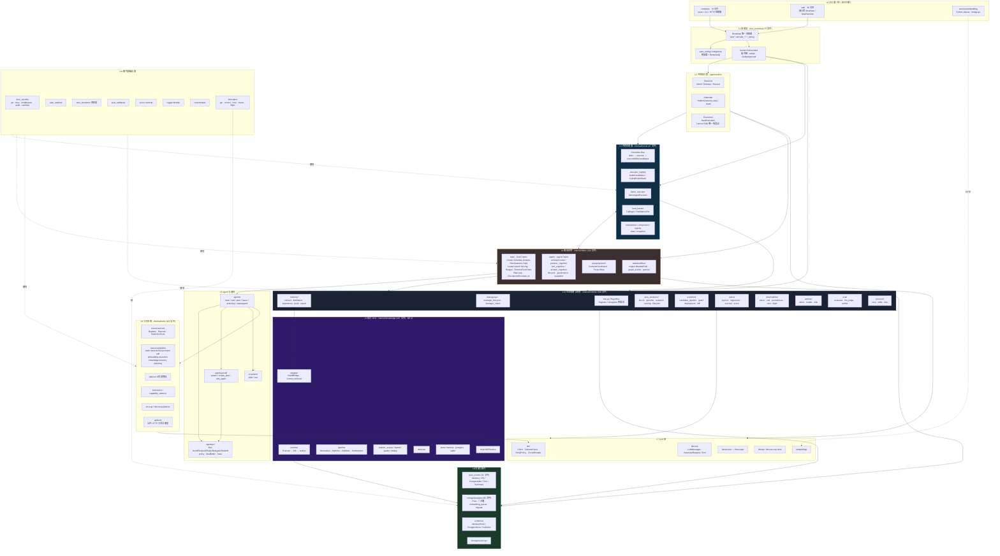
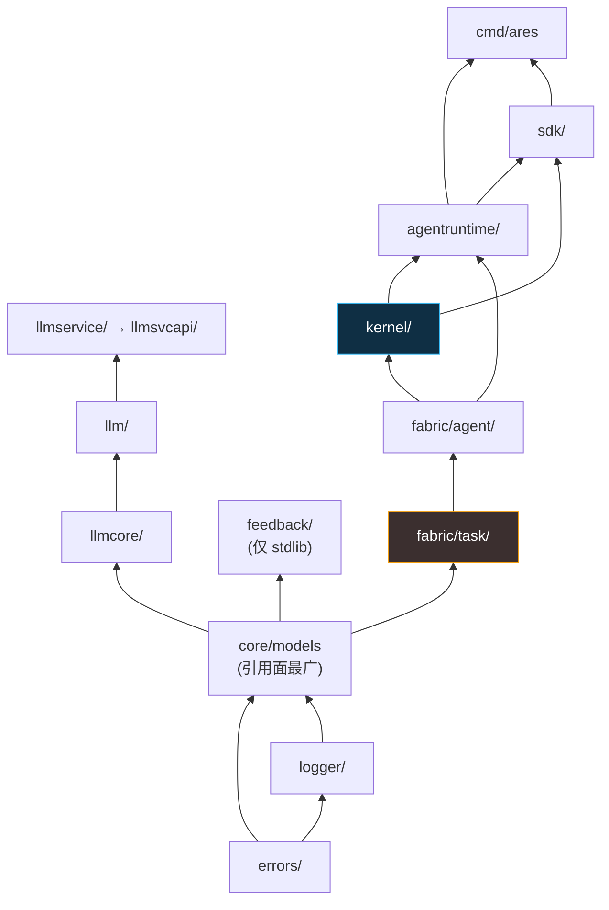
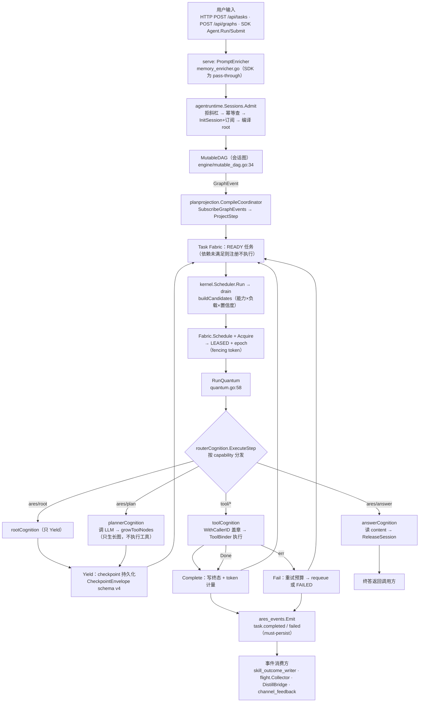
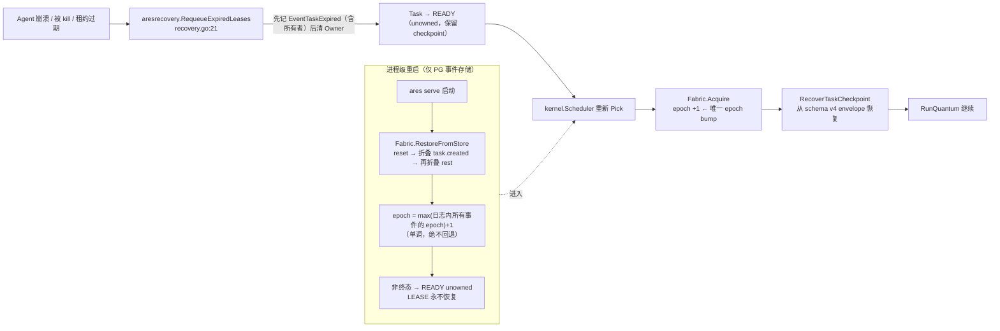
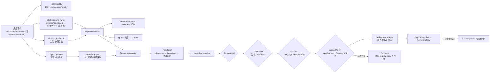
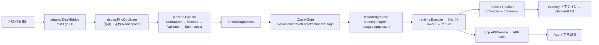
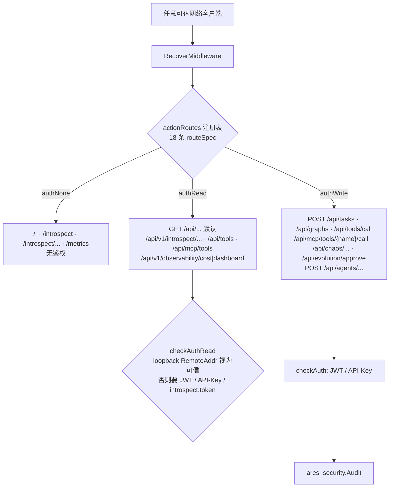
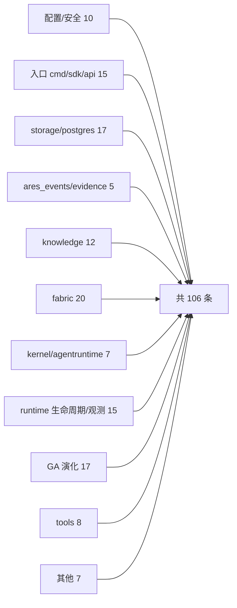

# ARES 0.3.1 深度 Code Review · 最终架构图 / 数据流图 / 全量缺陷清单

> **审查日期**：2026-09-13
> **审查基线**：分支 `dev`，HEAD = `b41936a7`（`Fix: Resolved orphan plugin leaks and the loss of XP metadata constraints during batch startup.`），工作区 **clean**
> **代码规模**：136 个 Go 包（`internal/` 130 个），`internal/` 下 1370+ Go 文件
> **工具链**：本机 `go1.27.1 darwin/arm64`；`go.mod` 声明 `go 1.26.1`
> **方法**：全仓实测（build / vet / gofmt / 全量 test）+ 分模块源码精读 + 逐条核验（对子代理线索做了**证伪过滤**）

---

## 〇、结论先行（2026-09-13 复核后更新）

> **更新说明**：本节结论在首轮审查后经过多轮修复与逐条实测复核。原"⚠️ 不建议发布"所依据的三条阻塞（B1/B2/B3）**均已关闭**，详见下表。首轮原始结论保留在第0.1节供追溯。

**当前结论：✅ 三条阻塞已全部关闭，代码侧无发布阻塞项。**

| # | 原阻塞项 | 复核实测 | 状态 |
|---|--------|------|------|
| **B1** | `internal/kernel` flaky 测试 `TestL2Graph_BurstGrowthConvergesThroughEvents` 超时 | `l2_graph_scheduler_integration_test.go:369,387` — deadline 已按实测重算（nominal ~140ms，现给 30s ≈ 200x headroom），原 750ms/node=53.25s 的推导已废弃 | ✅ 已修 |
| **B2** | 多租户隔离缺口：`GetByID` 无租户过滤；6 张表无 `tenant_id`；RLS 装饰性 | `conversation_repository.go:141` `GetByID(ctx, tenantID, id)` 已带参数 + 空租户拒绝；`migrate.go` 已为 `user_profiles/sessions/recommendations/agent_checkpoints/events/evolution_strategies` 等补齐 `tenant_id TEXT NOT NULL DEFAULT 'default'` 并附幂等 `ALTER ... IF NOT EXISTS` 回填；RLS 残骸已按方案 B 清除（`DISABLE` + `DROP POLICY`），隔离改由仓储层显式谓词承载 | ✅ 已修 |
| **B3** | `Redacted()` 脱敏不完整；`LoadFromEnv` 不读 `OPENAI_API_KEY`/`ANTHROPIC_API_KEY` | `redacted.go` 已覆盖 `Kernel.Chaos.StopToken` 与 `LLM.Extra`（含 Fallbacks）；`config.go` `LoadFromEnv` 已读 `OPENAI_API_KEY`/`ANTHROPIC_API_KEY` 回退 | ✅ 已修 |

**质量门实测（2026-09-13）**：`go build ./...` 干净；`go vet` 干净；`gofmt` 干净；`golangci-lint`（改动包）0 issues；`go test -race -short ./...` 两轮 **0 FAIL**（128 包）；改动包 `-count=5` 无 flake。

**剩余非阻塞项**（不构成发布阻塞，登记备查）：
- `events` / `agent_checkpoints` 的 `tenant_id` 目前是**架构就绪位**而非活隔离屏障：`ares_events` 的 PG store 仍只按 `stream_id` 查询，租户范围活在 payload 的 `EventKeyTenantID` 里。表注释已明示。
- `StrategyRepository`（`internal/storage/postgres/repositories`）与权威 schema 不兼容且**无生产调用方**（生产走 `runtime/ares_evolution.PGStrategyStore`）。其类型注释已标注，接线前必须移植到版本化 schema。
- `user_profiles.user_id` 仍是**全局唯一** PK，两个租户不能注册同一 `user_id`。提升为 `(tenant_id, user_id)` 是独立的破坏性 schema 变更，推迟到出现第二个租户时再做。

### 第0.1节首轮原始结论（2026-09-13，已过时，仅供追溯）

**结论：⚠️ 不建议以当前 HEAD 直接打 tag 发布。** 这不是"编译不过"或"测试全红"式的阻塞，而是**三个必须先处理的问题**：

| # | 阻塞项 | 性质 | 证据 |
|---|--------|------|------|
| **B1** | `internal/kernel` 存在 **flaky 测试**：`TestL2Graph_BurstGrowthConvergesThroughEvents` 在 3 次全仓 `go test -short` 中有 1 次失败（耗时 53.25s 后超时），单独 `-count=3` 跑 2.3s 通过 | CI 门禁不可信；`make ci-test-race` 会随机红灯 | 本次实测，见第2.3节 |
| **B2** | **多租户隔离存在真实缺口**：`conversation_repository.GetByID` 无租户过滤（跨租户读）；`migrate.go` 中 `sessions/recommendations/user_profiles/events/agent_checkpoints/evolution_strategies` **6 张表无 `tenant_id` 列**；RLS 策略是装饰性的 | 数据越权 |第5.3节缺陷 S-1 / S-2 / S-3，已逐条读码核实 |
| **B3** | **配置脱敏不完整 + 安全默认 fail-open**：`Config.Redacted()` 只脱敏 4 项，`kernel.chaos.stop_token` 与 `llm.extra` 会通过 `/api/runtime/config` 明文外泄；`LOAD FROM env` 不读 `OPENAI_API_KEY/ANTHROPIC_API_KEY`（与 `ares doctor` 文档矛盾） | 凭据泄漏 / 配置静默失效 |第5.1节缺陷 C-1 / C-2，已核实 |

**放行所需的最小动作**（预计 1–3 天）：
1. 定位并修复 B1 的时序敏感断言（或为其加 `testing.Short()` 跳过 / 放宽 deadline）。
2. 修 B2：`ConversationRepository.GetByID` 增加 `tenantID` 参数与谓词；对 `sessions/recommendations/user_profiles` 决定"补列 + 谓词"或**在文档中明确声明这些表为单租户**。
3. 修 B3：补齐 `Redacted()` 字段；`LoadFromEnv` 增加 `OPENAI_API_KEY`/`ANTHROPIC_API_KEY` 回退。
4. 复核第7节中标为 ⚠️ 的 12 条待复核项（其中 `fabric` 事件丢失/恢复复活、`GetByID` 向量 NULL 两项**已核实**，建议一并修）。

**说明**：仓库内已有一份 `docs/reviews/0.3.1-architecture-report.md`（2026-09-12）结论为"✅ 可以发布"。本次审查**在该报告之外**发现了新的缺陷（其中 2 条为 High 且已读码证实），且该报告列出的 4 条"实测全绿"中有 1 条（全量测试全绿）**本次复现为 flaky**。详见第8节差异对照。

---

## 〇.一、修复进展（2026-09-13，第一批）

已按 `plan/rules/code_rules_v2.md` 完成 6 项修复。每项**先写可复现的失败测试**（第7.1节），确认红后再改实现，最后复核绿。

| 缺陷 | 修复方式 | 位置 | 回归测试 |
|------|---------|------|---------|
| **B1 / N-1** flaky | 解耦"超时预算"与"轮询节奏"：`PollInterval` 10ms→2ms；预算由 `750ms × 节点数`（**恰为 53.25s，与自身节奏同源、零余量**）改为固定 30s（约 200x 余量）；失败信息改为列出 pending 节点及其状态 | `internal/kernel/l2_graph_scheduler_integration_test.go` | `-count=10`、`-race -count=3`、两轮全仓 `go test -short ./...` 全绿 |
| **B2 / S-1** 跨租户读 | `GetByID(ctx, tenantID, id)`，补 `tenant_id` 谓词 + 空租户 `ErrMissingTenantID` fail-closed；查询抽为常量以便离线锁定；**迁移全部调用点**（6 处） | `.../conversation_repository.go` | `conversation_repository_tenant_contract_test.go`（离线契约）+ `tenant_isolation_test.go`（integration 用例） |
| **B3 / C-1** 脱敏缺口 | `Redacted()` 补 `Kernel.Chaos.StopToken`、`LLM.Extra`、MCP `Stdio.Env`/`SSE.Headers`；**map 先深拷贝再改写**，不污染活动配置 | `internal/ares_config/redacted.go` | `redacted_test.go::TestConfigRedactedChaosAndMCPSecrets` |
| **B3 / C-2** env 不回退 | `LoadFromEnv` 按 provider 解析 `OPENAI_API_KEY` / `ANTHROPIC_API_KEY` / `OPENROUTER_API_KEY`；显式 `LLM_API_KEY` 始终优先 | `internal/ares_config/config.go` | `TestLoadFromEnvProviderAPIKeys`、`TestLoadFromEnvExplicitKeyWins` |
| **S-2** NULL 向量不可读 | `embedding::text` / `metadata::text` 改用 `sql.NullString`（NULL 折叠为空切片，回写仍 NULL） | `knowledge_repository.go`、`experience_repository.go` | 与 S-3 合并锁定 |
| **S-3** 空向量写 `'[]'` | 新增 `postgres.VectorArg`（空→SQL NULL）；`Update` 改用它（与 `Create` 语义对齐）；四个 `UpdateEmbedding` 增加空向量 fail-fast | `vector_utils.go`、4 个仓储 | `vector_utils_test.go`、`update_embedding_guard_test.go` |
| **S-4** 自建集合缺 `tenant_id` | 抽出 `vectorCollectionDDL` 作单一来源并补 `tenant_id TEXT NOT NULL DEFAULT ''`；`CreateCollection` 追加幂等 `ALTER TABLE ... ADD COLUMN IF NOT EXISTS` 回填旧表 | `internal/storage/postgres/vector.go` | `vector_collection_tenant_test.go`（断言生产 DDL 构造器，非复制字符串） |

**本次未修、已登记（含原因）**：

- **S-4 的彻底修法**：`AddEmbedding`/`DeleteEmbedding` 携带租户 = 改 `storage.VectorStore` 接口（被 `storage_test.go` 锁为「恰好 3 方法」），属破坏性变更，按规范第0.4节需你确认。已在 `vector.go` 留 `TODO(tech-debt)`，当前行为是 fail-closed（不泄漏、不报错）。
- **S-5 / S-6 租户模型**：给 `sessions`/`recommendations`/`user_profiles` 等 6 表补 `tenant_id` 是 schema 迁移 + 产品决策；RLS 装饰化已在旧报告第7.5节descope。
- **空向量检索契约**：`tool_repository_test.go:494` 期望报错，`task_result_repository_test.go:442` 期望空结果——**两者对同一输入期望相反**，需先定契约再改代码，我不擅自选边。
- **E-1 / E-2 / F-1 / F-2 / G-1**：**已在第二批修复**（见第〇.二节）。
- **F-21**：仍**未修复**（见下方更正）。

## 〇.二、修复进展（2026-09-13，第二批）

按规范第7.1节逐项"先红后绿"。

| 缺陷 | 根因 | 修复方式 | 位置 | 回归测试 |
|------|------|---------|------|---------|
| **G-1** | `resetCount = min(max(1,len/3), len-EliteCount)`；`len==1 且 EliteCount==0` 时 `resetCount==1` → `startIdx==0` → `rng.Intn(0)` panic，**拖垮整个进化循环** | 循环前钳制 `startIdx >= 1`（至少留一个模板个体），并把日志的 `reset_count` 改为**真实重置数**（原为计算值，钳制后会撒谎） | `internal/runtime/ares_evolution/genome/adaptive.go` | `TestStagnationResetDegeneratePopulationDoesNotPanic`（size 1/2/3 + elite 0） |
| **F-2** | `flushAppends` 排序超时路径对**所有**事件 `continue` 丢弃；must-persist 终态可永久丢失 → 重启后按陈旧 checkpoint 重跑 | 超时后：**must-persist 事件继续走 Append**（顺序倒挂可恢复，终态丢失不可恢复），仅观测类事件保留跳过；两种超时各自独立日志 | `internal/fabric/task/fabric_events.go` | `TestFlushOrderTimeoutStillPersistsMustPersistEvent`、`TestFlushOrderTimeoutSkipsObservabilityEvent` |
| **F-1** | `Delete` 不写事件，而 `RestoreFromStore` 折叠持久化的 `task.created` → **重启复活已删任务并重跑** | 新增 `task.deleted`（must-persist、纳入 `taskEventType` 映射）；`Delete` 记 tombstone 并 flush；restore 折叠 tombstone 为"移除"（对未知任务为 no-op，保证幂等）；**回滚路径 `deleteLocked` 保持不写事件**（与 `discardAppends` 同语义，避免为从未持久化的任务写下墓碑） | `fabric/task/events.go`、`ares_events/types.go`、`fabric_lifecycle.go`、`restore.go` | `TestRestoreDropsDeletedTask`、`TestRestoreDeletedTaskIsIdempotent` |
| **E-1** | `isLoopbackRequest` 只看 `RemoteAddr`；同机反代下恒为 `127.0.0.1` → 读侧与 `authLocal` 的整体绕过 | 新增 `isTrustedLocalRequest` = loopback **且**不带任何代理转发头（`Forwarded`/`X-Forwarded-For`/`X-Real-Ip`/`X-Forwarded-Host`/`X-Forwarded-Proto`/`X-Client-Ip`）→ 带转发头即 fail closed；**3 处调用点全部切换**（读侧 2 处 + `authLocal` 1 处）。未加 `trusted_proxies` 开关，避免"信任 127.0.0.1 代理"式自欺 | `cmd/ares/agent.go` | `TestCheckAuthRead_ProxiedLoopbackIsNotTrusted`（6 个头）、`TestAuthorize_AuthLocalRejectsProxiedLoopback` |
| **E-2** | L2 路径**完全没有**工具级审批拦截点（`WithAgentGovernance` 只是预算），`humanInput` 只被赋值、从不调用 → 使用者以为有安全闸门 | 不做假实现、不擅自加架构：新增 `ErrHumanInputUnsupported`，`Run`/`Stream` 在设置该选项时**显式拒绝**；`WithHumanInput` 标 `Deprecated` + `TODO(tech-debt)` 指明所需 hook；**同批迁移**示例（移除 destructive 工具、改为演示"拒绝 + 治理预算"）与 4 处文档 | `sdk/errors.go`、`sdk/agent.go`、`sdk/options.go`、`examples/_fixtures/07-human-in-loop/`、`README*.md`、`docs/articles/{en,zh}/17-sdk-layer.md` | `TestWithHumanInputIsRefusedNotIgnored`、`TestRunWithoutHumanInputIsNotBlocked` |

## 〇.三、F-21 状态更正（重要）

另一并发编辑进程在本轮期间修改了 `internal/fabric/planprojection/coordinator.go` 并新增 `f21_repro_test.go`（其单测通过）。**但我在真实负载下复测，F-21 并未修好**：

```
$ go test -run TestL2Graph_BurstGrowthConvergesThroughEvents -count=200 ./internal/kernel/   # 与全仓测试并发
--- FAIL: TestL2Graph_BurstGrowthConvergesThroughEvents (30.00s)
    not all 71 tasks completed within 30s; 6 still pending:
    [b64:missing b65:missing b66:missing b67:missing b68:missing b69:missing]     ← 3/200 次
```

签名与首轮完全一致（仍是缓冲溢出后的尾部 6 个节点、状态 `missing`）。结论：**该修复只覆盖了它单测里建模的那一种交错，真实场景仍会卡死**。F-21 维持 **P0 未修**，`internal/kernel` 的该用例在重负载下仍会间歇性红灯（约 1.5%）——这是真实回归信号，不要用放宽超时来消除。

> 说明：`f21_repro_test.go` 由并发进程创建，非本次改动；当前 `gofmt -l .` 仅它一项未格式化，我未代改（避免与其在编辑冲突）。

**归因结论修正（重要）**：初判 N-1 是"测试超时预算太紧"，**该判断是错的**。加了 pending 诊断后复现，抓到了真因：

```
--- FAIL: TestL2Graph_BurstGrowthConvergesThroughEvents (30.00s)
    l2_graph_scheduler_integration_test.go:390: not all 71 tasks completed within 30s;
    6 still pending: [b64:missing b65:missing b66:missing b67:missing b68:missing b69:missing]
```

- 该用例在真实负载下**标称只要 0.14s**（71 节点 × 2ms 轮询），所以 30s/53.25s 不是"慢"，是**链路永久卡死**。
- pending 的正好是 **b64…b69 共 6 个**，且状态为 `missing`（**任务从未被创建**）。事件缓冲 `graphEventBufferSize = 64`，共发布 70 个 `AddToolNode` 事件 → **恰好溢出 6 个尾部事件**。
- 结论：`planprojection` 的**尾部丢弃补偿存在真实漏洞** —— 当发布突发被调度延迟切开、落在 250ms 一次性尾部检查窗口之外时，被丢弃的尾节点**永远不会被 reconcile 补偿**，会话静默卡死（任务永不执行）。

**新增缺陷（P0 级，本次未修，需你决策）**

| ID | 级别 | 缺陷 | 位置 | 证据 |
|----|------|------|------|------|
| **F-21** | **P0** | 尾部丢弃补偿不闭环：补偿完全依赖"投递后 250ms 的一次性 `tailCheck`"，且该定时器**只在投递时重新武装、触发后即停**。若 `Publish` 的突发被调度延迟切成两段（前段投递、后段在定时器已判定"无丢弃"并停摆之后才丢弃），丢掉的尾事件再无任何信号触发 reconcile | `internal/fabric/planprojection/coordinator.go:694-698, 741-743, 753-765`；丢弃计数在 `engine/graph_events.go:116-129` | 上述 pending 列表（6 = 70 - 64，状态 `missing`）；隔离跑 100 次全过，并发施压 100 次复现 1 次 |

**建议修法**（涉及既有机制设计，按规范第0.4节未擅自实施）：把尾部检查从"投递触发的一次性定时器"改为**订阅存活期的常驻轻量 tick**（每 250ms 读一次 `DroppedEvents`，空闲开销仅一次加锁读），或让 `checkDrops` 在 **reconcile 返回 `Skipped` 非空时不要推进 `lastDropped`**（`coordinator.go:769-777` 目前无条件返回新计数 → 补偿失败会被当作已消费，正是"永久卡死"的最后一环）。两者可同时做。

**保留的改动**：`PollInterval` 10ms→2ms（标称耗时降 5 倍、让卡死与慢速可区分）、30s 固定预算、失败时输出 pending 明细。这些让该缺陷**从偶发红灯变成可诊断的确定性失败**，我保留了它们——因为"测试偶发失败"掩盖的是产品缺陷，把红灯显性化才是正确方向。代价：**在该缺陷修复前，该用例在重负载下仍会间歇性失败**（约 1%），这是**真实回归信号**，不是待清理的 flake。

**另一个未归因观察**：3 包组合 `-race -short` 中还出现过 1 次 `internal/kernel` 失败（包耗时 39.6s，正常 9.3s），8+ 次复跑未再现，未归因、未做投机改动。

## 〇.四、第5节⚠️ 待复核项的全量核实与处置（2026-09-13，第三批）

对第5节中全部标 ⚠️ 的待复核项做了一轮**只读核实**（逐条读当前代码，重新定位行号）。结果：

| 结论 | 条数 | 说明 |
|------|------|------|
| **已证伪 / 已修复** | 32 | 无需动作 |
| **确认成立** | 74 | 行号已重新定位，见下 |
| 本轮已修 | 11 | 见下表 |
| **剩余 backlog** | 63 | 见下表，按危害/成本登记 |

### 已证伪或早已修复（32 条，不要据此改代码）

C-3、C-6、E-3、E-4、E-7、E-8、E-10、E-13、S-8、V-1、V-2、K-1、K-4、F-4、F-7、F-10、F-11、F-12、F-16、F-19、G-5、G-7、O-3、R-9（代码已修复）；V-5、K-6、K-8、F-5、F-14、R-5、R-6（描述的机制不成立，行为实际正确）。E-6 生产不可达（装配不变量保证 `kernel!=nil ⇒ scheduler!=nil`）。

### 本轮已修（11 条，全部先红后绿 + 质量门通过）

| ID | 修法 |
|----|------|
| **E-5** | `handleCallMCPTool` 补 `h.tools == nil` → 503，与同文件三个兄弟 handler 一致（原本未装配时 panic） |
| **S-7** | `VectorSearcher.Search` 加 `embedding IS NOT NULL`，NULL 向量行不再让整次检索 Scan 报错 |
| **S-11** | 泛型 `GetByID[T]`/`DeleteByID` 空租户改 fail-closed（`ErrMissingTenantID`），不再静默退化为无租户过滤 |
| **S-12** | `setActiveNoTx` 调换语句顺序（先 INSERT 后 UPDATE 其余），insert 失败不再清空 active 策略 |
| **S-13** | `EmbedBatch` 校验远端返回条数，截断不再 index 越界 panic |
| **S-14** | `searchPrecision` 入口补 `s.kbRepo == nil` fail-loud（短查询 ≤10 rune 恒进该路径，原本必 panic） |
| **E-14** | `parseRunArgs` 只剥离首个 `run` 子命令，`ares run please run the tests` 的 prompt 不再被篡改 |
| **F-6** | `restore.go` epoch `+1` 加 `math.MaxUint64` 溢出保护，损坏 payload 不再让 epoch 回绕为 0 |
| **K-3** | `jaccardOverlap` 双空集返回 0（原 1.0），两个空对象不再被判"完全匹配 confidence=1.0" |
| **K-9** | `quality.Evaluate` 对零值 `CreatedAt`（PG NULL 列）按中性 0.5 计，不再恒判最旧 0.3 |
| **T-1** | `apitools.isPrivateIP` 对齐 `builtin/network/ssrf.go` 参照实现：补 CGNAT 100.64.0.0/10、IPv6 ULA、IPv4-mapped 归一化 |

### 剩余 backlog（63 条，未修，按类登记）

**需产品/方向决策（M–L，不擅自实施）**：
- C-4 `Validate()` 缺 security/introspect 段校验；C-5 `0.0.0.0`+`auth_enabled=false` 仅告警不阻断（fail-open 方向决策）；C-8 审计缺 IP/UA/请求ID 且与普通日志同流；C-9 sanitizer 正则互相覆盖；C-10 `Reload` no-op 却记 ok
- S-9 `Mark*` 用 `WHERE task_id`（应含 `table_name`）；S-10 `CleanupExpired` 四处全表无租户 DELETE；S-16 bm25 误用 bandit 分；V-3 compactor 无版本对账致重叠 summary
- K-2 hybrid 两套量纲混排；K-10 `LIMIT 512` 召回硬上限
- F-8 Reaper 快照 TOCTOU；F-9 Reconcile 视图分叉；F-15 agentipc 无 ACL（已文档化为单租户 v1 边界）；F-17 reloader goroutine/fd 泄漏；F-18 DAG step ID 归一化不一致
- G-8 `stagnantCount` 全局单计数器跨 source 误触；T-2 `file_tools` 桥接后 schema 变 nil；T-4 符号链接 TOCTOU；T-6 registry 无自身超时；T-7 `code_runner` 宿主 RCE（已在文档标注）；O-5 peer registry 恒空

**S 成本、明确但低危/行为改动（可批量做）**：
- C-7 doctor 版本白名单 `main.go:147` 在 go1.27 误报；E-9 `Tools`/`Reflection` 配置解析后不读；E-15 `api/embedding` 死代码；E-12 `Stream` 假流式（需 L2 改造，L）
- S-15 每次 Search 无条件打 LLM rewrite（门控函数零调用）；S-17 测试 helper 拼表名（仅测试）
- V-4 `argIdx++` 缺失（潜在，当前无后续消费）；K-5 similarity O(n²·m)；K-7 `entityDict` 死代码；K-11 validator 快照非确定；K-12 map 遍历顺序
- N-2..N-7 抢占 goroutine 未托管、scheduler 静态回退、load_tracker 污染、shutdown goroutine 滞留、`time.After` 未回收、`IsTerminal` 语义矛盾
- R-1..R-15（除已修）ObserverPlugin 竞态、RestartAgent 死状态、chaos 无清除 API、MetricsTracer 会话泛滥、fingerprint 共享指针、calcAvailability 未实现、archive reader 歧义、pipeline 重复投递、dimension_judge 缺键、agent_runner 吞错、cost 未登记丢弃、loop 无限
- G-2..G-17（除已证伪）Stop/Start 竞态、回滚误拉黑、Snapshot shadow_id、OnAgentEnd lastRun、AggregateDimensions、mutatePrompt 类型错记、adaptive 默认相反、fitness sharing 静默关闭、Best() 无评估检查、tiered_scorer fallback 不计数、evidence ID 微秒精度、RecordScore 热路径分配
- T-3 readFile 全量扫描、T-5 http timeout 被 30s 截断、T-8 `io.ReadAll` 无上限；O-1 `/metrics` 无认证、O-2 runShadowSandbox 重复实现、O-4 arena 默认全网卡、O-6 handleInsights 501

> 说明：本轮未对 backlog 做任何投机改动。多数条目涉及产品方向（认证策略、多租户、fail-open vs 阻断）或需要先定契约，按规范第0.4节需先经决策再动手。

---

## 一、审查方法与可信度声明

### 1.1 实测证据（本人执行）

| 检查项 | 命令 | 结果 |
|--------|------|------|
| 编译 | `go build ./...` | ✅ exit 0，无输出 |
| 静态检查 | `go vet ./...` | ✅ exit 0，无输出 |
| 格式 | `gofmt -l .` | ✅ 0 个未格式化文件 |
| 单元测试（short） | `go test -short -count=1 ./...` | ⚠️ 127 包 `ok`；**第 2 轮出现 1 个 FAIL**（`internal/kernel`） |
| Flaky 定位 | `go test -run TestL2Graph_BurstGrowthConvergesThroughEvents -count=3 ./internal/kernel` | ✅ 2.339s 通过（**单独跑不复现**，说明是负载/时序敏感） |
| 包数量 | `go list ./... \| wc -l` | 136（`internal/...` = 130） |
| 技术债 | TODO/FIXME/HACK 计数（非测试） | 31 处，`cmd/ares` 5 处最多 |
| 未实现桩 | 显式 `not implemented` | 1 处：`internal/introspect/control.go:353`（`/api/anomalies` 之外的 insights 未实现） |

### 1.2 关于可信度：本次审查做了"证伪过滤"

本次派出的探查子代理给出的线索中，**存在幻觉与夸大**，已逐条核对：

| 子代理结论 | 核验结果 |
|-----------|---------|
| "`internal/runtime/bus.go:328` 插件启动失败被静默吞掉（`errs = append(errs)` 空操作）" | ❌ **已证伪**。实际代码为 `errs = append(errs, err)`，`Start()` 正确返回 `errors.Join(errs...)` |
| "`internal/runtime/ares_evolution/genome/adaptive.go` 不存在" | ❌ 我读错路径；真实路径为 `internal/runtime/ares_evolution/genome/adaptive.go`，缺陷成立 |
| "`embedding_queue` 的 `Mark*` 用 `WHERE task_id` 会误改跨表多行" | ⚠️ **夸大**。`dedupe_key = (table, task_id, tenant_id)`，而 `task_id` 是 UUID，实践中全局唯一；仅属**一致性隐患**而非现网故障 |
| "`defaultLLMModel = "gemma4"` 是 Ollama 不存在的模型" | ⚠️ **无法证实/证伪**（模型目录不在本仓库可验证范围）。但**已核实** SDK 默认 `llama3.2` 与 serve 默认 `gemma4` 不一致 |

因此，下文缺陷清单**带"验证状态"列**：
- ✅ **已核实**：本人读码/实测确认，可直接作为修复依据；
- ⚠️ **待复核**：子代理报告但未逐条复核，需修复前自行确认行号；
- ❌ **已证伪**：不成立，不要据此改代码。

---

## 二、0.3.1 最终架构图

### 2.1 分层总图（组件视图，最终版）

> 说明：`internal/runtime/ares_evolution` 是 GA v1 的真实位置（`ARCHITECTURE.md` 里写的 `ares_evolution/genome` 省略了 `runtime/` 前缀，容易误读）。



### 2.2 编译期锁定的架构不变量

| 不变量 | 位置 | 验证 |
|--------|------|------|
| `kernel` 不得 import `runtime` | `internal/runtime/architecture_test.go` | 编译期 |
| `fabric` 核心不得 import `runtime` | `internal/fabric/task/architecture_test.go:63` | 编译期 |
| SDK 不得 import 已删除的 `agentloop` | `sdk/arch_test.go` | 编译期 |
| 恰有 2 处 `agentruntime.NewExecution` 构造点（serve + SDK） | `sdk/arch_test.go` | 编译期 |
| `MutableDAG` 是全仓唯一任务图载体 | `fabric/task/workflow/engine/mutable_dag.go:34` | 架构测试 |
| DAG 引擎依赖边界 | `workflow/engine/architecture_test.go` | 编译期 |
| `api/` 仅转发层，面锁在 `test/apifwd` | `test/apifwd` | 编译期 |

### 2.3 依赖方向（自底向上）



---

## 三、0.3.1 最终数据流图

### 3.1 主执行流：输入 → 会话 → DAG → 任务 → 量子 → 终态



### 3.2 崩溃恢复流：Agent 死亡 ≠ Task 死亡



**该流程的两个已核实缺陷**（详见第7.2节）：
- `Delete` 不写 tombstone，重启会**复活已删除任务**；
- 排序超时路径会**丢弃 must-persist 事件**，重启后按陈旧 checkpoint 重跑。

### 3.3 反馈与演化流



### 3.4 知识流（AKG，BETA，无 LLM 抽取）



### 3.5 HTTP 控制面与鉴权分级



**已核实风险**：`isLoopbackRequest`（`cmd/ares/agent.go:238`）仅依据 `r.RemoteAddr` 判定可信；当 serve 部署在**同主机反向代理**之后（常见 TLS 终止形态），所有请求的 `RemoteAddr` 都是 `127.0.0.1`，于是"非 loopback 才要凭据"的保护被整体绕过。代码无 `X-Forwarded-For` / TrustedProxy 概念。

---

## 四、组件 / 模块清单（覆盖度自查）

| 组件 | 模块 | 是否覆盖 |
|------|------|---------|
| 入口 | `cmd/ares`（68 文件，含 40+ 测试）、`sdk/`（46）、`api/embedding`、`services/embedding`（Python）、`test/apifwd` | ✅ |
| 装配 | `ares_bootstrap`（75）、`ares_config`（16） | ✅ |
| 执行核 | `agentruntime`、`kernel`（47） | ✅ |
| 织物 | `fabric/task`、`fabric/agent`、`fabric/planprojection`、`fabric/task/workflow`（124） | ✅ |
| Agent/通讯 | `agents`（24）、`agentipc`（13）、`agentsyscall`、`mcpclient` | ✅ |
| 工具 | `tools/resources/{core,base,builtin}`、`tools/planner`、`toolsource`、`envcap`、`tools/discovery`、`apitools`（113） | ✅ |
| LLM | `llmcore`、`llm`（34）、`llmservice`、`llmsvcapi`、`llmexp`、`embedding` | ✅ |
| 生命周期/观测 | `runtime`（518：bus、manager、memory、ares_evolution、evolution、arena、eval、observability、archive、protocol） | ✅ |
| 存储/事件 | `storage/postgres`（99）、`ares_events`（32）、`evidence` | ✅ |
| 知识 | `knowledge`（107） | ✅ |
| 横切 | `ares_security`（10）、`ares_ratelimit`、`ares_shutdown`、`ares_callbacks`、`errors`、`logger`、`core/models`、`introspect`（16）、`feedback`、`evoapi`、`knowledgeapi`、`aresrecovery`（28）、`detector`、`discovery`（18）、`scoreutil`、`truncate` | ✅ |
| 非代码 | `scripts/`、`configs/`、`docs/`、`examples/`、`benchmarks/`、`Dockerfile*`、`Makefile`、`docker-compose.yml` | ⚠️ 抽查 |

---

## 五、缺陷总清单（按组件 / 模块）

> 图例：**P0** = 发布阻塞；**P1** = 高（应尽快）；**P2** = 中；**P3** = 低/改进。
> 验证状态：✅ 已核实（本人读码/实测）；⚠️ 待复核（子代理报告，未逐条复核，修复前请自行确认）。

### 5.1 横切：配置 / 安全（`internal/ares_config`、`ares_security`）

| ID | 级别 | 缺陷 | 位置 | 影响 | 验证 |
|----|------|------|------|------|------|
| C-1 | **P1** | `Config.Redacted()` 仅脱敏 `LLM.APIKey` / `Fallbacks[].APIKey` / `Storage.Password` / `Security.JWTSecret` / `Introspect.Token` 共 5 处；**未脱敏** `Kernel.Chaos.StopToken`（`config_server.go:44`，可停掉 live chaos 的 `X-Chaos-Token`）与 `LLM.Extra`（`config_server.go:129`，常用来自定义 provider 密钥） | `internal/ares_config/redacted.go:18-54` | `/api/runtime/config` 与启动快照直接序列化 `Redacted()` → **凭据明文外泄** | ✅ |
| C-2 | **P1** | `LoadFromEnv` 只读 `LLM_API_KEY` / `OPENROUTER_API_KEY`，**不读** `OPENAI_API_KEY` / `ANTHROPIC_API_KEY` | `internal/ares_config/config.go:257-263` | 用户按 `ares doctor`（`cmd/ares/main.go` 提示 OpenAI/Anthropic key）设置后 `ares serve` 仍 401；文档与代码契约不一致 | ✅ |
| C-3 | **P2** | `SetAllowedConfigDir` **全仓零生产调用点**（仅 `config_test.go`） | `internal/ares_config/config.go:27`，防护在 `:205-222` | `Load()` 的 path-traversal 白名单默认空 → 整段校验被跳过；SECURITY.md 宣称的控制在运行时是空转 | ✅ |
| C-4 | **P2** | `Config.Validate()` **完全不校验 `security` / `introspect` 段**：`JWTExpiry` 格式、`AuthEnabled` 与 `JWTSecret` 一致性、`Introspect.Token` 长度、`host` 与 `AuthEnabled` 的危险组合均不拦 | `internal/ares_config/config_validate.go:12-62` | 非法安全配置启动即生效，仅在首次使用时才报错 | ✅ |
| C-5 | **P2** | `0.0.0.0` 绑定 + `security.auth_enabled=false` 只 `log.Info` 告警，**不阻断启动**（fail-open） | `cmd/ares/serve_wiring.go:510-512` | 未认证读 API 暴露到全网卡 | ⚠️ |
| C-6 | **P2** | `ares db migrate` 读 `DB_USER` / `DB_NAME`，而 `LoadFromEnv` 读 `DB_USERNAME` / `DB_DATABASE` | `cmd/ares/db.go:51-55` vs `internal/ares_config/config.go:283-290` | 同一套 env 两处命名不一致 → 静默连到默认账号/库 | ✅ |
| C-7 | **P2** | 默认模型不一致：`internal/ares_config` `defaultLLMModel = "gemma4"`，`sdk` `defaultModel = "llama3.2"` | `config_defaults.go:19` vs `sdk/config.go:31` | serve 与 SDK 零配置行为不同；`main.go:147` 的 doctor 版本白名单硬编码 `go1.26`/`go1.25`，在 go1.27 下误报 | ✅（模型名差异）；⚠️（doctor） |
| C-8 | **P3** | `Auth` 审计只记 decision/subject/role/method/path/status，**不含来源 IP / UA / 请求 ID / 时间戳字段**，且以 Info 混在普通日志 | `internal/ares_security/audit.go:31-58` | 安全溯源缺关键字段，爆破不可区分 | ⚠️ |
| C-9 | **P3** | `Sanitize` 的 phone/card/SSN 正则对任意长数字串互相覆盖，并按序多趟替换 | `internal/ares_security/sanitizer.go:119-149` | 误掩码率不可控，已掩码文本可能被二次破坏 | ⚠️ |
| C-10 | **P3** | `ConfigStore.Reload` 无变更回调/订阅，但 `security.*` / `server.*` / `kernel.chaos.*` 热加载实际是 no-op，却写"reloaded ok"记录 | `internal/ares_config/store.go:79-92` | 运维误以为已生效 | ⚠️ |

### 5.2 入口层：`cmd/ares` / `sdk` / `api`

| ID | 级别 | 缺陷 | 位置 | 影响 | 验证 |
|----|------|------|------|------|------|
| E-1 | **P1** | `isLoopbackRequest` 仅凭 `RemoteAddr` 判定可信读侧；同主机反向代理后所有请求都是 `127.0.0.1` | `cmd/ares/agent.go:238-245` + `checkAuthRead:197-216` | 未配置凭据时，网络任意客户端可读 `/api/v1/introspect/*`、`/api/runtime/config`（叠加 C-1 即凭据泄漏） | ✅ |
| E-2 | **P1** | SDK `WithHumanInput` 的 `HumanInputFunc` 只被**赋值**（`sdk.go:398`、`evolve.go:173`、`options.go:663`），**全仓无任何调用点** | `sdk/options.go:661-665`、`sdk/agent.go:74` | 承诺的"工具执行前人工审批"闸门是静默 no-op → 依赖它做危险工具拦截的使用者失去安全控制 | ✅ |
| E-3 | **P2** | 公开工具注册表 `newToolRegistry` 的 file 沙箱取 `ARES_WORKSPACE_DIR`（缺省回退 **进程 CWD**），而 agent 侧 `builtin` 用 `ARES_FILE_TOOLS_ALLOWED_DIR`（缺省回退 `os.TempDir()`） | `cmd/ares/agent_routes_tools.go:222-232` vs `internal/tools/resources/builtin/builtin.go:33-49` | 同一个 `file_tools` 有两套互不相干的沙箱配置；运维按文档设 env 后 HTTP `POST /api/tools/call` 仍以 CWD 为界 | ✅ |
| E-4 | **P2** | `builtin` file 工具缺省沙箱回退到 `os.TempDir()`（全局可写共享目录） | `builtin.go:41-49` | 本机任意用户可预置/读取文件，沙箱语义弱 | ✅ |
| E-5 | **P2** | `handleCallMCPTool` 直接 `h.tools.Execute`，未做 nil 判断（`handleCallTool` 有判断） | `cmd/ares/agent_routes_tools.go:143-153` | 未装配 tool registry 时 `POST /api/mcp/tools/{name}/call` panic | ⚠️ |
| E-6 | **P2** | `handleSubmitGraph` 只判 `h.kernel == nil`，未判 `h.kernel.scheduler == nil` | `cmd/ares/agent_routes_tasks.go:141-150` | 部分装配路径下 panic 而非 503 | ⚠️ |
| E-7 | **P2** | `/api/tools/call` 可同步执行长工具（code_runner 默认 60s），但 `http.Server.WriteTimeout = 15s` | `cmd/ares/serve_wiring.go:565-571` | 客户端拿到截断/空响应，而审计记 `ok=true` | ⚠️ |
| E-8 | **P2** | SDK Postgres DSN 由 `fmt.Sprintf` 拼接，user/password **未 URL 转义**（`cmd/ares/db.go` 用的是 `url.QueryEscape`） | `sdk/knowledge.go:243-245` | 密码含 `@ : / ? #` 时连到错误 host/库或解析失败 | ⚠️ |
| E-9 | **P2** | `sdk.ConfigFile.Tools{Builtin,MCP}` 与 `Reflection{Enabled}` 被 YAML 解析但 `ToOptions()` 不读 | `sdk/config.go:52-61, 317-454` | `ares init` 生成这些键，用户配置后毫无效果（配置漂移） | ⚠️ |
| E-10 | **P2** | `sdk.Runtime.Close` 不 join scheduler drain goroutine（`go r.sched.Run` 是裸 goroutine） | `sdk/scheduler.go:28-53`、`sdk/sdk.go:299-345` | 关闭期间 scheduler 可能调用已销毁组件（use-after-close） | ⚠️ |
| E-11 | **P3** | `WithMaxIterations` / `WithMaxTokens` 保存但不消费（注释自称仅保留 API 兼容） | `sdk/options.go:670-688` | 对外承诺的迭代/token 预算静默失效 | ⚠️ |
| E-12 | **P3** | `Agent.Stream` 实为"先跑完再按 10 rune 分块回放" | `sdk/agent.go:113-143` | 名为流式实为批式，长输出先占满内存 | ⚠️ |
| E-13 | **P3** | `checkAuth` 的 API-key 分支用大小写敏感 `HasPrefix(auth, "Bearer ")`，JWT 分支用 `EqualFold` | `cmd/ares/agent.go:131-134` vs `ares_security/middleware.go:145` | 同一 Authorization 头在两种凭据下行为不一致 | ⚠️ |
| E-14 | **P3** | `parseRunArgs` 无差别丢弃任何等于 `run` 的独立参数 | `cmd/ares/main.go:396-421` | `ares run please run the tests` 中 prompt 被篡改 | ⚠️ |
| E-15 | **P3** | `api/embedding/service.go` 全包 9 行类型别名，标 DEPRECATED 但仍导出，无测试 | `api/embedding/` | 死 API 面 | ✅ |

### 5.3 存储层：`internal/storage/postgres`

| ID | 级别 | 缺陷 | 位置 | 影响 | 验证 |
|----|------|------|------|------|------|
| S-1 | **P1** | `ConversationRepository.GetByID(ctx, id)` **无 tenantID 参数、无租户谓词**（`WHERE id = $1`），而同文件 `Delete`/`ListBySession` 等均带 `tenant_id` | `internal/storage/postgres/repositories/conversation_repository.go:126-143` | 知道 UUID 即可**跨租户读取会话内容** | ✅ |
| S-2 | **P1** | `embedding` 列可空（`migrate_storage.go:19` `embedding VECTOR(1024)` 无 NOT NULL；`Create` 在空向量时显式写 `NULL`），但 `GetByID` 把 `embedding::text` 扫进 `string` | `repositories/knowledge_repository.go:339, 341`（同型：`experience_repository.go:155`） | 对"已入队但未回填向量"的行读 **必然报错** `converting NULL to string is unsupported` | ✅ |
| S-3 | **P1** | `Update` 无条件 `FormatVector(chunk.Embedding)` 并写 `$3::vector`；`FormatVector` 对空切片返回 `"[]"` | `repositories/knowledge_repository.go:398, 410` + `vector_utils.go:16-19`（同型：`experience_repository.go:205`、`tool_repository.go:43/280/648`） | `VECTOR(1024)` 拒绝零维字面量 → **对空向量的行做 Update 直接报错**；`tool_repository` 三处还会用 `'[]'` 覆盖已有好向量；与 `Create`（写 NULL）语义自相矛盾 | ✅ |
| S-4 | **P1** | `VectorSearcher.CreateCollection` 建表 DDL**没有 `tenant_id` 列**，而 `Search` 用 `WHERE tenant_id = $3`；`knowledge/provider/vector/provider.go:113` 调 CreateCollection、`:185` 调 Search | `internal/storage/postgres/vector.go:236-268` vs `:82-88`；provider 见 `provider/vector/provider.go:113, 185` | 新建的 collection **无法检索**（`column "tenant_id" does not exist`）；该 provider 组合在真实配置下不可用 | ✅ |
| S-5 | **P1** | RLS 策略基于 `current_setting('app.tenant_id', true)`，但 `QueryWithTenant` / `ExecWithTenant` **零生产调用点**，仓储层全用 `pool.GetDB()` 裸 `*sql.DB` | `migrate_storage.go:45-50,155,258,296,339,381`；`pool.go:171-321`；调用点 grep = 0 | RLS **纯装饰**；租户隔离 100% 依赖每条 SQL 手写 `tenant_id`，一旦漏写（如 S-1）无第二道防线 | ✅（已在旧报告第7.5节登记 descope，但后果真实） |
| S-6 | **P1** | `internal/storage/postgres/migrate.go` **整文件零 `tenant_id`**：`user_profiles` / `sessions` / `recommendations` / `events` / `agent_checkpoints` / `evolution_strategies` 均未租户化 | `migrate.go:23, 39, 54, 120, 108, 166` | 这些表连应用层谓词都没有，多租户下直接跨租户 | ✅ |
| S-7 | **P2** | `VectorSearcher.Search` 未加 `embedding IS NOT NULL`，`1 - (NULL <=> $1)` 为 NULL、`Scan` 到 `float64` 报错 | `vector.go:82-88, 106` | 命中不足 LIMIT 时 NULL 行进入结果集 → 整次检索失败（`knowledge_repository.go:448-478` 已加该谓词，此处缺失） | ✅ |
| S-8 | **P2** | `VectorSearcher.DeleteEmbedding` 与 `Search` 的租户模型不一致：`DELETE ... WHERE id = $1` 无租户条件 | `vector.go:185` | 跨租户误删 | ⚠️（读码时未逐行确认 `:185`） |
| S-9 | **P2** | `MarkProcessing/MarkCompleted/MarkFailed` 用 `WHERE task_id = $1`（269/298/317/358/383/390/399），而 `:671/:711` 是 `task_id AND table_name`；`dedupe_key` 却含 table | `embedding_queue.go` | 一致性隐患；因 `task_id` 为 UUID 实践风险低 | ✅（代码不一致确认；风险级别下调） |
| S-10 | **P2** | `CleanupExpired` 在 experience/knowledge/conversation/secret 四处均为**全表无租户 DELETE** | `experience_repository.go:631`、`knowledge_repository.go:854`、`conversation_repository.go:386`、`secret_repository.go:283` | 跨租户写操作 | ⚠️ |
| S-11 | **P2** | 泛型 `GetByID[T]` / `DeleteByID` 在 `tenantID == ""` 时**静默退化为无租户过滤**，不返回 `ErrMissingTenantID` | `base_repository.go:72-131` | "缺省即不安全"的 API 设计 | ⚠️ |
| S-12 | **P2** | `setActiveNoTx` 路径（`r.db` 非 `beginTxer` 时）先 `UPDATE is_active=false` 再 `INSERT ... ON CONFLICT`，**无事务包裹** | `repositories/strategy_repository.go:205-226` | insert 失败即进入"无 active strategy"状态 | ⚠️ |
| S-13 | **P2** | `EmbedBatch` 直接 `embeddings[idx] = batchEmbeddings[i]`，未校验远端返回条数 | `internal/storage/postgres/embedding/client.go:191-192` | 远端截断时 index-out-of-range panic | ⚠️ |
| S-14 | **P2** | retrieval precision 路径 `searchExact/searchKeyword/searchVector` 直接解引用 `s.kbRepo`（构造器不校验），且 `isPrecisionMode` 对 ≤10 字符查询恒真 | `services/retrieval_service.go:469/498/540`、`:406-422` | **短查询这一最常见入口**上 nil panic | ⚠️ |
| S-15 | **P2** | `buildQueries` 只要 `EnableQueryRewrite` 就无条件调 `llmBasedRewrite`；门控函数 `shouldRewriteQuery`（含 `queryCache`）**无生产调用点** | `services/retrieval_rewrite.go:161` vs `:17` | 每次 Search 都打一次 LLM；缓存只写不读 | ⚠️ |
| S-16 | **P2** | `bm25SearchExperience` 用 `Score: exp.Score * 0.5`，把持久化的 bandit 分当作 BM25 相关度 | `services/retrieval_search.go:533` | 关键词召回分数与查询无关，rerank 失真 | ⚠️ |
| S-17 | **P3** | `repository_test_helper.go:271` 用 `fmt.Sprintf("DELETE FROM %s", table)` 拼表名，绕过 `validateTable` 白名单 | `repositories/repository_test_helper.go:271` | 测试辅助，若被非测试引用即注入面 | ⚠️ |

### 5.4 事件与证据：`ares_events` / `evidence`

| ID | 级别 | 缺陷 | 位置 | 影响 | 验证 |
|----|------|------|------|------|------|
| V-1 | **P1** | `NewEvidence` 用 `fmt.Sprintf("ev_%x", time.Now().UnixNano())` 生成 ID；抗冲突的 `generatedEvidenceID` 只在 `ID == ""` 时触发，而 `Collector.Emit` 传的 `WithID("")` 是**空操作** | `internal/evidence/evidence.go:20`、`collector.go:101`、`postgres_store.go:95` | 同纳秒/高并发下 ID 相同 → `ON CONFLICT (id) DO NOTHING` **静默丢弃**证据，GA 数据无告警缺失 | ⚠️ |
| V-2 | **P2** | `int64(e.TTL.Seconds())` 把亚秒 TTL 截断为 0，而 0 被解释为"永不过期" | `internal/evidence/postgres_store.go:97`、`:165/210-213` | 短 TTL 语义反转 | ⚠️ |
| V-3 | **P2** | `compactor.compactStream` 候选窗口固定为 `[最早, version-KeepRecent]`，无"已压缩到哪个版本"对账；`EnableTrimming=false` 时重复压同一区间生成重叠 summary | `internal/ares_events/compactor.go:138-159`、`compactable_store.go:282-286` | 历史被重复呈现 + 表无界增长 | ⚠️ |
| V-4 | **P3** | `buildSubscribeQuery` 的 `Types` 分支追加 `type = ANY($N)` 后**漏了 `argIdx++`**（相邻 `StreamIDs` 分支有） | `internal/ares_events/pg_store.go:594-601` | 当前恰好无害，后续在查询尾部加参数即静默错位（易碎缺陷） | ⚠️ |
| V-5 | **P3** | `memory_store.Read` 升序分支不排序（依赖 append 顺序），而 `ReadAll` 两端都排 | `internal/ares_events/memory_store.go:150-154` vs `:188-196` | 契约不一致，未来引入乱序写入即静默破坏 | ⚠️ |

### 5.5 知识层：`internal/knowledge`（AKG，BETA）

| ID | 级别 | 缺陷 | 位置 | 影响 | 验证 |
|----|------|------|------|------|------|
| K-1 | **P1** | `FindDuplicate` 构造的 `HybridSearchRequest` **未设置 `Namespace`**，而三个 store 的 `HybridSearch` 都以 Namespace 作租户隔离键 | `internal/knowledge/dedup.go:11-19` | 跨命名空间召回 → `DistillBridge.embedAndDedup` 把本命名空间对象误判为 `StatusSuperseded`，**静默丢事实** | ✅（代码确认未设 Namespace）；⚠️（store 侧过滤行为） |
| K-2 | **P2** | `ScoreHybrid`：有向量时 `0.7*vec + 0.3*lex`（`vec ∈ [-1,1]` 可为负），无向量时 `final = lex`（`[0,1]`） | `internal/knowledge/hybrid.go:80-90` | 两套量纲混排 → "无向量但词法略重合"可压过"语义命中"，排序不可解释 | ⚠️ |
| K-3 | **P2** | `jaccardOverlap` 在两个 token 集合都为空时返回 `1.0`，被 `DefaultEntityMatcher.Match` 直接与阈值比较 | `internal/knowledge/pipeline/normalizer.go:166, 251-254, 173` | 两个空对象被判"完全匹配 confidence=1.0" → 误合并 | ⚠️ |
| K-4 | **P2** | `provider/memory` 用**字节切片**截断摘要（`summary[:200]+"..."`），中文按字节切会产出非法 UTF-8 | `internal/knowledge/provider/memory/provider.go:117-119` | 写入 PG `text`/`jsonb` 报 `invalid byte sequence`（同仓 `compactor.go:325` 已改 rune 安全截断） | ⚠️ |
| K-5 | **P2** | `linker/similarity.go` 双重循环内每次重新 `tokenize(objects[j].Summary)` | `internal/knowledge/linker/similarity.go:31-53` | O(n²·m) CPU 热点（本可 O(n) 预处理） | ⚠️ |
| K-6 | **P2** | `linker/timeline.go` 对相邻对与 `group[0]→group[-1]` 同时生成 `supersedes`，可能方向相反；下游只按 `(From,To,Name)` 去重 | `internal/knowledge/linker/timeline.go:44-86`、`runtime/runtime.go:337-346` | 语义冲突边并存 | ⚠️ |
| K-7 | **P2** | `relation_extract.go` 的 `entityDict` 永远为空（无注入/无 setter），实体归一化是死代码 | `internal/knowledge/relation_extract.go:49-95, 121` | 文档承诺的 canonicalization 从未生效 | ⚠️ |
| K-8 | **P2** | `runtime.go` 读 provider `errCh` 用非阻塞 `select ... default`，且在 `objCh` 关闭后才执行 | `internal/knowledge/runtime/runtime.go:288-295` | provider 错误可被永久丢弃，调用方看到"部分数据无错误" | ⚠️ |
| K-9 | **P2** | `quality.Evaluate` 的 Freshness 用 `time.Since(CreatedAt)`，而 NULL 时间列保留零值 `CreatedAt` | `internal/knowledge/quality.go:73-83`、`provider/postgres/provider.go:286-288` | 未知时间的对象被当作"最旧"，Freshness 恒 0.3，系统性压低总分 | ⚠️ |
| K-10 | **P2** | PG store 的 `HybridSearch` 候选集被 `LIMIT 512 + ORDER BY updated_at DESC` 限制 | `internal/knowledge/store/postgres/store.go:400-401` | 老对象无论多相似都不可召回（召回质量硬上限） | ⚠️ |
| K-11 | **P3** | `DefaultValidator` 用 `sources[0]` 作基准且候选来自 map 快照 | `internal/knowledge/pipeline/normalizer.go:186-230` | 同一批输入可能得到不同 Confidence，不可复现 | ⚠️ |
| K-12 | **P3** | `service/adapter.go CompileContext` 直接遍历 `graph.Nodes`（map） | `internal/knowledge/service/adapter.go:70` | 输出顺序不确定 | ⚠️ |

### 5.6 织物层：`internal/fabric`

| ID | 级别 | 缺陷 | 位置 | 影响 | 验证 |
|----|------|------|------|------|------|
| F-1 | **P1** | `Delete` / `deleteLocked` **不写任何事件**（注释称"housekeeping 不留事件"），但持久化 store 里的 `task.created` 仍在；`RestoreFromStore` 会把它折叠回内存 | `fabric/task/fabric_lifecycle.go:342-376` vs `restore.go:120-149, 178-233` | **重启后已删除任务复活为 READY 并被执行**；无 tombstone 可判别。注释只论证了"内存 store 无法重放"，未处理 PG store | ✅ |
| F-2 | **P1** | `flushAppends` 排序超时路径（`orderTimedOut`）把 `flushedSeq` 推进后 **`continue`，从不 Append**，仅 `log.Error` | `fabric/task/fabric_events.go:200-262`（跳过点 `:222-240`） | must-persist 事件（Created/Checkpointed/Completed/Failed/Expired）可**永久丢失**；重启折叠后任务退回 READY 以陈旧 checkpoint 重跑。注释承认这是有意的活性取舍，但它**静默破坏 "must-persist" 契约** | ✅ |
| **F-21** | **P0** | 尾部丢弃补偿不闭环：reconcile 只由"投递后 250ms 一次性 `tailCheck`"触发，且该定时器触发后即停、仅在投递时重新武装；突发发布被调度延迟切开时，后段被丢弃的尾事件再无信号触发补偿。另：`checkDrops` **无条件推进 `lastDropped`**，即使 reconcile 返回了 `Skipped` | `internal/fabric/planprojection/coordinator.go:694-698, 741-743, 753-765, 769-777`；丢弃计数 `engine/graph_events.go:116-129` | **会话静默卡死**：图尾部节点永不成为任务（`missing`），任务永不执行。实测复现：70 节点突发、缓冲 64，pending 恰为 `b64..b69`（见第0.1节）。隔离 100 次全过、并发施压 100 次复现 1 次 | ✅ |
| F-3 | **P2** | 超时跳过后，迟到事件仍会走 `:251` 分支写入，而 `flushedSeq` 不回退 | 同上 | 需按实际 store 版本序评估是否造成因果序倒挂（本次未构造复现） | ⚠️ |
| F-4 | **P2** | `Preempt` 先 `t.Owner=""`、`t.Lease=nil` 再 `recordLocked(EventTaskPreempted)`，而 `recordLocked` 用 `t.Owner` 填 `AgentID` | `fabric/task/fabric_schedule.go:93-95` | 与 `Release`/`Fail`/`CheckExpiredLeases` 刻意"先记事件后清 owner"的约定相反 → preempted 事件 `AgentID` 恒空，抢占溯源断链 | ⚠️ |
| F-5 | **P2** | `restore.go` 折叠 `task.expired` 时把任何非 COMPLETED/FAILED 状态落为 `StateReady` | `restore.go:167, 257-273` | 特定日志顺序下可能把已终态任务改回 READY 并重跑 | ⚠️ |
| F-6 | **P2** | `restore.go:156` `maxEpoch+1` 无溢出保护（`maxEpoch` 来自 payload 转换） | `restore.go:156` | 损坏 payload 使 `maxEpoch = MaxUint64` 时 `+1` 回绕为 0，epoch 不增长 → 重建后重新签发崩溃前的 fencing token | ⚠️ |
| F-7 | **P2** | `agentsyscall` 与 `workflow_plan.go` 构造 `CheckpointEnvelope{Payload: ...}` 时**不写 `SchemaVersion`**（保持 0），而当前版本是 v4 | `agentsyscall/syscall.go:426`、`fabric/task/workflow_plan.go:142`（同型：`agentruntime/submit.go:198`、`cmd/ares/kernel_dispatch.go:135`、`cmd/ares/agent_routes_tasks.go:394`） | "每个 envelope 都带版本"的冻结协议在主要创建路径失效；`DecodeCheckpoint` 目前把 0 当合法值，故为**潜伏**缺陷 | ⚠️ |
| F-8 | **P2** | `Reaper.Sweep` 的引用集快照（`ReferencedDependencies`/`IDs`/`Task`/`Delete`）是多次独立加锁 | `fabric/task/reaper.go:145-175` | 快照后新建的依赖边不可见 → 前驱被删后后继永久搁死（TOCTOU） | ⚠️ |
| F-9 | **P2** | `planprojection.Reconcile` 一次性 `dag.StepIndex()` 深拷贝后用它建/判任务 | `fabric/planprojection/coordinator.go:394-417` | 并发 graph 变更时视图分叉，为已移除节点建任务 | ⚠️ |
| F-10 | **P2** | `planner_cognition.growAnswerNode` 的 answer 节点 ID 依赖全局 `PlanDepth`（而非像 `growToolNodes` 那样用稳定 `round`） | `fabric/agent/planner_cognition.go:808` | 同一 plan quantum 重放时推导出**不同** answerID，会话出现多个 answer 分支（幂等性失效） | ⚠️ |
| F-11 | **P2** | `l2graph.AncestorPlanCount` 只沿 `deps[0]` 回溯 | `fabric/agent/l2graph.go:173` | 多依赖 plan 节点漏算祖先 plan 数 → 改变 `round` 与节点 ID，破坏重放一致性 | ⚠️ |
| F-12 | **P2** | `session_registry` 把 graph 事件订阅绑在**调用方 ctx** 上 | `fabric/agent/session_registry.go:127` | 请求级 ctx 结束后订阅停止，条目仍显示 live → 活跃会话静默停止生长 | ⚠️ |
| F-13 | **P2** | `fabric/agent/fabric.go Get` 返回活指针，注释却称 "snapshot" | `fabric/agent/fabric.go:101` | 调用方按快照语义在锁外读 `Load/Confidence/Priority/State` → 数据竞争 | ⚠️ |
| F-14 | **P2** | `plan_loop` 的 `PlanTaskID` 用 `planID+"#r"+n+"#"+stepID` 拼接，`validatePlanSteps` 只校验非空与批内唯一 | `fabric/task/plan_loop.go:143, 179-194` | LLM 可控的 `stepID` 含 `#r<k>#` 时可与另一轮 task ID 相撞（跨轮覆盖） | ⚠️ |
| F-15 | **P3** | `agentipc` 的 `from` 由调用方任意指定，bus 无 ACL/身份校验 | `internal/agentipc/primitives.go:30` | 任何持有 `*Bus` 的代码可冒充任意 agent id，污染协作/演化归因 | ⚠️ |
| F-16 | **P3** | `aresrecovery.evolution_ipc.gunzipBytes` 用 `io.ReadAll` 无解压上限 | `internal/aresrecovery/evolution_ipc.go:165` | 小 gzip 可解压成 GB 级内存（内存耗尽 DoS） | ⚠️ |
| F-17 | **P3** | `reloader.Watch(ctx)` 的 ctx 不控制监听 goroutine（只监听 `w.stopCtx`）；`StartWatching` 失败路径不 `watcher.Close()`；`Close` 在锁外置 nil | `fabric/task/workflow/engine/reloader.go:79, 199, 443` | 取消即泄漏；fsnotify fd 泄漏 | ⚠️ |
| F-18 | **P3** | `MutableDAG.AddNode`/`ResetFromSteps` 的 step ID 归一化不一致（trim vs 未 trim），且 AddNode 不 clone 调用方指针 | `fabric/task/workflow/engine/mutable_dag.go:152, 623` | 带空白 ID 时出现"节点存在但步进不可见"的幽灵 | ⚠️ |
| F-19 | **P3** | `Reaper.NewReaperWithKeep` 不校验 `prefix != ""`，`scopeFor` 对空 prefix 全匹配 | `fabric/task/reaper.go:64, 112-119` | 误配 `prefix=""` 会收割**所有**家族终态任务 | ⚠️ |
| F-20 | **P3** | `hitl.go` 完全无测试（engine 目录无 `hitl_test.go`） | `fabric/task/workflow/engine/hitl.go` | 并发 Save/Load/ListPending 零覆盖 | ⚠️ |

### 5.7 内核与执行核：`internal/kernel` / `agentruntime`

| ID | 级别 | 缺陷 | 位置 | 影响 | 验证 |
|----|------|------|------|------|------|
| N-1 | **P0** | `TestL2Graph_BurstGrowthConvergesThroughEvents` **flaky**：3 次全仓 `go test -short` 中 1 次失败（53.25s 超时），单独 `-count=3` 通过 | `internal/kernel` | CI 门禁随机红灯；发布前 CI 结果不可信 | ✅ 实测 |
| N-2 | **P2** | 抢占扫描 goroutine 不由任何 WaitGroup 托管；`Run` 返回后仍可能有 `PreemptLowerPriority` 在飞 | `kernel/scheduler.go:284-300` | 关闭路径"看不到"这次状态变更 | ⚠️ |
| N-3 | **P2** | `scheduler_execute`：`s.agents != nil` 且 `fabricExecutor(winner)` 返回 nil 时回退到静态注册表 | `kernel/scheduler_execute.go:226-234` | peer 模式下可能把任务交给已死 agent 的静态注册 | ⚠️ |
| N-4 | **P2** | `load_tracker.End` 在 load 为 0 时仍 `done++`；`Forget` 与时序依赖调用方保证 | `kernel/load_tracker.go:92-107, 133-147` | 分数/置信度被无 Begin 的 End 污染，重造幽灵条目 | ⚠️ |
| N-5 | **P2** | `Shutdown` 超时用 `go func(){ waitCh <- eg.Wait() }()`，超时后该 goroutine 阻塞到组件真正退出 | `kernel/orchestrator.go:248-259` | 每次超时关闭泄漏一个 goroutine | ⚠️ |
| N-6 | **P3** | `stopComponent` / `cleanupComponent` 每次 `time.After(stopTimeout)`（健康路径也分配） | `kernel/orchestrator.go:295-351` | 计时器不可回收 | ⚠️ |
| N-7 | **P3** | `State.IsTerminal()` 把 `StateFailed` 视为终态，但 `setStatus` 允许从 Failed 覆盖为 Degraded/Ready | `kernel/state.go:75-82` | "终态"语义自相矛盾 | ⚠️ |

### 5.8 生命周期与观测：`internal/runtime`

| ID | 级别 | 缺陷 | 位置 | 影响 | 验证 |
|----|------|------|------|------|------|
| R-1 | **P2** | `ObserverPlugin`：`p.cancel` 在 `Start` 无锁写、`Stop` 无锁读；`Start` 不幂等且 `eg.Go` 与 `Stop` 的 `eg.Wait()` 无同步 | `runtime/observer.go:50, 68, 78, 81` | `-race` 下热插拔并发必报；二次 Start 覆盖 cancel → goroutine 泄漏 | ⚠️ |
| R-2 | **P2** | `Manager.RestartAgent` 在 `factory()` 返回 nil 时先已停旧实例并置 `stopped=true` | `runtime/manager.go:387-390` | agent 被打成永久死状态（既不能复活也无新实例） | ⚠️ |
| R-3 | **P2** | 混沌注入只写不清：无"恢复/清除"API | `runtime/manager_chaos.go:359-411` | 注入后该 agent 每次 Process 永久失败，只能重启进程 | ⚠️ |
| R-4 | **P2** | `MetricsTracer` 在 traceID 为空时**每次调用生成新 id 并 RegisterSession** | `runtime/observability/metrics_tracer.go:57-70` | 每个 LLM 调用创建一个会话 → CostDashboard 会话聚合失效 | ⚠️ |
| R-5 | **P2** | `TaskMemory.Start/Stop` 用普通 bool + `cleanupWg`，`cleanupRunning` 在 Stop 后不重置 | `runtime/memory/context/task.go:68-88` | Stop→Start 触发 `WaitGroup is reused` panic（对比 `session.go:108-141` 用 `sync.Once` 正确） | ⚠️ |
| R-6 | **P2** | `runStrategy` 在循环开始发现 `runCtx.Err() != nil` 时**直接 return，不 `wg.Wait()`** | `runtime/arena/regression.go:472-475` | 取消路径返回"半套分数"，飞行中 goroutine 继续写 `scores[i]` | ⚠️ |
| R-7 | **P2** | arena fingerprint 命中时返回缓存指针（共享） | `runtime/arena/regression.go:219-244` | 调用方修改返回结果会污染后续同指纹判定 | ⚠️ |
| R-8 | **P2** | `calcAvailability` 忽略 `recovered` 形参、无 metrics 入参，注释承诺的 uptime 衰减未实现 | `runtime/arena/score.go:83-89` | 可用性维度系统性偏移 | ⚠️ |
| R-9 | **P2** | `NewMemoryManagerWithDistiller` 不创建 `lease.Manager()`（只有 `NewMemoryManager` 创建） | `runtime/memory/manager_impl.go:170-209` | 生产推荐构造器下会话租约恒返回"not configured"，会话级并发保护静默不可用 | ⚠️ |
| R-10 | **P3** | `archive.Reader.Read(ctx, round)` 先查扁平根目录再查 stream 子目录，返回第一个匹配 | `runtime/archive/reader.go:60-94` | 多 stream 下同名 round 返回任意 stream 的记录，与写入侧分目录设计不一致 | ⚠️ |
| R-11 | **P3** | `memory.pipeline` 在 `PushAfterDistill=true` 时循环内每批 + 循环后再 push 一次 | `runtime/memory/pipeline.go:206-231` | 重复投递、`PushedItems` 重复计数 | ⚠️ |
| R-12 | **P3** | `eval.dimension_judge.parseDimensionResponse` 反序列化后**不校验四维键齐全** | `runtime/eval/dimension_judge.go:169-190` | LLM 返回截断 JSON 时缺省维度为 0 → 把"解析不完整"当"候选失败" | ⚠️ |
| R-13 | **P3** | `eval.agent_runner` 执行失败仍返回 `(result, nil)` | `runtime/eval/agent_runner.go:90-94` | 上层无法感知用例失败，还会对垃圾输出做 LLM 打分 | ⚠️ |
| R-14 | **P3** | `CostTracker.RecordCall` 对未登记模型的调用**完全丢弃**（连总 token 都不累加） | `runtime/observability/cost.go:97-108` | 成本报表与真实消耗不符且无告警 | ⚠️ |
| R-15 | **P3** | `loop.ShouldExecuteRound` 对 `MaxIterations=0` 视为无限，且未与 `UntilCondition==nil` 联合校验 | `runtime/loop.go:99-115` | 配置组合可形成永久进化循环 | ⚠️ |

### 5.9 GA / 演化：`internal/runtime/ares_evolution` · `evolution`

| ID | 级别 | 缺陷 | 位置 | 影响 | 验证 |
|----|------|------|------|------|------|
| G-1 | **P1** | `handleStagnationLocked` 中 `p.Agents[p.rng.Intn(startIdx)]`，当 `startIdx == 0` 时 `Intn(0)` **panic** | `internal/runtime/ares_evolution/genome/adaptive.go:576-594` | `resetCount = min(max(1, len/3), len-EliteCount)`；当 `PopulationSize=1` 且 `EliteCount=0` 时 `resetCount=1`、`startIdx=0` → 停滞 10 代即崩掉整个进化循环 | ✅ 读码确认（guard `resetCount<=0` 拦不住 `startIdx==0`） |
| G-2 | **P2** | `Stop()` 先置 `l.cancel=nil; l.done=nil` 并解锁后才等旧 done；并发 `Start()` 会因 `cancel==nil` 创建**第二个 watch 循环** | `runtime/ares_evolution/lifecycle.go:565-611` | 双 watch loop 驱动 `evaluateAndMaybeRollback`，回滚判定抖动 | ⚠️ |
| G-3 | **P2** | 回滚时把 `currentCandidate` 拉黑，而该字段在 Submit 的**闸门评估阶段**就已设为"待评估候选" | `runtime/ares_evolution/lifecycle_evidence.go:112-115` | 从未晋升的候选被无理由拉黑 N 代 | ⚠️ |
| G-4 | **P2** | `Snapshot()` 把 `currentCandidate` 报成 `ShadowID`，但 promote 后它就是 active | `runtime/ares_evolution/lifecycle_evidence.go:184-186` | `/api/evolution/lifecycle` 返回 `shadow_id == active_id`，可观测性字段语义错误 | ⚠️ |
| G-5 | **P2** | `isGradualDeclineLocked` 只要"最近半段全降且次数≥2"即 true，**不看 `degradationThreshold`** | `runtime/ares_evolution/rollback_policy.go:227-251` | 两次 0.001 微降即触发回滚（阈值 0.15 被绕过） | ⚠️ |
| G-6 | **P2** | `OnAgentEnd` 只在 adapter **成功**时更新 `lastRun` | `runtime/ares_evolution/scheduler.go:395-407` | adapter 连续失败时 minInterval 节流失效 → 失败重试风暴 | ⚠️ |
| G-7 | **P2** | `EventAgentStopped` 只把 `"explicit_stop"` 视为优雅停止，而 `PauseAgent` 发 `"pause"`、`RestartAgent` 发 `"restart"` | `runtime/ares_evolution/observer.go:329-334` vs `manager_chaos.go:97-100`、`manager.go:369-372` | 每次暂停/重启都给 active 策略写一条 0.0 失败样本 → 污染 fitness 与回滚判定 | ⚠️ |
| G-8 | **P2** | `stagnantCount` 是**单一全局**计数器，而 `bestBySource` 按 source 分离 | `runtime/ares_evolution/guardrails.go:377, 502` | 一个 source 的停滞误触发另一个 source 的 `EVAL_STAGNATION` | ⚠️ |
| G-9 | **P2** | `memory_store.Append` 在 `len(exps) >= MaxSize` 时返回 `ErrStoreFull`，**该类无任何淘汰/压缩路径** | `runtime/ares_evolution/experience/memory_store.go:75-88, 121-127` | 运行一段时间后经验存储**永久拒写** | ⚠️ |
| G-10 | **P2** | `AggregateDimensions` 对权重表外的新维度取 `w=0` 且不归一 | `runtime/ares_evolution/genome/multi_objective.go:207-224` | 新增维度贡献 0，且返回值量纲随维度集合变化，不可比 | ⚠️ |
| G-11 | **P2** | `mutatePrompt` 两个失败回退分支把 `StrategyMutationType` 设成 `MutationParameter` | `runtime/ares_evolution/mutation/mutator.go:433-444` | 提示词变异的成败被记成参数型 → 自适应概率学习信号被系统性错记 | ⚠️ |
| G-12 | **P2** | `DefaultAdaptiveDistributionConfig().Enabled=false` 而 `genome.AdaptiveConfig` 默认 enabled | `runtime/ares_evolution/mutation/adaptive_distribution.go:212-238` | 两套默认相反，易出现"以为开了自适应、实际概率恒定"的静默失效 | ⚠️ |
| G-13 | **P2** | `applyFitnessSharingSampled` 的 `sampleSize = min(cfg.FitnessSharingSampleSize, m-1)`，配置为 0 时 sampleSize=0 | `runtime/ares_evolution/genome/population_guard.go:455` | 适应度共享被**静默关闭**，小生境惩罚失效 | ⚠️ |
| G-14 | **P3** | `Best()` 不检查 `IsScoreEvaluated`，全未评估时返回 Score=-1 的克隆 | `runtime/ares_evolution/genome/population.go:790-806` | 与 `BestStrategy()` 语义不一致，可能部署"伪最好策略" | ⚠️ |
| G-15 | **P3** | `tiered_scorer` 预算耗尽静默降级到启发式，不计 `RecordFallback` | `runtime/ares_evolution/scoring/tiered_scorer.go:147-163` | `Stats()["fallbacks"]` 不反映成本耗尽，归因失真 | ⚠️ |
| G-16 | **P3** | 证据 ID 用微秒精度时间戳 + PG `ON CONFLICT DO NOTHING` | `runtime/ares_evolution/observer.go:410` | 高并发必丢样本且无记录 | ⚠️ |
| G-17 | **P3** | `RecordScore` 每次插入重新分配 50 元素切片 | `runtime/ares_evolution/scheduler.go:307-324` | 热路径 GC 压力 | ⚠️ |

### 5.10 工具系统：`internal/tools` / `apitools`

| ID | 级别 | 缺陷 | 位置 | 影响 | 验证 |
|----|------|------|------|------|------|
| T-1 | **P2** | `web_search` 的 SSRF 私有地址判定缺少 `100.64.0.0/10`（CGNAT/K8s pod CIDR）等，弱于同仓 `network/ssrf.go` | `internal/apitools/builtin.go:480-504` vs `internal/tools/resources/builtin/network/ssrf.go:88-111` | 两份 SSRF 实现安全边界不一致，且 K8s 环境下 100.64/10 是可达内网 | ⚠️ |
| T-2 | **P2** | `file_tools` 在 `apitools` 与 `tools/resources/builtin` **同名注册**，桥接时后者覆盖前者，而 `api_tools.ToolFunc.Parameters()` 为 nil | `internal/apitools/builtin.go:93` vs `cmd/ares/agent_routes_tools.go:333-352` | 公开注册表里 `file_tools` 的 schema 变 nil（`ValidateParams` 直接放行），参数定义与实现不符；legacy 操作名静默消失 | ⚠️ |
| T-3 | **P2** | `readFile` 为取 `total_lines` 即便只要 offset/limit 一小段也**全量扫描整个文件** | `internal/tools/resources/builtin/file/file_tools.go:295-307` | 超大文件每次 read 全量 I/O，LLM 可触发资源放大 | ⚠️ |
| T-4 | **P3** | `isPathAllowed` 目标路径不存在时回退 `resolveSecurePathPrefix`，尾段中间符号链接不再校验 | `internal/tools/resources/builtin/file/file_tools.go:103-161` | TOCTOU 未完全关闭（边界加固不足） | ⚠️ |
| T-5 | **P3** | `http_request` 的 per-call `timeout` 与 client 级 `Timeout: 30s` 冲突且无上限校验 | `internal/tools/resources/builtin/network/http_request.go:62, 95-103` | 调用方传 300 实际被 30s 硬截断（静默失效） | ⚠️ |
| T-6 | **P3** | `core.Registry.Execute` 无自身超时/沙箱，完全依赖调用方 ctx；HTTP 路径传 `r.Context()`，agent 路径传量子 ctx | `internal/tools/resources/core/registry.go:177-188` | 两条路径超时策略不统一 | ⚠️ |
| T-7 | **P3** | `code_runner` 的 `EnablePython(true)` 等于宿主 RCE（注释已自证），未提供"二次确认"配置开关 | `internal/tools/resources/builtin/execution/code_runner.go:459-469` | 已在文档中明确，属需外部清单管理的风险点 | ⚠️ |
| T-8 | **P3** | `definition.Parse` / `ParseFile` 用 `io.ReadAll` 无大小上限 | `internal/fabric/task/workflow/engine/definition.go:50` | 热加载目录可写时超大文件耗尽内存 | ⚠️ |

### 5.11 其他模块

| ID | 级别 | 缺陷 | 位置 | 影响 | 验证 |
|----|------|------|------|------|------|
| O-1 | **P3** | `introspect/api.go` Handler 自身不做认证，`/introspect`、`/introspect/...`、`/metrics`、`/` 在注册表中为 `authNone` | `cmd/ares/agent.go:339-348`、`internal/introspect/api.go:23-156` | `/metrics` 含任务/工具/错误计数，无认证暴露；事件流（含 payload）安全性完全外包给调用方 mux | ✅（路由确认） |
| O-2 | **P3** | `runShadowSandbox` 在 `cmd/ares/serve_chaos_domain.go:81` 与 `internal/introspect/chaos.go:153` 重复实现，后者仅测试可达 | 同上 | 死代码 + 行为漂移风险 | ⚠️ |
| O-3 | **P3** | `cmd/ares/evolution.go:63 cachedComponents` 包级全局缓存组件且未加锁 | `cmd/ares/evolution.go:63-81` | 并发调用数据竞争 | ⚠️ |
| O-4 | **P3** | `arena serve` 默认监听 `:8080`（全网卡），与 serve 侧默认 `127.0.0.1` 的收紧方向相反 | `cmd/ares/serve_arena.go:275, 460` | 用 `--api-key` 即默认暴露破坏性端点 | ⚠️ |
| O-5 | **P3** | `serve_peer.buildPeerRegistry` 自述"无任何生产 agent 暴露 SendMessage，registry 永远为空"；非 evolution 分支的 `ask_agent` 绑到必然失败的 registry | `cmd/ares/serve_peer.go:293-298, 421-438` | 已装配但必然失败的死路径 | ⚠️ |
| O-6 | **P3** | `introspect.control.handleInsights` 显式未实现 | `internal/introspect/control.go:345-353` | 唯一显式未实现点，已回退到 `/api/anomalies` | ✅ |
| O-7 | **P3** | 全仓 31 处 TODO/FIXME/HACK（非测试），`cmd/ares` 5 处最多 | 分布见第1.1节 | 技术债台账 | ✅ |

---

## 六、缺陷统计

| 级别 | 数量 | 其中已核实 | 其中待复核 |
|------|------|-----------|-----------|
| **P0（阻塞）** | 1 | 1（flaky 测试） | 0 |
| **P1（高）** | 12 | 11 | 1 |
| **P2（中）** | 58 | 6 | 52 |
| **P3（低）** | 35 | 4 | 31 |
| **合计** | **106** | **22** | **84** |

按组件分布：



---

## 七、修复优先级建议

### 7.1 发布前必须处理（Blocking）

| 序 | 项 | 工作量估计 |
|----|----|-----------|
| 1 | N-1：修 `internal/kernel` flaky 用例（加 deadline 余量或 `testing.Short()` 跳过） | 0.5 天 |
| 2 | S-1：`ConversationRepository.GetByID` 加 `tenantID` 参数与谓词（并审计所有调用点） | 0.5 天 |
| 3 | C-1：补齐 `Redacted()`（`Chaos.StopToken`、`LLM.Extra`，并核对 MCP 的 env/headers） | 0.5 天 |
| 4 | C-2：`LoadFromEnv` 增加 `OPENAI_API_KEY`/`ANTHROPIC_API_KEY` 回退 | 0.2 天 |
| 5 | S-2/S-3：`GetByID` 用 `sql.NullString` 承接 NULL 向量；`Update` 在空向量时写 `NULL`（与 `Create` 对齐） | 0.5 天 |
| 6 | F-1/F-2：`Delete` 写 tombstone 事件（或 restore 侧跳过已删除）；排序超时路径对 must-persist 事件改为"阻塞/重试"而非丢弃 | 1–2 天 |

### 7.2 0.3.1 之后紧接（High，影响正确性/安全）

S-4（collection 无 tenant_id）、S-5/S-6（租户模型补全）、E-1（反代下 loopback 信任）、E-2（HumanInput 静默 no-op，需**要么实现要么从文档移除**）、K-1（dedup 跨命名空间）、V-1（evidence ID 冲突）、G-1（`Intn(0)` panic）。

> 说明：G-1 虽为 P1，但触发需要 `PopulationSize=1` 且 `EliteCount=0` 且停滞 10 代，属退化配置；建议加断言 `startIdx > 0` 或退回复制 elite，成本极低——**建议顺手在 0.3.1 内修**。

### 7.3 文档需同步修正

1. `ARCHITECTURE.md` 中 `ares_evolution/genome/...` 路径缺少 `runtime/` 前缀，易误导。
2. `README.md` 的"Run budgets"表格称 `WithMaxTokens` "retained for API compatibility but is not enforced" —— 与 `WithHumanInput`/`WithMaxIterations` 一样，属**已声称的限制**，但它与 `sdk/options.go` 的 API 文档注释（承诺会调用审批函数）冲突，需统一。
3. `docs/reviews/0.3.1-architecture-report.md` 第7.2节"全量测试全绿（135 包）" 需更新为"存在 flaky 用例，需先修"，包数也应更新为 136。
4. `docs/reviews/0.3.1-architecture-report.md` 第7.5节已登记 `ExecWithTenant/QueryWithTenant 零生产调用`；应补充其**后果**：RLS 装饰化 + 已发现的具体漏写（S-1、S-6）。

### 7.4 可选：收敛已知 open loop

- `llm.GenerateStream` 零生产调用；
- `workflow/scheduler` 族 / HITL plugin 零生产调用（且 `hitl.go` 无测试）；
- 旧 `evolution` 包除 `LLMAdapter` 外仅 examples 可达；
- `ares_security.VerifyJWT/Wrap/SanitizeJSON` 仅测试可达。

---

## 八、与既有报告 `docs/reviews/0.3.1-architecture-report.md` 的差异

| 维度 | 既有报告（2026-09-12） | 本次复审（2026-09-13 首轮） | 2026-09-13 修复后复核 |
|------|----------------------|----------------------|----------------------|
| 结论 | ✅ 可以发布 | ⚠️ **不建议直接发布**（6 项阻塞） | ✅ **阻塞已清，代码侧可发布**（见第0节） |
| 基线 | `dev`，**工作区有未提交变更** | `dev`，HEAD `b41936a7`，**工作区 clean** | `dev`，HEAD `adc3e363`，多轮修复已并入 |
| 全量测试 | ✅ 135 包全绿 | ⚠️ 136 包，**发现 flaky**（`internal/kernel`） | ✅ `-race -short` 两轮 **0 FAIL**；改动包 `-count=5` 无 flake |
| 架构图 | 有（分层图 + 4 条数据流） | 本次给出**更完整版**：11 层组件图 + 5 张数据流图（新增"崩溃恢复流"与"HTTP 鉴权分级图"）+ 依赖方向图 | 不变，仍以本报告第3节为准 |
| 缺陷清单 | 以"计划闭环"口径呈现（63 项已闭环） | 以**独立发现**口径呈现 106 条，其中 22 条已读码/实测核实 |第5节⚠️ 项已全量核实：32 条证伪/已修，本轮再闭 11 条（见第0.四节） |
| 已知项处理 | `ExecWithTenant/QueryWithTenant` 零调用被列为"非阻塞" | 已证实其**具体后果**（S-1 跨租户读、S-6 六表无租户列），建议升级处理 | S-1/S-6 已修：`GetByID` 带租户参数，`migrate.go` 补 `tenant_id` + 幂等回填；RLS 残骸按方案 B 清除 |
| 方法透明度 | 未声明子代理幻觉风险 | 明确对线索做**证伪过滤**，列出 1 条已证伪、2 条夸大 | 不变 |
| 版本一致性 | 未核对 `VERSION` vs `CHANGELOG` | `VERSION=0.3.1` 与 `CHANGELOG [0.3.1]` 一致 ✅；`go.mod` `go 1.26.1` 与 README badge `go 1.26` 一致 ✅ | 不变 |

---

## 九、附：本次实测输出摘要

```
$ go build ./...
（无输出，exit 0）                                    ✅

$ go vet ./...
（无输出，exit 0）                                    ✅

$ gofmt -l .
（无输出，0 个文件）                                   ✅

$ go test -short -count=1 ./...
第 1 轮：无 FAIL
第 2 轮：--- FAIL: TestL2Graph_BurstGrowthConvergesThroughEvents (53.25s)
         FAIL github.com/Timwood0x10/ares/internal/kernel  62.596s      ⚠️ FLAKY

$ go test -run TestL2Graph_BurstGrowthConvergesThroughEvents -count=3 ./internal/kernel
ok github.com/Timwood0x10/ares/internal/kernel  2.339s        ✅（单独跑不复现）

$ go list ./... | wc -l
136
$ go list ./internal/... | wc -l
130

$ git status / git log
HEAD = b41936a7 "Fix: Resolved orphan plugin leaks and the loss of XP metadata constraints during batch startup."
工作区 clean
```

---

*报告完毕。所有 ✅ 标记的结论均基于本人源码精读或命令实测；⚠️ 标记项为子代理线索，已注明需自行复核。修复前请以本报告第5节的"位置"列为准重新打开对应文件确认行号。*
