# ARES System Internals (v0.3.2)

> A reference walkthrough of how the ARES (goagent) v0.3.x AgentOS works,
> covering 15 core modules, each with a Mermaid diagram and source
> file / line references.
>
> The design thesis in one line: **treat an agent as a disposable process,
> a task as a durable intent; the kernel schedules, the LLM understands and
> decomposes, GA makes it sharper over time, and checkpoint + chaos make it
> safe to fail.**
>
> Note: the project self-labels as dev / small ecosystem / GA not yet
> validated at production scale (see `docs/reference/framework-comparison-*.md`).

---

> **Where this document fits.** It is the *runtime internals* reference:
> startup -> hot path -> L2/L1 graphs -> collaboration -> IPC -> recovery ->
> chaos -> evolution -> storage / knowledge / memory / MCP / SDK-CLI / security.
> Pair it with `README.md` (positioning + *Honest limits*) -> `ARCHITECTURE.md`
> (module map, data flow, the 23-step `POST /api/tasks` walkthrough) ->
> `docs/articles/*` (per-subsystem deep dives) -> `SECURITY.md` and
> `docs/operator/README.md` (operations).

## Contents

1. [Global Overview](#1-global-overview)
2. [Entry Point & Startup (serve / Bootstrap)](#2-entry-point--startupserve--bootstrap)
3. [Configuration Panel (config.yaml)](#3-configuration-panelconfigyaml)
4. [Hot Path: Single-Task Execution Loop](#4-hot-pathsingle-task-execution-loop)
5. [Quantization & Resource Budgets](#5-quantization--resource-budgets)
6. [Dynamic Graph: L2 Session Graph ↔ Tasks (planprojection)](#6-dynamic-graphl2-session-graph--tasksplanprojection)
7. [L1 Tool-Class Graph Constraining L2](#7-l1-tool-class-graph-constraining-l2)
8. [Agent Expansion (agentsyscall)](#8-agent-expansionagentsyscall)
9. [Collaboration: Decompose / Ask / Handoff](#9-collaborationdecompose--ask--handoff)
10. [IPC Message Bus (agentipc)](#10-ipc-message-busagentipc)
11. [Multi-Session Concurrency & Resource Isolation](#11-multi-session-concurrency--resource-isolation)
12. [Recovery (aresrecovery)](#12-recoveryaresrecovery)
13. [Chaos Engineering](#13-chaos-engineering)
14. [Evolution (GA cold path + Deployment Pipeline)](#14-evolutionga-cold-path--deployment-pipeline)
15. [Observability & Control Plane (introspect)](#15-observability--control-planeintrospect)
16. [Storage Layer: Postgres (schema / retention / migration / tenant guard)](#16-storage-layer-postgres)
17. [Knowledge Layer: AKG (build / retrieve / fallback)](#17-knowledge-layer-akg)
18. [Memory & Distillation (session store / thresholds / token cost / safety fencing)](#18-memory--distillation)
19. [MCP Integration & Tool Discovery (progressive disclosure)](#19-mcp-integration--tool-discovery)
20. [SDK / CLI Usage](#20-sdk--cli-usage)
21. [Security Model (SSRF / sandbox / tenant boundaries)](#21-security-model)

---

## 1. Global Overview

The system splits into a **hot path** (always running, completes work) and a
**cold path** (runs when idle, keeps getting better), plus an
**observability / control plane**.

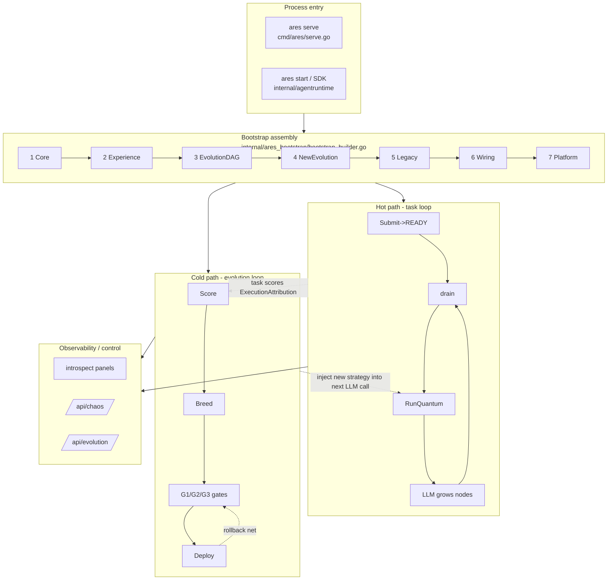

**Three invariants (thread through the whole system):**

| Invariant | Meaning | Source |
|---|---|---|
| Agents never self-schedule | agents are scheduled, they never decide "who next" | `cmd/ares/kernel_dispatch.go` (PolicyTaskFabric default) |
| Tasks outlive agents | agents are disposable; tasks are durable in the fabric | `internal/aresrecovery/recovery.go` |
| Kernel enforces provenance | origin/tenant/source come from context, never LLM args | `internal/agentsyscall/syscall.go` |

---

## 2. Entry Point & Startup (serve / Bootstrap)

`runServe` in `ares serve` is the assembly hub, in four stages:
**load config → Bootstrap assembly → build peer kernel → start HTTP + loops**.

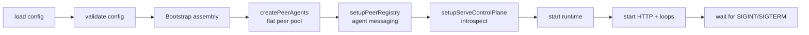

**Security fail-closed** (`cmd/ares/serve.go:86` `validateServeConfig`): a
wildcard bind (`0.0.0.0` / `::`) with no auth/JWT/`introspect.token` is
**refused at startup**, not logged-and-started. Default bind is
`127.0.0.1` (`serve.go:300` `defaultServeHost`).

**Bootstrap 7-step assembly order** (components have dependencies, built in order):

| Step | Function | Builds |
|---|---|---|
| ① | `assembleCore` `bootstrap_builder.go:68` | EventStore / Runtime / Memory / MCP / Skills |
| ② | `assembleExperience` `:162` | LLM (failover) / distillation / AKG loop / observability trio |
| ③ | `assembleEvolutionDAG` `:231` | evolution DAG / KnowledgeRuntime / evidence store |
| ④ | `assembleNewEvolution` `:322` | NewEvolution (Genome+Diff+`UngatedPatcher`) + FlightRecorder |
| ⑤ | `assembleLegacyEvolution` `:362` | legacy Evolution system (gated by `Evolution.Enabled`) |
| ⑥ | `wireEvolutionWiring` `:402` | RAG retrievers + DeploymentPipeline + minimal DAG registration |
| ⑦ | `wirePlatform` `:477` | GA evolution ticker + Discovery + SystemRuntime + expiry cleanup |

Every failed step runs `runCleanups()` (reverse order) so a failed bootstrap
never leaves live goroutines behind.

---

## 3. Configuration Panel (config.yaml)

18 top-level sections (`internal/ares_config/config.go:53` `Config`):

```
server / llm / agents / tools / prompts / output / validation /
workflow / storage / memory / knowledge / mcp / evolution /
embedding / discovery / kernel / security / introspect
```

**The three sections you actually touch:**

```yaml
agents:                                   # which agents + their capabilities
  peers:
    - id: coder
      capabilities: [code, refactor]      # the key for scheduling match
    - id: reviewer
      capabilities: [review, audit]

kernel:                                   # scheduling + wallet + lease
  max_concurrent: 4
  lease_ttl: 5m
  max_restarts: 5
  agent_budget:                           # *the agent wallet*
    tokens: 100000                        # lifetime token cap (0 = unlimited)
    tools: 50                             # lifetime tool-call cap (0 = unlimited)
    deadline: 30m                         # max wall-clock life ("" = unlimited)

evolution:                                # GA on/off / population / gates / rollback
```

| Block | Struct | Source |
|---|---|---|
| `kernel` | `KernelConfig` | `config.go:84` |
| `agent_budget` (wallet) | `AgentBudgetConfig` | `config.go:163` |
| `dag_execution` | `DAGExecutionConfig` | `config.go:179` |

**The "agent wallet" (`agent_budget`)** is a three-slot cap: `tokens` /
`tools` / `deadline`, all-zero = unlimited. It is the "long-task safety
gate": without it a runaway agent has no cost or lifetime ceiling.

---

## 4. Hot Path: Single-Task Execution Loop

Full lifecycle of one task from submit to done.

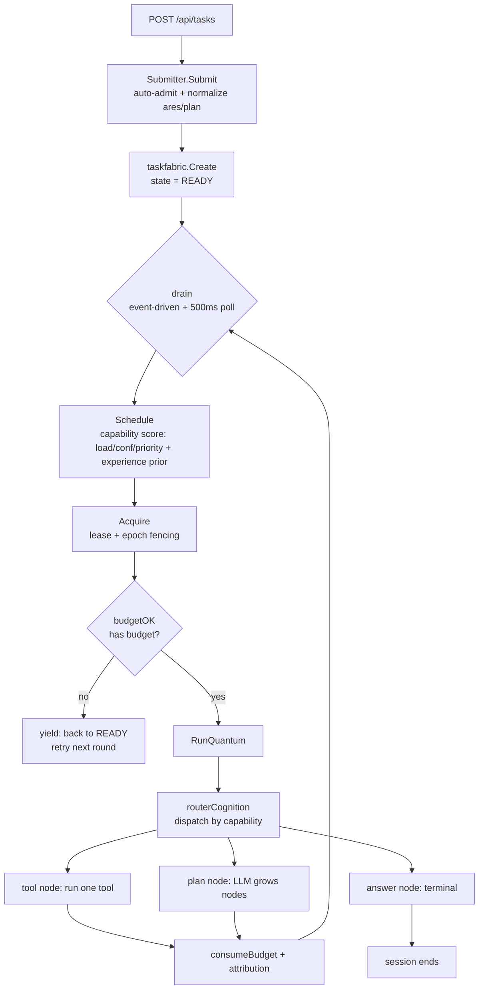

**Key source:**

| Stage | Function | File:line |
|---|---|---|
| Submit | `Submitter.Submit` | `internal/agentruntime/submit.go:151` |
| Queue drain | `Scheduler.drain` | `internal/kernel/scheduler_dispatch.go:43` |
| Select + acquire | Schedule/Acquire inside `drain` | `scheduler_dispatch.go:43` |
| Execute | `Scheduler.execute` | `internal/kernel/scheduler_execute.go:52` |
| Quantum | `buildQuantumStep` | `internal/kernel/scheduler_quantum.go:38` |
| Dispatch | `routerCognition.ExecuteStep` | `internal/fabric/agent/l2graph.go:388` |

**`routerCognition` is the dispatcher**: one session agent declares its full
capability set; `ExecuteStep` picks the body by `task.AgentType`:

```
tool/<name>  -> toolCognition    (run a single tool)
ares/plan    -> plannerCognition (call LLM, grow tool/plan nodes; never run tools)
ares/answer  -> answerCognition   (terminal: pass-through / synthesized / gap body)
ares/root    -> rootCognition    (session admission, zero work)
```

**"Grow-as-you-go" decomposition**: each tool node becomes a new fabric task
back in the drain; the `answer` node completing = session ends.

---

## 5. Quantization & Resource Budgets

**Quantization's core is not "bookkeeping" — it is checkpoint-resume /
preemptibility / yield (robustness). Bookkeeping (tokens/tools) is just a
side-channel feeding GA fitness.**

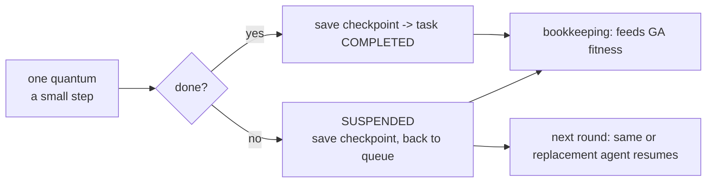

| Concept | Mechanism | Source |
|---|---|---|
| Pre-gate (has budget to run) | `budgetOK` | `internal/kernel/scheduler_governance.go:30` |
| Post bookkeeping | `consumeBudget` | `scheduler_governance.go:53` |
| One concurrent quantum per agent | `maxConcurrentPerAgent` | architectural invariant |
| Reject expired holder | epoch fencing | validated at drain |

**The agent wallet** = `kernel.agent_budget` (`config.go:163`): `tokens` /
`tools` / `deadline`, all-zero = unlimited. A syscall-spawned agent carries
this wallet from birth (`SpawnAgent`'s `Governance: k.governance` in
`internal/agentsyscall/syscall.go`).

**Token budget semantics (0.3.1+)**: `WithMaxTokens` is **enforced**, not a
no-op — it bridges into the same governance budget (`sdk/sdk.go:441`), and
`budgetOK` refuses a quantum for an agent whose `tokenUsed` has reached
`TokenBudget`, so an over-budget task yields instead of burning tokens. Two
caveats before quoting it as a hard cap: the value is the **L2 peer's lifetime
total** (the first positive `WithMaxTokens`/`WithAgentGovernance` wins; a later
agent's value does not tighten it), and enforcement is **cooperative** — it
stops at a quantum boundary, never mid-LLM-call (`sdk/options.go:703-717`).

---

## 6. Dynamic Graph: L2 Session Graph ↔ Tasks (planprojection)

Two "graphs" are the most confusing part:

| Graph | What | Character |
|---|---|---|
| **L2 session graph** (`L2Graph` / `MutableDAG`) | a session's execution plan; nodes = tool instances / plan / answer | in-memory, live, LLM keeps growing nodes |
| **Task fabric** | the tasks actually scheduled + executed | durable (event-sourced) |

"Dynamic" = **as the L2 graph grows a node, it is immediately compiled into a
task**.

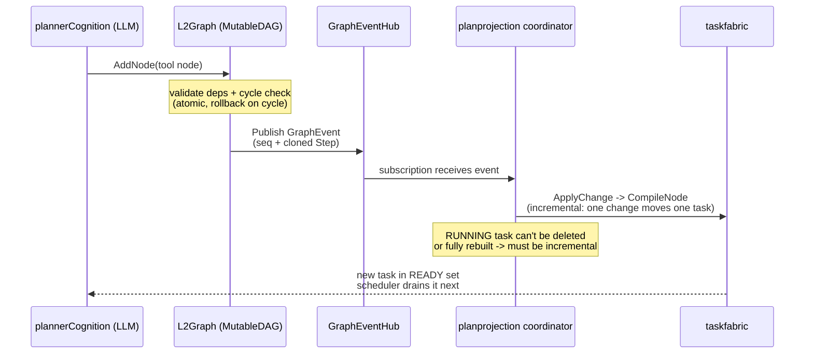

**Missed-event fallback**: `SubscribeGraphEvents` uses a **drop-counter + DAG-
version two-signal** scheme (F-21) to trigger a full `Reconcile`.

| Mechanism | Function | Source |
|---|---|---|
| Add node (cycle check + rollback) | `MutableDAG.AddNode` | `internal/fabric/task/workflow/engine/mutable_dag.go:77` |
| Atomic node replace | `ReplaceNode` | `mutable_dag.go:784` |
| Subscribe to graph events | `Subscribe` / `SubscribeWithID` | `mutable_dag.go:585` / `:593` |
| Node->task mapping | `ProjectStep` | `internal/fabric/planprojection/projection.go:47` |
| Incremental compile | `ApplyChange` | `internal/fabric/planprojection/coordinator.go:314` |
| Full reconcile | `Reconcile` | `coordinator.go:384` |
| Event subscription loop | `SubscribeGraphEvents` | `coordinator.go:695` |
| Grow tool node | `L2Graph.AddToolNode` | `internal/fabric/agent/l2graph.go:280` |

**Node ID = task ID**: the planner reads a predecessor's output by using the
node ID to look up the task's fabric envelope (the "join key").

---

## 7. L1 Tool-Class Graph Constraining L2

**L1 ≠ L2.** L1 is the "tool capability catalog + constraints" (`enabled` /
`budget` / `prior`) and is **not compiled into tasks**; L2 is the "session's
actual execution plan".

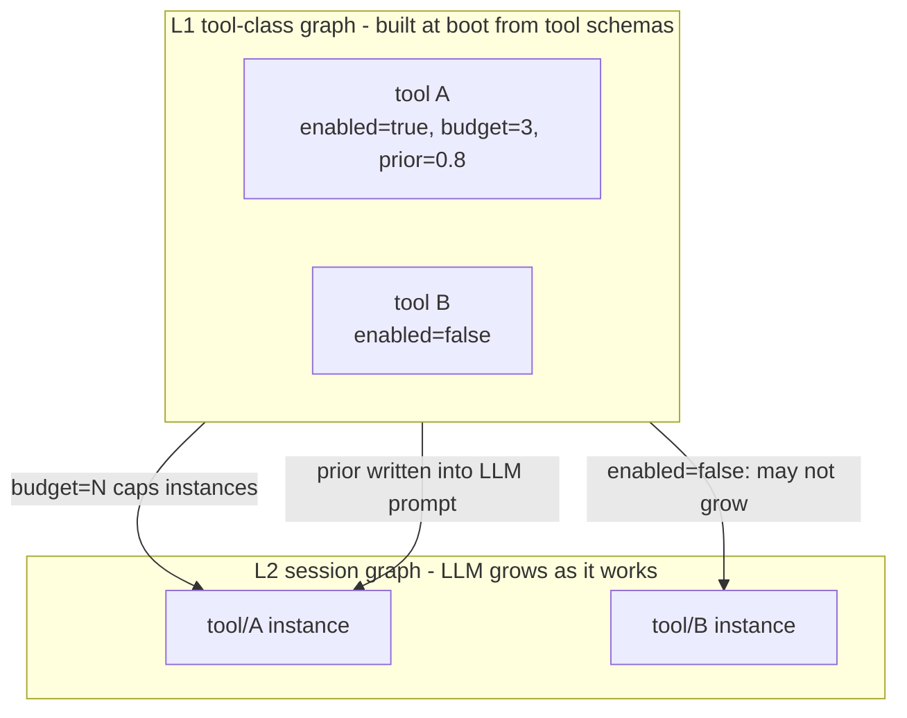

**Injection point** (`cmd/ares/serve_peer.go` `injectToolClassDAG`, verbatim
comment: "the L1 graph is NOT compiled into taskfabric — it is a capability
catalog, not an execution plan (L1 != L2)"):

- At boot, `injectToolClassDAG` (`serve_peer.go:511`) scans
  `toolBinder.GetToolSchemas()` to build L1 and feeds it to the evolution system.
- The planner checks L1 constraints before growing a tool node
  (`internal/fabric/agent/l2graph.go` `CountToolClass`).

> Note: there is also a **LiveDAG** (`buildLiveAgentDAG`, `serve_peer.go:536`)
> = "one node per peer agent", the **agent-pool topology** that the
> evolution structural patches act on (via `UpdateLiveDAG`). It is a
> different thing from the L1 tool-class graph.

---

## 8. Agent Expansion (agentsyscall)

While executing a quantum, the LLM can call these "system calls", just like it
calls `web_search`:

| Tool | What | Function | Source |
|---|---|---|---|
| `spawn_agent` | "hire a teammate" | `SpawnAgent` | `internal/agentsyscall/syscall.go:349` |
| `create_task` | "split this into subtasks" | `CreateTask` | `syscall.go:454` |
| `ask_agent` | "ask a teammate" | `AskAgent` | `syscall.go:614` |
| `create_plan` | grow a whole DAG at once | `CreatePlan` | `internal/agentsyscall/plan.go` |

**The subtle part: provenance comes from context, not the LLM (anti-forgery).**

```go
// SpawnAgent's parent (who created it) - the kernel knows "who is calling";
// that value wins over any LLM-supplied parent_id.
parentID := args.ParentID
if caller := kctx.CallerID(ctx); caller != "" {
    parentID = caller
}
```

- `create_task`'s `Origin` = `kctx.CallerID(ctx)` (never LLM-supplied).
- Tenant (`tenant_id`) is always taken from context; any LLM value is
  **overwritten**, not merged.

**"The agent decides what to do; the kernel decides on whose authority and
with what resources."**

**Spawned vs configured agents**: equivalent capability (same LLM + tools),
but a spawned agent carries extra gates — must be an L2 capability
(`IsL2Capability`), carries the wallet from birth (`Governance`), optional
`ToolAllowlist`, and must pass the spawn quota.

---

## 9. Collaboration: Decompose / Ask / Handoff

**There is no "team collaboration" concept** (no group messaging, no
"meeting to align"). Agents do exactly three things toward each other; the
only coordinator is **the scheduler**.

```mermaid
flowchart TD
    A[big task -> agent-A] --> A1{agent-A calls LLM<br/>"too big, split"}
    A1 -->|spawn_agent| B[new agent-C live<br/>into pool]
    A1 -->|create_task| tB[task-B READY]
    A1 -->|create_task| tD[task-D READY]
    B & tB & tD --> drain[scheduler drains]
    drain --> run[each agent executes independently]
    run --> envelope[results stored in task envelope]
    envelope --> synth[next round: synthesize final answer]
```

| Mode | Code | Semantics |
|---|---|---|
| **Decompose** | `create_task` / `create_plan` | "split this off to you" (task into queue, scheduler dispatches) |
| **Ask** | `ask_agent` → `Bus.Request` | "let me ask you" (fire-and-forget, no blocking; breaks the C-1 deadlock) |
| **Handoff** | `Bus.Handoff` | "I can't do it, whole task to you" (point-to-point, **bypasses the scheduler**) |

**Ask is fire-and-forget**: `ask_agent` returns `{Status: "pending"}`
immediately; the quantum does not block (or the asker would hold the
scheduler, the target could never be drained, deadlock). The reply arrives in
the background (currently only logged, not written back to the asker — marked
C-1-a as future work). Identical questions are deduped within 30s.

**The `grand_loop` E2E test** (`internal/fabric/agent/e2e_grand_loop_test.go`)
verifies: A dies, B/C/D continue; B questions A, C verifies B — **the task
is indifferent to who runs it; it only cares who has the capability.**

---

## 10. IPC Message Bus (agentipc)

`Bus` is a **centralized in-memory message hub** (in-process, not
cross-process).

> **Important correction**: it borrows the **semantics** of IPC
> (the Send/Request/Reply vocabulary) but **not the mechanism** — messages
> travel between goroutines (shared memory + channels), no socket, no
> serialization. The source's security-boundary comment states plainly:
> "single-tenant, single-process v1; not usable across trust domains."

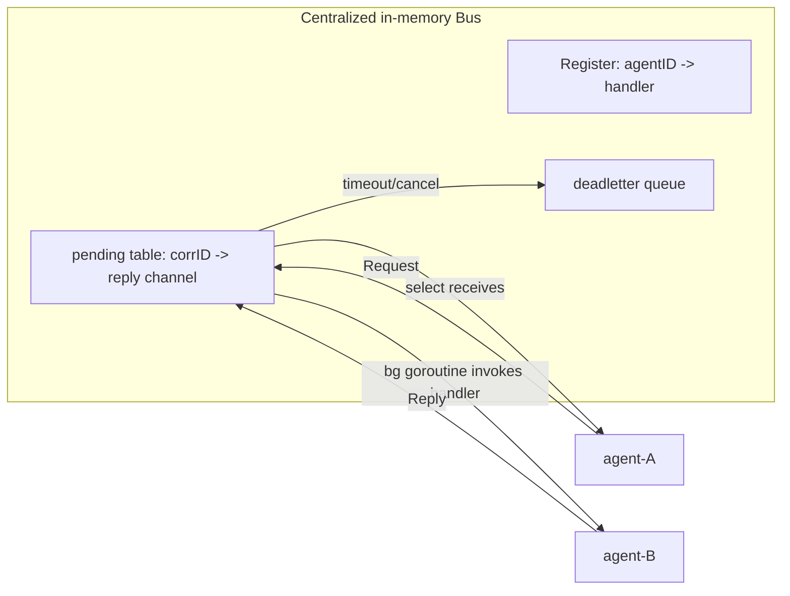

| Primitive | Semantics | Source |
|---|---|---|
| `Send` | fire-and-forget | `internal/agentipc/primitives.go:57` |
| `Request` | ask + wait (30s timeout) | `primitives.go:146` |
| `Reply` | async reply | `primitives.go` |
| `Delegate` | forward to whoever can | `primitives.go` |
| `Handoff` | point-to-point task ownership | `primitives.go:454` |
| `Subscribe`/`Broadcast` | "I care about X" / "tell everyone who cares" | `primitives.go` |
| Message struct | `Message` | `internal/agentipc/bus.go:14` |
| Register / Unregister | `Register`/`Unregister` | `bus.go:131` |

**Who owns / releases resources** (layered):

| Resource layer | Owner | Released by |
|---|---|---|
| In-flight message state (pending/channel/deadletter) | the Bus itself | `Request`'s `defer removePending` |
| Agent life/death | Agent Fabric | `Bus.Unregister` when the agent is killed |
| Token/tool budget | scheduler governance | `consumeBudget` |

**The Bus only moves messages; it owns and releases no resources.** When an
agent dies, the fabric knows first, then unregisters it.

---

## 11. Multi-Session Concurrency & Resource Isolation

**Key insight: a session is a task namespace, not a resource container;
agents are a global shared pool.**

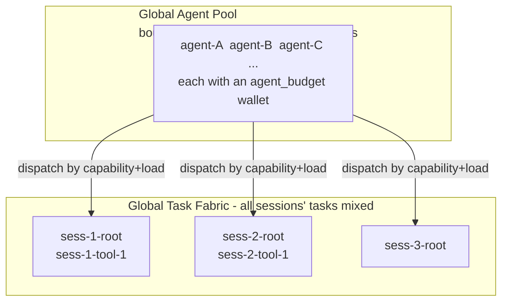

| Isolation layer | Mechanism | Source |
|---|---|---|
| Same-session admission serialized | per-session lock `lockAdmission` | `internal/agentruntime/session.go:67` |
| Cross-session tasks independent | unique task-ID prefix `sess-N-*`; deps only within a session | `session.go` |
| Global resource cap | `maxConcurrent` + `agent_budget` + `kernel.resources` | the scheduler |
| Reaper protection | `KeepSet`: a live session is never touched | `session.go:311` |

**Session lifecycle**: `Admit` → live (every quantum refreshes the idle
timer) → `Release` (answer completes/fails) → Reaper harvest
(delete terminal tasks after `ReaperGrace`).

| Stage | Function | Source |
|---|---|---|
| Admit (idempotent + same-session serialized) | `Sessions.Admit` | `internal/agentruntime/session.go:105` |
| Harvest deletable tasks | `Harvest` | `session.go:290` |
| Build the reaper keep-predicate | `KeepSet` | `session.go:311` |
| Release on answer failure | `ReleaseOnAnswerFailure` | `session.go:331` |

**Sessions and agents are decoupled**: killing an agent does not kill the
session; the task's lease expires, it returns to READY, and the scheduler
hands it to a replacement — the session is unaware.

---

## 12. Recovery (aresrecovery)

**Agent dies → task does not die**: lease expires → requeue → replacement
agent resumes from checkpoint.

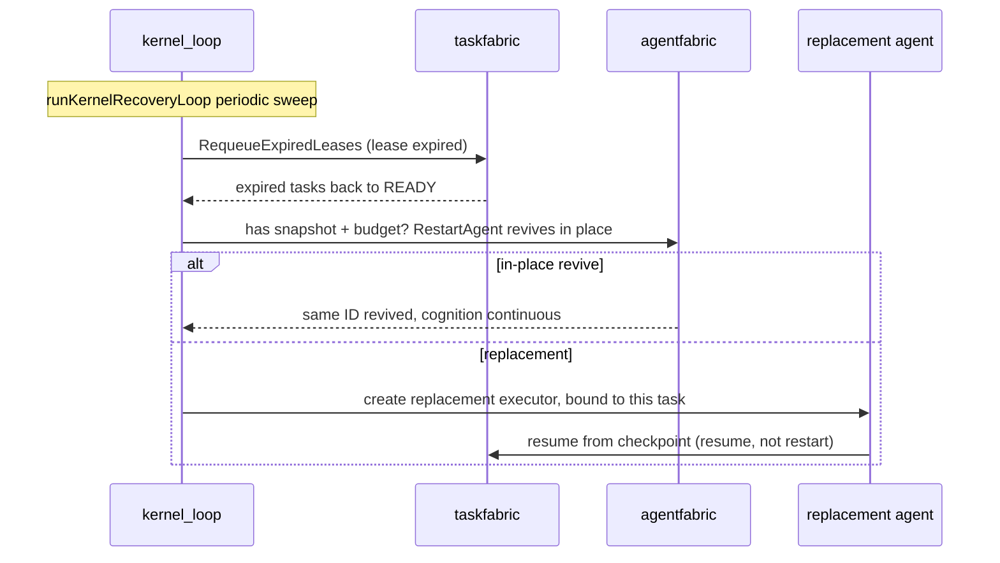

**Storm prevention**: a restart budget (lifetime-cumulative, success does not
refund the count) + exponential backoff.

| Stage | Function | Source |
|---|---|---|
| Recovery subsystem | `Recovery` | `internal/aresrecovery/recovery.go:21` |
| Lease-expiry sweep | `RequeueExpiredLeases` | `recovery.go:171` |
| In-place revive | `RestartAgent` (death snapshot) | `recovery.go:265` |
| Full recovery chain | `RecoverFromAgentDeath` | `recovery.go:375` |
| Kernel recovery loop | `runKernelRecoveryLoop` | `cmd/ares/kernel_loop.go:275` |

---

## 13. Chaos Engineering

**Chaos is not the recovery mechanism itself; it is the "deliberately break
it and check checkpoint+recovery can save it" drill stand.** "The checkpoint
lets you recover; chaos makes you *dare to believe* it recovers."

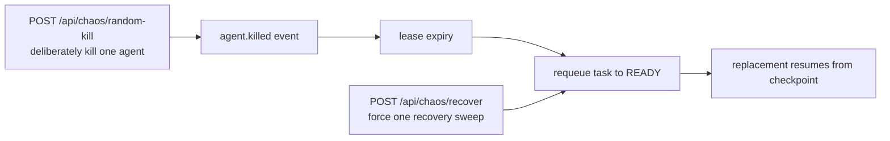

| Endpoint | Function | Source |
|---|---|---|
| Dispatcher | `handleChaos` | `cmd/ares/agent_routes_chaos.go:27` |
| Random kill | `chaosKillRandomFabric` | `agent_routes_chaos.go:188` |
| Force recover sweep | `chaosRecoverSweep` | `agent_routes_chaos.go:236` |
| List live agents | `liveFabricAgents` | `agent_routes_chaos.go:249` |

**GA quiet window**: while an evolution generation is mid-flight
(`GenerationActive`), chaos pauses injections so a half-tested fault doesn't
disturb a GA cycle about to make a decision.

---

## 14. Evolution (GA cold path + Deployment Pipeline)

**What is a "gene"**: the `Strategy`'s `Params` (temperature, etc.) +
`PromptTemplate`. **Evolution never changes code — only these two.**

> **Correction**: `DreamCycle` (`dream_cycle.go:304`) is a lightweight shell
> of the same GA engine and is **off in production**
> (`bootstrap` `EnableDreamCycle=false`). Production actually drives
> `GenomePopulationAdapter.Run` (`genome_wiring.go:38`), which carries the full
> safety-gate suite.

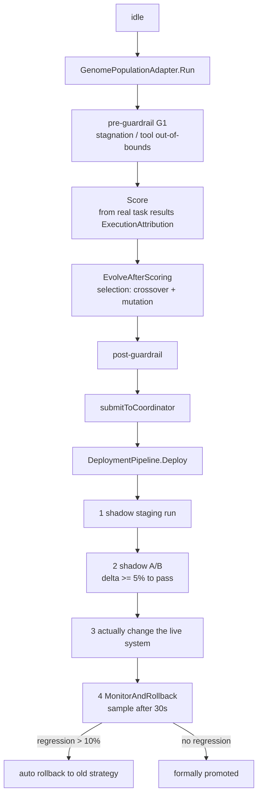

**"How evolution lands on the live system"** (deployment pipeline, 4 steps,
`internal/runtime/evolution/deployment/deployment.go`):

| Step | Function | Source |
|---|---|---|
| Deploy | `DeploymentPipeline.Deploy` | `deployment.go:184` |
| Monitor + rollback | `MonitorAndRollback` | `deployment.go:313` |
| Patch struct | `patch.RuntimePatch` | `internal/runtime/evolution/patch/patch.go:114` |
| Find executor by Target | `Registry.Register` | `patch.go:399` |
| Wire the live DAG | `UpdateLiveDAG` | `internal/ares_bootstrap/provide_new_evolution.go` |

**`RuntimePatch`** is the "universal mutation language": `Type` (what to
change) + `Target` (where) + `Value` (to what) + `Rollback` (inverse). It is
dispatched by Target to the Graph / Planner / Recovery / Knowledge / Memory
PatchExecutors.

**Effect on running tasks: none.** GA changes L1 (capability/strategy layer),
not L2 (session execution plan). Tool nodes already compiled into fabric tasks
in a running session are not rebuilt by an L1 patch; a changed prompt template
is only picked up by the next new session / next plan quantum. Worst case
"new strategy got worse" → the monitor detects it within 30s → auto rollback.

**G1/G2/G3 safety gates** (loose to tight):

| Gate | Location | Blocks |
|---|---|---|
| G1 Guardrails | around `GenomePopulationAdapter` | population-level: stagnation / tool allowlist out-of-bounds |
| G2 Shadow Gate | `DeploymentPipeline` step ② | shadow A/B: only delta >= 5% passes |
| G3 Eval + Regression | after lifecycle submit | run eval-suite / A/B vs baseline: a significant drop is not promoted |

> **Scope of these gates — do not read this table as "every promotion is
> verified".** G1-G3 guard the **`DeploymentPipeline` / `StrategyLifecycle`**
> chain. The **patch application path has no gate installed in production**: it
> decides by its own fitness threshold, which is exactly why the type is named
> `UngatedPatcher` (`internal/runtime/evolution/coordinator/coordinator.go:185`).
> Routing the patch path through the gate chain is tracked as A1-a; until then a
> patch can land without ever meeting G1-G3.

**The GA closed loop**: more runs → more score data → sharper evolution →
better strategy → better runs.

---

## 15. Observability & Control Plane (introspect)

| Surface | Purpose | Source |
|---|---|---|
| 7 panels | Overview/Tasks/Agents/Scheduler/Execution/Memory/Events | `internal/introspect` |
| `EvolutionTracer` | evolution trajectory (`/evolution/trajectory`) | `internal/aresrecovery` |
| `FeedbackStore` | evolution feedback (`/evolution/feedback`) | same |
| `GlobalTracer` | full trace (`/observability/spans`) | same |
| `/api/chaos` | chaos drills | `cmd/ares/agent_routes_chaos.go` |
| `/api/evolution` | evolution control | `cmd/ares/evolution.go` |

The observability components are built once in Bootstrap step ②
(`assembleExperience`) and shared across surfaces, so the panels show
**live data** instead of empty lists.

---

## 16. Storage Layer: Postgres

The durable foundation. `CREATE TABLE IF NOT EXISTS` + `ALTER ... ADD COLUMN IF
NOT EXISTS` are all idempotent — safe to re-run.

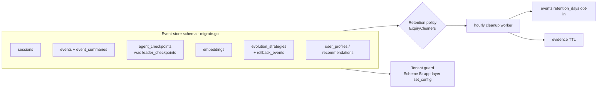

**Key fact (the 0.2→0.3 rename lives here):** the `leader_checkpoints` table is
`RENAME TO agent_checkpoints`, the `leader_id` column becomes `agent_id`, and
`idx_leader_checkpoints_status` becomes `idx_agent_checkpoints_status`
(`internal/storage/postgres/migrate.go:107-123`). This is the storage-layer
evidence of "the Leader was removed."

| Concern | Mechanism | Source |
|---|---|---|
| events / sessions / checkpoints tables | `CREATE TABLE IF NOT EXISTS` | `migrate.go:33/55/132/153` |
| Retention (opt-in) | `events_retention_days`, default = **never delete** | `bootstrap_builder.go:83-91` |
| Hourly TTL cleanup | `startExpiryCleanupWorker` + `CleanupExpired` | `bootstrap_builder.go:527` / `maintenance_worker.go:60` |
| Evidence-row TTL | registered on the same worker, S-10 tenant-scoped | `bootstrap_builder.go:303-306` / `bootstrap_steps.go:50-56` |

**Tenant guard = "Scheme B"** (worth memorizing): DB-layer RLS is
**deliberately NOT enabled** (the `migrate_storage.go:47-52` comment names it a
"pre-enforcement checklist"); instead the app layer binds
`set_config('app.tenant_id', $1, true)` transaction-locally
(`pool.go:172-238`). `true` = transaction scope, and the connection is
defensively cleared before return to the pool (`pool.go:215` so no tenant
leaks across requests). **SQL-injection guard**: every identifier passes
`validateSQLIdentifier` (`security.go:23-40`: regex + length + quoting).

---

## 17. Knowledge Layer: AKG

AKG (Agent Knowledge Graph, BETA) uses `KnowledgeObject` as the universal
knowledge representation, with **three layers**: `Raw` (original bytes, kept
for re-distillation) → `Normalized` (cleaned text for vectors/matching) →
`Summary` (LLM-friendly summary).

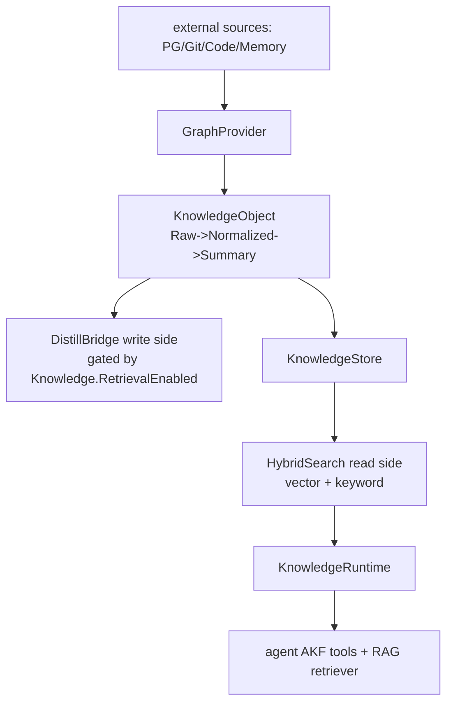

**The current pipeline is rule-based (no LLM):** `DefaultNormalizer`
(strips control chars), `DefaultSummarizer` (truncates to first 200 chars),
`defaultPlanner` (`containsAny` keyword + weight)
(`internal/knowledge/pipeline/normalizer.go` / `planner/default.go`).
It is assembled in Bootstrap step ② `wireAKGLoop`
(`bootstrap_builder.go` `assembleExperience`); **if AKG is unavailable the
system warns and degrades, still fully functional** (BETA never blocks the hot
path).

| Concern | Mechanism | Source |
|---|---|---|
| Universal knowledge object (3 layers) | `KnowledgeObject` | `internal/knowledge/object.go` |
| Write-side distillation bridge | `wireAKGLoop` → `AKGBridge` | `internal/ares_bootstrap/bootstrap_builder.go` |
| Read-side sharing | `KnowledgeRuntime` feeds both agent tools + RAG | `bootstrap_builder.go` `assembleEvolutionDAG` |
| Tenant isolation | **by `namespace`, not a tenant column** (tenant→namespace mapping) | `SECURITY.md:94-99` |

> **Connection to "task normalization"** (the earlier AKG proposal): store
> "original task + decomposed sub-tasks" as an `ObjectTask` **shadow semantic
> ledger** (bypass write + degraded read-prior). Do **not** make it the
> authoritative source of live task semantics, or the 0.3.x invariant
> "hot path never depends on the knowledge component" would be dragged down
> by a BETA AKG.

---

## 18. Memory & Distillation

The "remembers more the more it runs" mechanism. Split into a **write side
(distillation)** and a **read side (retrieval injection)**.

```mermaid
flowchart LR
    tc[task.completed event] --> sd{ShouldDistill<br/>task>=10 and result>=20}
    sd -->|pass| llm[LLM extracts Problem/Solution/Constraints<br/>with fenceUntrusted fencing]
    llm --> store[store experience row<br/>+ embedding]
    store --> vec[MemoryRetriever<br/>vector search MinScore0.4 TopK5]
    vec --> prompt[inject into prompt context]
    store --> prior[ExperiencePrior injected at spawn]
    prior --> next[next agent "born with experience"]
```

| Concern | Mechanism | Source |
|---|---|---|
| Distillation service | `DistillationService` | `internal/runtime/memory/experience/distillation_service.go` |
| Distill gate | `ShouldDistill` (success **and** failure both eligible; only content-length filters) | `distillation_service.go` `ShouldDistill` |
| **Stored indirect-injection guard** | `fenceUntrusted`: task content wrapped in `---UNTRUSTED-TASK-DATA---` fences, preventing a "stored into the experience store then RAG-injected back into a prompt" persistent-injection path | `distillation_service.go` `buildExtractionPrompt` |
| Distillation wiring | `wireDistillation` + `subscribeDistillationEvents` (subscribes `task.completed`) | `internal/ares_bootstrap/bootstrap_steps.go:26` / `:105` |
| Read-side retrieval | `MemoryRetriever` (vector, defaults `MinScore=0.4` / `TopK=5`) | `internal/runtime/memory/context/memory_retriever.go:65` |
| Scheduler-side prior | `ExperiencePrior` injected at spawn (truncated to 4096 runes) | `internal/fabric/agent/lifecycle.go:49` / `planner_cognition.go:181` |
| Cost / threshold knobs | `DistillationThreshold` / `MaxDistilledTasks` / `DistilledTaskTTL` | `internal/runtime/memory/manager.go:102/116/125` |
| Async vector backfill | `embeddingEnqueuer` (default synchronous; with a queue it persists the row first, then backfills the vector async so the event loop never blocks) | `distillation_service.go` `WithEmbeddingEnqueuer` |

**Token cost**: distillation runs an LLM extraction (30s timeout) — one of the
few "background token-burning" places. Cost is controlled three ways:
`MaxDistilledTasks` (row cap), `DistilledTaskTTL` (expiry reclamation), and the
async embedding path.

---

## 19. MCP Integration & Tool Discovery

Tool sources come from **three paths**, all landing in one `core.Registry`
(`toolBinder.GetToolSchemas()` reads it to build L1):

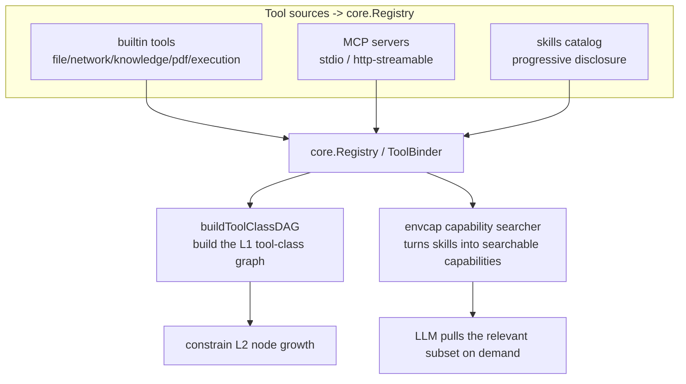

| Concern | Mechanism | Source |
|---|---|---|
| MCP assembly | `ProvideMCP` (stdio / http transports) | `internal/ares_bootstrap/provide_mcp.go:57` |
| MCP manager | `MCPManager` (transport_stdio / transport_server) | `internal/runtime/protocol/mcp/` |
| **Progressive disclosure** | the server keeps the **full** tool set; each task is fed only the **relevant subset** (saves tokens) | `cmd/ares/serve_wiring.go:215` |
| Capability searcher | `registerCapabilitySearch` (envcap): makes the skills catalog a searchable tool capability | `cmd/ares/agent_routes_tools.go:263` |
| L1 tool-class graph | `buildToolClassDAG(toolBinder.GetToolSchemas())` | `cmd/ares/serve_peer.go:515` |

**What makes "tool discovery" distinctive**: instead of dumping every tool
schema into the LLM at once (token explosion), it **registers the full set but
feeds only the relevant subset per task** — the envcap searcher turns the
skills catalog into "LLM-searchable" capabilities, paired with progressive
disclosure. This is how 0.3.x avoids the "hard-dump every tool" anti-pattern.

---

## 20. SDK / CLI Usage

| Entry | Scenario | Source |
|---|---|---|
| `ares serve` | production long-running (HTTP + background loops) | `cmd/ares/serve.go` |
| `ares start` / SDK | embedded (in-process agent, shares the L2 core) | `sdk/` + `internal/agentruntime` |
| Other CLI subcommands | `status` / `doctor` / `chaos` / `evolution` | `cmd/ares/main.go` (cobra) |

**Two entries, one semantics**: both `serve` and the SDK drive the L2
execution core in `internal/agentruntime` (session registry + compile
coordinator + planner/router cognition + task reaper). **The entry differs
(HTTP vs in-process); the execution semantics are identical.**

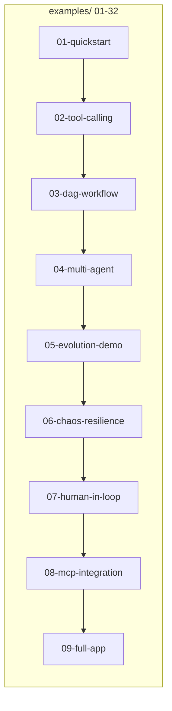

`examples/` runs from 01 (minimal LLM hookup) to 32 (llm-service-direct),
covering quickstart / tool-calling / DAG / multi-agent / evolution / chaos /
HITL / MCP / full-app — the living documentation of "how to use the system."

---

## 21. Security Model

**Three trust boundaries** (`SECURITY.md`):

| Boundary | Mechanism | Source |
|---|---|---|
| **SSRF** | `ValidateURL` rejects private/loopback/link-local/cloud metadata (`169.254`); **every hop re-validated** to stop redirect bypass | `internal/tools/resources/builtin/network/ssrf.go:32` |
| **Sandbox** | code-execution tools run sandboxed; MCP stdio servers are **constrained by the operator** (stated in docs) | `SECURITY.md:61` / `.../execution/code_runner.go` |
| **Tenant** | **single-tenant by default**; `tenant_id` is a **per-request opt-in scope**; **kernel-enforced** (an LLM-supplied tenant is always overwritten by context); the knowledge side isolates by **namespace** | `SECURITY.md:69-99` / `agentsyscall` |

**The common fail-closed toolkit (recollected here from earlier sections):**

| Mechanism | Effect | Source |
|---|---|---|
| Wildcard bind requires auth | refuse to start unauthenticated | `cmd/ares/serve.go:86` |
| Path-traversal guard | `SetAllowedConfigDir` confines config reads to a directory | `internal/ares_config/config.go` |
| Read interfaces need permission | `PermRead` gates introspect / config reads | `agent_routes_task_read.go` |
| SQL identifier validation | `validateSQLIdentifier` blocks injection | `internal/storage/postgres/security.go:23` |
| Tenant kernel-enforced | `kctx.CallerID` / `tenantctx` override LLM args | `internal/agentsyscall/syscall.go` |

**The one through-line**: fail closed wherever it can, never trust the LLM or
the model where the kernel can enforce, and have context stamp every
tenant / origin / provenance.

---

## Appendix: 0.2.x → 0.3.x Verdict

| Dimension | 0.2.x | 0.3.x | Verdict |
|---|---|---|---|
| Orchestration | Leader (single point + double-path race) | Leader removed; flat peers + kernel scheduling | ✅ positive |
| Tasks | no durable state machine, ReAct has no checkpoint | durable tasks + checkpoint-resume | ✅ positive |
| Agents | passive sub-agents | disposable cognition, can spawn | ✅ positive |
| Planning | implicit, one-shot | explicit L2 graph, grow-as-you-go, recoverable | ✅ positive |
| Self-healing | two external heartbeat supervisors | event-driven unified recovery chain + in-place revive | ✅ positive |
| Evolution | early DreamMode | GA + G1/G2/G3 gates + rollback net | ✅ stronger |
| Cost | — | complexity up; no equivalent of centralized-owner semantics; HITL not wired in production | ⚠️ |

> **Source-location note**: line numbers are a v0.3.2 snapshot and may drift as
> the dev branch moves. Function names / file paths are more stable than line
> numbers — locate by symbol when in doubt.
