# ARES 系统内部机制速览（v0.3.3）

> 本文梳理 ARES（goagent）v0.3.x AgentOS 全项目如何工作，覆盖 15 个核心模块，
> 每个模块附 Mermaid 图与源码文件/行号引用。
>
> 核心哲学一句话：**把 agent 当作"可丢弃的进程"，把任务当作"持久的意图"，
> 内核负责调度，LLM 负责理解与拆解，GA 负责越来越聪明，checkpoint + chaos
> 负责"敢故障"。**
>
> 注意：项目自标 dev / 生态小 / GA 未经大规模生产验证（见
> `docs/reference/framework-comparison-*.md`）。

---

> **这份文档的定位。** 它是*运行时内部机制*的参考：启动 → 热路径 → L2/L1 图 →
> 协作 → IPC → 恢复 → 混沌 → 进化 → 存储/知识/记忆/MCP/SDK-CLI/安全。
> 建议配合阅读：`README.md`（定位 + *Honest limits*）→ `ARCHITECTURE.md`
> （模块全景、数据流、`POST /api/tasks` 的 23 步走读）→ `docs/articles/*`（逐子系统深潜）
> → `SECURITY.md` 与 `docs/operator/README.md`（运维）。

## 目录

1. [全局总览](#1-全局总览)
2. [入口与启动（serve / Bootstrap）](#2-入口与启动serve--bootstrap)
3. [配置面板（config.yaml）](#3-配置面板configyaml)
4. [热路径：单任务执行环](#4-热路径单任务执行环)
5. [量子化与资源预算](#5-量子化与资源预算)
6. [动态图：L2 会话图 ↔ 任务（planprojection）](#6-动态图l2-会话图--任务planprojection)
7. [L1 工具类图 约束 L2](#7-l1-工具类图-约束-l2)
8. [agent 扩编（agentsyscall）](#8-agent-扩编agentsyscall)
9. [协作：拆解 / 提问 / 交接](#9-协作拆解--提问--交接)
10. [IPC 消息总线（agentipc）](#10-ipc-消息总线agentipc)
11. [多 session 并发与资源隔离](#11-多-session-并发与资源隔离)
12. [恢复（aresrecovery）](#12-恢复aresrecovery)
13. [chaos 混沌演练](#13-chaos-混沌演练)
14. [进化（GA 冷路径 + 部署管线）](#14-进化ga-冷路径--部署管线)
15. [观测与控制面（introspect）](#15-观测与控制面introspect)
16. [存储层：Postgres（schema / 保留策略 / 迁移 / 租户守卫）](#16-存储层postgres)
17. [知识层：AKG（构建 / 检索 / 回退）](#17-知识层akg)
18. [记忆与蒸馏（session store / 阈值 / token 成本 / 安全围栏）](#18-记忆与蒸馏)
19. [MCP 集成与工具发现（渐进披露）](#19-mcp-集成与工具发现)
20. [SDK / CLI 用法](#20-sdk--cli-用法)
21. [安全模型（SSRF / 沙箱 / 租户三条边界）](#21-安全模型)
22. [ReAct 去哪了：动态 DAG + 想/做/进化三层](#22-react-去哪了动态-dag--想做进化三层)
23. [L1 / L2 双图与数据分流（Postgres / pgvector）](#23-l1--l2-双图与数据分流)
24. [检索降噪（向量检索"噪声"与规避）](#24-检索降噪)
25. [Checkpoint 与恢复（字段 + 7 步 + 两种模式）](#25-checkpoint-与恢复)
26. [上下文管理（滑窗截断 + 规则裁剪 + RAG 注入，非 LLM 摘要）](#26-上下文管理)
27. [LLM 失败切换 + 工具组织（`core.Registry`）](#27-llm-失败切换与工具组织)
28. [事件驱动总线（谁订阅了什么）](#28-事件驱动总线)

---

## 1. 全局总览

系统分**热路径**（一直跑，完成任务）和**冷路径**（空闲时跑，持续变强），
外加一套**观测/控制面**。

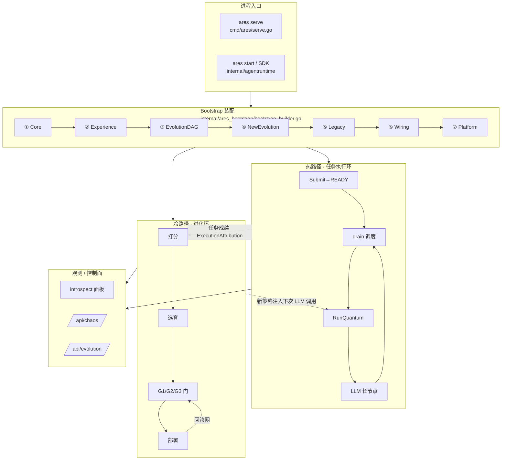

**三条铁律（贯穿全系统）：**

| 铁律 | 含义 | 源码 |
|---|---|---|
| agent 不自调度 | agent 被调度，从不自己决定"下一步做谁" | `cmd/ares/kernel_dispatch.go`（`agentipc.KernelDispatcher`，单轨） |
| 任务比 agent 长寿 | agent 可丢弃，任务持久在 fabric | `internal/aresrecovery/recovery.go` |
| 内核强制 provenance | 归属/租户/来源从 context 取，不信 LLM 参数 | `internal/agentsyscall/syscall.go` |

---

## 2. 入口与启动（serve / Bootstrap）

`ares serve` 的 `runServe` 是启动编排中心，分四段：**读配置 → Bootstrap 装配 →
建 peer kernel → 起 HTTP 与各后台 loop**。

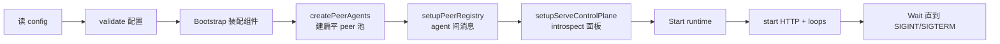

**安全 fail-closed**（`cmd/ares/serve.go:292` `validateServeConfig`）：通配符 bind
（`0.0.0.0` / `::`）若没配 auth/JWT/`introspect.token`，**直接拒绝启动**，而非
"启动后打个日志"。默认绑定 `127.0.0.1`（`serve.go:327` `defaultServeHost`）。

**Bootstrap 7 步装配顺序**（组件有依赖，按顺序搭）：

| 步 | 函数 | 建什么 |
|---|---|---|
| ① | `assembleCore` `bootstrap_builder.go:68` | EventStore / Runtime / Memory / MCP / Skills |
| ② | `assembleExperience` `:162` | LLM(失败切换) / 经验蒸馏 / AKG 闭环 / 观测三件套 |
| ③ | `assembleEvolutionDAG` `:231` | 进化 DAG / KnowledgeRuntime / evidence store |
| ④ | `assembleNewEvolution` `:322` | NewEvolution(Genome+Diff+`UngatedPatcher`) + FlightRecorder |
| ⑤ | `assembleLegacyEvolution` `:362` | legacy Evolution 系统（门控 `Evolution.Enabled`） |
| ⑥ | `wireEvolutionWiring` `:402` | RAG retrievers + DeploymentPipeline + 注册 minimal DAG |
| ⑦ | `wirePlatform` `:477` | GA 进化 ticker + Discovery + SystemRuntime + 过期清理 |

每一步失败都走 `runCleanups()`（逆序清理），避免"装配失败还留一堆活 goroutine"。

---

## 3. 配置面板（config.yaml）

顶层 15 个大项（`internal/ares_config/config.go` `Config`）：

```
server / tasks / llm / agents / tools / storage / memory /
knowledge / mcp / evolution / embedding / discovery / kernel /
security / introspect
```

**跟你最常打交道的三段：**

```yaml
agents:                                   # 配哪些 agent + 各自能力
  peers:
    - id: coder
      capabilities: [code, refactor]      # 调度匹配的关键
    - id: reviewer
      capabilities: [review, audit]

kernel:                                   # 调度 + 钱包 + 租约
  max_concurrent: 4
  lease_ttl: 5m
  max_restarts: 5
  agent_budget:                           # ★ agent 钱包
    tokens: 100000                        # 一生最多烧多少 token (0=不限)
    tools: 50                             # 一生最多调多少次工具 (0=不限)
    deadline: 30m                         # 最长活多久 (墙钟, ""=不限)

evolution:                                # GA 开关/种群/安全门/回滚
```

| 配置块 | 结构体 | 源码 |
|---|---|---|
| `kernel` | `KernelConfig` | `config.go:60` |
| `agent_budget`（钱包） | `AgentBudgetConfig` | `config.go:141` |
| `dag_execution` | `DAGExecutionConfig` | `config.go:157` |

**"agent 钱包"（`agent_budget`）三格限额**：`tokens` / `tools` / `deadline`，
全零 = 不限。它是"长任务安全门"——没有它，一个失控 agent 没有成本/寿命上限。

---

## 4. 热路径：单任务执行环

一个任务从提交到完成的完整链路。

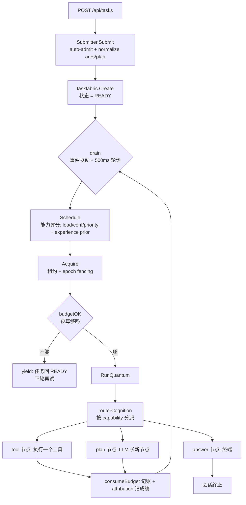

**关键源码：**

| 环节 | 函数 | 文件:行号 |
|---|---|---|
| 提交 | `Submitter.Submit` | `internal/agentruntime/submit.go:151` |
| 队列 drain | `Scheduler.drain` | `internal/kernel/scheduler_dispatch.go:43` |
| 选 + 领 | `drain` 内 Schedule/Acquire | `internal/kernel/scheduler_dispatch.go:43` |
| 执行 | `Scheduler.execute` | `internal/kernel/scheduler_execute.go:52` |
| 量子 | `buildQuantumStep` | `internal/kernel/scheduler_quantum.go:38` |
| 分派 | `routerCognition.ExecuteStep` | `internal/fabric/agent/l2graph.go:388` |

**`routerCognition` 是"分派器"**：一个会话 agent 声明全部能力，
`ExecuteStep` 按 `task.AgentType` 选执行体：

```
tool/<name>  → toolCognition   （执行单个工具）
ares/plan    → plannerCognition （调 LLM，长 tool/plan 节点，不执行工具）
ares/answer  → answerCognition  （终端：pass-through / 合成 / gap body）
ares/root    → rootCognition    （会话准入，零工作量）
```

**拆解"边做边长"**：每个 tool 节点又变成一个新 fabric task 回 drain；
`answer` 节点完成 = 会话结束。

### 4.1 失败语义（0.3.3）

一次失败不是一件事，而是三个决策：**值不值得重试**、**什么时候重试**、
**下游怎么办**。

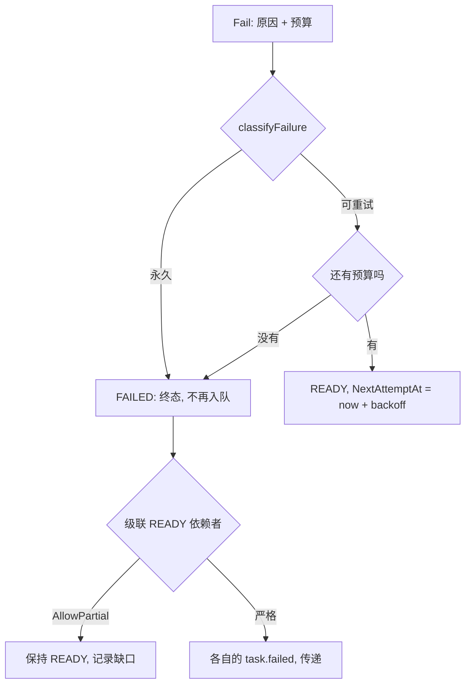

| 决策 | 位置 | 规则 |
|---|---|---|
| 可重试吗 | `classifyFailure` | `internal/fabric/task/failure.go:77` —— 显式标记优先（`MarkPermanent` / `MarkRetryable`：最了解情况的是产生错误的那一层），错过任务 deadline 的原因视为终态，**其余一律可重试**，与 0.3.2 完全一致（裸的 `context.DeadlineExceeded` 也在内）。判定结果写进 `task.failed` 事件的 `retryable`，所以"为什么又试了一次"只看日志就能回答。 |
| 什么时候 | `Fail` | `internal/fabric/task/fabric_lifecycle.go:242` —— 只有"原因可重试 **且** 还有预算"才回 READY。`BackoffBase` 是首次延迟、每次翻倍，由 `BackoffMax` 封顶（`internal/fabric/task/backoff.go:19`）；不配置就是立即重试，即 0.3.2 的行为。等待中的任务对 `ReadyTasks`/`ResumableTasks` 不可见、`Acquire` 会拒绝，且 `NextAttemptAt` 已持久化，重启不会让它提前重试。 |
| 下游怎么办 | `cascadeFailureLocked` | `internal/fabric/task/dag.go:160` —— 终态失败会级联失败所有可达的 READY 依赖者；**除非**该依赖者显式 `AllowPartial`：它保持 READY，把失败前驱记进 `DegradedInputs`。这条记录正是解锁它的东西（`dependencySatisfied`，`internal/fabric/task/dag.go:113`）：只有被记录的缺口才算满足，所以**另一个仍在运行的依赖依旧阻塞它**。 |

**Deadline 与租约过期是两件事。** 租约过期意味着"执行权失效"：任务回 READY，
换人从 checkpoint 续跑（见 §12）。而 `Task.Deadline` 是绝对截止——
`ExpireDeadlines`（`internal/fabric/task/fabric_lifecycle.go:436`）走独立终态路径
把它置为 FAILED（哪怕还有重试预算也不回队列）并触发级联；`Acquire` 也会拒绝
已过期的任务，所以扫描间隙里没人能拿到执行权。

**部分输入是"声明"出来的，不是猜出来的。** 降级任务在 checkpoint payload 与
`task.ready` 事件里都带 `degraded_inputs`（缺失前驱的 ID 列表），读者据此可区分
"没查"与"查了、没有发现"。**原因刻意不复制**：失败任务自己的 `LastError` 与
`task.failed` 事件是唯一事实来源，ID 是回查的稳定主键。

---

## 5. 量子化与资源预算

**量子化的核心不是"记账"，是"断点续跑 / 可打断 / 可让路"（鲁棒性）；
记账（token/工具）只是搭便车喂 GA。**

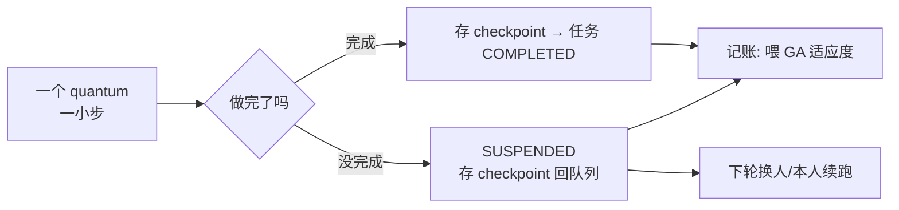

| 概念 | 机制 | 源码 |
|---|---|---|
| 前置门（预算够才做） | `budgetOK` | `internal/kernel/scheduler_governance.go:30` |
| 后置记账 | `consumeBudget` | `internal/kernel/scheduler_governance.go:53` |
| 单 agent 并发=1 | `maxConcurrentPerAgent` | 架构不变量 |
| 拒绝过期持有者 | epoch fencing | 调度器 drain 时校验 |

**agent 钱包** = `kernel.agent_budget`（`config.go:141`）：`tokens`/`tools`/`deadline`
三格，全零不限。syscall spawn 的 agent 也从出生就带这个钱包
（`internal/agentsyscall/syscall.go` `SpawnAgent` 的 `Governance: k.governance`）。

**token 预算的真实语义（0.3.1+）**：`WithMaxTokens` **已经生效**，不是 no-op——
它桥接进同一个 governance 预算（`sdk/sdk.go:441`），`budgetOK` 会拒绝
`tokenUsed` 已达 `TokenBudget` 的 agent 的下一个量子，于是超预算的任务是"让出"
而不是继续烧 token。当硬上限引用前要知道两点：该值是 **L2 peer 的生命周期总量**
（第一个正值生效，后续 agent 不能收紧），执行是**协作式**的——在量子边界停下，
不会打断进行中的 LLM 调用（`sdk/options.go:703-717`）。

---

## 6. 动态图：L2 会话图 ↔ 任务（planprojection）

系统里有"两张图"最容易懵：

| 图 | 是什么 | 特点 |
|---|---|---|
| **L2 会话图**（`L2Graph` / `MutableDAG`） | 一个会话的执行计划，节点=工具实例/plan/answer | 内存、活体、LLM 运行时不断长节点 |
| **任务 fabric** | 真正被调度+执行的任务 | 持久（事件溯源） |

"动态"= **L2 图边长节点，边把节点即时编译成任务**。

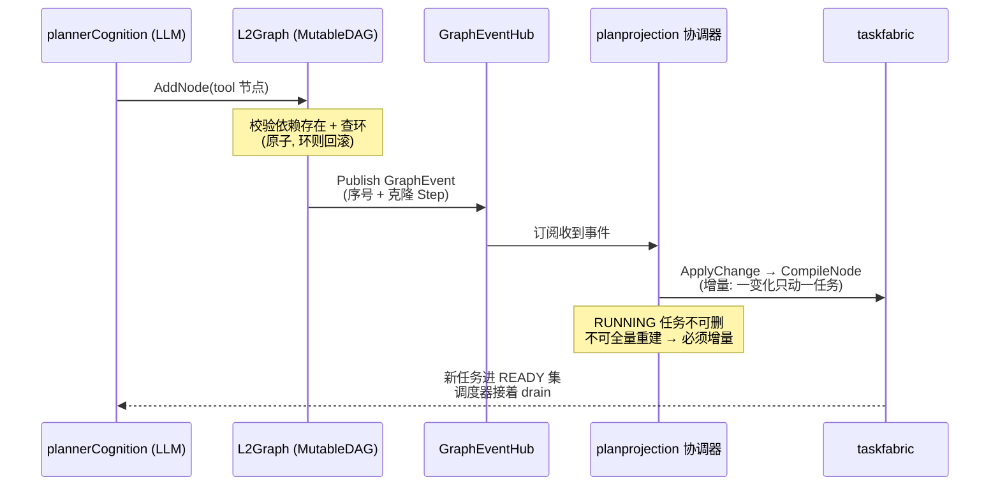

**漏事件怎么兜底**：`SubscribeGraphEvents` 用 **drop counter + DAG version 双信号**
（F-21）触发全量 `Reconcile` 对账。

| 机制 | 函数 | 源码 |
|---|---|---|
| 图加节点（带环检测+回滚） | `MutableDAG.AddNode` | `internal/fabric/task/workflow/engine/mutable_dag.go:77` |
| 原子替换节点 | `ReplaceNode` | `mutable_dag.go:784` |
| 订阅图事件 | `Subscribe` / `SubscribeWithID` | `mutable_dag.go:585` / `:593` |
| 节点→任务映射 | `ProjectStep` | `internal/fabric/planprojection/projection.go:58` |
| 增量编译 | `ApplyChange` | `internal/fabric/planprojection/coordinator.go:314` |
| 全量对账 | `Reconcile` | `coordinator.go:384` |
| 事件订阅循环 | `SubscribeGraphEvents` | `coordinator.go:695` |
| 长工具节点 | `L2Graph.AddToolNode` | `internal/fabric/agent/l2graph.go:280` |

**节点 ID = 任务 ID**：planner 读前驱输出时，用节点 ID 直接去 fabric 查任务
envelope（"join key"）。

---

## 7. L1 工具类图 约束 L2

**L1 ≠ L2**。L1 是"工具能力目录 + 约束"（`enabled` / `budget` / `prior`），
**不编译成任务**；L2 是"会话实际执行计划"。

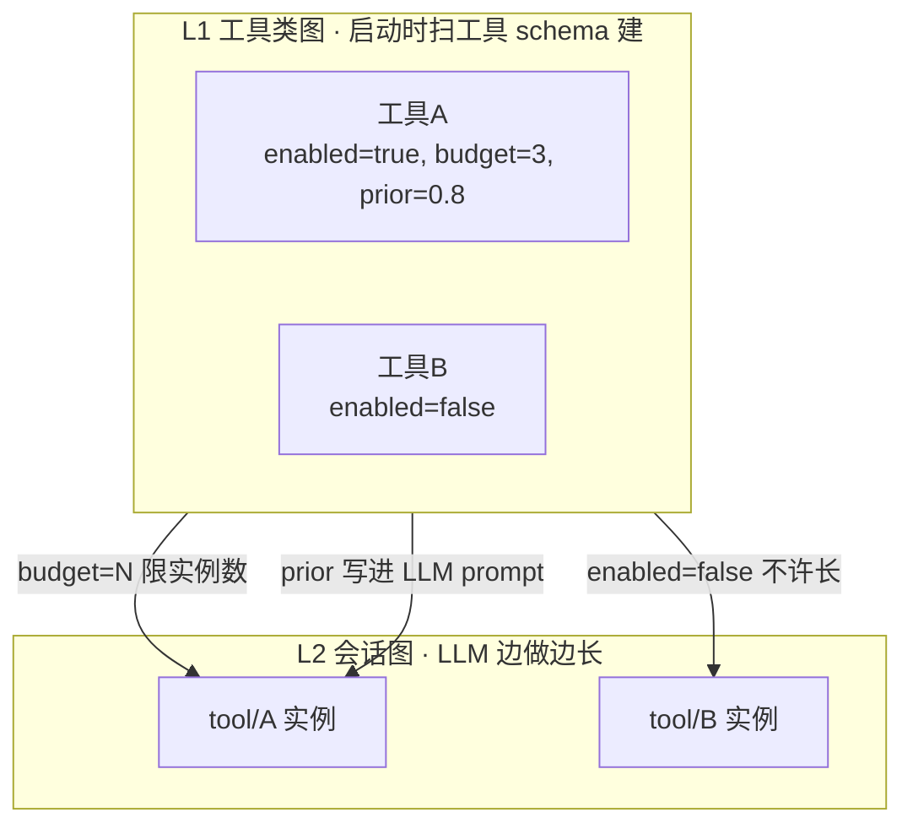

**注入点**（`cmd/ares/serve_peer.go` `injectToolClassDAG`，注释原文：
"L1 graph 不编译进 taskfabric——它是能力目录，不是执行计划（L1 ≠ L2）"）：

- 启动时 `injectToolClassDAG`（`serve_peer.go:511`）扫 `toolBinder.GetToolSchemas()`
  建 L1，喂给进化系统。
- planner 长 tool 节点前查 L1 约束（`internal/fabric/agent/l2graph.go` `CountToolClass`）。

> 注意区分：还有一个 **LiveDAG**（`buildLiveAgentDAG`，`serve_peer.go:536`）=
> "每个 peer agent 一个节点"的**agent 池拓扑**，是给**进化结构补丁**改的对象
> （`UpdateLiveDAG`）。它和 L1 工具类图不是一回事。

---

## 8. agent 扩编（agentsyscall）

LLM 执行 quantum 时，和调 `web_search` 一样，还能调这几个"系统调用"：

| 工具 | 干什么 | 函数 | 源码 |
|---|---|---|---|
| `spawn_agent` | "再养一个队友" | `SpawnAgent` | `internal/agentsyscall/syscall.go:349` |
| `create_task` | "这事拆成子任务" | `CreateTask` | `syscall.go:454` |
| `ask_agent` | "问一下某队友" | `AskAgent` | `syscall.go:614` |
| `create_plan` | 一次长一串 DAG 节点 | `CreatePlan` | `internal/agentsyscall/plan.go` |

**最精妙的一点：provenance 靠 context，不靠 LLM（防伪造）。**

```go
// SpawnAgent 的 parent（谁生的）—— 内核知道"谁在调"，这个才作数
parentID := args.ParentID
if caller := kctx.CallerID(ctx); caller != "" {
    parentID = caller
}
```

- `create_task` 的 `Origin` = `kctx.CallerID(ctx)`（不是 LLM 填的）。
- 租户（`tenant_id`）全从 context 取，LLM 填的一律**覆盖**而非合并。

**"agent 决定做什么，内核决定以谁的名义做、给多少资源。"**

**新 agent vs 静态 agent**：能力等价（同一 LLM+工具），但多几道闸——
必须 L2 能力（`IsL2Capability`）、从出生带钱包（`Governance`）、可选
`ToolAllowlist`、要过 spawn 配额。

---

## 9. 协作：拆解 / 提问 / 交接

**没有"团队协作"概念**（没有 group 消息、没有"开会对齐"）。agent 之间只做
三件事，唯一的协调者是**调度器**。

```mermaid
flowchart TD
    A[大任务给 agent-A] --> A1{agent-A 调 LLM<br/>"太大了，拆"}
    A1 -->|spawn_agent| B[新 agent-C 活体<br/>进调度池]
    A1 -->|create_task| tB[task-B READY]
    A1 -->|create_task| tD[task-D READY]
    B & tB & tD --> drain[调度器 drain 派活]
    drain --> run[各 agent 独立认知执行]
    run --> envelope[结果存 task envelope]
    envelope --> synth[下一轮: 合成最终答案]
```

| 协作方式 | 代码 | 语义 |
|---|---|---|
| **拆解** | `create_task` / `create_plan` | "这事拆给你做"（任务进队列，调度器派） |
| **提问** | `ask_agent` → `Bus.Request` | "我问你一下"（一问就发不等待，破死锁 C-1） |
| **交接** | `Bus.Handoff` | "我办不了，整个任务给你"（点对点，**不走调度器**） |

**提问是 fire-and-forget**：`ask_agent` 立即返回 `{Status: "pending"}`，
quantum 不阻塞（否则 asker 占住调度器 → 目标排不上 → 死锁）。回答在后台送达
（当前只记日志，未回写 asker，标 C-1-a 待做）。相同问题 30s 内去重。

**`grand_loop` E2E 测试**（`internal/fabric/agent/e2e_grand_loop_test.go`）验证：
A 死了 B/C/D 继续，B 质疑 A、C 验证 B——**任务不认人，只认"谁有能力"**。

---

## 10. IPC 消息总线（agentipc）

`Bus` 是**中心化的内存消息中枢**（in-process，非跨进程）。

> **重要纠正**：它借用了 IPC 的**语义**（Send/Request/Reply 这套词），
> **不是 IPC 的机制**——消息在 goroutine 间走（共享内存 + channel），
> 无 socket/无序列化。源码安全边界注释明标"单进程单租户 v1，跨信任域不可用"。

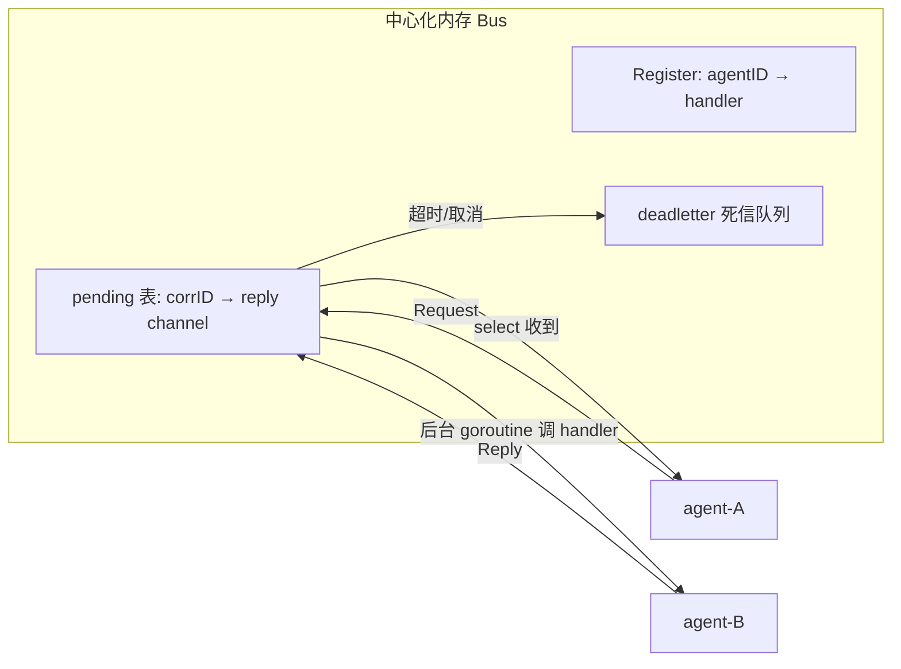

| 原语 | 语义 | 源码 |
|---|---|---|
| `Send` | 发不等回 | `internal/agentipc/primitives.go:57` |
| `Request` | 问 + 等（带 30s 超时） | `primitives.go:146` |
| `Reply` | 异步回信 | `primitives.go` |
| `Delegate` | 转给能办的人 | `primitives.go` |
| `Handoff` | 任务所有权点对点交接 | `primitives.go:454` |
| `Subscribe`/`Broadcast` | 关心 X / 喊所有关心 X 的 | `primitives.go` |
| 消息结构 | `Message` | `internal/agentipc/bus.go:14` |
| 注册/摘除 | `Register`/`Unregister` | `bus.go:131` |

**资源谁掌握谁释放**（分层）：

| 资源层 | 掌握者 | 释放者 |
|---|---|---|
| 消息在途状态（pending/channel/死信） | Bus 自己 | `Request` 的 `defer removePending` |
| agent 生死 | Agent Fabric | agent 被 Kill 时 `Bus.Unregister` |
| token/工具预算 | 调度器 governance | `consumeBudget` |

**Bus 只管消息流转，不掌握/不释放资源**；agent 死了 fabric 先知道，再摘除。

---

## 11. 多 session 并发与资源隔离

**关键认知：session 是任务命名空间，不是资源容器；agent 是全局共享池。**

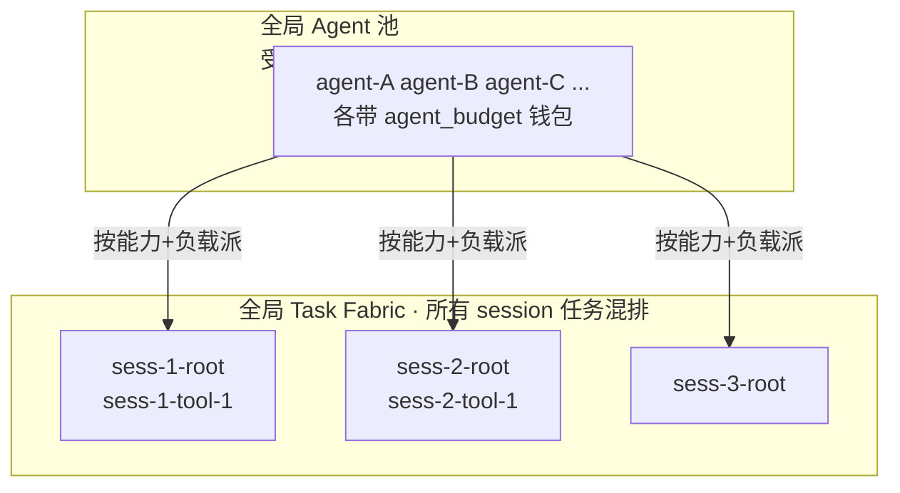

| 隔离层 | 机制 | 源码 |
|---|---|---|
| 同 session 准入序列化 | per-session 锁 `lockAdmission` | `internal/agentruntime/session.go:67` |
| 跨 session 任务无依赖 | 任务 ID 唯一前缀 `sess-N-*`，依赖只在同 session 内 | `session.go` |
| 全局资源约束 | `maxConcurrent` + `agent_budget` + `kernel.resources` | 调度器 |
| 收割保护 | `KeepSet`：活体 session 永不碰 | `session.go:311` |

**session 生命周期**：`Admit`（准入）→ 活体（每个 quantum 刷新 idle）→
`Release`（answer 完成/失败）→ Reaper 收割（`ReaperGrace` 后删 terminal task）。

| 环节 | 函数 | 源码 |
|---|---|---|
| 准入（幂等 + 同 session 序列化） | `Sessions.Admit` | `internal/agentruntime/session.go:105` |
| 收割可删任务 | `Harvest` | `session.go:290` |
| 构建 reaper 保留谓词 | `KeepSet` | `session.go:311` |
| answer 失败释放 | `ReleaseOnAnswerFailure` | `session.go:331` |

**session 与 agent 解耦**：kill agent 不杀 session，任务 lease 过期回 READY，
调度器换人续跑，session 无感。

---

## 12. 恢复（aresrecovery）

**agent 挂 → 任务不死**：租约过期 → 重新入队 → 换 agent 从 checkpoint 续跑。

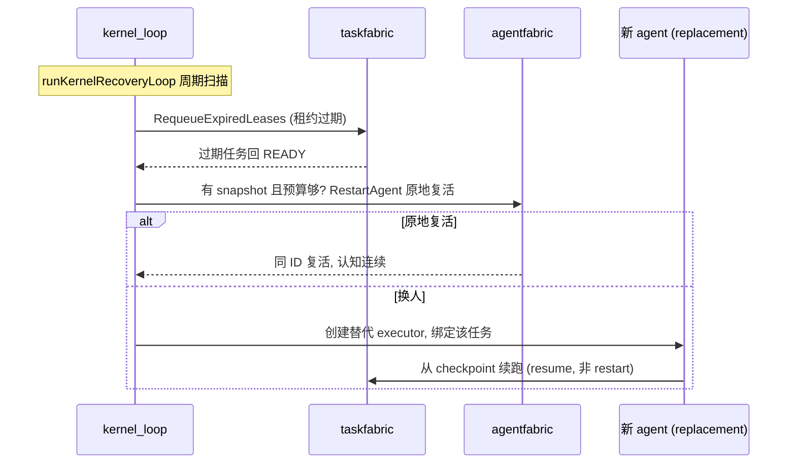

**防风暴**：restart budget（lifetime 累积，成功不回退计数）+ 指数 backoff。

**Deadline 不是租约过期**：上面讲的是**执行权失效**，这里救回来的任务消耗的是
restart budget，重试预算不动。而 `Task.Deadline` 已过是另一种截止——终态，
这个扫描不会再把它入队（见 §4.1）。

| 环节 | 函数 | 源码 |
|---|---|---|
| 恢复系统 | `Recovery` | `internal/aresrecovery/recovery.go:21` |
| 租约过期扫描 | `RequeueExpiredLeases` | `recovery.go:171` |
| 原地复活 | `RestartAgent`（death snapshot） | `recovery.go:274` |
| 完整恢复链 | `RecoverFromAgentDeath` | `recovery.go:384` |
| 内核恢复循环 | `runKernelRecoveryLoop` | `cmd/ares/kernel_loop.go:275` |

---

## 13. chaos 混沌演练

**chaos 不是恢复机制本身，是"故意把系统搞挂、看 checkpoint+recovery 能不能
救回来"的演练台。** "checkpoint 让你能恢复，chaos 让你敢信它能恢复。"

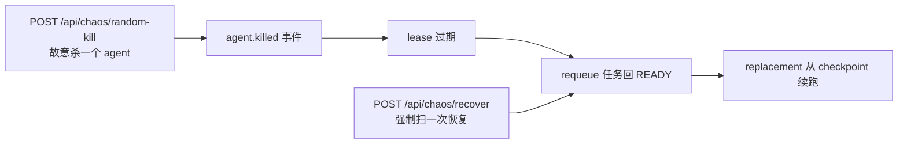

| 端点 | 函数 | 源码 |
|---|---|---|
| 分发 | `handleChaos` | `cmd/ares/agent_routes_chaos.go:27` |
| 随机杀 agent | `chaosKillRandomFabric` | `agent_routes_chaos.go:188` |
| 强制恢复扫描 | `chaosRecoverSweep` | `agent_routes_chaos.go:236` |
| 列活体 agent | `liveFabricAgents` | `agent_routes_chaos.go:249` |

**GA 静默窗**：进化跑到一半（`GenerationActive`）时，chaos 暂停注入，避免
"测到一半的故障把正在做决定的 GA 搞乱"。

---

## 14. 进化（GA 冷路径 + 部署管线）

**"基因"是什么**：`Strategy` 的 `Params`（temperature 等）+ `PromptTemplate`
（提示词模板）。**进化不改代码，只改这两样。**

> **纠正**：`DreamCycle`（`dream_cycle.go:304`）是同一 GA 引擎的轻量壳，
> **生产里关着**（`bootstrap` `EnableDreamCycle=false`）。生产实际驱动的是
> `GenomePopulationAdapter.Run`（`genome_wiring.go:38`），带一整套安全门。

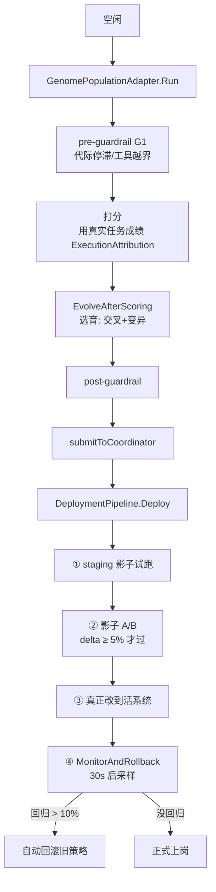

**"进化结果怎么落到活系统"**（部署管线 4 步，`internal/runtime/evolution/deployment/deployment.go`）：

| 步 | 函数 | 源码 |
|---|---|---|
| 部署 | `DeploymentPipeline.Deploy` | `deployment.go:184` |
| 监控回滚 | `MonitorAndRollback` | `deployment.go:313` |
| 补丁结构 | `patch.RuntimePatch` | `internal/runtime/evolution/patch/patch.go:114` |
| 按 Target 找执行器 | `Registry.Register` | `patch.go:399` |
| 接活 DAG | `UpdateLiveDAG` | `internal/ares_bootstrap/provide_new_evolution.go` |

**`RuntimePatch`** 是"通用变异语言"：`Type`（改什么）+ `Target`（改哪）+
`Value`（改成什么）+ `Rollback`（逆操作）。按 Target 分派到
Graph / Planner / Recovery / Knowledge / Memory 各 PatchExecutor。

**对在跑任务的影响：无。** GA 改的是 L1（能力/策略层），不是 L2（会话执行计划）。
正在跑的 session 里已编译成 fabric task 的 tool 节点不会被 L1 patch 重建；
改了 prompt 模板，下一轮新 session / 新 plan 量子才用新模板。
最坏情况"新策略变差" → 30s 后监控发现 → 自动回滚。

**G1/G2/G3 三道安全门**（由松到紧）：

| 门 | 位置 | 挡什么 |
|---|---|---|
| G1 Guardrails | `GenomePopulationAdapter` 前后 | 种群层面：停滞 / 工具白名单越界 |
| G2 Shadow Gate | `DeploymentPipeline` 第②步 | 影子 A/B：delta ≥ 5% 才放行 |
| G3 Eval + Regression | Lifecycle 提交后 | 跑评测/对基准 A/B：显著退步不 promote |

> **这三道门的适用范围——不要读成"所有提升都被验证过"。** G1-G3 约束的是
> **`DeploymentPipeline` / `StrategyLifecycle`** 这条链。**patch 应用路径在生产没有装门**：
> 它按自身 fitness 阈值决策，这正是该类型命名为 `UngatedPatcher` 的原因
> （`internal/runtime/evolution/coordinator/coordinator.go:185`）。把 patch 路径接进门链
> 记为 A1-a；在那之前，一个 patch 可以在从未经过 G1-G3 的情况下落地。

**GA 闭环**：跑得越多 → 成绩数据越多 → 进化越准 → 策略越好 → 跑得越好。

---

## 15. 观测与控制面（introspect）

| 面 | 作用 | 源码 |
|---|---|---|
| 7 页面板 | Overview/Tasks/Agents/Scheduler/Execution/Memory/Events | `internal/introspect` |
| `EvolutionTracer` | 进化轨迹（`/evolution/trajectory`） | `internal/aresrecovery` |
| `FeedbackStore` | 进化反馈（`/evolution/feedback`） | 同上 |
| `GlobalTracer` | 全链路 trace（`/observability/spans`） | 同上 |
| `/api/chaos` | 混沌演练 | `cmd/ares/agent_routes_chaos.go` |
| `/api/evolution` | 进化控制 | `cmd/ares/evolution.go` |

观测组件在 Bootstrap ② `assembleExperience` 建一次、多处共享，
保证面板显示**活数据**而非空列表。

---

## 16. 存储层：Postgres

v0.3.2 的持久化底座。`CREATE TABLE IF NOT EXISTS` + `ALTER ... ADD COLUMN IF NOT EXISTS` 全幂等，
可安全重跑。

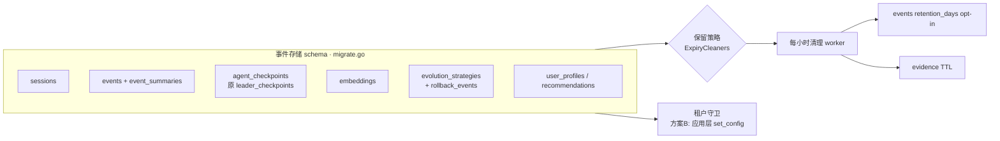

**关键事实（v0.2→0.3 的改名痕迹就藏在这里）：** `leader_checkpoints` 表在迁移里被
`RENAME TO agent_checkpoints`、`leader_id` 列改 `agent_id`、`idx_leader_checkpoints_status`
改 `idx_agent_checkpoints_status`（`internal/storage/postgres/migrate.go:107-123`）。
这就是"Leader 被删除"在存储层的证据。

| 关注点 | 机制 | 源码 |
|---|---|---|
| 事件/会话/checkpoint 表 | `migrate.go` 各 `CREATE TABLE IF NOT EXISTS` | `migrate.go:33/55/132/153` |
| 保留策略（opt-in） | `events_retention_days`，默认**永删** | `bootstrap_builder.go:83-91` |
| 每小时 TTL 清理 | `startExpiryCleanupWorker` + `CleanupExpired` | `bootstrap_builder.go:527` / `maintenance_worker.go:60` |
| 证据行 TTL | 注册进同一 worker，S-10 租户作用域 | `bootstrap_builder.go:303-306` / `bootstrap_steps.go:50-56` |

**租户守卫 = "方案 B"**（要特别记牢）：**刻意不启用 DB 层 RLS**（`migrate_storage.go:47-52` 注释明说
"pre-enforcement 清单"），改用**应用层** `set_config('app.tenant_id', $1, true)` 事务局部绑定
（`pool.go:172-238`）。`true` = 事务作用域，连接归还前必清空（`pool.go:215` 防御性清空残留租户）。
**SQL 注入守卫**：所有标识符过 `validateSQLIdentifier`（`security.go:23-40`，正则 + 长度 + 引号化）。

---

## 17. 知识层：AKG

AKG（Agent Knowledge Graph，BETA）的 `KnowledgeObject` 是统一知识表示，
**三层**：`Raw`（原始字节，留作再蒸馏）→ `Normalized`（清洗后给向量/匹配）→
`Summary`（LLM 友好摘要）。

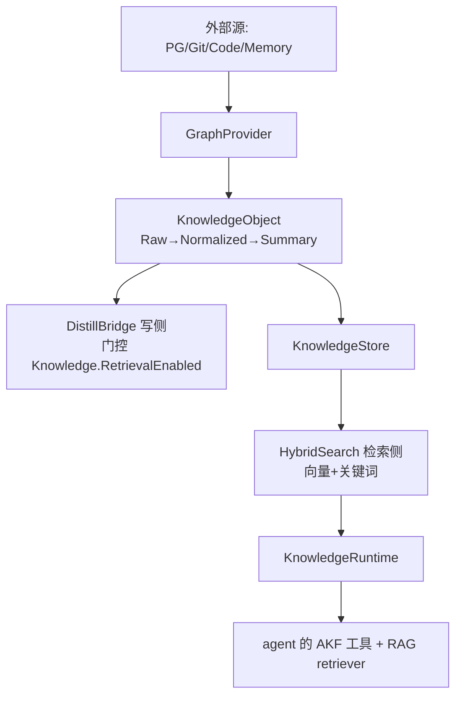

**当前 pipeline 是规则版（无 LLM）**：`DefaultNormalizer`（清洗控制字符）、
`DefaultSummarizer`（取前 200 字符截断）、`defaultPlanner`（`containsAny` 关键词 + 权重）
（`internal/knowledge/pipeline/normalizer.go` / `planner/default.go`）。
装配在 Bootstrap ② `wireAKGLoop`（`bootstrap_builder.go` `assembleExperience`），
**AKG 不可用 → 警告降级，系统照常跑**（BETA 不绑架热路径）。

| 关注点 | 机制 | 源码 |
|---|---|---|
| 统一知识对象（三层） | `KnowledgeObject` | `internal/knowledge/object.go` |
| 写侧蒸馏桥 | `wireAKGLoop` → `AKGBridge` | `internal/ares_bootstrap/bootstrap_builder.go` |
| 读侧共享 | `KnowledgeRuntime` 同时喂 agent 工具 + RAG | `bootstrap_builder.go` `assembleEvolutionDAG` |
| 租户隔离 | **按 `namespace` 隔离，非 tenant 列**（tenant→namespace 映射） | `SECURITY.md:94-99` |

> **与"任务规范化"的衔接**（前文 AKG 提议）：建议把"原任务 + 拆解任务"作为
> `ObjectTask` 的**影子语义账本**（旁路写 + 降级读先验），**不要**提为活任务语义权威，
> 否则 0.3.x "热路径不依赖知识组件"的不变量会被 BETA 的 AKG 拖垮。

---

## 18. 记忆与蒸馏

"越跑越记得住"的机制。分**写侧（蒸馏）**和**读侧（检索注入）**。

```mermaid
flowchart LR
    tc[task.completed 事件] --> sd{ShouldDistill<br/>task≥10 且 result≥20}
    sd -->|通过| llm[LLM 抽取 Problem/Solution/Constraints<br/>带 fenceUntrusted 围栏]
    llm --> store[存 experience 行<br/>+ embedding]
    store --> vec[MemoryRetriever<br/>向量检索 MinScore0.4 TopK5]
    vec --> prompt[注入 prompt context]
    store --> prior[spawn 时注入 ExperiencePrior]
    prior --> next[下个 agent "一出生就带经验"]
```

| 关注点 | 机制 | 源码 |
|---|---|---|
| 蒸馏服务 | `DistillationService` | `internal/runtime/memory/experience/distillation_service.go` |
| 蒸馏门槛 | `ShouldDistill`（成功/失败都可蒸，仅内容长度过滤） | `distillation_service.go` `ShouldDistill` |
| **存储型间接注入防护** | `fenceUntrusted`：任务正文包 `---UNTRUSTED-TASK-DATA---` 围栏，防"存进经验库再 RAG 注入回 prompt"的持久化注入 | `distillation_service.go` `buildExtractionPrompt` |
| 蒸馏装配 | `wireDistillation` + `subscribeDistillationEvents`（订阅 `task.completed`） | `internal/ares_bootstrap/bootstrap_steps.go:26` / `:105` |
| 读侧检索 | `MemoryRetriever`（vector, 默认 `MinScore=0.4`/`TopK=5`） | `internal/runtime/memory/context/memory_retriever.go:65` |
| 调度侧先验 | `ExperiencePrior` 注入 spawn（截断 4096 字） | `internal/fabric/agent/lifecycle.go:49` / `planner_cognition.go:186`（`maxExperiencePriorRunes`） |
| 成本/阈值旋钮 | `DistillationThreshold` / `MaxDistilledTasks` / `DistilledTaskTTL` | `internal/runtime/memory/manager.go:102/116/125` |
| 异步向量回填 | `embeddingEnqueuer`（默认同步；配了队列则先落行后异步补向量，不阻塞事件循环） | `distillation_service.go` `WithEmbeddingEnqueuer` |

**token 成本**：蒸馏走 LLM 抽取（30s 超时），是系统里少数"后台烧 token"的地方，
用 `MaxDistilledTasks`（条数上限）+ `DistilledTaskTTL`（过期回收）+ 异步 embedding 三条控制成本。

---

## 19. MCP 集成与工具发现

工具来源有**三条路**，最终都进同一个 `core.Registry`（`toolBinder.GetToolSchemas()` 读它建 L1）：

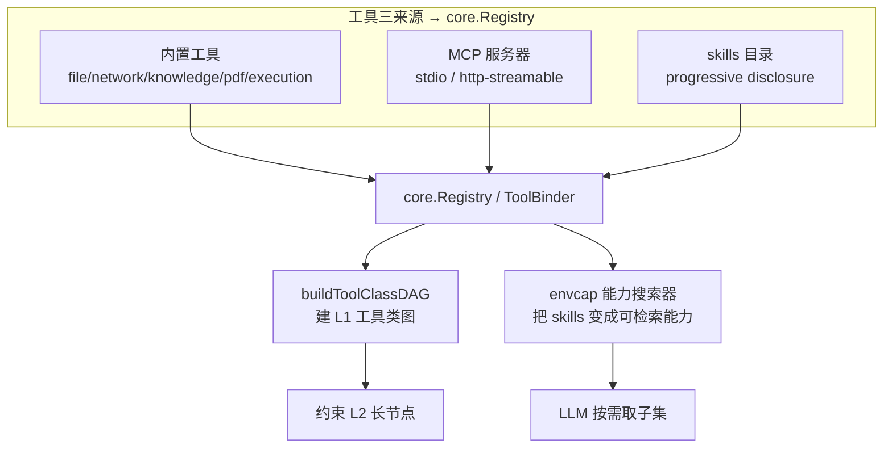

| 关注点 | 机制 | 源码 |
|---|---|---|
| MCP 装配 | `ProvideMCP`（stdio / http 传输） | `internal/ares_bootstrap/provide_mcp.go:57` |
| MCP 管理器 | `MCPManager`（transport_stdio / transport_server） | `internal/runtime/protocol/mcp/` |
| **渐进披露** | 服务保留**全量**工具；每个任务只把**相关子集**喂给 LLM（省 token） | `cmd/ares/serve_wiring.go:215` |
| 能力搜索器 | `registerCapabilitySearch`（envcap）：把 skills 变成可检索的工具能力 | `cmd/ares/agent_routes_tools.go:280` |
| L1 工具类图 | `buildToolClassDAG(toolBinder.GetToolSchemas())` | `cmd/ares/serve_peer.go:515` |

**"工具发现"的特色**：不是把所有工具 schema 一次塞给 LLM（会爆 token），
而是**全量注册、按需取子集**——envcap 搜索器把 skills 目录变成"可被 LLM 检索"的能力，
配合渐进披露，每个任务只暴露相关的工具。这是 0.3.x 区别于"工具全量硬塞"的巧思。

### 19.1 主动服务发现（`internal/discovery` 引擎）

上面讲的是"工具级"的发现。最顶层还有一层**"服务级"的主动发现**——
不等用户在 config 里手写 MCP 服务器，而是**主动扫描机器上已有的配置，自动摸出可用的供应商**。

| 层 | 干什么 | 时机 | 源码 |
|---|---|---|---|
| **① 服务发现** | 主动扫 Claude/Cursor/VSCode/ARES 配置 + PATH 二进制，发现有哪些 MCP 服务器 | 每 5min（默认）+ 自愈循环 | `internal/discovery/engine.go` |
| **② 工具发现** | 连上服务器主动 `ListTools` + `OnChange` 动态增删 | 启动 + 服务端通知 | `internal/runtime/protocol/mcp/client.go:186` |
| **③ 工具选择** | 全量入池，只按需喂 LLM 子集（渐进披露 + envcap） | LLM 调用时 | `cmd/ares/serve_wiring.go:215` |

```mermaid
flowchart TB
    subgraph disc[① 服务发现 · internal/discovery]
        p[Providers 并发扫<br/>Claude/Cursor/VSCode/ARES + PATH 二进制]
        p --> merge[merge → diff<br/>added/updated/removed]
        merge --> store[持久化 ServiceStore]
        merge --> evt[发事件 → EventStore "discovery" stream]
        auto[StartAutoDiscovery<br/>默认每5min + panic自愈退避] --> p
    end
    evt --> mcp[② MCP 连上 → ListTools + OnChange]
    mcp --> reg2[core.Registry]
    reg2 --> sel[③ 渐进披露 + envcap 按需喂 LLM]
```

**关键设计：**

- **主动 ≠ 配了才连**：去扫各 IDE 已有的 `mcp.json`（`providers/filesystem.go`），把机器上散落的 MCP 服务器自动摸出来。
- **手动注册不被误删**（#51）：`Engine.Register` 出的服务是 passive，diff 的 removed 分支保护它。
- **自愈后台循环**：`StartAutoDiscovery` 的 goroutine panic 被 recover + 指数退避重启（`1s/2s/4s...30s cap`）。
- **门控**：`Discovery.Enabled` 默认 **false**（`bootstrap_builder.go:493`），不开就是纯手工配 MCP。

| 关注点 | 函数 | 源码 |
|---|---|---|
| 发现引擎（4 阶段） | `Engine.DiscoverNow` | `internal/discovery/engine.go:50` |
| Provider 接口 | `DiscoveryProvider.Discover` | `internal/discovery/discovery.go:87` |
| 各 IDE 配置扫描 | `NewClaudeProvider`/`NewCursorProvider`/`NewVSCodeProvider`/`NewARESProvider` | `internal/discovery/providers/filesystem.go` |
| 自动发现循环（自愈+退避） | `StartAutoDiscovery` | `internal/discovery/engine.go` |
| 装配 + 事件桥 | `ProvideDiscovery`/`forwardDiscoveryEvent` | `internal/ares_bootstrap/provide_discovery.go:51` |

---

## 20. SDK / CLI 用法

| 入口 | 场景 | 源码 |
|---|---|---|
| `ares serve` | 生产常驻（HTTP + 各后台 loop） | `cmd/ares/serve.go` |
| `ares start` / SDK | 嵌入式（同进程内起 agent，共享 L2 核心） | `sdk/` + `internal/agentruntime` |
| CLI 其他子命令 | `status` / `doctor` / `chaos` / `evolution` | `cmd/ares/main.go`（cobra） |

**两个入口、一套语义**：`serve` 和 SDK 都走 `internal/agentruntime` 的
L2 执行核心（session registry + compile coordinator + planner/router cognition +
task reaper），**入口不同（HTTP vs 进程内），执行语义完全一致**。

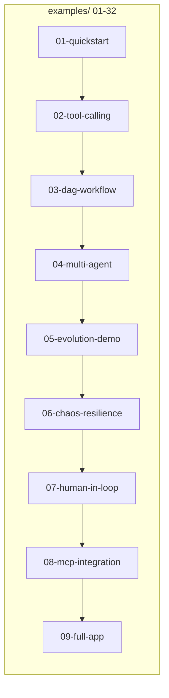

`examples/` 从 01（最小 LLM 接入）到 32（llm-service-direct）覆盖 quickstart /
tool-calling / DAG / multi-agent / evolution / chaos / HITL / MCP / full-app，
是"系统怎么用"的活文档。

---

## 21. 安全模型

**三条信任边界**（`SECURITY.md`）：

| 边界 | 机制 | 源码 |
|---|---|---|
| **SSRF** | `ValidateURL` 拒 private/loopback/link-local/云 metadata（`169.254`）；**每跳重验**防重定向绕过 | `internal/tools/resources/builtin/network/ssrf.go:32` |
| **沙箱** | 代码执行工具走沙箱；MCP stdio 服务器**由操作者自己约束**（文档明说） | `SECURITY.md:61` / `.../execution/code_runner.go` |
| **租户** | 默认**单租户**；`tenant_id` 是**按请求 opt-in 的作用域**；**内核强制**（LLM 填的 tenant 一律被 context 覆盖）；知识侧按 **namespace** 隔离 | `SECURITY.md:69-99` / `agentsyscall` |

**通用 fail-closed 手段（前文提过，收拢在此）：**

| 手段 | 作用 | 源码 |
|---|---|---|
| 通配符 bind 必须带 auth | 无认证就拒启动 | `cmd/ares/serve.go:292` |
| 路径穿越守卫 | `SetAllowedConfigDir` 把 config 读取圈定在目录内 | `internal/ares_config/config.go` |
| 读接口也需权限 | `PermRead` 门控 introspect / config 读 | `agent_routes_task_read.go` |
| SQL 标识符校验 | `validateSQLIdentifier` 防注入 | `internal/storage/postgres/security.go:23` |
| 租户内核强制 | `kctx.CallerID` / `tenantctx` 覆盖 LLM 参数 | `internal/agentsyscall/syscall.go` |

**一条主线**：能 fail-closed 的地方都 fail-closed，能内核强制的地方不信 LLM/模型，
租户/归属/provenance 全部由 context 盖章。

---

## 22. ReAct 去哪了：动态 DAG + 想/做/进化三层

v0.3.x **删除了 ReAct 工具循环**（源码多处注释明说 "the ReAct tool loop is deleted"，
见 `internal/agents/sub/agent.go:55` / `internal/fabric/agent/l2graph.go:22`）。
替代它的不是"另一个循环"，而是**动态 DAG + 想把"做"拆成两类节点 + 外层进化轮**三者配合。

### 22.1 一个比喻

| 模式 | 比喻 |
|---|---|
| **ReAct** | 一个厨师自己边做边想，全在脑子里；厨师晕倒，做法全丢 |
| **动态 DAG** | 一张菜谱流程图 + 一群工位厨师；厨师只填一个格子就交出去，总厨盯着图派活；图是活资产，厨师可换 |

### 22.2 "想"和"做"被拆成两类节点

ReAct 那条链（想→做→想→做）被拆成 DAG 上的**格子**：

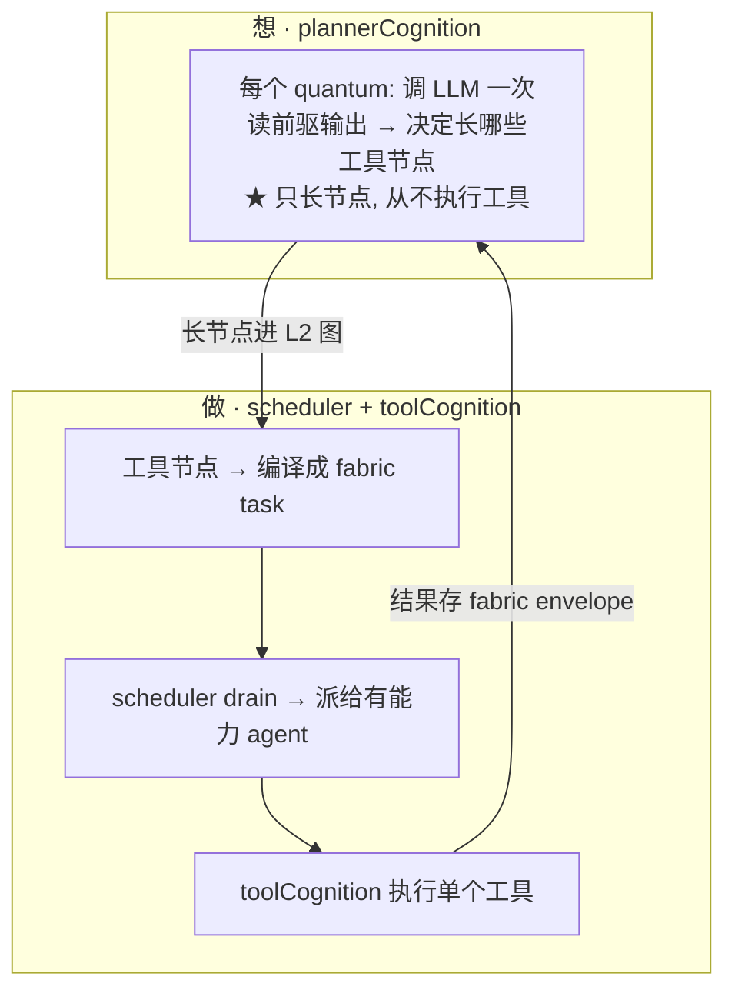

| ReAct（0.2.x） | 替代（0.3.x） | 源码 |
|---|---|---|
| 一个 cognition 内 `LLM→工具→LLM` 死循环 | **plannerCognition**：每 quantum 只调 LLM 一次，把工具调用长成品节点，不执行 | `planner_cognition.go:236`（`ExecuteStep`） |
| 工具在 cognition 里直接跑 | **toolCognition**：工具节点是一等 fabric task，内核调度执行 | `internal/fabric/agent/l2graph.go` |
| 无上限，LLM 爱调多久调多久 | **maxPlanDepth**（默认 10）强制收敛 | `planner_cognition.go:26`（`DefaultMaxPlanDepth`） |
| 循环状态=内存 Messages，挂了就丢 | 任务 + `CheckpointEnvelope` 才是持久的（断点续跑）；**L2 图本身只在进程内**——重启后会话重新 Admit，重建成一张空图 | 见 §6、§25.1 |

### 22.3 "动态"到底动态在哪（边跑边长）

同一个 DAG 在三个时刻——**它不是一开始画好的，是边跑边长**：

```mermaid
flowchart TB
    subgraph T0["T0 · 刚提交（只有骨架）"]
        r0[root 会话] --> p0[plan①]
    end
    subgraph T1["T1 · plan① 想完，长出工具（图变了）"]
        p0x[plan①] --> g1[tool: grep]
        p0x --> r1[tool: read]
        g1 --> p1[plan②]
        r1 --> p1
    end
    subgraph T2["T2 · plan② 看结果，继续长 / 出答案"]
        p2[plan②] --> a[answer 出最终答案]
    end
    T0 --> T1 --> T2
```

- **T0**：只有 root + 第一个 plan 格子。
- **T1**：plan① 调 LLM，LLM 说"我需要 grep + read"，就在图末尾**长**出这两个 tool 格子 + 一个 plan②（依赖它们）。调度器把 tool 格子跑掉。
- **T2**：plan② 读 grep/read 结果，LLM 说"够了"，长出 **answer** 格子 → 会话结束；说"还得再查"就再长一批 tool 格子。

**"动态" = 每跑一个 plan 格子，DAG 就长一截，调度器接着 drain 新长出的部分。**

### 22.4 为什么这样比 ReAct 好（与不好）

**换来的（ReAct 没有）：** 工具是一等任务可断点续跑；内核统一调度；`maxPlanDepth` 收敛上界；计划显式可回放；可被进化 steer。

**付出的（ReAct 反而更简单的地方）：**

| 代价 | 说明 |
|---|---|
| 复杂度爆炸 | ReAct 一个循环；0.3.x 是 planner + L2 图 + 增量编译 + 调度 + toolCognition + checkpoint 六件套 |
| 延迟变大 | tool 结果要"存 fabric → 下个 plan 量子读"，比 ReAct 即时喂回绕几圈，**快速试错不友好** |
| token 成本 | 每个 plan 量子都重新组 context、重新调 LLM，比 ReAct 烧得多 |
| 装配脆弱面 | `PlannerDeps` 有 9 个字段（`planner_cognition.go:31`），任一没接好就降级 |

### 22.5 还有一层"外层轮"（进化）

`LoopConfig`（`internal/runtime/loop.go:11`，注释原文在 `:9`："Unlike a fixed ReAct loop,
drives the outer round loop that re-executes the entire DAG with mutations applied
between rounds"）。这是 GA 冷路径用的——**每轮之间注入变异，重跑整个 DAG**。

所以完整替代 = **planner（想）+ scheduler/toolCognition（做）+ 外层 round loop（进化）三件套**。

> **一句话判断**：ReAct 是"一个人边想边做"的一条链，挂了全丢；动态 DAG 把这条链拆成
> "plan 格子（想）+ tool 格子（做）+ answer 格子（终）"，骨架（图）持久、厨师（agent）可换，
> 边跑边长、总厨（调度器）派活、外圈还能进化。这是"用结构化换鲁棒性"的取舍——
> 对 0.3.x 的定位（耐活、可进化、多 agent 协作）是**正向的**；但若拿它做"单 agent 实时
> 交互式快速试错"，它会比经典 ReAct 笨重、慢、烧钱。

---

## 23. L1 / L2 双图与数据分流

### 23.1 L1 vs L2：规则层 vs 实例层

系统里有**两张不同层级的图**，不是"同类图的两个副本"：

| | L1 工具类图（`injectToolClassDAG`） | L2 会话图（`L2Graph` / `MutableDAG`） |
|---|---|---|
| 节点是什么 | 一个**工具类**（grep、web_search…） | 一个**工具实例**（本会话第 3 次 grep） |
| 谁建 | 启动时扫 `toolBinder.GetToolSchemas()` | LLM 在 planner 量子里**现长** |
| 挂什么 | `enabled`/`budget`/`prior`（元数据） | `payload`/依赖边/结果 |
| 生命周期 | 全系统共享，长期稳定 | 一个会话一份，会话结束就收 |
| 改它的谁 | **GA 进化**（patch 改 metadata） | **LLM**（边跑边长节点） |
| 编译成任务吗 | **不编译**（它只是约束目录） | **编译**成 fabric task，调度器跑 |

源码：L1 建在 `cmd/ares/serve_peer.go:515`；L2 在 `internal/fabric/agent/l2graph.go`；
L1 约束 L2 的拦截点在 `planner_cognition.go` 的 `growToolNodes`
（长节点前查 `isToolEnabled` / `toolBudgetRemaining` / `l1Priors`）。

**L1 定规则，L2 出实例。规则约束实例。** 最干净的一处演示：
`budget=N` 挂在 L1 某工具类节点上；planner 长 L2 节点时用 `CountToolClass`
数"本会话 L2 里已经长了几个这个类的实例"，超 N 就拦——**规则存 L1，
被数的实例在 L2，两层各司其职**。

### 23.2 为什么必须两张图（一张图会出的三个麻烦）

```mermaid
flowchart TB
    one[如果 L1/L2 合一张] --> a[共享性: 目录被每个会话拷一份]
    one --> b[进化安全: GA 一改'规则'<br/>就把在跑的会话工单也改飞了]
    one --> c[更新节奏: 稳定(进化)和易变(LLM现长)<br/>混在一个对象上, 锁/版本/重建全乱]
```

1. **共享性**：工具目录天然是"全系统一份"；和会话工单塞一张图里，就被每个会话拷一份。
2. **进化安全**：GA 改 L1 metadata；**在跑的 L2 会话不受影响**（节点已长出来，patch 只管"下次"）。
3. **更新节奏**：L1 稳定（偶尔进化 patch），L2 易变（每量子在长）。塞同对象里锁全乱。

> 类比：数据库 schema（表结构）和行（数据）从不是一回事——L1 是 schema，L2 是行。

### 23.3 数据分流：结构化 vs 语义化（Postgres / pgvector）

| 数据类 | 存哪 | 为什么 |
|---|---|---|
| **结构化**：任务状态机、租约/epoch、checkpoint、事件账本 | Postgres 关系表——**仅在配置了 `storage` 时**；否则事件存储回落内存归档（`cmd/ares/serve_wiring.go:338`） | 要事务、要精确查、要事件溯源、要多节点共享 |
| **语义化**：知识对象、蒸馏经验（"Problem/Solution/Constraints"） | pgvector 向量列（`VECTOR(1024)`） | 要按"意思"（不是按字）召回 |

agent fabric 的运行时状态（agent 群体、`CognitiveState`）是**进程内状态**，不在 Postgres：
`agent_checkpoints` 表虽存在，但 `migrate.go:128` 注明它目前**没有生产查询**。

"Postgres + pgvector 同一实例"是**有意为之**：关系数据（经验行）+ 向量（`embedding` 列）
**同库同事务**，不引入 Milvus/Pinecone 独立向量库。多节点集群化时共享一份 PG 即可。
（`migrate.go:97` 建的是通用 `embeddings` 表 `VECTOR(1024)`；真正的 pgvector 表是
`knowledge_chunks_1024` / `experiences_1024`，其 `ivfflat` 索引在 `migrate_storage.go:72`。）

---

## 24. 检索降噪

向量检索在数据量大时**天生噪声大**，四个来源：

```mermaid
flowchart LR
    q[查询向量] --> n1[① 维度灾难<br/>几万条挤在 cosine 0.7~0.9, 区分度没了]
    q --> n2[② ivfflat 近似索引<br/>只查最近几个'桶', 漏/混]
    q --> n3[③ 长尾冷数据<br/>向量短、含糊、质量低]
    q --> n4[④ 纯 cosine 无精排<br/>'标题近但内容错'分不出]
```

### 24.1 项目"实际"用了哪些降噪（源码背书）

| 手段 | 治哪种 | 源码 |
|---|---|---|
| 硬过滤先缩空间（`WHERE tenant_id AND embedding IS NOT NULL`） | ①③ | `internal/storage/postgres/vector.go:91` |
| **HybridSearch 混合检索**（向量 cosine + 关键词 lexical 融合） | ①④ | `internal/knowledge/store.go:55` |
| TopK + MinScore 双闸（默认 `RAGTopK:5 / MinScore:0.4`） | ①③ | `internal/runtime/memory/manager.go:429-430` |
| Quality 元数据参与打分（Extraction/Consistency/Freshness/Usage） | ③ | `internal/knowledge/object.go:96`（权重在 `quality.go:31`） |
| 经验去重/冲突合并（相似度阈值） | ③ | `internal/runtime/memory/experience/conflict_resolver.go:15` |

**项目没做的（最值得补的）**：**模型级**的二段精排——全库没有 cross-encoder / 学习式 reranker。
现有的是**启发式重加权**，不是语义精排：`internal/storage/postgres/services/retrieval_search.go:652 rerankResults`（以及 `:598 mergeAndRerank`）。

### 24.2 量产降噪的正确姿势（宽召回 + 精排）

```mermaid
flowchart LR
    q[查询] --> r1[① 宽召回<br/>向量/hybrid top-50<br/>宁多勿漏]
    r1 --> r2[② 精排 rerank<br/>cross-encoder 逐条打分<br/>或 LLM 判'哪几条真相关']
    r2 --> top[③ 取 top-5 注入]
```

配合三条（按性价比）：

1. **ivfflat → 调 probes 或换 HNSW**（量大时 ivfflat 召回率掉得快；HNSW 更高，代价内存+构建慢）
2. **元数据 pre-filter**：按"类型/时间窗/标签/能力域"先筛，比事后 rerank 便宜
3. **嵌入版本化 + 全量重嵌**：模型升级后 `embedding_version` 一列，旧向量按新版本重嵌

> 面试一句话："量大噪声大，我从三层降——**检索前**硬过滤+pre-filter；**检索时**混合检索（向量+关键词）；**检索后**宽召回 top-50 + cross-encoder 精排到 top-5 + 质量/新鲜度加权。"
>
> **用这句话务必分清时态**：项目当前是 ivfflat（`lists=100`）+ **启发式**重加权；
> HNSW + cross-encoder 是"该往哪走"，不是"已经在用什么"。说"我会把它换成 HNSW"才站得住。

---

## 25. Checkpoint 与恢复

### 25.1 两层"记忆"（面试第一道追问）

| 层 | 存哪 | 存什么 | 大白话 |
|---|---|---|---|
| **任务进度** | `Task.Checkpoint`（fabric 账本，持久化） | `CheckpointEnvelope` | "任务做到哪了" |
| **agent 脑子** | `CognitiveState`（agent 自己的状态） | LLM 上下文 + 工具调用历史 | "这个 agent 脑子里装了什么" |

### 25.2 `CheckpointEnvelope` 字段全表（`checkpoint_schema.go`，SchemaVersion=v5）

| 字段 | 干嘛的 | 要点 |
|---|---|---|
| `SchemaVersion` | 格式版本（v5） | 回滚不能拿新版硬套旧代码 |
| `StepCheckpoint` | **量子进度**（nil=没跑过） | 最核心字段，续跑的落点 |
| `Payload` | 任务原始数据（task_desc） | "任务是啥" |
| `SessionID` / `TenantID` | 归属会话/租户 | 跨 yield→resume 不变，执行时还原进 tenantctx |
| `StrategyID` | 提交时用的 GA 策略 | **提交时盖一次、之后不改**（GA 归因绑任务粒度，中途 promote 不能把成绩算错给新策略） |
| `UsedExperienceID` | 借了哪条蒸馏经验 | bandit 反馈链接 |
| `InputTokens` / `OutputTokens` | **累计** LLM token 花费 | 跨量子累加（不是取最后一步），GA 看的是整任务成本 |
| `LastError` | 终态 FAILED 时"为什么挂了" | agent 死亡不填这个（那在 `Task.FailedDependency`） |
| `UserProfile` | 附加用户 profile（对 fabric 透明） | executor 负责还原 |

### 25.3 agent 原地复活（`aresrecovery.RestartAgent` 内部 7 步）

查 death snapshot、绑定 task-X、从 `StepCheckpoint` 续跑这三件事**不在**
`RestartAgent` 内，而在调用方（`runKernelRecoveryLoop`，`cmd/ares/kernel_loop.go:336`）和调度器里。

```mermaid
sequenceDiagram
    participant S as Scheduler
    participant R as Recovery (RestartAgent)
    participant F as AgentFabric
    participant B as Agent B(replacement)
    S->>R: agent A 没了, task-X 还在 RUNNING
    R->>R: ① 查 restartBudget(lifetime 累积, 默认5, 成功复活不回退)
    alt 超 budget
        R--xS: 拒活, task-X FAILED
    else 没超
        R->>R: ② 原子预留(reserve, 先占坑再 sleep)
        R->>R: ③ 指数 backoff(1s→2s→4s...30s cap)
        R->>R: ④ 同 ID 仲裁(只有一个复活者胜出)
        R->>F: ⑤ 经 CognitionFactory spawn B(造"真实认知体"不是空壳)
        F->>B: ⑥ 装 A 的 CognitiveState 进 B
        R->>R: ⑦ 清理 death snapshot
    end
    S->>B: 调用方(不在 RestartAgent 内): 绑定 task-X, 从 StepCheckpoint 续跑
```

| 步 | 关键点 | 源码 |
|---|---|---|
| budget 检查（lifetime 累积） | "总共 5 次"不是"连续 5 次"，防循环 | `recovery.go:277` |
| 原子预留 | check+increment 一次，先占坑再 sleep | `recovery.go:283` |
| 指数退避 | 防 crash-restart 风暴 | `recovery.go:310` |
| 同 ID 仲裁 | death snapshot 驱动同 ID 原地复活，provenance/审计连续 | `recovery.go:326` |
| CognitionFactory spawn | 造"真实认知体"不是空壳 | `recovery.go:151` |
| 装脑子 | A 的 LLM 上下文/工具历史装进 B | `recovery.go:340` |
| 绑定 + 续跑（**调用方**） | *不在* `RestartAgent` 内：`runKernelRecoveryLoop` 绑定 task-X，调度器从 `StepCheckpoint` 续跑 | `kernel_loop.go:336` |

> `RecoverTaskCheckpoint`（`recovery.go:193`）与 `RecoverFromAgentDeath`（`recovery.go:371`）
> 被标为 TEST/CHAOS-ONLY；`RestartAgent` 才是生产路径。

### 25.4 两种恢复模式

| 模式 | 触发 | 结果 |
|---|---|---|
| **requeue（换人）** | 租约过期 → 任务回 READY → 调度器派给另一个 agent | 新 agent 从 `Task.Checkpoint` 续，**不一定复用 A 的脑子** |
| **原地复活（RestartAgent）** | agent panic / chaos kill → recovery 检测到 death snapshot | **同 ID 复活**，把 A 的脑子（CognitiveState）装进"新肉体" |

默认路径是 **requeue**；**原地复活**是增强路径（有 death snapshot 时）。

> 一句话：lease 过期只让任务**重新入队换人**（不判死任务）；租约守卫会拒掉旧持有者的迟到写——
> **已不持有租约时返回 `ErrNotOwner`，持有租约但 epoch 过期时返回 `ErrEpochMismatch`**——
> 任意时刻只有一个有效写者。

---

## 26. 上下文管理（滑窗截断 + 规则裁剪 + RAG 注入，非 LLM 摘要）

> 本章实事求是说明：项目**没有做 LLM 摘要式压缩**（不是 OpenAI `compact`
> 那种"把历史总结成一段喂回去"）。它做的是**"滑窗截断 + 规则裁剪 + RAG
> 注入"**，零 LLM 成本。这是有意的 trade-off，边界也明确。

### 26.1 三层机制（源码核实）

```mermaid
flowchart TB
    subgraph store[① 存储层]
        m[session 消息流]
        c["SessionMaxHistory=500<br/>AddMessage 满 500 丢最旧的<br/>(session.go:23)"]
    end
    subgraph read[② 读取层 BuildContext]
        w["MaxHistory(默认 10~50)<br/>只取最近 N 条<br/>(manager_impl.go:563)"]
        cl["ContextCleaner.Clean<br/>规则裁剪(非LLM)"]
    end
    subgraph rag[③ 补充层 RAG]
        r["retrieveContextString<br/>注入相关经验/知识 snippet"]
    end
    store -->|读时截断| w
    w --> cl
    cl --> out[LLM 上下文]
    rag -->|prepend| out
```

| 层 | 做什么 | 源码 |
|---|---|---|
| ① 存储上限 | 每个 session 最多存 `SessionMaxHistory=500` 条，满了丢最旧（防长会话 OOM，修过的 bug） | `context/session.go:23` `defaultMaxSessionMessages=500` |
| ② 读取截断 | `BuildContext` 只取**最近 `MaxHistory`（10~50）条**，不是全量 | `manager_impl.go:563` `messages[len-maxHistory:]` |
| ② 规则裁剪 | `ContextCleaner.Clean` 对截断后的消息做"角色差异化压缩" | `context/cleaner.go` |
| ③ RAG 注入 | prepend 检索到的相关经验/知识 snippet（用当前 input 当查询） | `manager_rag.go:17` `retrieveContextString` |

### 26.2 `ContextCleaner` 到底做了什么（不吹）

代码注释写的是 "intelligently cleans / differential compression"——**实际实现
是纯规则（regex + 截断 + 取首句），零 LLM 调用**。按消息角色区别对待：

| 消息角色 | 处理 | 效果 |
|---|---|---|
| `tool_call` / `tool_result` | `extractGist`：去掉代码块，**只留第一句**，再截到 `MaxToolLen` | 工具噪音大幅砍掉 |
| `assistant` 带 ToolCalls | 当工具类内容，激进砍 | 同上 |
| `assistant` 纯推理 | `compressCodeBlocks`：代码块 ```...``` 替换成 `<code block [lang]>`，再截到 `MaxAssistantLen` | 长代码塌成占位 |
| `system` / 其他 | 截到 `MaxSystemLen`/`MaxAssistantLen` | 兜底截断 |

**关键事实（面试别顺着注释吹）**：
- **没有"总结""提炼要点"的语义动作**——是"砍代码块""取首句""截断"，规则化的。
- `compressCodeBlocks`（`cleaner.go:128`）就是把 ``` 代码块 整个替换成 `<code block>` 占位，**不读代码内容**。
- `extractGist`（`cleaner.go:144`）取"第一个句号/叹号/问号前的句子"，取不到就 `WithEllipsis` 硬截。
- 有 `CleaningMode`（Default/Conservative/Aggressive，`cleaner.go:24`）三档 + `CleanWithTurns`（按"回合"做工具消息的保留/裁剪，`cleaner.go:169`），但**本质仍是规则，不是 LLM**。
- **（0.3.3 更新）`CleanWithTurns` 已可接进生产读路径**：`memory.turn_aware_cleaning: true`（ares.yaml，映射到 `MemoryConfig.TurnAwareCleaning`）时 `BuildContext` 走 `CleanWithTurns`（tool_call↔tool_result 成对保留），否则（默认）仍走扁平 `Clean`——**开关关闭 = 现状逐字节一致**；两条路径共用同一 `CleanOptions` 预算，开关只改分组、不放宽字符上限。注：结构化路径 `BuildPromptMessages` 本就恒走 `CleanWithTurns`，本开关只影响文本路径 `BuildContext`。**（0.3.3 更新）token 预算（B-G2）已接**：`memory.context_token_budget>0` 时 `BuildContext` 在清理前按保守 token 估算裁剪窗口（丢弃序：系统保底>工具因果>历史），0=关。**仍待做**：记忆锚点 LLM 摘要（B-G3，新增 LLM 调用，默认不做）。

### 26.3 三种"压缩"方案的对照（为什么选这个）

| 方案 | 成本 | 效果 | 短板 |
|---|---|---|---|
| **滑窗截断（本项目）** | 零（纯切片） | 保最近 N 条连贯 | 丢旧上下文 |
| **规则裁剪（本项目）** | 零（regex/截断） | 砍工具/代码噪音 | 无脑砍，可能砍掉"不啰嗦但关键"的内容 |
| RAG 补充（本项目） | 向量检索（便宜，非 LLM） | 召回"不最近但相关"的旧知识 | 精度依赖 embedding 质量（见 §24） |
| **LLM 摘要（本项目没做）** | 多一次 LLM 调用（贵 + 慢） | 语义压缩最完整 | 烧钱 + 摘要本身有损 + 引入新故障点 |

**为什么选"截断 + 规则裁剪 + RAG"而不用 LLM 摘要**：
1. **零 LLM 成本**——截断/裁剪/向量检索都不多烧 token，热路径不卡 LLM。
2. **确定性**——规则裁剪结果稳定，不引入"摘要 LLM 抽风"的变量。
3. **够用**——"最近 N 条（连贯）+ RAG 相关 snippet（语义）"覆盖了大多数 agent 场景。

### 26.4 明确边界（实事求是，不吹）

- **超长多轮任务是短板**："很久以前第 3 步的一个关键决定"既不在最近 N 条里，RAG 也未必检索到（依赖 embedding 质量）——两头漏。
- **规则裁剪是有损的**：砍代码块、取首句，**丢了具体细节**；如果 LLM 后续需要"刚才那段代码的变量名"，已经砍没了。
- **`MaxHistory` 默认 10~50**：窗口很窄，长对话里"稍早几句"就出窗口了（靠 RAG 补，但 RAG 是"相关"不是"时序"）。
- **如果未来要做超长任务**：正确补法是加一条 **LLM 摘要路径**（把滑窗外的旧历史摘要成一段"记忆锚点"），而不是加大 MaxHistory（那只是更贵的截断）。

### 26.5 面试速答（实事求是版）

> "上下文管理是**滑窗截断 + 规则裁剪 + RAG 注入**，**不是 LLM 摘要压缩**。
> 存储层 session 存 500 条上限（防 OOM）；读取层 `BuildContext` 只取最近
> `MaxHistory`（10~50）条，再过一遍 `ContextCleaner`（正则砍代码块、工具
> 消息取首句，**零 LLM 成本**）；同时 RAG 把相关经验 snippet 注入进去。
> **为什么不用 LLM 摘要**：截断+规则+向量检索都不多烧 token，热路径不卡
> LLM，且确定性高。**边界**：超长任务里'不最近也不相关但关键'的信息两头
> 会漏；要覆盖得加一条 LLM 摘要路径——这是已知短板，不是设计遗漏。"

---

## 27. LLM 失败切换与工具组织

> 本章补足前面只讲了"agent 层 / 任务层"容错、漏掉的**第三层——LLM 供应商层**，
> 以及一直被简称 "core.Registry" 的工具组织。逐行核实，不吹。

### 27.1 LLM 失败切换（`FailoverClient`，`internal/llm/failover.go`）

三级容错里补上的第三级：前两级是"agent 挂了 / 任务挂了"（§12），
这级是"**LLM 供应商挂了 / 限流了**"。

**机制（源码核实）**：

```
NewFailoverClient(configs[0]=primary, configs[1:]=fallbacks, rate, burst)
  · 只给 primary 挂 token bucket 限流(rate req/s + burst)，fallback 不限 (failover.go:81)
  · 每个底层 client 关掉单调用重试(MaxAttempts=1)，重试交给 failover 层 (failover.go:76)

Generate / GenerateStream（遍历 provider）:
  for 每个 client (primary 先, fallback 按序):
    · callerAborted(ctx)? → 立即停 (不"把锅甩给每个 provider")
    · isCooledDown(该provider)? → 跳过 (60s 内不碰它)
    · 带 per-attempt timeout 调 LLM
    · 成功 → clearCooldown, 返回
    · 失败/429 → markCooldown, 继续试下一个
  全挂 → "no provider available (all N cooled down)" (failover.go)
```

| 细节 | 事实 | 行号 |
|---|---|---|
| 默认冷却 | 限流(429)供应商冷却 60s；其它错误只冷却 **1/3**（clamp 100ms~60s） | `failover.go:17`、`:180` |
| 只限流主 | token bucket 只挂 primary，fallback 不受限 | `failover.go:81` |
| 关单重试 | 底层 client `MaxAttempts=1` **且熔断也关掉**；切换由 failover 层负责 | `failover.go:76-77` |
| caller 取消 | `callerAborted` → `coolDown` 返回 0，立即停、不记、不 blame | `failover.go:200-215` |
| 流式超时 | 首块超时（以及首块带 `Err`、首块前通道关闭）=失败 → 继续 failover | `failover.go:387-436`——**注：`GenerateStream` 目前没有生产调用方**（`:302-304`） |

**和 agent 钱包（§3 `agent_budget`）的区别**：

```
LLM 失败切换 = 【请求级】这一次 LLM 调用交给哪个供应商
agent 钱包   = 【任务级】一个 agent 一生能烧多少 token/工具
两级独立：钱包管"预算天花板"，failover 管"这个请求发给谁"
```

### 27.2 工具组织（`core.Registry`，`internal/tools/resources/core/registry.go`）

前面 §19 讲"工具怎么**进来**"（discovery + ListTools + 渐进披露），这块讲"进来后怎么**组织**"。

**实际方法（`registry.go`，核实）**：

| 方法 | 干嘛 | 行号 |
|---|---|---|
| `Register(tool)` / `Unregister(name)` | 工具进池 / 出池（id 去重、类型校验） | `:97` / `:126` |
| `SetActiveTools(names)` | 只激活指定工具——渐进披露的开关；**但 serve 默认保持全量 active**，§19 落地的披露是 envcap + skills 目录 | `:52` |
| `Filter(*ToolFilter)` / `FilterByCategory` | 按条件/类别挑工具 | `:201` / `:243` |
| `GetSchemas()` / `GetLLMTools()` | 输出 schema（喂 LLM 的就是这两个） | `:250` / `:291` |
| `Execute(name, params)` | 执行单个工具 | `:177` |
| `OnChange(fn)` | 池子变化通知（MCP 动态增删同步到这） | `:41` |

**和前面模块的咬合**：L1 工具类图（§7/§23）是启动时从**工具 schema** 构建的——`toolBinder.GetToolSchemas()` → `buildToolClassDAG`（`cmd/ares/serve_peer.go:511-515,622`），节点 id = `工具名#<参数键集合>`（`core/convert.go` 的 `ToolClassID` / `ToolArgShape`）。`core/capability.go` 里的能力标签是**另一套**机制：它驱动 §19 的 envcap 能力检索，与 L1 图无关。

---

## 28. 事件驱动总线（谁订阅了什么）

> §15/§24 讲了事件**账本**（存 + 裁剪），本章讲"事件怎么**驱动**其他模块"。
> 下表是 **serve/kernel 主链**上的订阅点；全仓生产代码实际有 **20 处**
> `.Subscribe(`（ObserverPlugin、EvolutionScheduler、flight collectors、记忆蒸馏器、SDK 蒸馏…），
> 本表是精选子集，不是全集。

### 28.1 主链上的 7 个订阅点（`EventFilter` 精确到类型）

| 订阅点 | 订阅哪些事件 | 干嘛 |
|---|---|---|
| **调度器** `scheduler.go:315` | `task.created/ready/completed/failed/yielded`（5 类） | 事件驱动 drain；`yielded` 让 SUSPENDED 任务省掉一个 poll 间隔（§4） |
| **恢复循环** `kernel_loop.go:290` | `task.expired/failed/acquired/yielded`（4 类） | 租约/失败 → 恢复处理 |
| **answer 失败释放** `peer_assembly.go:432` | `task.failed` | answer 失败 → 释放会话（idle TTL 是兜底） |
| **蒸馏** `bootstrap_steps.go:112` | `task.completed/failed` | 蒸经验（§18，**成功失败都蒸**） |
| **GA 成绩** `ares_evolution/observer.go:216`（+ `scheduler.go:433`） | `task.completed/failed/agent.stopped` | 转成策略样本 / `KindFitness` 证据喂 GA（§14）。注：`ExecutionAttribution` 是内核调度器**内联**写入的（`kernel/scheduler_quantum.go:258`），不是订阅驱动 |
| **skill 结果写入** `skill_outcome_writer.go:81` | `task.completed/failed` | 把任务结果写进 skills 经验 |
| **观测** `serve_wiring.go:384`（`EventFilter{}` = match-all） | 所有事件 | 飞行记录 / 面板回放（§15） |

### 28.2 核心认知

> 整个系统是"**一个事件账本驱动三条链**"：任务一完，**同一笔 `task.completed`** 同时——
> ① 触发调度器拉起后继任务；② 触发蒸馏 + GA 记成绩；③ 被观测面记下来。
> **热路径（执行）和冷路径（进化）靠这条总线解耦**——事件驱动不只是"drain 加速"，
> 是整个系统的神经。

**实事求是的边界**：这 7 个主链订阅点里，多数是 `task.completed/failed` 家族（执行结果驱动蒸馏/GA/恢复），真正"多类型"的只有调度器（**5 类**）和恢复（4 类）。所以准确说法是"**以任务生命周期事件为主**"，不是"任意事件都能驱动"。

---

## 附：0.2.x → 0.3.x 改动结论

| 维度 | 0.2.x | 0.3.x | 判定 |
|---|---|---|---|
| 编排 | Leader（单点 + 双路径竞态） | 删 Leader，扁平 peer + 内核调度 | ✅ 正向 |
| 任务 | 无持久状态机，ReAct 无 checkpoint | 任务持久化 + 断点续跑 | ✅ 正向 |
| agent | sub 被动执行 | 可丢弃认知，可 spawn | ✅ 正向 |
| 计划 | 隐式一次性 | L2 显式图，边做边长，可恢复 | ✅ 正向 |
| 自愈 | 两套外部心跳 supervisor | 事件驱动统一恢复链 + 原地复活 | ✅ 正向 |
| 进化 | DreamMode（早期） | GA + G1/G2/G3 门 + 回滚网 | ✅ 增强 |
| 代价 | — | 复杂度上升；中心化 owner 语义无等价替代；HITL 生产未接线 | ⚠️ |

> 源码定位说明：本文行号基于 v0.3.2 快照，随 dev 分支演进可能漂移；
> 函数名/文件路径比行号更稳定，定位时以符号为准。
