# ARES 系统内部机制速览（v0.3.2）

> 本文梳理 ARES（goagent）v0.3.x AgentOS 全项目如何工作，覆盖 15 个核心模块，
> 每个模块附 Mermaid 图与源码文件/行号引用。
>
> 核心哲学一句话：**把 agent 当作"可丢弃的进程"，把任务当作"持久的意图"，
> 内核负责调度，LLM 负责理解与拆解，GA 负责越来越聪明，checkpoint + chaos
> 负责"敢故障"。**
>
> 注意：项目自标 dev / 生态小 / GA 未经大规模生产验证（见
> `docs/reference/framework-comparison-*.md`）。

---

> **这份文档的定位。** 它是*运行时内部机制*的参考：启动 → 热路径 → L2/L1 图 →
> 协作 → IPC → 恢复 → 混沌 → 进化 → 存储/知识/记忆/MCP/SDK-CLI/安全。
> 建议配合阅读：`README.md`（定位 + *Honest limits*）→ `ARCHITECTURE.md`
> （模块全景、数据流、`POST /api/tasks` 的 23 步走读）→ `docs/articles/*`（逐子系统深潜）
> → `SECURITY.md` 与 `docs/operator/README.md`（运维）。

## 目录

1. [全局总览](#1-全局总览)
2. [入口与启动（serve / Bootstrap）](#2-入口与启动serve--bootstrap)
3. [配置面板（config.yaml）](#3-配置面板configyaml)
4. [热路径：单任务执行环](#4-热路径单任务执行环)
5. [量子化与资源预算](#5-量子化与资源预算)
6. [动态图：L2 会话图 ↔ 任务（planprojection）](#6-动态图l2-会话图--任务planprojection)
7. [L1 工具类图 约束 L2](#7-l1-工具类图-约束-l2)
8. [agent 扩编（agentsyscall）](#8-agent-扩编agentsyscall)
9. [协作：拆解 / 提问 / 交接](#9-协作拆解--提问--交接)
10. [IPC 消息总线（agentipc）](#10-ipc-消息总线agentipc)
11. [多 session 并发与资源隔离](#11-多-session-并发与资源隔离)
12. [恢复（aresrecovery）](#12-恢复aresrecovery)
13. [chaos 混沌演练](#13-chaos-混沌演练)
14. [进化（GA 冷路径 + 部署管线）](#14-进化ga-冷路径--部署管线)
15. [观测与控制面（introspect）](#15-观测与控制面introspect)
16. [存储层：Postgres（schema / 保留策略 / 迁移 / 租户守卫）](#16-存储层postgres)
17. [知识层：AKG（构建 / 检索 / 回退）](#17-知识层akg)
18. [记忆与蒸馏（session store / 阈值 / token 成本 / 安全围栏）](#18-记忆与蒸馏)
19. [MCP 集成与工具发现（渐进披露）](#19-mcp-集成与工具发现)
20. [SDK / CLI 用法](#20-sdk--cli-用法)
21. [安全模型（SSRF / 沙箱 / 租户三条边界）](#21-安全模型)

---

## 1. 全局总览

系统分**热路径**（一直跑，完成任务）和**冷路径**（空闲时跑，持续变强），
外加一套**观测/控制面**。

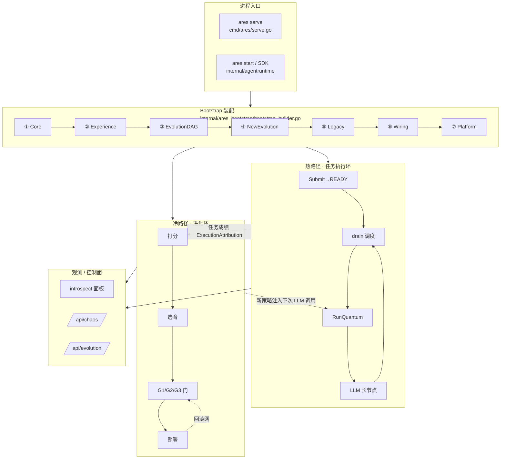

**三条铁律（贯穿全系统）：**

| 铁律 | 含义 | 源码 |
|---|---|---|
| agent 不自调度 | agent 被调度，从不自己决定"下一步做谁" | `cmd/ares/kernel_dispatch.go`（PolicyTaskFabric 默认） |
| 任务比 agent 长寿 | agent 可丢弃，任务持久在 fabric | `internal/aresrecovery/recovery.go` |
| 内核强制 provenance | 归属/租户/来源从 context 取，不信 LLM 参数 | `internal/agentsyscall/syscall.go` |

---

## 2. 入口与启动（serve / Bootstrap）

`ares serve` 的 `runServe` 是启动编排中心，分四段：**读配置 → Bootstrap 装配 →
建 peer kernel → 起 HTTP 与各后台 loop**。

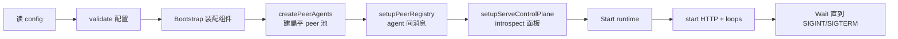

**安全 fail-closed**（`cmd/ares/serve.go:86` `validateServeConfig`）：通配符 bind
（`0.0.0.0` / `::`）若没配 auth/JWT/`introspect.token`，**直接拒绝启动**，而非
"启动后打个日志"。默认绑定 `127.0.0.1`（`serve.go:300` `defaultServeHost`）。

**Bootstrap 7 步装配顺序**（组件有依赖，按顺序搭）：

| 步 | 函数 | 建什么 |
|---|---|---|
| ① | `assembleCore` `bootstrap_builder.go:68` | EventStore / Runtime / Memory / MCP / Skills |
| ② | `assembleExperience` `:162` | LLM(失败切换) / 经验蒸馏 / AKG 闭环 / 观测三件套 |
| ③ | `assembleEvolutionDAG` `:231` | 进化 DAG / KnowledgeRuntime / evidence store |
| ④ | `assembleNewEvolution` `:322` | NewEvolution(Genome+Diff+`UngatedPatcher`) + FlightRecorder |
| ⑤ | `assembleLegacyEvolution` `:362` | legacy Evolution 系统（门控 `Evolution.Enabled`） |
| ⑥ | `wireEvolutionWiring` `:402` | RAG retrievers + DeploymentPipeline + 注册 minimal DAG |
| ⑦ | `wirePlatform` `:477` | GA 进化 ticker + Discovery + SystemRuntime + 过期清理 |

每一步失败都走 `runCleanups()`（逆序清理），避免"装配失败还留一堆活 goroutine"。

---

## 3. 配置面板（config.yaml）

顶层 18 个大项（`internal/ares_config/config.go:53` `Config`）：

```
server / llm / agents / tools / prompts / output / validation /
workflow / storage / memory / knowledge / mcp / evolution /
embedding / discovery / kernel / security / introspect
```

**跟你最常打交道的三段：**

```yaml
agents:                                   # 配哪些 agent + 各自能力
  peers:
    - id: coder
      capabilities: [code, refactor]      # 调度匹配的关键
    - id: reviewer
      capabilities: [review, audit]

kernel:                                   # 调度 + 钱包 + 租约
  max_concurrent: 4
  lease_ttl: 5m
  max_restarts: 5
  agent_budget:                           # ★ agent 钱包
    tokens: 100000                        # 一生最多烧多少 token (0=不限)
    tools: 50                             # 一生最多调多少次工具 (0=不限)
    deadline: 30m                         # 最长活多久 (墙钟, ""=不限)

evolution:                                # GA 开关/种群/安全门/回滚
```

| 配置块 | 结构体 | 源码 |
|---|---|---|
| `kernel` | `KernelConfig` | `config.go:84` |
| `agent_budget`（钱包） | `AgentBudgetConfig` | `config.go:163` |
| `dag_execution` | `DAGExecutionConfig` | `config.go:179` |

**"agent 钱包"（`agent_budget`）三格限额**：`tokens` / `tools` / `deadline`，
全零 = 不限。它是"长任务安全门"——没有它，一个失控 agent 没有成本/寿命上限。

---

## 4. 热路径：单任务执行环

一个任务从提交到完成的完整链路。

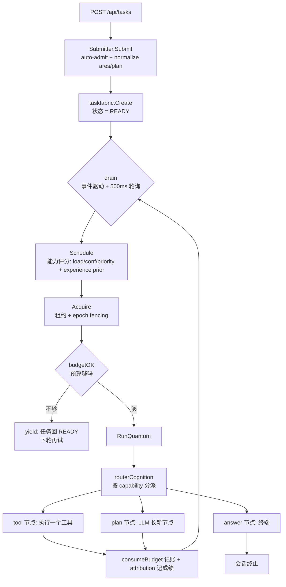

**关键源码：**

| 环节 | 函数 | 文件:行号 |
|---|---|---|
| 提交 | `Submitter.Submit` | `internal/agentruntime/submit.go:151` |
| 队列 drain | `Scheduler.drain` | `internal/kernel/scheduler_dispatch.go:43` |
| 选 + 领 | `drain` 内 Schedule/Acquire | `internal/kernel/scheduler_dispatch.go:43` |
| 执行 | `Scheduler.execute` | `internal/kernel/scheduler_execute.go:52` |
| 量子 | `buildQuantumStep` | `internal/kernel/scheduler_quantum.go:38` |
| 分派 | `routerCognition.ExecuteStep` | `internal/fabric/agent/l2graph.go:388` |

**`routerCognition` 是"分派器"**：一个会话 agent 声明全部能力，
`ExecuteStep` 按 `task.AgentType` 选执行体：

```
tool/<name>  → toolCognition   （执行单个工具）
ares/plan    → plannerCognition （调 LLM，长 tool/plan 节点，不执行工具）
ares/answer  → answerCognition  （终端：pass-through / 合成 / gap body）
ares/root    → rootCognition    （会话准入，零工作量）
```

**拆解"边做边长"**：每个 tool 节点又变成一个新 fabric task 回 drain；
`answer` 节点完成 = 会话结束。

---

## 5. 量子化与资源预算

**量子化的核心不是"记账"，是"断点续跑 / 可打断 / 可让路"（鲁棒性）；
记账（token/工具）只是搭便车喂 GA。**

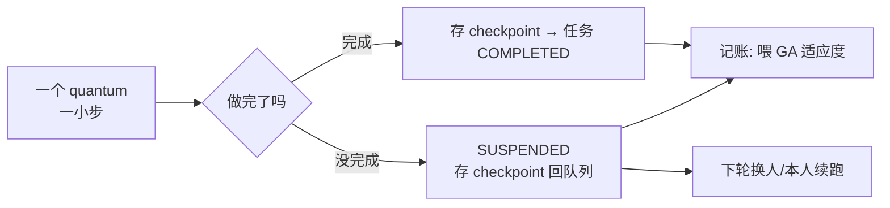

| 概念 | 机制 | 源码 |
|---|---|---|
| 前置门（预算够才做） | `budgetOK` | `internal/kernel/scheduler_governance.go:30` |
| 后置记账 | `consumeBudget` | `internal/kernel/scheduler_governance.go:53` |
| 单 agent 并发=1 | `maxConcurrentPerAgent` | 架构不变量 |
| 拒绝过期持有者 | epoch fencing | 调度器 drain 时校验 |

**agent 钱包** = `kernel.agent_budget`（`config.go:163`）：`tokens`/`tools`/`deadline`
三格，全零不限。syscall spawn 的 agent 也从出生就带这个钱包
（`internal/agentsyscall/syscall.go` `SpawnAgent` 的 `Governance: k.governance`）。

**token 预算的真实语义（0.3.1+）**：`WithMaxTokens` **已经生效**，不是 no-op——
它桥接进同一个 governance 预算（`sdk/sdk.go:441`），`budgetOK` 会拒绝
`tokenUsed` 已达 `TokenBudget` 的 agent 的下一个量子，于是超预算的任务是"让出"
而不是继续烧 token。当硬上限引用前要知道两点：该值是 **L2 peer 的生命周期总量**
（第一个正值生效，后续 agent 不能收紧），执行是**协作式**的——在量子边界停下，
不会打断进行中的 LLM 调用（`sdk/options.go:703-717`）。

---

## 6. 动态图：L2 会话图 ↔ 任务（planprojection）

系统里有"两张图"最容易懵：

| 图 | 是什么 | 特点 |
|---|---|---|
| **L2 会话图**（`L2Graph` / `MutableDAG`） | 一个会话的执行计划，节点=工具实例/plan/answer | 内存、活体、LLM 运行时不断长节点 |
| **任务 fabric** | 真正被调度+执行的任务 | 持久（事件溯源） |

"动态"= **L2 图边长节点，边把节点即时编译成任务**。

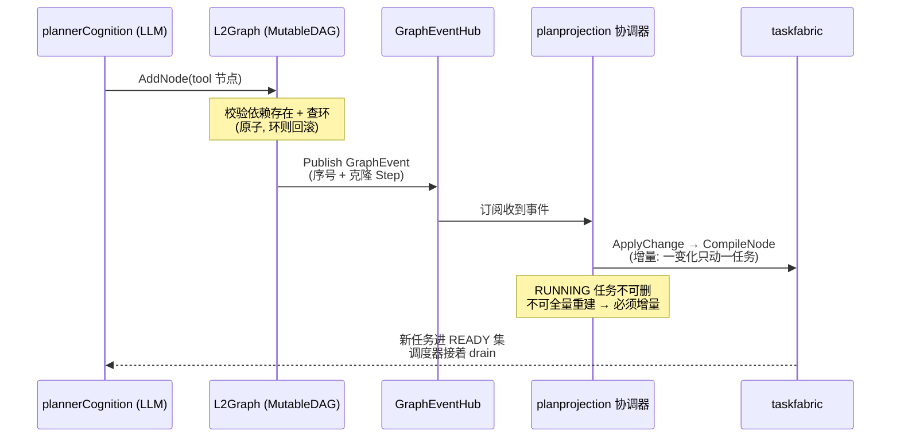

**漏事件怎么兜底**：`SubscribeGraphEvents` 用 **drop counter + DAG version 双信号**
（F-21）触发全量 `Reconcile` 对账。

| 机制 | 函数 | 源码 |
|---|---|---|
| 图加节点（带环检测+回滚） | `MutableDAG.AddNode` | `internal/fabric/task/workflow/engine/mutable_dag.go:77` |
| 原子替换节点 | `ReplaceNode` | `mutable_dag.go:784` |
| 订阅图事件 | `Subscribe` / `SubscribeWithID` | `mutable_dag.go:585` / `:593` |
| 节点→任务映射 | `ProjectStep` | `internal/fabric/planprojection/projection.go:47` |
| 增量编译 | `ApplyChange` | `internal/fabric/planprojection/coordinator.go:314` |
| 全量对账 | `Reconcile` | `coordinator.go:384` |
| 事件订阅循环 | `SubscribeGraphEvents` | `coordinator.go:695` |
| 长工具节点 | `L2Graph.AddToolNode` | `internal/fabric/agent/l2graph.go:280` |

**节点 ID = 任务 ID**：planner 读前驱输出时，用节点 ID 直接去 fabric 查任务
envelope（"join key"）。

---

## 7. L1 工具类图 约束 L2

**L1 ≠ L2**。L1 是"工具能力目录 + 约束"（`enabled` / `budget` / `prior`），
**不编译成任务**；L2 是"会话实际执行计划"。

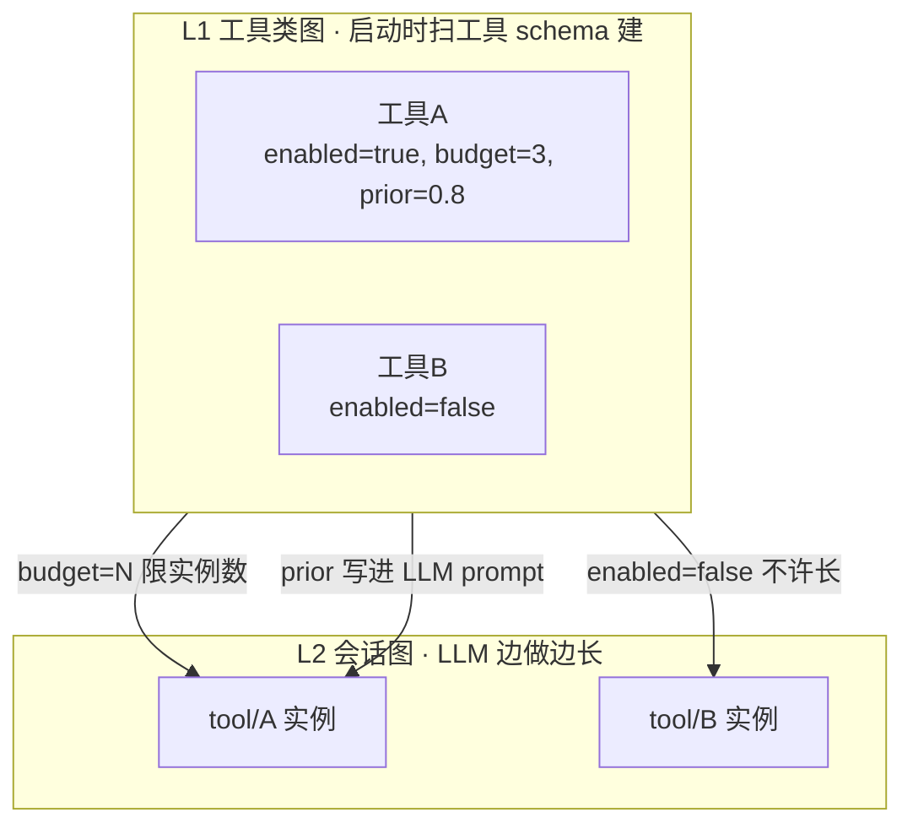

**注入点**（`cmd/ares/serve_peer.go` `injectToolClassDAG`，注释原文：
"L1 graph 不编译进 taskfabric——它是能力目录，不是执行计划（L1 ≠ L2）"）：

- 启动时 `injectToolClassDAG`（`serve_peer.go:511`）扫 `toolBinder.GetToolSchemas()`
  建 L1，喂给进化系统。
- planner 长 tool 节点前查 L1 约束（`internal/fabric/agent/l2graph.go` `CountToolClass`）。

> 注意区分：还有一个 **LiveDAG**（`buildLiveAgentDAG`，`serve_peer.go:536`）=
> "每个 peer agent 一个节点"的**agent 池拓扑**，是给**进化结构补丁**改的对象
> （`UpdateLiveDAG`）。它和 L1 工具类图不是一回事。

---

## 8. agent 扩编（agentsyscall）

LLM 执行 quantum 时，和调 `web_search` 一样，还能调这几个"系统调用"：

| 工具 | 干什么 | 函数 | 源码 |
|---|---|---|---|
| `spawn_agent` | "再养一个队友" | `SpawnAgent` | `internal/agentsyscall/syscall.go:349` |
| `create_task` | "这事拆成子任务" | `CreateTask` | `syscall.go:454` |
| `ask_agent` | "问一下某队友" | `AskAgent` | `syscall.go:614` |
| `create_plan` | 一次长一串 DAG 节点 | `CreatePlan` | `internal/agentsyscall/plan.go` |

**最精妙的一点：provenance 靠 context，不靠 LLM（防伪造）。**

```go
// SpawnAgent 的 parent（谁生的）—— 内核知道"谁在调"，这个才作数
parentID := args.ParentID
if caller := kctx.CallerID(ctx); caller != "" {
    parentID = caller
}
```

- `create_task` 的 `Origin` = `kctx.CallerID(ctx)`（不是 LLM 填的）。
- 租户（`tenant_id`）全从 context 取，LLM 填的一律**覆盖**而非合并。

**"agent 决定做什么，内核决定以谁的名义做、给多少资源。"**

**新 agent vs 静态 agent**：能力等价（同一 LLM+工具），但多几道闸——
必须 L2 能力（`IsL2Capability`）、从出生带钱包（`Governance`）、可选
`ToolAllowlist`、要过 spawn 配额。

---

## 9. 协作：拆解 / 提问 / 交接

**没有"团队协作"概念**（没有 group 消息、没有"开会对齐"）。agent 之间只做
三件事，唯一的协调者是**调度器**。

```mermaid
flowchart TD
    A[大任务给 agent-A] --> A1{agent-A 调 LLM<br/>"太大了，拆"}
    A1 -->|spawn_agent| B[新 agent-C 活体<br/>进调度池]
    A1 -->|create_task| tB[task-B READY]
    A1 -->|create_task| tD[task-D READY]
    B & tB & tD --> drain[调度器 drain 派活]
    drain --> run[各 agent 独立认知执行]
    run --> envelope[结果存 task envelope]
    envelope --> synth[下一轮: 合成最终答案]
```

| 协作方式 | 代码 | 语义 |
|---|---|---|
| **拆解** | `create_task` / `create_plan` | "这事拆给你做"（任务进队列，调度器派） |
| **提问** | `ask_agent` → `Bus.Request` | "我问你一下"（一问就发不等待，破死锁 C-1） |
| **交接** | `Bus.Handoff` | "我办不了，整个任务给你"（点对点，**不走调度器**） |

**提问是 fire-and-forget**：`ask_agent` 立即返回 `{Status: "pending"}`，
quantum 不阻塞（否则 asker 占住调度器 → 目标排不上 → 死锁）。回答在后台送达
（当前只记日志，未回写 asker，标 C-1-a 待做）。相同问题 30s 内去重。

**`grand_loop` E2E 测试**（`internal/fabric/agent/e2e_grand_loop_test.go`）验证：
A 死了 B/C/D 继续，B 质疑 A、C 验证 B——**任务不认人，只认"谁有能力"**。

---

## 10. IPC 消息总线（agentipc）

`Bus` 是**中心化的内存消息中枢**（in-process，非跨进程）。

> **重要纠正**：它借用了 IPC 的**语义**（Send/Request/Reply 这套词），
> **不是 IPC 的机制**——消息在 goroutine 间走（共享内存 + channel），
> 无 socket/无序列化。源码安全边界注释明标"单进程单租户 v1，跨信任域不可用"。

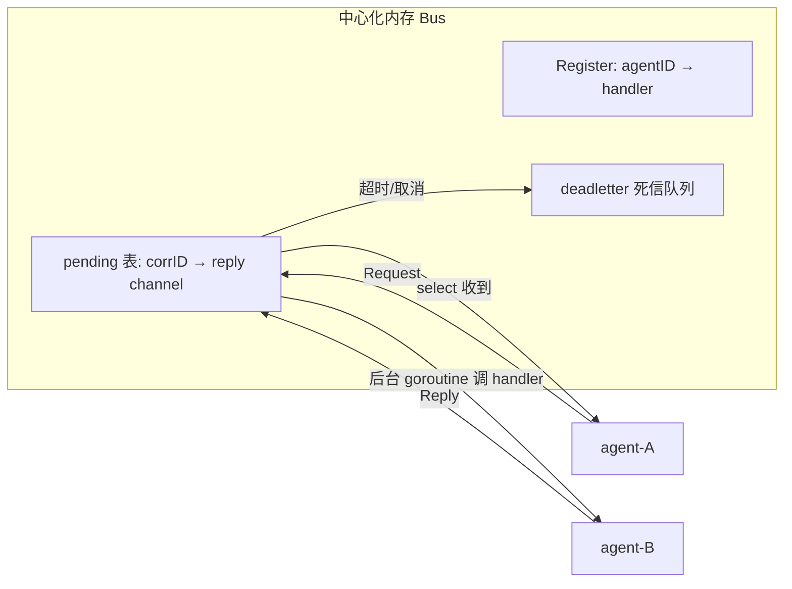

| 原语 | 语义 | 源码 |
|---|---|---|
| `Send` | 发不等回 | `internal/agentipc/primitives.go:57` |
| `Request` | 问 + 等（带 30s 超时） | `primitives.go:146` |
| `Reply` | 异步回信 | `primitives.go` |
| `Delegate` | 转给能办的人 | `primitives.go` |
| `Handoff` | 任务所有权点对点交接 | `primitives.go:454` |
| `Subscribe`/`Broadcast` | 关心 X / 喊所有关心 X 的 | `primitives.go` |
| 消息结构 | `Message` | `internal/agentipc/bus.go:14` |
| 注册/摘除 | `Register`/`Unregister` | `bus.go:131` |

**资源谁掌握谁释放**（分层）：

| 资源层 | 掌握者 | 释放者 |
|---|---|---|
| 消息在途状态（pending/channel/死信） | Bus 自己 | `Request` 的 `defer removePending` |
| agent 生死 | Agent Fabric | agent 被 Kill 时 `Bus.Unregister` |
| token/工具预算 | 调度器 governance | `consumeBudget` |

**Bus 只管消息流转，不掌握/不释放资源**；agent 死了 fabric 先知道，再摘除。

---

## 11. 多 session 并发与资源隔离

**关键认知：session 是任务命名空间，不是资源容器；agent 是全局共享池。**

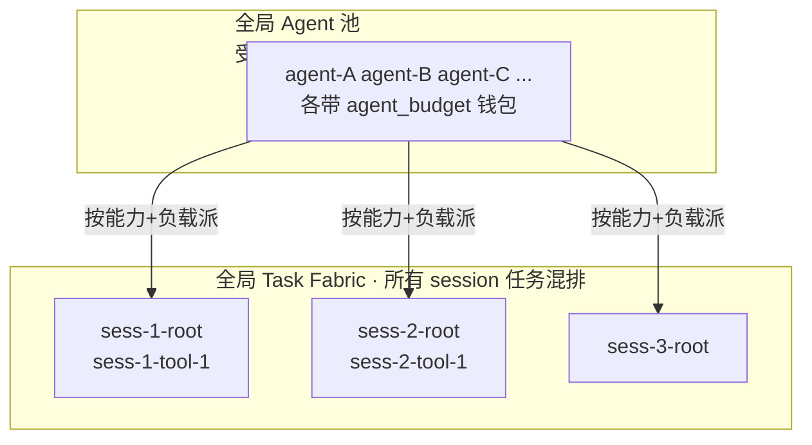

| 隔离层 | 机制 | 源码 |
|---|---|---|
| 同 session 准入序列化 | per-session 锁 `lockAdmission` | `internal/agentruntime/session.go:67` |
| 跨 session 任务无依赖 | 任务 ID 唯一前缀 `sess-N-*`，依赖只在同 session 内 | `session.go` |
| 全局资源约束 | `maxConcurrent` + `agent_budget` + `kernel.resources` | 调度器 |
| 收割保护 | `KeepSet`：活体 session 永不碰 | `session.go:311` |

**session 生命周期**：`Admit`（准入）→ 活体（每个 quantum 刷新 idle）→
`Release`（answer 完成/失败）→ Reaper 收割（`ReaperGrace` 后删 terminal task）。

| 环节 | 函数 | 源码 |
|---|---|---|
| 准入（幂等 + 同 session 序列化） | `Sessions.Admit` | `internal/agentruntime/session.go:105` |
| 收割可删任务 | `Harvest` | `session.go:290` |
| 构建 reaper 保留谓词 | `KeepSet` | `session.go:311` |
| answer 失败释放 | `ReleaseOnAnswerFailure` | `session.go:331` |

**session 与 agent 解耦**：kill agent 不杀 session，任务 lease 过期回 READY，
调度器换人续跑，session 无感。

---

## 12. 恢复（aresrecovery）

**agent 挂 → 任务不死**：租约过期 → 重新入队 → 换 agent 从 checkpoint 续跑。

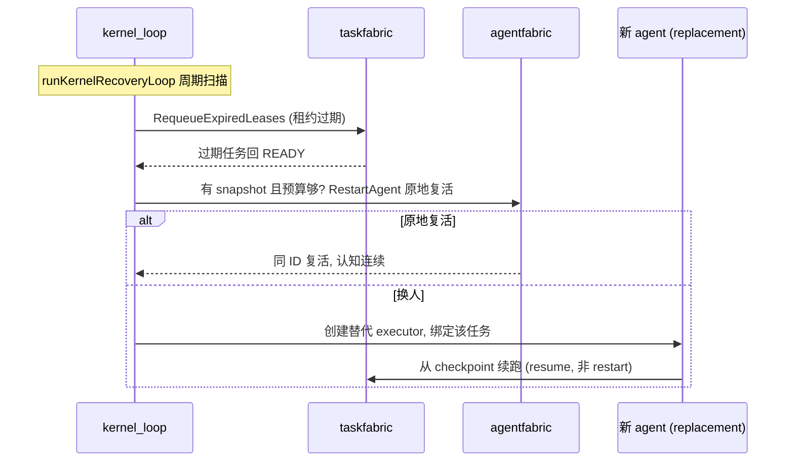

**防风暴**：restart budget（lifetime 累积，成功不回退计数）+ 指数 backoff。

| 环节 | 函数 | 源码 |
|---|---|---|
| 恢复系统 | `Recovery` | `internal/aresrecovery/recovery.go:21` |
| 租约过期扫描 | `RequeueExpiredLeases` | `recovery.go:171` |
| 原地复活 | `RestartAgent`（death snapshot） | `recovery.go:265` |
| 完整恢复链 | `RecoverFromAgentDeath` | `recovery.go:375` |
| 内核恢复循环 | `runKernelRecoveryLoop` | `cmd/ares/kernel_loop.go:275` |

---

## 13. chaos 混沌演练

**chaos 不是恢复机制本身，是"故意把系统搞挂、看 checkpoint+recovery 能不能
救回来"的演练台。** "checkpoint 让你能恢复，chaos 让你敢信它能恢复。"

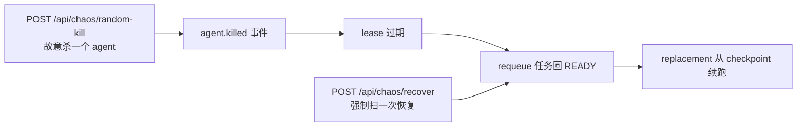

| 端点 | 函数 | 源码 |
|---|---|---|
| 分发 | `handleChaos` | `cmd/ares/agent_routes_chaos.go:27` |
| 随机杀 agent | `chaosKillRandomFabric` | `agent_routes_chaos.go:188` |
| 强制恢复扫描 | `chaosRecoverSweep` | `agent_routes_chaos.go:236` |
| 列活体 agent | `liveFabricAgents` | `agent_routes_chaos.go:249` |

**GA 静默窗**：进化跑到一半（`GenerationActive`）时，chaos 暂停注入，避免
"测到一半的故障把正在做决定的 GA 搞乱"。

---

## 14. 进化（GA 冷路径 + 部署管线）

**"基因"是什么**：`Strategy` 的 `Params`（temperature 等）+ `PromptTemplate`
（提示词模板）。**进化不改代码，只改这两样。**

> **纠正**：`DreamCycle`（`dream_cycle.go:304`）是同一 GA 引擎的轻量壳，
> **生产里关着**（`bootstrap` `EnableDreamCycle=false`）。生产实际驱动的是
> `GenomePopulationAdapter.Run`（`genome_wiring.go:38`），带一整套安全门。

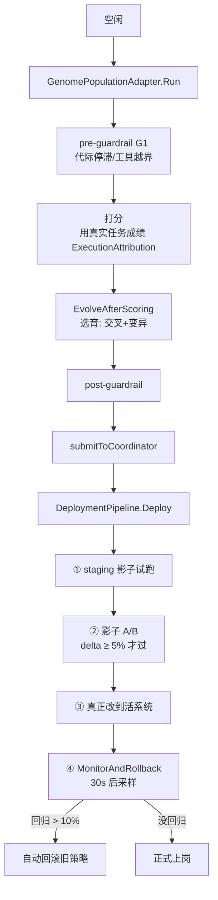

**"进化结果怎么落到活系统"**（部署管线 4 步，`internal/runtime/evolution/deployment/deployment.go`）：

| 步 | 函数 | 源码 |
|---|---|---|
| 部署 | `DeploymentPipeline.Deploy` | `deployment.go:184` |
| 监控回滚 | `MonitorAndRollback` | `deployment.go:313` |
| 补丁结构 | `patch.RuntimePatch` | `internal/runtime/evolution/patch/patch.go:114` |
| 按 Target 找执行器 | `Registry.Register` | `patch.go:399` |
| 接活 DAG | `UpdateLiveDAG` | `internal/ares_bootstrap/provide_new_evolution.go` |

**`RuntimePatch`** 是"通用变异语言"：`Type`（改什么）+ `Target`（改哪）+
`Value`（改成什么）+ `Rollback`（逆操作）。按 Target 分派到
Graph / Planner / Recovery / Knowledge / Memory 各 PatchExecutor。

**对在跑任务的影响：无。** GA 改的是 L1（能力/策略层），不是 L2（会话执行计划）。
正在跑的 session 里已编译成 fabric task 的 tool 节点不会被 L1 patch 重建；
改了 prompt 模板，下一轮新 session / 新 plan 量子才用新模板。
最坏情况"新策略变差" → 30s 后监控发现 → 自动回滚。

**G1/G2/G3 三道安全门**（由松到紧）：

| 门 | 位置 | 挡什么 |
|---|---|---|
| G1 Guardrails | `GenomePopulationAdapter` 前后 | 种群层面：停滞 / 工具白名单越界 |
| G2 Shadow Gate | `DeploymentPipeline` 第②步 | 影子 A/B：delta ≥ 5% 才放行 |
| G3 Eval + Regression | Lifecycle 提交后 | 跑评测/对基准 A/B：显著退步不 promote |

> **这三道门的适用范围——不要读成"所有提升都被验证过"。** G1-G3 约束的是
> **`DeploymentPipeline` / `StrategyLifecycle`** 这条链。**patch 应用路径在生产没有装门**：
> 它按自身 fitness 阈值决策，这正是该类型命名为 `UngatedPatcher` 的原因
> （`internal/runtime/evolution/coordinator/coordinator.go:185`）。把 patch 路径接进门链
> 记为 A1-a；在那之前，一个 patch 可以在从未经过 G1-G3 的情况下落地。

**GA 闭环**：跑得越多 → 成绩数据越多 → 进化越准 → 策略越好 → 跑得越好。

---

## 15. 观测与控制面（introspect）

| 面 | 作用 | 源码 |
|---|---|---|
| 7 页面板 | Overview/Tasks/Agents/Scheduler/Execution/Memory/Events | `internal/introspect` |
| `EvolutionTracer` | 进化轨迹（`/evolution/trajectory`） | `internal/aresrecovery` |
| `FeedbackStore` | 进化反馈（`/evolution/feedback`） | 同上 |
| `GlobalTracer` | 全链路 trace（`/observability/spans`） | 同上 |
| `/api/chaos` | 混沌演练 | `cmd/ares/agent_routes_chaos.go` |
| `/api/evolution` | 进化控制 | `cmd/ares/evolution.go` |

观测组件在 Bootstrap ② `assembleExperience` 建一次、多处共享，
保证面板显示**活数据**而非空列表。

---

## 16. 存储层：Postgres

v0.3.2 的持久化底座。`CREATE TABLE IF NOT EXISTS` + `ALTER ... ADD COLUMN IF NOT EXISTS` 全幂等，
可安全重跑。

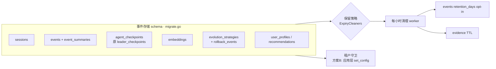

**关键事实（v0.2→0.3 的改名痕迹就藏在这里）：** `leader_checkpoints` 表在迁移里被
`RENAME TO agent_checkpoints`、`leader_id` 列改 `agent_id`、`idx_leader_checkpoints_status`
改 `idx_agent_checkpoints_status`（`internal/storage/postgres/migrate.go:107-123`）。
这就是"Leader 被删除"在存储层的证据。

| 关注点 | 机制 | 源码 |
|---|---|---|
| 事件/会话/checkpoint 表 | `migrate.go` 各 `CREATE TABLE IF NOT EXISTS` | `migrate.go:33/55/132/153` |
| 保留策略（opt-in） | `events_retention_days`，默认**永删** | `bootstrap_builder.go:83-91` |
| 每小时 TTL 清理 | `startExpiryCleanupWorker` + `CleanupExpired` | `bootstrap_builder.go:527` / `maintenance_worker.go:60` |
| 证据行 TTL | 注册进同一 worker，S-10 租户作用域 | `bootstrap_builder.go:303-306` / `bootstrap_steps.go:50-56` |

**租户守卫 = "方案 B"**（要特别记牢）：**刻意不启用 DB 层 RLS**（`migrate_storage.go:47-52` 注释明说
"pre-enforcement 清单"），改用**应用层** `set_config('app.tenant_id', $1, true)` 事务局部绑定
（`pool.go:172-238`）。`true` = 事务作用域，连接归还前必清空（`pool.go:215` 防御性清空残留租户）。
**SQL 注入守卫**：所有标识符过 `validateSQLIdentifier`（`security.go:23-40`，正则 + 长度 + 引号化）。

---

## 17. 知识层：AKG

AKG（Agent Knowledge Graph，BETA）的 `KnowledgeObject` 是统一知识表示，
**三层**：`Raw`（原始字节，留作再蒸馏）→ `Normalized`（清洗后给向量/匹配）→
`Summary`（LLM 友好摘要）。

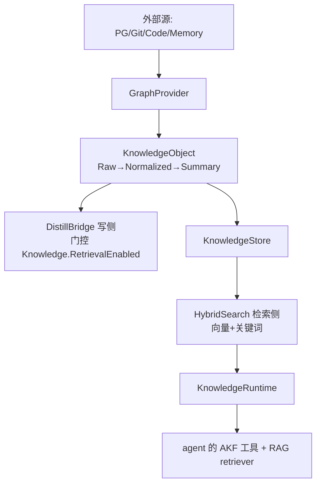

**当前 pipeline 是规则版（无 LLM）**：`DefaultNormalizer`（清洗控制字符）、
`DefaultSummarizer`（取前 200 字符截断）、`defaultPlanner`（`containsAny` 关键词 + 权重）
（`internal/knowledge/pipeline/normalizer.go` / `planner/default.go`）。
装配在 Bootstrap ② `wireAKGLoop`（`bootstrap_builder.go` `assembleExperience`），
**AKG 不可用 → 警告降级，系统照常跑**（BETA 不绑架热路径）。

| 关注点 | 机制 | 源码 |
|---|---|---|
| 统一知识对象（三层） | `KnowledgeObject` | `internal/knowledge/object.go` |
| 写侧蒸馏桥 | `wireAKGLoop` → `AKGBridge` | `internal/ares_bootstrap/bootstrap_builder.go` |
| 读侧共享 | `KnowledgeRuntime` 同时喂 agent 工具 + RAG | `bootstrap_builder.go` `assembleEvolutionDAG` |
| 租户隔离 | **按 `namespace` 隔离，非 tenant 列**（tenant→namespace 映射） | `SECURITY.md:94-99` |

> **与"任务规范化"的衔接**（前文 AKG 提议）：建议把"原任务 + 拆解任务"作为
> `ObjectTask` 的**影子语义账本**（旁路写 + 降级读先验），**不要**提为活任务语义权威，
> 否则 0.3.x "热路径不依赖知识组件"的不变量会被 BETA 的 AKG 拖垮。

---

## 18. 记忆与蒸馏

"越跑越记得住"的机制。分**写侧（蒸馏）**和**读侧（检索注入）**。

```mermaid
flowchart LR
    tc[task.completed 事件] --> sd{ShouldDistill<br/>task≥10 且 result≥20}
    sd -->|通过| llm[LLM 抽取 Problem/Solution/Constraints<br/>带 fenceUntrusted 围栏]
    llm --> store[存 experience 行<br/>+ embedding]
    store --> vec[MemoryRetriever<br/>向量检索 MinScore0.4 TopK5]
    vec --> prompt[注入 prompt context]
    store --> prior[spawn 时注入 ExperiencePrior]
    prior --> next[下个 agent "一出生就带经验"]
```

| 关注点 | 机制 | 源码 |
|---|---|---|
| 蒸馏服务 | `DistillationService` | `internal/runtime/memory/experience/distillation_service.go` |
| 蒸馏门槛 | `ShouldDistill`（成功/失败都可蒸，仅内容长度过滤） | `distillation_service.go` `ShouldDistill` |
| **存储型间接注入防护** | `fenceUntrusted`：任务正文包 `---UNTRUSTED-TASK-DATA---` 围栏，防"存进经验库再 RAG 注入回 prompt"的持久化注入 | `distillation_service.go` `buildExtractionPrompt` |
| 蒸馏装配 | `wireDistillation` + `subscribeDistillationEvents`（订阅 `task.completed`） | `internal/ares_bootstrap/bootstrap_steps.go:26` / `:105` |
| 读侧检索 | `MemoryRetriever`（vector, 默认 `MinScore=0.4`/`TopK=5`） | `internal/runtime/memory/context/memory_retriever.go:65` |
| 调度侧先验 | `ExperiencePrior` 注入 spawn（截断 4096 字） | `internal/fabric/agent/lifecycle.go:49` / `planner_cognition.go:181` |
| 成本/阈值旋钮 | `DistillationThreshold` / `MaxDistilledTasks` / `DistilledTaskTTL` | `internal/runtime/memory/manager.go:102/116/125` |
| 异步向量回填 | `embeddingEnqueuer`（默认同步；配了队列则先落行后异步补向量，不阻塞事件循环） | `distillation_service.go` `WithEmbeddingEnqueuer` |

**token 成本**：蒸馏走 LLM 抽取（30s 超时），是系统里少数"后台烧 token"的地方，
用 `MaxDistilledTasks`（条数上限）+ `DistilledTaskTTL`（过期回收）+ 异步 embedding 三条控制成本。

---

## 19. MCP 集成与工具发现

工具来源有**三条路**，最终都进同一个 `core.Registry`（`toolBinder.GetToolSchemas()` 读它建 L1）：

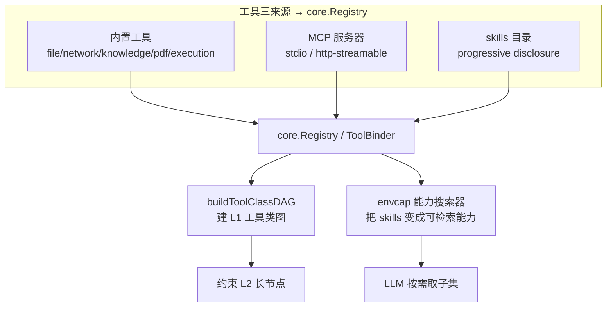

| 关注点 | 机制 | 源码 |
|---|---|---|
| MCP 装配 | `ProvideMCP`（stdio / http 传输） | `internal/ares_bootstrap/provide_mcp.go:57` |
| MCP 管理器 | `MCPManager`（transport_stdio / transport_server） | `internal/runtime/protocol/mcp/` |
| **渐进披露** | 服务保留**全量**工具；每个任务只把**相关子集**喂给 LLM（省 token） | `cmd/ares/serve_wiring.go:215` |
| 能力搜索器 | `registerCapabilitySearch`（envcap）：把 skills 变成可检索的工具能力 | `cmd/ares/agent_routes_tools.go:263` |
| L1 工具类图 | `buildToolClassDAG(toolBinder.GetToolSchemas())` | `cmd/ares/serve_peer.go:515` |

**"工具发现"的特色**：不是把所有工具 schema 一次塞给 LLM（会爆 token），
而是**全量注册、按需取子集**——envcap 搜索器把 skills 目录变成"可被 LLM 检索"的能力，
配合渐进披露，每个任务只暴露相关的工具。这是 0.3.x 区别于"工具全量硬塞"的巧思。

### 19.1 主动服务发现（`internal/discovery` 引擎）

上面讲的是"工具级"的发现。最顶层还有一层**"服务级"的主动发现**——
不等用户在 config 里手写 MCP 服务器，而是**主动扫描机器上已有的配置，自动摸出可用的供应商**。

| 层 | 干什么 | 时机 | 源码 |
|---|---|---|---|
| **① 服务发现** | 主动扫 Claude/Cursor/VSCode/ARES 配置 + PATH 二进制，发现有哪些 MCP 服务器 | 每 5min（默认）+ 自愈循环 | `internal/discovery/engine.go` |
| **② 工具发现** | 连上服务器主动 `ListTools` + `OnChange` 动态增删 | 启动 + 服务端通知 | `internal/runtime/protocol/mcp/client.go:186` |
| **③ 工具选择** | 全量入池，只按需喂 LLM 子集（渐进披露 + envcap） | LLM 调用时 | `cmd/ares/serve_wiring.go:215` |

```mermaid
flowchart TB
    subgraph disc[① 服务发现 · internal/discovery]
        p[Providers 并发扫<br/>Claude/Cursor/VSCode/ARES + PATH 二进制]
        p --> merge[merge → diff<br/>added/updated/removed]
        merge --> store[持久化 ServiceStore]
        merge --> evt[发事件 → EventStore "discovery" stream]
        auto[StartAutoDiscovery<br/>默认每5min + panic自愈退避] --> p
    end
    evt --> mcp[② MCP 连上 → ListTools + OnChange]
    mcp --> reg2[core.Registry]
    reg2 --> sel[③ 渐进披露 + envcap 按需喂 LLM]
```

**关键设计：**

- **主动 ≠ 配了才连**：去扫各 IDE 已有的 `mcp.json`（`providers/filesystem.go`），把机器上散落的 MCP 服务器自动摸出来。
- **手动注册不被误删**（#51）：`Engine.Register` 出的服务是 passive，diff 的 removed 分支保护它。
- **自愈后台循环**：`StartAutoDiscovery` 的 goroutine panic 被 recover + 指数退避重启（`1s/2s/4s...30s cap`）。
- **门控**：`Discovery.Enabled` 默认 **false**（`bootstrap_builder.go:493`），不开就是纯手工配 MCP。

| 关注点 | 函数 | 源码 |
|---|---|---|
| 发现引擎（4 阶段） | `Engine.DiscoverNow` | `internal/discovery/engine.go:50` |
| Provider 接口 | `DiscoveryProvider.Discover` | `internal/discovery/discovery.go:87` |
| 各 IDE 配置扫描 | `NewClaudeProvider`/`NewCursorProvider`/`NewVSCodeProvider`/`NewARESProvider` | `internal/discovery/providers/filesystem.go` |
| 自动发现循环（自愈+退避） | `StartAutoDiscovery` | `internal/discovery/engine.go` |
| 装配 + 事件桥 | `ProvideDiscovery`/`forwardDiscoveryEvent` | `internal/ares_bootstrap/provide_discovery.go:47` |

---

## 20. SDK / CLI 用法

| 入口 | 场景 | 源码 |
|---|---|---|
| `ares serve` | 生产常驻（HTTP + 各后台 loop） | `cmd/ares/serve.go` |
| `ares start` / SDK | 嵌入式（同进程内起 agent，共享 L2 核心） | `sdk/` + `internal/agentruntime` |
| CLI 其他子命令 | `status` / `doctor` / `chaos` / `evolution` | `cmd/ares/main.go`（cobra） |

**两个入口、一套语义**：`serve` 和 SDK 都走 `internal/agentruntime` 的
L2 执行核心（session registry + compile coordinator + planner/router cognition +
task reaper），**入口不同（HTTP vs 进程内），执行语义完全一致**。

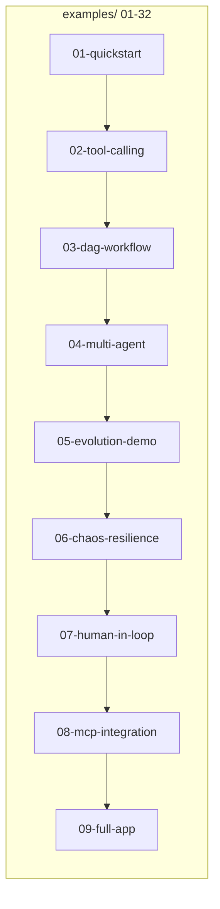

`examples/` 从 01（最小 LLM 接入）到 32（llm-service-direct）覆盖 quickstart /
tool-calling / DAG / multi-agent / evolution / chaos / HITL / MCP / full-app，
是"系统怎么用"的活文档。

---

## 21. 安全模型

**三条信任边界**（`SECURITY.md`）：

| 边界 | 机制 | 源码 |
|---|---|---|
| **SSRF** | `ValidateURL` 拒 private/loopback/link-local/云 metadata（`169.254`）；**每跳重验**防重定向绕过 | `internal/tools/resources/builtin/network/ssrf.go:32` |
| **沙箱** | 代码执行工具走沙箱；MCP stdio 服务器**由操作者自己约束**（文档明说） | `SECURITY.md:61` / `.../execution/code_runner.go` |
| **租户** | 默认**单租户**；`tenant_id` 是**按请求 opt-in 的作用域**；**内核强制**（LLM 填的 tenant 一律被 context 覆盖）；知识侧按 **namespace** 隔离 | `SECURITY.md:69-99` / `agentsyscall` |

**通用 fail-closed 手段（前文提过，收拢在此）：**

| 手段 | 作用 | 源码 |
|---|---|---|
| 通配符 bind 必须带 auth | 无认证就拒启动 | `cmd/ares/serve.go:86` |
| 路径穿越守卫 | `SetAllowedConfigDir` 把 config 读取圈定在目录内 | `internal/ares_config/config.go` |
| 读接口也需权限 | `PermRead` 门控 introspect / config 读 | `agent_routes_task_read.go` |
| SQL 标识符校验 | `validateSQLIdentifier` 防注入 | `internal/storage/postgres/security.go:23` |
| 租户内核强制 | `kctx.CallerID` / `tenantctx` 覆盖 LLM 参数 | `internal/agentsyscall/syscall.go` |

**一条主线**：能 fail-closed 的地方都 fail-closed，能内核强制的地方不信 LLM/模型，
租户/归属/provenance 全部由 context 盖章。

---

## 附：0.2.x → 0.3.x 改动结论

| 维度 | 0.2.x | 0.3.x | 判定 |
|---|---|---|---|
| 编排 | Leader（单点 + 双路径竞态） | 删 Leader，扁平 peer + 内核调度 | ✅ 正向 |
| 任务 | 无持久状态机，ReAct 无 checkpoint | 任务持久化 + 断点续跑 | ✅ 正向 |
| agent | sub 被动执行 | 可丢弃认知，可 spawn | ✅ 正向 |
| 计划 | 隐式一次性 | L2 显式图，边做边长，可恢复 | ✅ 正向 |
| 自愈 | 两套外部心跳 supervisor | 事件驱动统一恢复链 + 原地复活 | ✅ 正向 |
| 进化 | DreamMode（早期） | GA + G1/G2/G3 门 + 回滚网 | ✅ 增强 |
| 代价 | — | 复杂度上升；中心化 owner 语义无等价替代；HITL 生产未接线 | ⚠️ |

> 源码定位说明：本文行号基于 v0.3.2 快照，随 dev 分支演进可能漂移；
> 函数名/文件路径比行号更稳定，定位时以符号为准。
