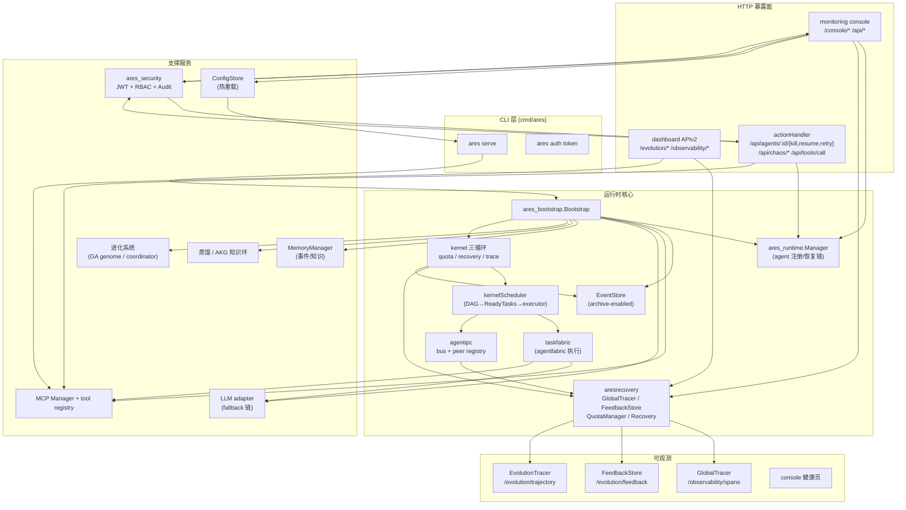
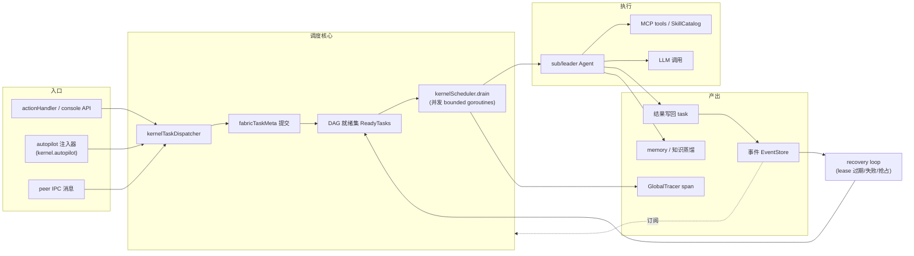
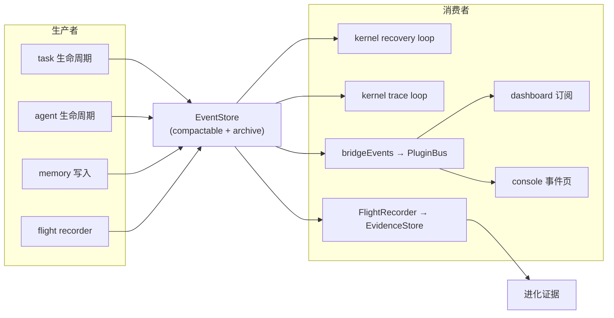
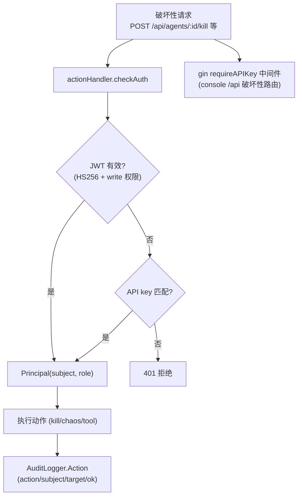
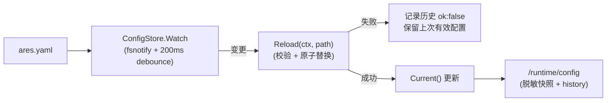

# ARES 运行时架构与数据流（v0.3.0）

> 本文档由 2026-08-19 的代码梳理生成，反映 `ares serve` 的**实际组件拓扑**，
> 与代码一致（非愿景文档）。配套阅读：`ares-runtime.md`（设计）、
> `docs/operator/README.md`（运维）。

---

## 1. 总体架构图

---

## 2. 任务执行主链路（数据流）

---

## 3. 事件流

---

## 4. 认证与审计流

---

## 5. 配置热重载流（P1，快照级）

---

## 6. 组件职责速查

| 组件 | 职责 | 关键依赖 |
|---|---|---|
| `ares_bootstrap` | 装配所有基础设施（EventStore/Runtime/Memory/MCP/LLM/进化/蒸馏） | cfg, EventStore |
| `ares_runtime.Manager` | agent 注册/启动/停止/恢复链（lease/requeue） | EventStore, factories |
| `kernelTaskDispatcher` + `kernelScheduler` | 任务提交 → DAG 就绪 → 并发 drain 执行 | EventStore, fabric |
| `taskfabric` | 任务执行编排（预占/重试/checkpoint） | agentfabric |
| `aresrecovery` | GlobalTracer / FeedbackStore / QuotaManager / recovery | EventStore |
| `agentipc` | peer 消息总线（json+gzip 演进策略） | peer registry |
| `ares_security` | JWT(RBAC) + 模块化审计 | stdlib, gin |
| `ares_config.ConfigStore` | 配置快照 + fsnotify 热重载 | fsnotify |
| `monitoring` | console HTTP（健康/动作/配置/可观测） | plugin, runtime, security |
| `dashboard` | APIv2（evolution/observability WebSocket hub） | MCP, aresrecovery |

---

## 7. 与 AGENTOS 计划的映射

| 计划项 | 对应架构元素 | 状态 |
|---|---|---|
| M1 多 Agent 协作 | **调度器模型（OS 线程语义）**：`kernelScheduler` 共享 ReadyTasks 队列 + capability 感知打分 + 并发 drain；agent 被调度而非编排，**从不自调度**（v0.3.0 移除自调度）。`agentipc` 协作协议（`DelegateToSpecialist`/`Pipeline`/`Orchestrate`）已接入生产 IPC bridge：`wireEvolutionIPC` 按 topic 分发，`delegate-task`/`pipeline-stage`/`orchestrate-worker` 到达目标 agent 时经其 `Execute` 执行并回 reply | ✅ 调度器 + 协作协议均生产已接线 |
| M2 资源调度/隔离 | `EvolutionAwareQuotaManager` + kernel quota loop | ✅（cgroup 暂缓） |
| M3 可解释性/反馈 | `EvolutionTracer` + `FeedbackStore` + dashboard 端点 | ✅ 已接线 |
| M4 全局可观测 | `GlobalTracer` + `/observability/spans` + trace loop | ✅ 已接线 |
| M6 配置热加载 | `ConfigStore` + `/runtime/config` | ✅（快照级） |
| M7 安全/RBAC | `ares_security`（JWT+RBAC+Audit） | ✅ |
| M8 版本化 | `VERSION` + Makefile 注入 | ✅ |
| M10 故障注入 e2e | arena→runtime 恢复链 + `agentos_ci.yml` | ✅（单进程） |
