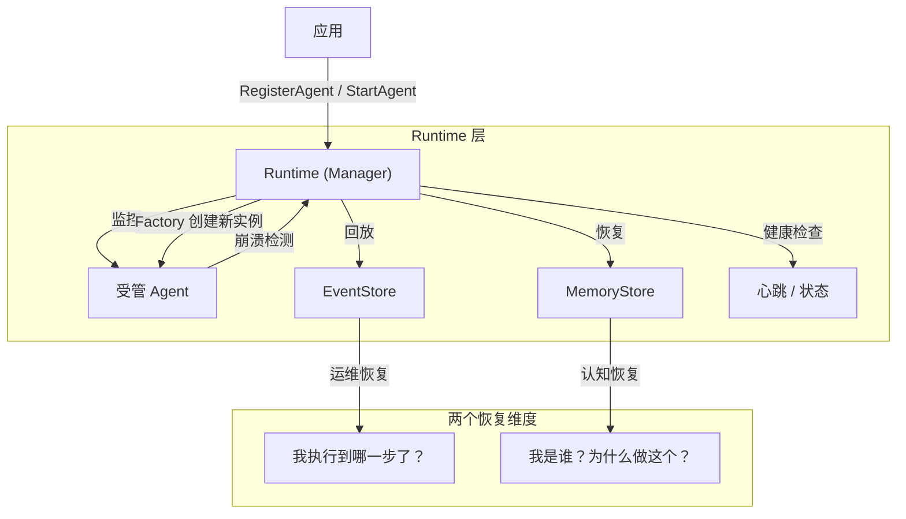
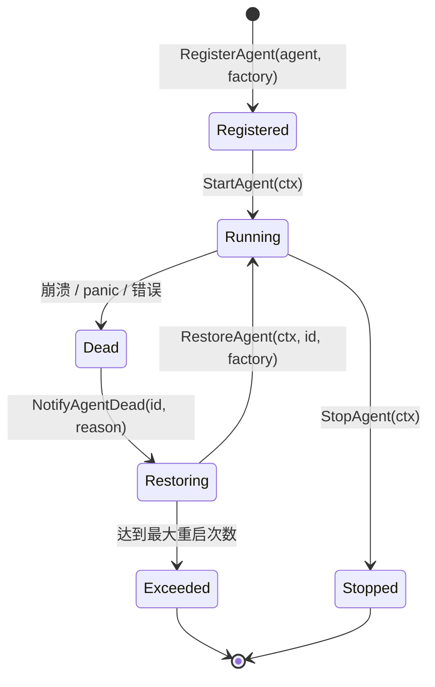
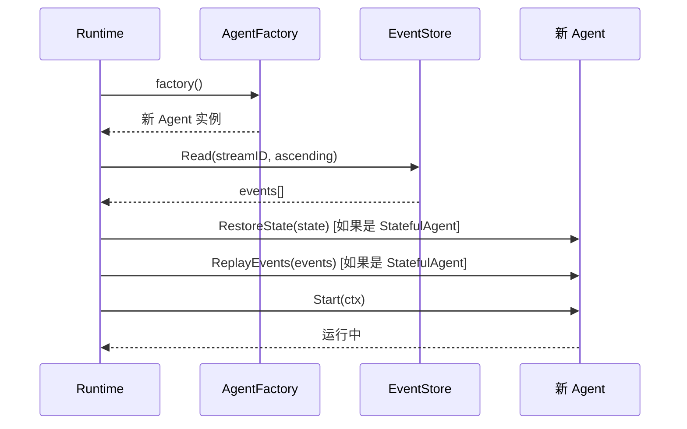

# Runtime 层

**更新日期**: 2026-06-12

## 概述

Runtime 层管理 Agent 生命周期。Agent 是可丢弃的执行器；Runtime 拥有它们的诞生、死亡和复活。当 Agent 崩溃时，Runtime 检测故障，从 Factory 创建新实例，回放持久化的事件，恢复记忆状态，并重启 Agent -- 全程无需人工干预。

此层位于应用和各个 Agent 之间，提供统一的注册、健康监控、优雅关闭和自动恢复控制点。

## 架构



## Runtime 接口

`Runtime` 接口定义了 9 个方法，覆盖完整的 Agent 生命周期管理：

```go
// Runtime manages agent lifecycle. Agents are disposable executors;
// Runtime owns their birth, death, and resurrection.
type Runtime interface {
    // StartAgent launches an agent in a managed goroutine.
    StartAgent(ctx context.Context, agent base.Agent) error

    // StopAgent gracefully stops an agent by ID.
    StopAgent(ctx context.Context, agentID string) error

    // RestartAgent stops and restarts an agent with fresh state.
    RestartAgent(ctx context.Context, agentID string) error

    // RestoreAgent creates a new agent from factory, replays events, and starts it.
    RestoreAgent(ctx context.Context, agentID string, factory AgentFactory) error

    // NotifyAgentDead is called by agents or safety nets when an agent dies.
    // It triggers asynchronous restoration.
    NotifyAgentDead(agentID string, reason string)

    // RegisterAgent registers an agent and its factory for lifecycle management.
    RegisterAgent(agent base.Agent, factory AgentFactory)

    // Start begins the runtime's monitoring loop.
    Start(ctx context.Context) error

    // Stop gracefully shuts down all agents and the runtime.
    Stop() error

    // Stats returns runtime statistics.
    Stats() RuntimeStats
}
```

| 方法 | 用途 |
|------|------|
| `RegisterAgent` | 注册 Agent 及其 Factory，供后续生命周期管理使用。 |
| `StartAgent` | 在受管 goroutine 中启动 Agent，带 panic 恢复。 |
| `StopAgent` | 优雅停止 Agent；标记为有意停止以防止复活。 |
| `RestartAgent` | 停止旧 Agent，从 Factory 创建新实例并启动。 |
| `RestoreAgent` | 完整恢复：Factory -> 回放事件 -> 恢复状态 -> 启动。 |
| `NotifyAgentDead` | Agent 死亡时调用；如果注册了 Factory 则触发异步恢复。 |
| `Start` | 启动 Runtime 监控循环并启动所有已注册的 Agent。 |
| `Stop` | 优雅关闭所有 Agent 并等待 goroutine 完成。 |
| `Stats` | 返回活跃 Agent 数量、总重启次数和运行时长。 |

## Manager 实现

`Manager` 是 `Runtime` 的具体实现。使用 `errgroup` 实现结构化并发，使用 `sync.RWMutex` 保证 Agent 状态的线程安全访问。

### 构造

```go
// New creates a new Manager.
func New(config *Config, eventStore events.EventStore, memManager memory.MemoryManager) *Manager
```

| 参数 | 说明 |
|------|------|
| `config` | Runtime 配置。传 `nil` 使用默认值（`DefaultConfig()`）。 |
| `eventStore` | 用于运维恢复的 EventStore。可为 `nil`。 |
| `memManager` | 用于认知恢复的 MemoryManager。可为 `nil`。 |

### 内部状态

```go
type Manager struct {
    mu            sync.RWMutex
    agents        map[string]*managedAgent   // 活跃 Agent 实例
    factories     map[string]AgentFactory    // 每个 Agent ID 对应的 Factory
    eventStore    events.EventStore          // 运维恢复
    memManager    memory.MemoryManager       // 认知恢复
    g             *errgroup.Group            // 结构化并发
    gctx          context.Context            // group context
    cancel        context.CancelFunc
    config        *Config
    totalRestarts int
    startTime     time.Time
    isStarted     bool
    isStopped     bool
}
```

每个受管 Agent 跟踪其生命周期元数据：

```go
type managedAgent struct {
    agent    base.Agent
    factory  AgentFactory
    cancel   context.CancelFunc
    restarts int
    stopped  bool  // 防止有意停止的 Agent 被复活
}
```

## Agent 生命周期

受管 Agent 的完整生命周期：



### 恢复流程

当 `NotifyAgentDead` 被触发时：

1. 检查 Agent 是否被有意停止（通过 `StopAgent` 或 `RestartAgent`）。如果是，跳过。
2. 检查 Runtime 是否已停止。如果是，跳过。
3. 检查是否注册了 Factory。如果没有，记录警告并跳过。
4. 检查重启次数是否超过 `MaxRestartsPerAgent`。如果超过，记录错误并跳过。
5. 通过 errgroup 异步触发 `RestoreAgent`。

`RestoreAgent` 执行完整的恢复序列：

```go
// RestoreAgent 恢复流程：
//  1. 从 Factory 创建新 Agent 实例。
//  2. 从 EventStore 回放事件，进行运维恢复。
//  3. 如果 Agent 实现了 StatefulAgent，调用 RestoreState。
//  4. 启动新 Agent。
```



## 两个恢复维度

Runtime 支持两个独立的恢复维度，可以单独使用或组合使用。

### 运维恢复（EventStore）

**回答的问题**："我执行到哪一步了？"

EventStore 将每个重要的 Agent 操作持久化为不可变事件。恢复时，按时间顺序回放这些事件以重建 Agent 的运维状态 -- 哪些任务已开始、哪些已完成、哪些已失败。

```go
// replayEvents 从 EventStore 读取给定 Agent 流的所有事件。
func (m *Manager) replayEvents(ctx context.Context, agentID string) []*events.Event {
    streamID := fmt.Sprintf("agent:%s", agentID)
    evts, err := m.eventStore.Read(ctx, streamID, events.ReadOptions{
        Direction: events.ReadAscending,
    })
    // ...
}
```

事件按升序读取，如果 Agent 实现了 `StatefulAgent`，则传递给其 `ReplayEvents` 方法。

### 认知恢复（MemoryStore）

**回答的问题**："我是谁？为什么做这个？"

MemoryStore 保留 Agent 的对话上下文、任务记忆和蒸馏知识。恢复时，这些记忆被还原，使 Agent 能够在完全了解历史的情况下继续工作。

此维度由 `MemoryManager` 接口处理，提供会话级和任务级的记忆持久化。

### 组合恢复

当同时提供 `EventStore` 和 `MemoryManager` 时，Runtime 执行两阶段恢复：

1. **阶段一 -- 运维恢复**：回放事件以恢复 Agent 在工作流中的位置。
2. **阶段二 -- 认知恢复**：恢复记忆，使 Agent 理解上下文和历史。

这确保恢复后的 Agent 既运维正确（正确的步骤）又有认知感知（正确的上下文）。

## 健康监控

Runtime 以 `HealthCheckInterval` 间隔运行后台健康检查循环：

```go
// healthCheck 检查所有 Agent 的存活性。
func (m *Manager) healthCheck() {
    // 对每个非停止的 Agent：
    // 1. 如果 Agent 实现了 Heartbeater，优先使用 Heartbeater.IsAlive()
    // 2. 回退到 Status() 检查（offline/stopping = 死亡）
    // 3. 如果死亡且有 Factory，触发 NotifyAgentDead
}
```

检测策略：
- **心跳**：如果 Agent 实现了 `base.Heartbeater`，Runtime 调用 `IsAlive()`。
- **状态**：回退到 `agent.Status()`，检查 `AgentStatusOffline` 或 `AgentStatusStopping`。
- **Panic 恢复**：每个 Agent goroutine 都有 `defer recover()`，会调用 `NotifyAgentDead`。

## 配置

```go
type Config struct {
    // HealthCheckInterval is the interval between agent liveness checks.
    HealthCheckInterval time.Duration
    // MaxRestartsPerAgent is the maximum number of restarts allowed per agent.
    // A value of 0 means unlimited restarts.
    MaxRestartsPerAgent int
}

func DefaultConfig() *Config {
    return &Config{
        HealthCheckInterval: 10 * time.Second,
        MaxRestartsPerAgent: 10,
    }
}
```

| 字段 | 默认值 | 说明 |
|------|--------|------|
| `HealthCheckInterval` | 10s | Runtime 检查 Agent 存活性的间隔。 |
| `MaxRestartsPerAgent` | 10 | 每个 Agent 的最大重启次数。0 = 无限制。 |

## 集成

### 与 EventStore 集成

将 `events.EventStore` 实现传给 `New()`。Runtime 在恢复时从流 `agent:<agentID>` 读取事件。

```go
rt := runtime.New(config, eventStore, nil)
```

### 与 MemoryManager 集成

将 `memory.MemoryManager` 实现传给 `New()`。实现了 `StatefulAgent` 的 Agent 将被恢复状态。

```go
rt := runtime.New(config, eventStore, memManager)
```

### 与现有 Agent 集成

任何实现了 `base.Agent` 的类型都可以被管理。要支持完整恢复，需实现 `base.StatefulAgent`：

```go
type StatefulAgent interface {
    RestoreState(state map[string]any) error
    ReplayEvents(events []*events.Event) error
    Snapshot() (map[string]any, error)
}
```

### 使用示例

```go
// 创建 Runtime，传入 EventStore 和 MemoryManager。
rt := runtime.New(runtime.DefaultConfig(), eventStore, memManager)

// 注册 Agent 及其 Factory，用于复活。
rt.RegisterAgent(myAgent, func() base.Agent {
    return NewMyAgent(myConfig)
})

// 启动 Runtime（启动所有已注册的 Agent）。
if err := rt.Start(ctx); err != nil {
    log.Fatal(err)
}

// 优雅关闭。
defer rt.Stop()

// 查看统计信息。
stats := rt.Stats()
fmt.Printf("Active: %d, Restarts: %d, Uptime: %v\n",
    stats.ActiveAgents, stats.TotalRestarts, stats.Uptime)
```

## 哨兵错误

| 错误 | 条件 |
|------|------|
| `ErrAgentNotFound` | 请求的 Agent 未注册。 |
| `ErrAgentAlreadyRegistered` | 相同 ID 的 Agent 已在运行。 |
| `ErrRuntimeStopped` | Runtime 已停止。 |
| `ErrMaxRestartsExceeded` | Agent 超过最大重启限制。 |
| `ErrNilAgent` | 传给 StartAgent 的 Agent 为 nil。 |
| `ErrNilFactory` | 传给 RestoreAgent 的 Factory 为 nil。 |

## 相关文档

- [v2 架构](./v2-architecture.md)
- [事件溯源](../features/event-sourcing.md)
- [Agent 复活](../features/resurrection.md)
- [Agent 定义](../components/agents-definition.md)
