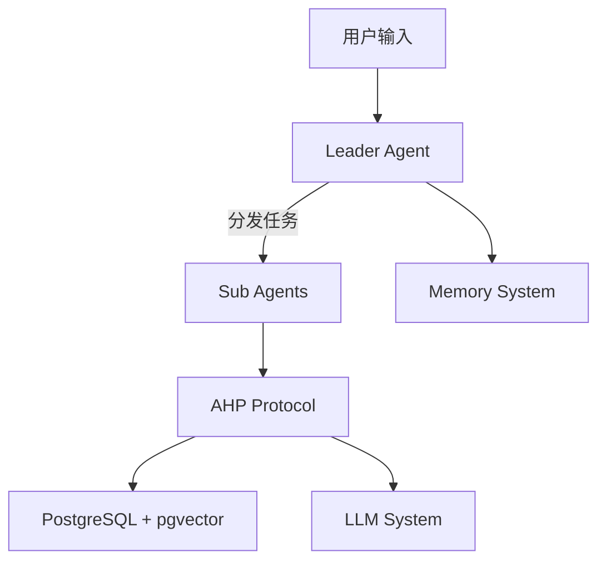
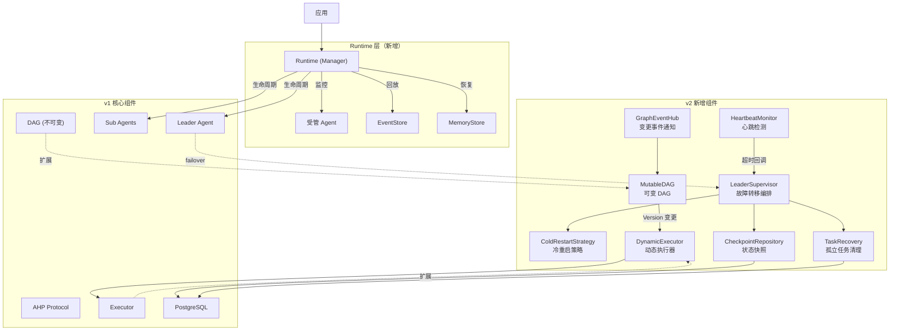
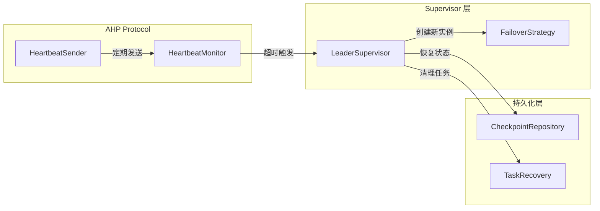
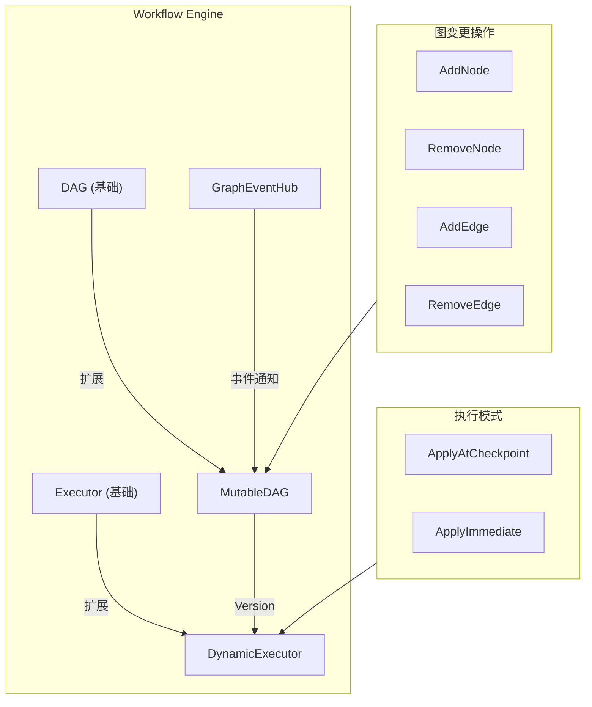
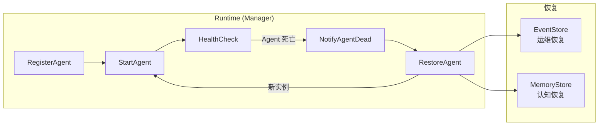
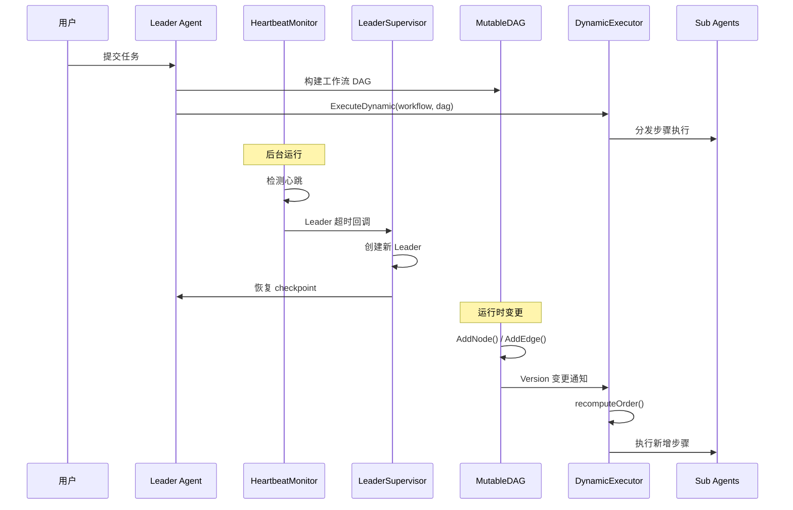

# ARES v2 架构设计

**更新日期**: 2026-06-10

## 概述

v2 在 v1 基础上新增两个核心能力：

1. **Leader Failover** - Leader 故障自动检测与恢复
2. **Runtime Dynamic Graph** - 运行时动态修改工作流 DAG

这两个能力增强了系统的可靠性和灵活性。

## v1 架构回顾

v1 的局限：
- Leader 崩溃 = 会话丢失
- DAG 构建后不可变
- 无自动故障恢复

## v2 架构扩展

## Leader Failover 在架构中的位置

Leader Failover 在 AHP Protocol 层和 Leader Agent 之间插入监控和恢复机制：

数据流：
1. `HeartbeatSender` 定期通过 AHP 消息队列发送心跳
2. `HeartbeatMonitor` 检测超时，触发回调
3. `LeaderSupervisor` 编排故障转移：停止旧实例 → 恢复 checkpoint → 创建新实例 → 清理孤立任务
4. `CheckpointRepository` 和 `TaskRecovery` 通过 PostgreSQL 持久化状态

## Dynamic Graph 在架构中的位置

Dynamic Graph 扩展了 Workflow Engine 层：

数据流：
1. 外部通过 `MutableDAG` 的方法修改图结构
2. 每次变更递增 `version` 并通过 `GraphEventHub` 发布事件
3. `DynamicExecutor` 在执行期间检测版本变更
4. 根据 `ApplyMode` 在检查点或立即重算执行顺序
5. 新增步骤自动追加到执行队列

## Runtime 层

Runtime 层管理 Agent 生命周期。Agent 是可丢弃的执行器；Runtime 拥有它们的诞生、死亡和复活。

核心行为：
- **注册**：Agent 通过 Factory 函数注册，用于复活
- **健康监控**：后台循环通过心跳或状态检查 Agent 存活性
- **自动恢复**：崩溃时，Runtime 创建新实例、回放事件、恢复记忆并重启
- **两个恢复维度**：EventStore 用于运维状态（"执行到哪一步？"），MemoryStore 用于认知状态（"我是谁？"）
- **优雅关闭**：Stop 取消所有 Agent 并等待 goroutine 完成

详见 [Runtime 层详解](./runtime.md)。

## 组件交互

## v1 → v2 迁移

v2 完全向后兼容 v1。新增组件均为可选：

| v1 组件 | v2 扩展 | 是否必须 |
|---------|---------|---------|
| Leader Agent | + LeaderSupervisor | 可选 |
| DAG | MutableDAG | 可选 |
| Executor | DynamicExecutor | 可选 |
| AHP Protocol | + HeartbeatMonitor | 可选 |
| （无） | Runtime (Manager) | 可选 |

最小迁移步骤：
1. 引入 `HeartbeatMonitor` 和 `LeaderSupervisor` 获得故障转移能力
2. 将 `DAG` 替换为 `MutableDAG` 获得动态图能力
3. 将 `Executor` 替换为 `DynamicExecutor` 获得运行时重排能力
4. 使用 `Runtime` 包装 Agent，获得生命周期管理和自动恢复能力

## 相关文档

- [Runtime 层详解](./runtime.md)
- [Leader Failover 详解](../features/leader-failover.md)
- [Runtime Dynamic Graph 详解](../features/dynamic-graph.md)
- [v1 架构设计](./arch.md)
