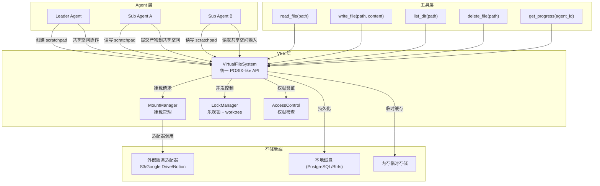
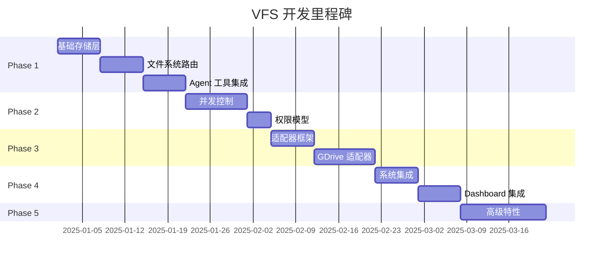

# GoAgent 虚拟文件系统开发计划
**基于《AI Agents in Depth》第 10 章理论框架**

---

## 一、项目背景

### 现状差距

| 维度 | 本书要求 | GoAgent 现状 |
|------|---------|-------------|
| Agent 专属工作区 | 每个 Agent 独立 scratchpad | ❌ 缺失 |
| 多 Agent 共享空间 | 协作区域，用户可见，需持久化 | ❌ 缺失 |
| 外部资源挂载 | Google Drive/Notion 等适配器 | ❌ 缺失（仅内存队列） |
| 系统内置资源 | Skills/模板/参考手册 | ⚠️ 部分实现（skills 目录但无统一挂载点） |
| 并发控制 | 乐观锁/worktree 隔离 | ❌ 缺失 |
| 权限模型 | 私有/共享/只读分区 | ❌ 缺失 |

### 核心价值

1. **大产物交换** — 子 Agent 生成数千行代码/文档时，无需将内容塞进 `Payload map[string]any`
2. **持久化中间态** — 执行轨迹、临时草稿可跨会话保留
3. **隔离与协作平衡** — 每个 Agent 有独立工作区，通过共享空间有序交换
4. **文件系统即通用接口** — 路径字符串轻量传递，避免上下文窗口膨胀

---

## 二、总体架构设计

### 2.1 四层目录树结构

```
/workspace
├── /scratch/{agent_id}/       # 一、Agent 专属工作区（私有读写）
│   ├── draft/                 #     草稿、临时文件
│   ├── logs/                  #     调试日志
│   └── cache/                 #     运行时缓存
│
├── /shared/                   # 二、多 Agent 共享空间（协作读写，需并发控制）
│   ├── input/                 #     用户上传的原始文件
│   ├── output/                #     最终交付物
│   ├── artifacts/             #     中间产物（如术语表、数据文件）
│   └── progress/              #     各 Agent 进度文件（progress.md）
│
├── /mounted/                  # 三、外部挂载资源（只读/有限写）
│   ├── gdrive/                #     Google Drive 适配器
│   ├── notion/                #     Notion 适配器
│   └── dropbox/               #     Dropbox 适配器
│
└── /skills/                   # 四、系统内置资源（全局只读共享）
    ├── reference/             #     参考手册
    ├── templates/             #     模板库
    └── tools/                 #     共享工具定义
```

### 2.2 核心组件关系图



### 2.3 关键接口设计

```go
// internal/vfs/types.go

// FileSystem 是虚拟文件系统的统一接口
type FileSystem interface {
    // 基本操作
    Read(ctx context.Context, path string) ([]byte, error)
    Write(ctx context.Context, path string, data []byte, mode FileMode) error
    List(ctx context.Context, path string) ([]FileInfo, error)
    Delete(ctx context.Context, path string) error
    Mkdir(ctx context.Context, path string, perm os.FileMode) error
    
    // 元数据
    Stat(ctx context.Context, path string) (*FileInfo, error)
    Glob(ctx context.Context, pattern string) ([]string, error)
    
    // 并发控制
    AcquireLock(ctx context.Context, path string, ttl time.Duration) (Locker, error)
    
    // 挂载管理
    Mount(ctx context.Context, point string, backend StorageBackend) error
    Unmount(ctx context.Context, point string) error
}

// StorageBackend 是不同存储后端的统一抽象
type StorageBackend interface {
    Type() StorageType
    Read(path string) ([]byte, error)
    Write(path string, data []byte) error
    List(path string) ([]string, error)
    Delete(path string) error
}

type StorageType int
const (
    LocalDisk StorageType = iota
    ObjectStorage  // S3/GCS
    ExternalAPI    // Google Drive/Notion adapter
    InMemory
)
```

---

## 三、分阶段实施计划

### Phase 1：基础文件系统（预计 2-3 周）

**目标**：实现最基本的读写能力和四层目录结构

#### 1.1 核心存储层

**任务清单**：
- [ ] 设计 `StorageBackend` 接口和四种后端实现
- [ ] 实现本地磁盘后端（基于 PostgreSQL blob 或文件系统）
- [ ] 实现内存后端（用于测试和临时文件）
- [ ] 设计文件元数据结构（大小、权限、创建时间、所有者）

**产出物**：
- `internal/vfs/storage/` 包
- 单元测试覆盖率达到 80%

#### 1.2 文件系统路由

**任务清单**：
- [ ] 实现路径解析和权限检查中间件
- [ ] 实现 `/scratch/{agent_id}/` 路由（自动创建）
- [ ] 实现 `/shared/` 路由（带并发控制预留接口）
- [ ] 实现 `/skills/` 路由（只读挂载）

**产出物**：
- `internal/vfs/virtual_fs.go`
- `internal/vfs/middleware/` 包

#### 1.3 Agent 工具集成

**任务清单**：
- [ ] 在 `sub/tools.go` 中集成 `read_file`, `write_file`, `list_dir` 工具
- [ ] 在 `leader/aggregator.go` 中增加从共享空间读取产物的逻辑
- [ ] 更新 Dispatcher 支持传递文件路径而非全量内容

**产出物**：
- `internal/agents/sub/tools_vfs.go`
- `internal/agents/leader/dispatcher_vfs.go`

---

### Phase 2：并发控制与权限（预计 2 周）

**目标**：实现书中要求的"乐观锁 + worktree 隔离"

#### 2.1 共享空间并发控制

**任务清单**：
- [ ] 实现基于文件的乐观锁（类似 Git）
- [ ] 实现版本号检测，冲突时返回错误或自动合并
- [ ] 实现进度文件轮询机制（progress.md 最后修改时间检测卡住）

**产出物**：
- `internal/vfs/locker/` 包
- 并发压力测试用例

#### 2.2 权限模型

**任务清单**：
- [ ] 定义四种访问模式：Private / Shared / ReadOnly / System
- [ ] 实现 ACL（访问控制列表）检查中间件
- [ ] 实现 Agent 身份绑定（每个 Agent 只能访问自己的 scratchpad）

**产出物**：
- `internal/vfs/access/` 包
- 权限测试矩阵

---

### Phase 3：外部挂载适配器（预计 3 周）

**目标**：实现书的"外部挂载资源"层

#### 3.1 适配器框架

**任务清单**：
- [ ] 设计 `ExternalAdapter` 接口（OAuth 认证、限流处理）
- [ ] 实现适配器注册表和动态加载机制

**产出物**：
- `internal/vfs/adapters/` 包
- 适配器工厂 `NewAdapter(name string) (ExternalAdapter, error)`

#### 3.2 Google Drive 适配器

**任务清单**：
- [ ] OAuth2 流程集成
- [ ] 文件夹映射为目录树
- [ ] 文件同步策略（只读 vs 可写）

**产出物**：
- `internal/vfs/adapters/gdrive/`
- 集成测试（使用沙箱账号）

#### 3.3 Notion/Dropbox 适配器（可选）

**任务清单**：
- [ ] Notion API 集成（block 结构映射为文件）
- [ ] Dropbox API 集成
- [ ] 统一的挂载点映射规则

**产出物**：
- `internal/vfs/adapters/notion/`
- `internal/vfs/adapters/dropbox/`

---

### Phase 4：与现有系统集成（预计 2 周）

**目标**：让 VFS 融入 GoAgent 现有架构

#### 4.1 与消息队列的协同

**问题**：TaskMessage.Payload 仍适合小型结构化数据，VFS 适合大产物
**方案**：Dispatcher 自动判断，超过阈值（如 10KB）则写入 VFS，仅传递路径

**任务清单**：
- [ ] 修改 `dispatcher.go` 中的 `executeTask()`
- [ ] 检测 task.Payload 大小，超阈值写入共享空间
- [ ] Sub-Agent 执行后自动将大结果写入 scratchpad，只返回路径摘要

**产出物**：
- `internal/agents/leader/dispatcher_vfs_integration.go`
- 性能对比测试报告

#### 4.2 与记忆系统的协同

**问题**：轨迹持久化和 VFS 文件的关系
**方案**：子 Agent 的完整轨迹日志写入其 scratchpad，主 Agent 可通过 VFS 读取

**任务清单**：
- [ ] 修改 `sub/executor.go` 在完成任务时将轨迹追加到 `{agent_id}/logs/trajectory.jsonl`
- [ ] Leader 提供 `read_agent_logs(agent_id)` 工具用于调试
- [ ] Progress 文件写入 `/shared/progress/{task_id}.md`

**产出物**：
- `internal/agents/sub/executor_vfs.go`
- 调试工具 `read_agent_logs`

#### 4.3 Dashboard 可视化

**任务清单**：
- [ ] Dashboard 新增"文件浏览器"面板
- [ ] 展示每个 Agent 的 scratchpad 内容
- [ ] 展示共享空间的协作状态

**产出物**：
- Dashboard UI 更新
- WebSocket 推送文件变更事件

---

### Phase 5：高级特性（预计 2 周，可选）

#### 5.1 快照与恢复
- [ ] 实现目录级快照（类似 git commit）
- [ ] 支持从快照恢复到某个时间点

#### 5.2 差分与合并
- [ ] 实现文件内容 diff
- [ ] 冲突时的三路合并算法

#### 5.3 监控与告警
- [ ] 检测 Agent 长时间不更新 progress.md
- [ ] 异常写入行为检测（如删除他人文件）

---

## 四、关键技术决策

### 4.1 存储选型

| 选项 | 优点 | 缺点 | 推荐 |
|------|------|------|------|
| PostgreSQL BLOB | 与现有 DB 统一，事务保证 | 大文件性能差 | ❌ |
| 本地文件系统 + PostgreSQL 元数据 | 性能好，灵活 | 部署复杂 | ⚠️ 中期考虑 |
| SQLite + FUSE | 零依赖，单文件 | 并发限制 | ❌ |
| **PostgreSQL + S3/对象存储** | 可扩展，云原生 | 需要额外服务 | ✅ **Phase 1 起点** |

**建议**：Phase 1 先实现内存后端 + PostgreSQL BLOB 作为本地备选，Phase 3 引入 S3 适配。

### 4.2 并发控制策略

借鉴文件系统经典方案：
- **乐观锁**：写入时检查版本号，冲突则重试（类似 Git）
- **工作副本**：每个 Agent 在 scratchpad 有独立副本，提交时才合并
- **租约锁**：持有锁的 Agent 必须定期续期，防止死锁

### 4.3 权限模型

采用 **RBAC + ACL** 混合模型：
- 所有 Agent 默认拥有自己 scratchpad 的完全权限
- 共享空间使用 ACL 控制读写
- 系统内置资源只读，不可修改

---

## 五、风险与缓解

| 风险 | 影响 | 缓解措施 |
|------|------|---------|
| 大文件传输导致 LLM 上下文爆炸 | 高 | VFS 只传路径，内容由工具按需读取 |
| 并发写冲突导致数据丢失 | 中 | 乐观锁 + 自动重试 + 人工介入选项 |
| 外部适配器 OAuth 流程复杂 | 中 | Phase 3 只做 Google Drive 一个作为 MVP |
| 存储后端切换困难 | 低 | StorageBackend 接口抽象良好 |
| Dashboard 文件浏览性能 | 低 | 分页加载 + 懒加载 |

---

## 六、验收标准

### Phase 1 验收
- [ ] 子 Agent 能将产物写入 `/shared/output/` 并返回路径
- [ ] Leader 能通过路径读取子 Agent 产物
- [ ] 单个 Agent 的 scratchpad 与其他 Agent 隔离
- [ ] 单元测试覆盖率 ≥ 80%

### Phase 2 验收
- [ ] 两个 Agent 同时写同一文件，冲突可检测并处理
- [ ] Agent A 无法读取 Agent B 的 scratchpad
- [ ] progress.md 超时检测正常工作

### Phase 3 验收
- [ ] Google Drive 文件夹可挂载为 `/mounted/gdrive/`
- [ ] Agent 能读取挂载的 Google Drive 文件

### 整体验收
- [ ] 端到端演示：用户提交需求 → Leader 分发 → Sub-Agent 写文件 → Leader 聚合结果
- [ ] 与纯 Payload 方式相比，大产物场景 token 消耗降低 ≥ 50%
- [ ] 文档完整（API 文档 + 用户使用指南）

---

## 七、里程碑



---

## 八、参考资料

1. 《AI Agents in Depth》第 10 章 - 多 Agent 协作
2. Mirage - Strukto AI Virtual Filesystem: https://github.com/strukto-ai/mirage
3. AgentFS - Turso: https://turso.tech/blog/agentfs
4. "Everything is Context. A Virtual File System (VFS) unifies AI…" - Medium
5. STORM - Multi-Agent Collaboration with State Management: https://arxiv.org/abs/2605.20563

---

**维护者**：GoAgent Core Team  
**最后更新**：2025-01-XX  
**状态**：📝 规划阶段
