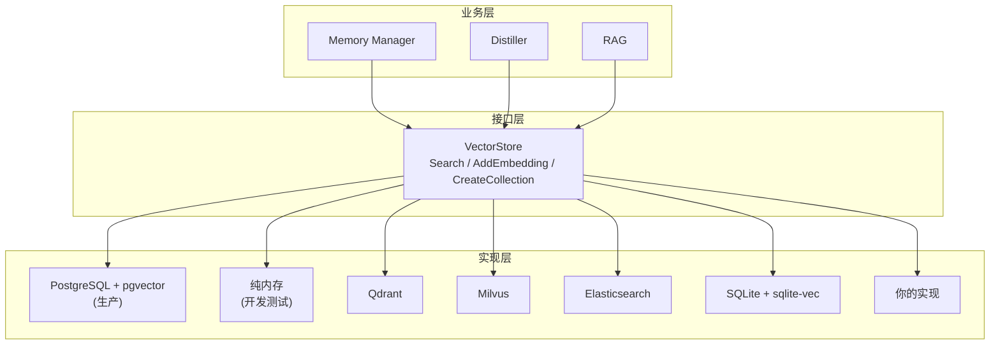

# 自定义向量存储

GoAgent 支持可插拔的向量存储后端。只需实现一个接口，就能替换成任何向量数据库。

## 接口定义

```go
// internal/storage/vector.go
type VectorStore interface {
    Search(ctx context.Context, table string, embedding []float64, limit int) ([]*SearchResult, error)
    AddEmbedding(ctx context.Context, table, id string, embedding []float64, metadata map[string]any) error
    CreateCollection(ctx context.Context, name string, dimension int) error
}

type SearchResult struct {
    ID       string         `json:"id"`
    Score    float64        `json:"score"`
    Metadata map[string]any `json:"metadata,omitempty"`
}
```

三个方法，就这么简单。

## 内置实现

| 后端 | 包路径 | 适用场景 |
|------|--------|---------|
| PostgreSQL + pgvector | `internal/storage/postgres` | 生产环境，完整 SQL 支持 |
| 纯内存 | `internal/storage/memory` | 开发、测试、原型验证 |

## 如何添加自定义实现

### 第一步：实现接口

```go
package myqdrant

import (
    "context"
    "goagent/internal/storage"
)

type VectorStore struct {
    host   string
    port   int
    client *http.Client
}

func New(host string, port int) *VectorStore {
    return &VectorStore{host: host, port: port, client: &http.Client{}}
}

func (v *VectorStore) Search(ctx context.Context, table string, embedding []float64, limit int) ([]*storage.SearchResult, error) {
    // 调用你的向量数据库 API
    // 返回按相似度排序的结果（最高分在前）
}

func (v *VectorStore) AddEmbedding(ctx context.Context, table, id string, embedding []float64, metadata map[string]any) error {
    // 存储向量到你的数据库
}

func (v *VectorStore) CreateCollection(ctx context.Context, name string, dimension int) error {
    // 在你的数据库中创建集合/表
}
```

### 第二步：替换

```go
// 方式 A：替换现有 repository 的 Vector 字段
repo := postgres.NewRepository(pool)
repo.Vector = myqdrant.New("localhost", 6333)

// 方式 B：开发测试用内存实现
memStore := memory.NewVectorStore()
repo.Vector = memStore
```

`Repository.Vector` 字段类型为 `storage.VectorStore`，任何实现都可以直接使用，无需修改其他代码。

### 第三步：配置驱动（推荐）

```yaml
# config.yaml
storage:
  vector_backend: "qdrant"  # 可选: postgres, memory, qdrant, milvus, es
  vector:
    host: "localhost"
    port: 6333
```

```go
switch cfg.Storage.VectorBackend {
case "postgres":
    repo := postgres.NewRepository(pool)
case "qdrant":
    repo.Vector = myqdrant.New(cfg.Storage.Vector.Host, cfg.Storage.Vector.Port)
case "memory":
    repo.Vector = memory.NewVectorStore()
}
```

## 各后端实现示例

### Qdrant

```go
func (v *QdrantStore) Search(ctx context.Context, table string, embedding []float64, limit int) ([]*storage.SearchResult, error) {
    body := map[string]any{"vector": embedding, "limit": limit}
    resp, err := v.post(ctx, "/collections/"+table+"/points/search", body)
    // 解析返回结果为 []*storage.SearchResult
}
```

### Milvus

```go
func (v *MilvusStore) Search(ctx context.Context, collection string, embedding []float64, limit int) ([]*storage.SearchResult, error) {
    // 使用 Milvus Go SDK
    results, err := v.client.Search(ctx, collection, embedding, limit)
    // 转换为 []*storage.SearchResult
}
```

### Elasticsearch

```go
func (v *ESStore) Search(ctx context.Context, index string, embedding []float64, limit int) ([]*storage.SearchResult, error) {
    query := map[string]any{
        "knn": map[string]any{
            "field":        "embedding",
            "query_vector": embedding,
            "k":            limit,
        },
    }
    // 执行搜索并解析结果
}
```

### SQLite + sqlite-vec

```go
func (v *SQLiteStore) Search(ctx context.Context, table string, embedding []float64, limit int) ([]*storage.SearchResult, error) {
    query := `SELECT id, vec_distance_cosine(embedding, ?) as score, metadata
              FROM ` + table + ` ORDER BY score LIMIT ?`
    // 执行查询并解析结果
}
```

## SQL 语法差异

每个后端写自己的 SQL，业务层完全不感知。

| 功能 | PostgreSQL | SQLite |
|------|-----------|--------|
| 向量类型 | `VECTOR(N)` | `vec_float(N)` (sqlite-vec) |
| 距离计算 | `embedding <=> $1` | `vec_distance_cosine(embedding, ?)` |
| 索引 | `ivfflat` / `hnsw` | sqlite-vec 内置 |
| JSON | `JSONB` | `TEXT` + `json_extract()` |
| 全文搜索 | `TSVECTOR` + `ts_rank` | `FTS5` |
| 租户隔离 | `RLS` + `SET LOCAL` | `WHERE tenant_id = ?` |
| 队列锁 | `FOR UPDATE SKIP LOCKED` | 应用层 mutex |

## 架构图



业务层只依赖 `VectorStore` 接口。每个实现自己处理 SQL/API 语法。零耦合。
