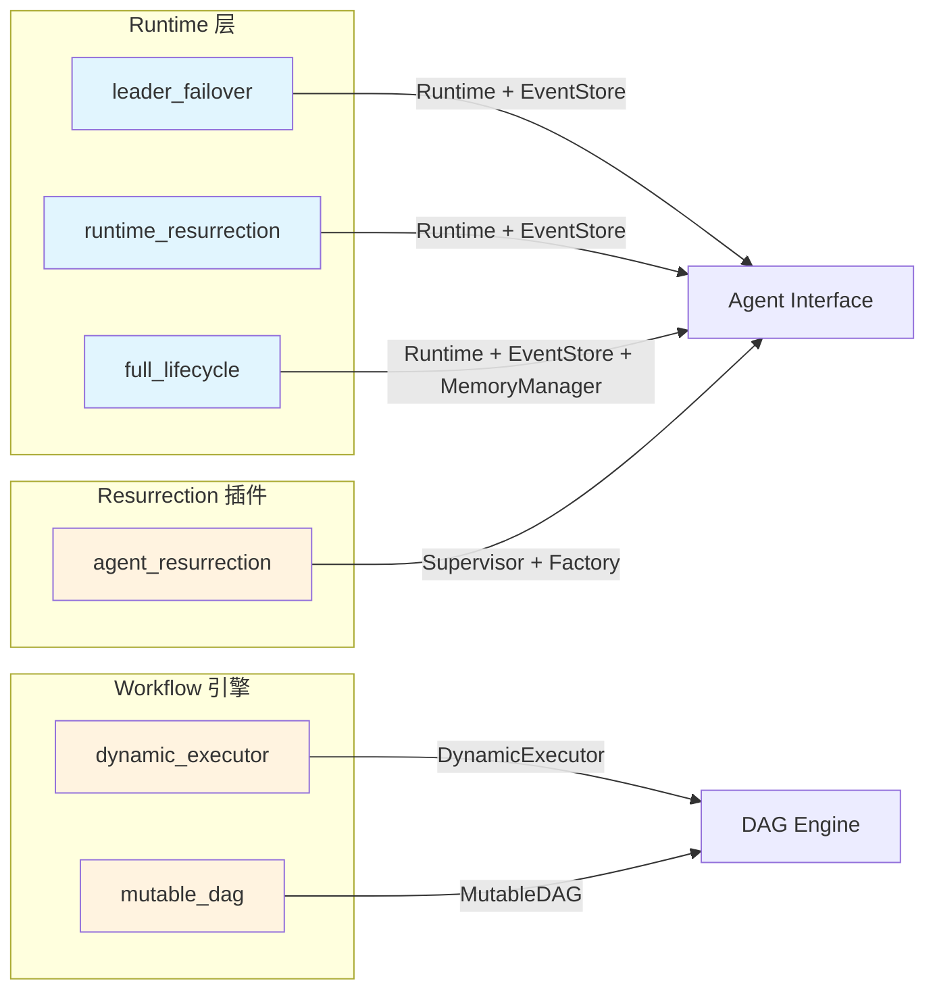

# Advanced Examples 示例文档

ARES v2 功能的完整可运行示例。每个示例独立运行，无需外部依赖。

## 环境要求

- Go 1.26+
- 无需外部依赖（所有示例使用 in-memory store）

## 示例总览



| 示例 | 功能 | 核心概念 |
|------|------|----------|
| `full_lifecycle/` | 完整 Agent 生命周期 | Runtime, EventStore, MemoryManager, MutableDAG |
| `leader_failover/` | Leader checkpoint 恢复 | Runtime, EventStore, Factory, checkpoint 回放 |
| `agent_resurrection/` | 通用 Agent 复活 | Supervisor, HealthChecker, Factory, 多 Agent 监控 |
| `runtime_resurrection/` | Runtime 管理的生命周期 | Runtime, EventStore, event replay, 认知恢复 |
| `dynamic_executor/` | 运行时 DAG 修改 | DynamicExecutor, ApplyMode, ExecutorOption |
| `mutable_dag/` | 线程安全 DAG 操作 | MutableDAG, graph events, 环检测 |

---

## full_lifecycle

演示完整的 Agent 生命周期，包括 Runtime、EventStore、MemoryManager 和 MutableDAG 工作流修改。

**演示内容：**
- 创建 Runtime + EventStore + MemoryManager 基础设施
- 注册 4 个 Agent：leader、worker-a、worker-b、planner
- Worker-a 处理任务并向 EventStore 发送事件
- Worker-a 崩溃（模拟）；Runtime 检测并复活
- 复活的 worker-a 从事件和内存恢复状态
- Planner 在运行时修改工作流 DAG（MutableDAG）

**关键代码：**

```go
// 创建基础设施。
eventStore := events.NewMemoryEventStore()
// 生产环境蒸馏推荐使用 NewMemoryManagerWithDistiller 替代 NewMemoryManager
// （需要 embedding.EmbeddingService 和 distillation.ExperienceRepository）。
memManager, _ := memory.NewMemoryManager(memory.DefaultMemoryConfig())
memManager.Start(ctx)

rt := runtime.New(&runtime.Config{
    HealthCheckInterval: 1 * time.Second,
    MaxRestartsPerAgent: 5,
    MaxReplayEvents:     1000,
}, eventStore, memManager)

// 注册 Agent 及 Factory（用于复活）。
rt.RegisterAgent(workerA, func() base.Agent {
    return newLifecycleAgent("worker-a", models.AgentTypeBottom, eventStore, memManager)
})

// 启动所有 Agent。
rt.Start(ctx)

// Planner 在运行时修改工作流。
dag, _ := engine.NewMutableDAG(initialSteps)
dag.AddNode(ctx, &engine.Step{
    ID: "validate-data", Name: "Validate Data",
    DependsOn: []string{"analyze-data"},
})
```

**运行：**

```bash
go run ./examples/advanced/full_lifecycle/
```

---

## leader_failover

演示 Leader Agent 崩溃检测与自动复活，使用 Runtime 层和 EventStore checkpoint 恢复。

**演示内容：**
- 创建带 `MemoryEventStore` 的 `Runtime`
- 注册 Leader Agent 及 Factory
- Leader 处理任务并通过事件保存 checkpoint
- 模拟 Leader 崩溃（通过 `shouldCrash` 标志触发 panic）
- Runtime 通过健康检查检测崩溃，回放事件，从最后一个 checkpoint 恢复

**关键代码：**

```go
// 创建基础设施。
eventStore := events.NewMemoryEventStore()

// 创建 Runtime（演示用激进的健康检查间隔）。
rtConfig := &runtime.Config{
    HealthCheckInterval: 1 * time.Second,
    MaxRestartsPerAgent: 3,
    MaxReplayEvents:     1000,
}
rt := runtime.New(rtConfig, eventStore, nil)

// 注册 Leader 及 Factory（用于复活）。
leader := newLeader("leader-1", eventStore)
rt.RegisterAgent(leader, func() base.Agent {
    return newLeader("leader-1", eventStore)
})

// 启动 Runtime。
rt.Start(ctx)

// Leader 通过事件保存 checkpoint。
leader.emitEvent(ctx, events.EventStepCompleted, map[string]any{
    "task_id": taskID, "checkpoint": cp,
})

// 模拟崩溃。
leader.shouldCrash = true

// Runtime 检测崩溃，回放事件，新 Leader 从最后一个 checkpoint 恢复。
```

**运行：**

```bash
go run ./examples/advanced/leader_failover/
```

---

## agent_resurrection

演示通用 Agent 复活机制，使用 resurrection Supervisor 插件。任意 Agent 类型（leader、worker、planner）均可通过同一个 Supervisor 监控和复活。

**演示内容：**
- 用一个 Supervisor 注册 3 个不同类型的 Agent
- 杀死一个 Agent，验证复活
- 杀死第二个 Agent，验证第一个不受影响
- 每个 Agent 有独立的 Factory 函数

**关键代码：**

```go
// 创建心跳监控器。
hbMon := ahp.NewHeartbeatMonitor(&ahp.HeartbeatConfig{
    Interval:  2 * time.Second,
    Timeout:   3 * time.Second,
    MaxMissed: 2,
})

// 创建 Resurrection 插件。
health := resurrection.NewHeartbeatAdapter(hbMon)
supervisor, _ := resurrection.New(health, resurrection.Config{
    CheckInterval:     3 * time.Second,
    HeartbeatInterval: 2 * time.Second,
}, nil)

// 注册 3 个不同类型的 Agent。
for _, d := range defs {
    agent := newWorker(d.id, d.agentType)
    agent.Start(ctx)
    id, at := d.id, d.agentType
    supervisor.Watch(agent, func() base.Agent {
        return newWorker(id, at)
    })
}

// 启动监控。
supervisor.Start(ctx)

// 杀死 worker-1，等待复活。
supervisor.Agent("worker-1").Stop(ctx)
time.Sleep(10 * time.Second)

// 验证 worker-1 已复活，worker-2 不受影响。
agent := supervisor.Agent("worker-1")
// agent.Status() == models.AgentStatusReady
```

**运行：**

```bash
go run ./examples/advanced/agent_resurrection/
```

---

## runtime_resurrection

演示 Runtime 管理的 Agent 生命周期，基于 EventStore 保留状态和认知恢复。Agent 崩溃后，Runtime 检测、创建新实例、回放事件以恢复运行状态。

**演示内容：**
- 创建带 `MemoryEventStore` 的 `Runtime`
- 注册 Agent 及 Factory
- Agent 在工作期间向 EventStore 发送生命周期和任务事件
- 通过 `shouldCrash` 标志模拟崩溃
- Runtime 检测崩溃、复活 Agent、回放事件
- 验证复活的 Agent 从上次中断处继续

**关键代码：**

```go
// 创建基础设施。
eventStore := events.NewMemoryEventStore()
rt := runtime.New(runtime.DefaultConfig(), eventStore, nil)

// 注册 Agent 及 Factory。
rt.RegisterAgent(worker, func() base.Agent {
    return newWorker("worker-1", eventStore)
})

// 启动 Runtime。
rt.Start(ctx)

// Agent 工作期间发送事件。
worker.emitEvent(ctx, events.EventTaskCreated, map[string]any{
    "task_id": taskID, "agent_id": worker.id,
})

// 模拟崩溃。
worker.shouldCrash.Store(true)

// Runtime 检测崩溃，创建新 Agent，回放事件。
// 新 worker 从上次中断处继续处理任务。
```

**运行：**

```bash
go run ./examples/advanced/runtime_resurrection/
```

---

## dynamic_executor

演示 DynamicExecutor API 和 ApplyMode 配置，支持执行期间的运行时 DAG 修改。

**演示内容：**
- 创建带初始 Step 的 `MutableDAG`
- 运行时添加并行节点
- 不同 `ApplyMode` 的 `DynamicExecutor` 配置
- `ExecutorOption` 细粒度控制（`WithMaxParallel`、`WithStepTimeout`）
- 边插入时的环检测

**关键代码：**

```go
// 创建初始 DAG: step1 -> step2 -> step3。
dag, _ := engine.NewMutableDAG(initialSteps)

// 运行时添加并行 Step: step1 -> step4。
dag.AddNode(ctx, &engine.Step{
    ID:        "step4",
    Name:      "Parallel Step",
    DependsOn: []string{"step1"},
})

// 使用 Option 创建 Executor。
executor := engine.NewDynamicExecutor(
    nil,
    engine.ApplyAtCheckpoint,
    engine.WithMaxParallel(5),
    engine.WithStepTimeout(60*time.Second),
)

// 环检测拒绝无效边。
dag.AddEdge(ctx, "step3", "step1") // 返回 error
```

**运行：**

```bash
go run ./examples/advanced/dynamic_executor/
```

---

## mutable_dag

演示线程安全的 MutableDAG 操作：运行时增删节点和边、graph event 订阅、snapshot 并发读取。

**演示内容：**
- 创建 DAG，运行时添加节点和边
- 订阅图变更事件
- 边插入时的环检测
- 移除节点并验证执行顺序更新
- Snapshot 用于安全的并发读取

**关键代码：**

```go
// 创建初始 DAG: A -> B -> C。
dag, _ := engine.NewMutableDAG(initialSteps)

// 订阅 graph events。
events := dag.Subscribe()

// 添加节点 D（依赖 B）。
dag.AddNode(ctx, &engine.Step{
    ID: "D", Name: "Step D", DependsOn: []string{"B"},
})

// 尝试添加环（被拒绝）。
dag.AddEdge(ctx, "D", "A") // error

// 移除节点 C。
dag.RemoveNode(ctx, "C")

// Snapshot 用于并发读取。
snapshot := dag.Snapshot()
```

**运行：**

```bash
go run ./examples/advanced/mutable_dag/
```

---

## 架构关系

Runtime 系列示例（leader_failover、runtime_resurrection、full_lifecycle）展示了三个递进的复杂度：

1. **leader_failover** -- 单 Agent，Runtime + EventStore checkpoint 恢复
2. **runtime_resurrection** -- 多 Agent，Runtime + EventStore + 认知恢复
3. **full_lifecycle** -- 完整基础设施：Runtime + EventStore + MemoryManager + MutableDAG

Resurrection 插件示例（agent_resurrection）使用独立的 Supervisor 模式：

1. **agent_resurrection** -- 多 Agent，Supervisor + HeartbeatAdapter + Factory

Workflow 系列示例（dynamic_executor、mutable_dag）展示 DAG 引擎：

1. **mutable_dag** -- 底层图操作（增删节点/边、snapshot）
2. **dynamic_executor** -- 高层执行 + 运行时修改
