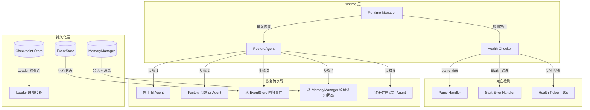
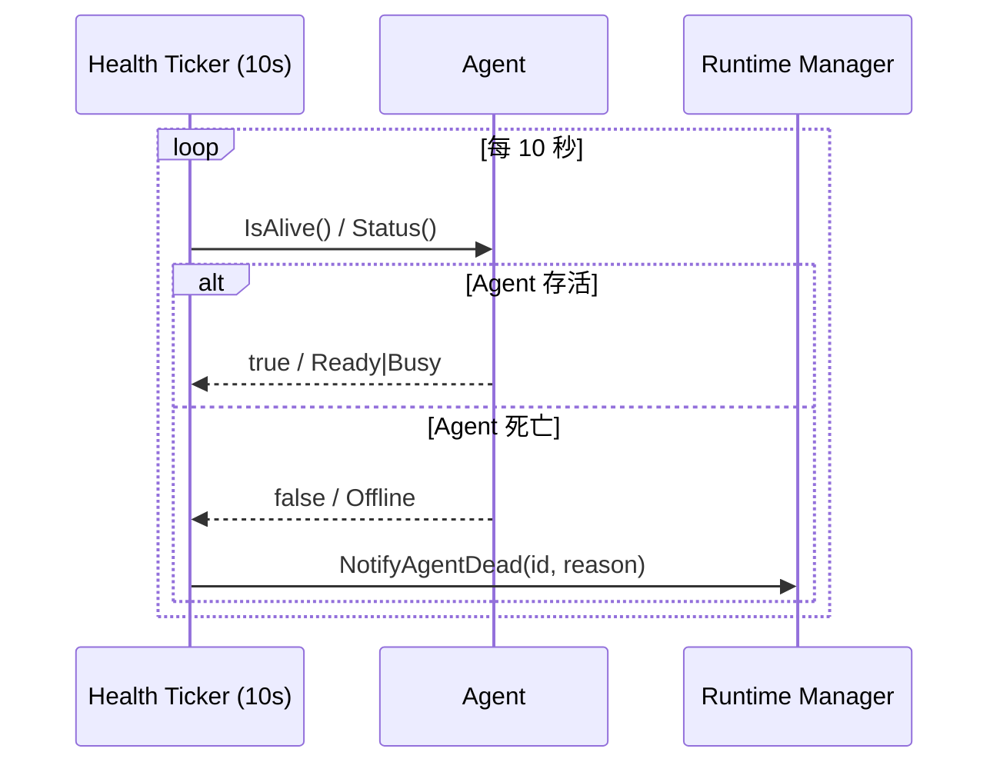
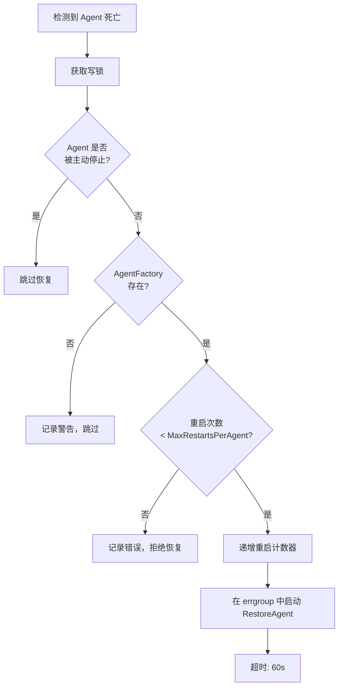
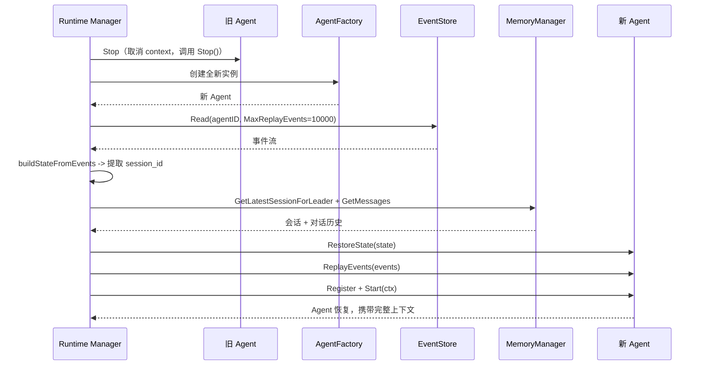
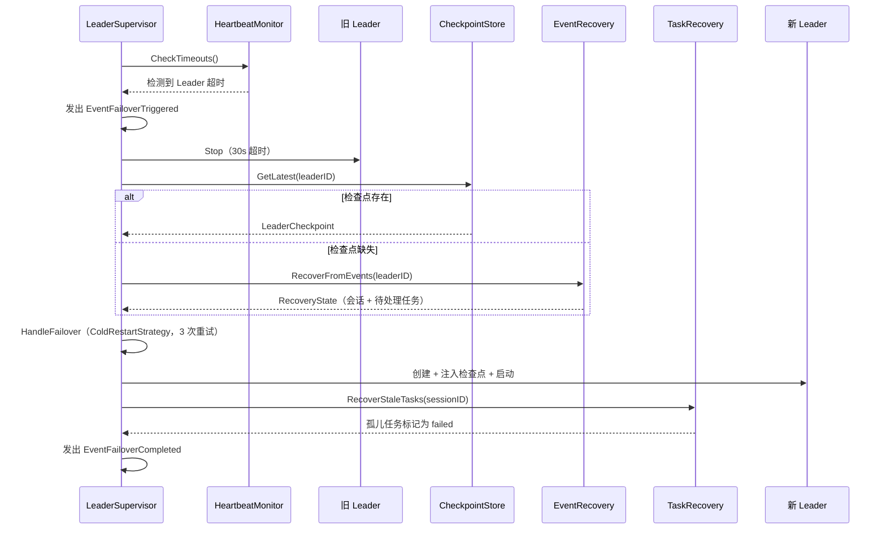
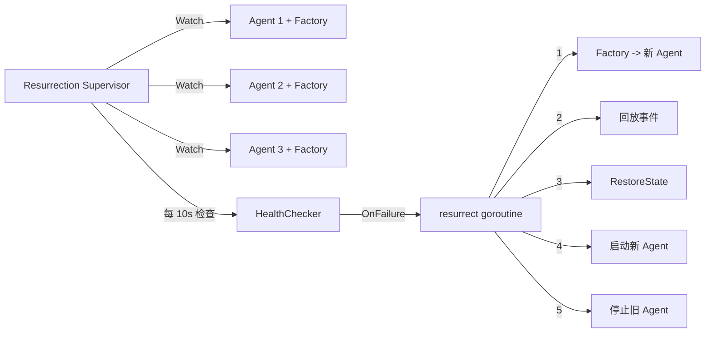

# Agent 崩溃恢复

当 ares 中的 Agent 崩溃时，Runtime 会检测到死亡，创建全新实例，回放事件恢复运行状态，并从记忆存储加载对话历史。Agent 恢复后拥有完整上下文，就像什么都没发生过一样。

## 恢复架构

恢复系统分为五层：



## Agent 怎么死的

Agent 有三种死亡方式，都在 `internal/ares_runtime/manager.go` 中处理。

### 1. 执行过程中 Panic

每个 Agent 在 goroutine 中运行，外层包裹 `defer recover()`。捕获到 panic 后调用 `NotifyAgentDead`：

```go
// internal/ares_runtime/manager.go:146-166
m.g.Go(func() error {
    defer func() {
        if r := recover(); r != nil {
            slog.Error("runtime: agent panicked in Start",
                "agent_id", id, "panic", r,
            )
            m.NotifyAgentDead(id, fmt.Sprintf("panic: %v", r))
        }
    }()

    if err := agent.Start(agentCtx); err != nil {
        if agentCtx.Err() != nil {
            return nil  // 主动停止，不触发复活
        }
        m.NotifyAgentDead(id, fmt.Sprintf("start failed: %v", err))
        return nil // 不传播错误，runtime 必须继续运行
    }
    return nil
})
```

### 2. Start() 返回错误

如果 `agent.Start()` 返回非 nil 错误，且 context 不是被主动取消的，就会调用 `NotifyAgentDead`。`agentCtx.Err() != nil` 检查区分主动停止和崩溃。

### 3. 健康检查失败

后台 ticker 每隔 `HealthCheckInterval`（默认 10s）运行一次。通过两种机制检查 Agent：

- **心跳**：如果 Agent 实现了 `base.Heartbeater`，检查器调用 `IsAlive()`。Leader Agent 仅在状态为 `Ready` 或 `Busy` 时返回 `true`。
- **状态兜底**：否则检查 `agent.Status()` 是否为 `Offline` 或 `Stopping`。



## NotifyAgentDead -- 安全门

`NotifyAgentDead` 是核心分发点。在写锁下执行，触发恢复前进行多项检查：



实际代码（`internal/ares_runtime/manager.go:416-454`）：

```go
func (m *Manager) NotifyAgentDead(agentID string, reason string) {
    // 写锁下检查并递增，防止 TOCTOU 竞态
    m.mu.Lock()
    factory, hasFactory := m.factories[agentID]
    ma, hasAgent := m.agents[agentID]
    intentionallyStopped := hasAgent && ma.stopped

    if m.isStopped || intentionallyStopped {
        m.mu.Unlock()
        return
    }
    if !hasFactory {
        m.mu.Unlock()
        return
    }

    // 同一把锁下检查重启限制
    if hasAgent && m.config.MaxRestartsPerAgent > 0 &&
        ma.restarts >= m.config.MaxRestartsPerAgent {
        m.mu.Unlock()
        return
    }

    // 启动 goroutine 之前递增
    if hasAgent {
        ma.restarts++
    }
    m.totalRestarts++
    // ... 通过 errgroup 启动 RestoreAgent
}
```

关键设计：重启限制的检查和递增在同一把写锁下完成。两个并发的 `NotifyAgentDead` 调用如果都用 RLock，可能都通过检查，然后都调度 `RestoreAgent`，超出预期的重启次数。

## RestoreAgent 流水线

`RestoreAgent` 执行五步恢复：



### 步骤 1：停止旧 Agent

旧 Agent 在写锁下标记 `stopped = true`，取消其 context，调用 `agent.Stop()`（10s 超时）。

```go
// internal/ares_runtime/manager.go:310-328
m.mu.Lock()
oldMA, oldExists := m.agents[agentID]
if oldExists && oldMA != nil {
    oldMA.stopped = true
}
m.mu.Unlock()

if oldExists && oldMA != nil {
    if oldMA.cancel != nil {
        oldMA.cancel()
    }
    stopCtx, stopCancel := context.WithTimeout(ctx, m.config.AgentStopTimeout)
    if err := oldMA.agent.Stop(stopCtx); err != nil {
        slog.Warn("runtime: restore stop old agent failed", "agent_id", agentID, "error", err)
    }
    stopCancel()
}
```

### 步骤 2：创建新 Agent

`AgentFactory`（`func() base.Agent`）创建全新实例。

```go
newAgent := factory()
if newAgent == nil {
    return fmt.Errorf("runtime: factory returned nil for agent %s", agentID)
}
```

### 步骤 3：回放事件（运行状态恢复）

`replayEvents` 方法从 `EventStore` 读取 Agent 的事件流（以 Agent ID 作为 stream ID），最多读取 10,000 条事件，按版本升序排列。

### 步骤 4：构建认知状态

两个子步骤：

- `buildStateFromEvents` 从 `EventSessionCreated` 事件中提取 `session_id`。
- `buildCognitiveState` 从 `MemoryManager` 加载对话历史。先尝试事件中的 session_id，再回退到 `GetLatestSessionForLeader`（5s 超时）。消息通过 `GetMessages` 加载（5s 超时）。

如果 Agent 实现了 `StatefulAgent`，会调用 `RestoreState` 和 `ReplayEvents`。

### 步骤 5：注册并启动

新 Agent 在写锁下注册，在带 panic 恢复的 goroutine 中启动，调用 `agent.Start()`。

## StatefulAgent 接口

需要自定义恢复逻辑的 Agent 实现此接口（`internal/agents/base/agent.go`）：

```go
type StatefulAgent interface {
    RestoreState(state map[string]any) error
    ReplayEvents(events []*events.Event) error
    Snapshot() (map[string]any, error)
}
```

Leader Agent 实现了全部三个方法：

```go
// internal/agents/leader/agent.go:767-816
func (a *LeaderAgent) RestoreState(state map[string]any) error {
    if sid, ok := state["session_id"].(string); ok && sid != "" {
        a.sessionID = sid
        slog.Info("LeaderAgent restored session_id", "session_id", sid)
    }
    return nil
}

func (a *LeaderAgent) ReplayEvents(events []*events.Event) error {
    for _, ev := range events {
        if ev.Type == events.EventSessionCreated {
            if sid, ok := ev.Payload["session_id"].(string); ok {
                a.sessionID = sid
            }
        }
    }
    return nil
}

func (a *LeaderAgent) Snapshot() (map[string]any, error) {
    return map[string]any{
        "session_id": a.sessionID,
        "agent_id":   a.agentID,
        "status":     string(a.Status()),
    }, nil
}
```

## Leader 故障转移

Leader Agent 有额外的故障转移层，通过 `LeaderSupervisor` 实现。Leader 死亡时，执行基于检查点的恢复：



### 检查点

`LeaderCheckpoint` 存储 `leader_id`、`session_id`、`status` 和 `metadata`。通过 upsert 语义持久化到 PostgreSQL。Leader 在创建或恢复会话时保存检查点。

### 事件恢复

如果检查点缺失或不完整，`EventRecovery.RecoverFromEvents` 通过回放完整事件流重建状态：
- `EventSessionCreated` -> 捕获 session ID
- `EventTaskCreated` -> 将任务加入待处理列表
- `EventTaskCompleted` -> 从待处理列表移除任务

### 孤儿任务清理

`TaskRecovery.RecoverStaleTasks` 将状态为 `pending` 或 `running` 的任务标记为 `failed`，错误信息为 `"leader failover: task orphaned"`。

## 复活插件

`resurrection.Supervisor` 是通用的、与 Agent 类型无关的复活机制（`internal/plugins/resurrection/`）。



配置默认值：
- `CheckInterval`：10s
- `ResurrectTimeout`：60s
- `MaxAttempts`：3
- `HeartbeatInterval`：5s

## 事件溯源

所有状态变更都作为事件持久化。`EventStore` 接口支持：

- `Append(ctx, streamID, events, expectedVersion)` -- 乐观并发控制
- `Read(ctx, streamID, opts)` -- 读取单个流
- `Subscribe(ctx, filter)` -- 实时事件通道

事件类型：`agent.started`、`agent.stopped`、`task.created`、`task.dispatched`、`task.completed`、`task.failed`、`session.created`、`message.added`、`memory.distilled`、`failover.triggered`、`failover.completed`、`llm.call`。

## 配置参数

| 参数 | 默认值 | 说明 |
|------|--------|------|
| `HealthCheckInterval` | 10s | 健康检查频率 |
| `MaxRestartsPerAgent` | 10 | 最大重启次数 |
| `MaxReplayEvents` | 10,000 | 恢复时最大回放事件数 |
| `AgentStopTimeout` | 10s | 停止旧 Agent 超时 |
| `RestoreTimeout` | 60s | RestoreAgent 总超时 |
| `OverallStopTimeout` | 30s | 停止所有 Agent 超时 |
