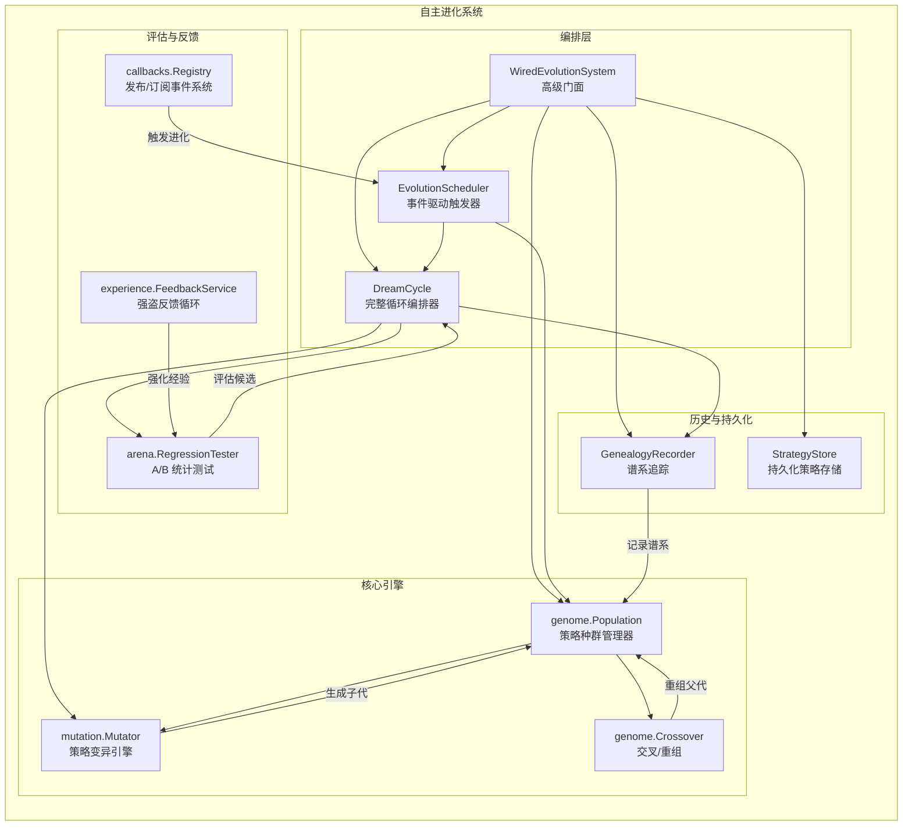
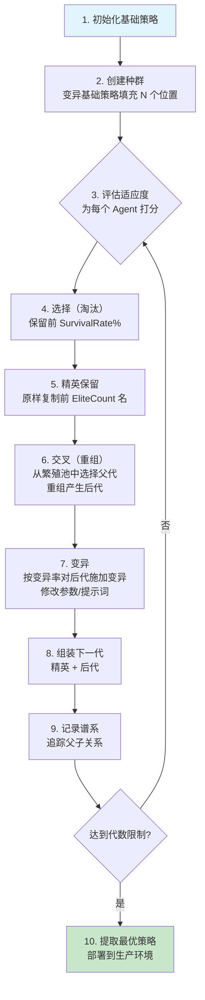

# 自主进化系统（遗传算法）

## 概述

GoAgentX 的**自主进化（Autonomous Evolution）**系统实现了一套用于自主 Agent 策略优化的**遗传算法（Genetic Algorithm, GA）**。该系统也被称为 **Dream Mode（梦境模式）**，使 Agent 能够在无需人工干预的情况下持续探索、评估并采纳更优的决策策略。

系统的核心思想是将 Agent 策略视为一个**策略种群（Population）**，通过多代的**选择（Selection）、交叉（Crossover/重组）、变异（Mutation）**操作进行演化。每条策略编码了 LLM temperature、top_k、max_steps、提示词模板和工具配置等参数。遗传算法在高维参数空间中搜索，以发现能够最大化任务性能评分的策略组合。

系统被设计为**零成本后台进化**循环：进化周期在系统空闲期间运行，使用预计算的任务评分，进化过程本身不需要额外的 LLM API 调用。

---

## 架构



---

## 核心组件

### 1. Evolution 包 (`internal/evolution/`)

**顶层编排包**，将所有组件连接为一个完整的系统。

**核心类型：**

| 类型 | 描述 |
|------|------|
| `WiredEvolutionSystem` | 高级门面，持有所有已连接的组件 |
| `Strategy` | 演化后的策略，包含 ID、Version、Params、ParentID、Score |
| `StrategyLineage` | 谱系记录：ParentID → ChildID、MutationType、WinRate |
| `RegressionConfig` | 竞技场测试配置（Candidate、Baseline、TaskSampleSize） |
| `RegressionResult` | 竞技场测试结果（CandidateScore、BaselineScore、WinRate） |

**核心接口：**

```go
// GenealogyRecorder 记录策略演化历史
type GenealogyRecorder interface {
    Record(ctx context.Context, lineage StrategyLineage) error
}

// TesterInterface 执行竞技场回归测试
type TesterInterface interface {
    Run(ctx context.Context, cfg RegressionConfig) (*RegressionResult, error)
}
```

**核心函数：**

```go
// 一次调用创建完整的连线系统
func NewWiredEvolutionSystem(base *mutation.Strategy, cfg SystemConfig) (*WiredEvolutionSystem, error)

// 连接 Population 与谱系记录的桥梁
func RecordPopulationLineage(ctx context.Context, pop *genome.Population, recorder GenealogyRecorder, prevGeneration int) (int, error)

// 从连线系统中提取最优策略
func BestStrategyFromSystem(system *WiredEvolutionSystem) (*mutation.Strategy, error)

// 清理资源释放
func Shutdown(system *WiredEvolutionSystem)
```

---

### 2. Genome 包 (`internal/evolution/genome/`)

管理跨代演化的**策略 Agent 种群**，执行遗传算法的核心操作。

**`Population`** — 核心数据结构：

```go
type Population struct {
    Agents     []*mutation.Strategy // 当前世代的所有策略
    Size       int                  // 目标种群大小（恒定）
    Generation int                  // 当前代数
    cfg        PopulationConfig     // 演化配置
    rng        *rand.Rand           // 确定性随机数源
}
```

**构建方式：**

```go
pop, err := genome.NewPopulation(ctx, baseStrategy, mutator,
    genome.WithPopulationSize(20),    // 目标种群大小
    genome.WithEliteCount(3),         // 每代保留的精英数量
    genome.WithMutationRate(0.2),     // 交叉后变异概率
    genome.WithSurvivalRate(0.6),     // 保留的高分个体比例
    genome.WithBreedingPoolRatio(0.3),// 有资格作为父代的存活者比例
    genome.WithSeed(42),              // 确定性随机种子（可选）
)
```

**核心方法：**

| 方法 | 描述 |
|------|------|
| `EvolveOnIdle(ctx, mutator, crosser)` | 执行一代空闲时间演化 |
| `Stats()` | 返回 `PopulationStats`（Size、Generation、BestScore、AvgScore、WorstScore） |
| `Best()` | 返回得分最高的个体 Agent |
| `BestStrategy()` | 返回用于部署的深拷贝最优策略 |
| `Snapshot()` | 所有 Agent 的线程安全副本 + 当前代数 |

**`Crossover`** — 重组父代策略：

```go
type CrossoverInterface interface {
    Crossover(ctx context.Context, a, b *mutation.Strategy) (*mutation.Strategy, error)
}

// 均匀交叉：每个参数独立地从 A 或 B 中选择（各 50% 概率）
crosser.Crossover(ctx, parentA, parentB)

// 多点交叉：在 k 个分割点处交替父代来源
crosser.MultiPointCrossover(ctx, parentA, parentB, k)

// 半分割提示词交叉：前半部分来自 A，后半部分来自 B
crosser.CrossoverWithHalfSplit(ctx, parentA, parentB)
```

**自适应特性：**

- **自适应变异率**：根据种群多样性和停滞状态自动在 `MinMutationRate` 与 `MaxMutationRate` 之间调整
- **停滞检测**：连续 `MaxStagnantGenerations` 代无改进时，重置底层表现者以注入新鲜基因材料
- **多样性监控**：当平均成对距离低于 `DiversityThreshold` 时，进入激进探索模式

---

### 3. Mutation 包 (`internal/evolution/mutation/`)

通过修改参数或提示词模板从父代**生成子代策略**。

**`Strategy`** — 可变策略表示：

```go
type Strategy struct {
    ID                   string       // 唯一标识符
    ParentID             string       // 父代策略 ID（根策略为空）
    Version              int          // 单调递增版本号
    Params               map[string]any // 可变参数（temperature、top_k 等）
    PromptTemplate       string       // 行为提示词模板
    StrategyMutationType MutationType // 策略创建方式
    MutationDesc         string       // 可读的变异描述
    Score                float64      // 评估分数（-1 = 未评估）
    CreatedAt            time.Time    // 创建时间戳
}
```

**变异类型：**

| 类型 | 概率 | 描述 |
|------|------|------|
| `MutationParameter` | ~70% | 修改一个参数值（如 temperature 0.7 → 0.5） |
| `MutationPrompt` | ~15% | 从池中替换提示词模板 |
| `MutationTool` | ~15% | 从池中替换工具配置 |
| `MutationCrossover` | — | 通过交叉重组创建 |

**默认参数范围：**

| 参数 | 候选值 |
|------|--------|
| `temperature` | 0.1, 0.3, 0.5, 0.7, 0.9 |
| `top_k` | 10, 20, 40, 80 |
| `max_steps` | 5, 10, 15, 20 |
| `memory_limit` | 3, 5, 10 |
| `conflict_threshold` | 0.85, 0.90, 0.95 |

**Mutator 构建：**

```go
mutator, err := mutation.NewMutator(
    mutation.WithPromptPool([]string{
        "You are a careful assistant. Think step by step.",
        "You are a creative assistant. Explore multiple solutions.",
        "You are a precise assistant. Focus on accuracy.",
    }),
    mutation.WithSeed(42),             // 确定性种子，保证可复现
    mutation.WithDeterministicIDs(true), // 计数器式 ID
)
```

**关键特性 —— 确定性**：相同种子下，`Mutate()` 每次产生完全一致的结果，支持可复现实验和调试。

---

### 4. Arena 包 (`internal/arena/`)

提供候选策略与当前基线之间的**统计 A/B 测试**能力。

**`RegressionTester`** — A/B 对比框架：

```go
type RegressionConfig struct {
    OldStrategy  any      // 基线策略
    NewStrategy  any      // 候选策略
    BaselineRuns int      // 基线评估运行次数
    CompareRuns  int      // 候选评估运行次数
    TestSuite    string   // 测试套件标识
    Confidence   float64  // 显著性水平（如 0.05 表示 95% 置信度）
    MinWinRate   float64  // 接受改进的最小胜率（如 0.55）
}

type RegressionResult struct {
    OldAvg     float64   // 基线平均分
    NewAvg     float64   // 候选平均分
    WinRate    float64   // 候选 ≥ 基线的比例（0–1）
    PValue     float64   // 统计显著性 p 值
    Confident  bool      // 结果是否统计显著
    Samples    int       // 每个策略运行次数
    TestedAt   time.Time // 测试时间戳
    OldScores  []float64 // 基线各次运行得分
    NewScores  []float64 // 候选各次运行得分
}
```

**统计方法**：使用 Welch's t-test 近似判断得分差异是否具有统计显著性（非随机因素导致）。

---

### 5. Callbacks 包 (`internal/callbacks/`)

用于监控 LLM、Tool 和 Agent 生命周期事件的**发布/订阅事件注册中心**。

**支持的事件：**

| 事件 | 触发时机 |
|------|---------|
| `EventLLMStart` | LLM API 调用之前 |
| `EventLLMEnd` | LLM API 调用完成之后 |
| `EventLLMError` | LLM 调用失败时 |
| `EventToolStart` | 工具执行之前 |
| `EventToolEnd` | 工具执行完成之后 |
| `EventAgentStart` | Agent 开始之前 |
| `EventAgentEnd` | Agent 结束之后 |

**使用示例：**

```go
registry := callbacks.NewRegistry()

registry.On(callbacks.EventAgentEnd, func(ctx *callbacks.Context) {
    slog.Info("Agent 完成", "agent_id", ctx.AgentID, "duration", ctx.Duration)
})

registry.Emit(&callbacks.Context{
    Event:    callbacks.EventAgentEnd,
    AgentID:  "agent-01",
    Duration: 250 * time.Millisecond,
})
```

**上下文元数据**：Model、Input、Output、ToolName、AgentID、Duration、Error、TokenCount。

**安全保证**：Handler 的 panic 会被恢复，不会导致发射器崩溃。

---

### 6. Experience 包 (`internal/experience/`)

用于经验质量强化的**强盗反馈服务（Bandit Feedback Service）**。

```go
type FeedbackService struct {
    repo repositories.ExperienceRepositoryInterface
}

// 成功时强化：增加使用计数
func (s *FeedbackService) RecordSuccess(ctx context.Context, id string) error

// 失败时惩罚：降低排名（减少 10%）
func (s *FeedbackService) RecordFailure(ctx context.Context, id string) error
```

这形成了一个**正反馈循环**：成功的经验被更频繁地使用；失败的经验被降权处理。

---

## 遗传算法工作流

从初始化到多代优化的完整演化流程：



### 分步说明

1. **初始化基础策略**：定义根策略，设置初始参数（temperature、top_k、max_steps、提示词模板等）。

2. **创建种群**：克隆基础策略并通过变异填充 `PopulationSize` 个位置。所有 Agent 都是根策略的变体。

3. **评估适应度**：为种群中的每个 Agent 评分。生产环境中使用竞技场回归测试或任务成功指标。可通过 `Snapshot()` 外部赋分。

4. **选择（生存）**：按得分降序排列。保留前 `SurvivalRate` 比例（默认 60%）的个体。低分者被淘汰。

5. **精英保留**：将前 `EliteCount` 名策略深拷贝到下一代，不做任何修改。确保最优解不会丢失。

6. **交叉（重组）**：从存活池中选择**繁殖池**（前 `BreedingPoolRatio`，默认 30%）。随机选取两个父代并组合其参数：
   - **均匀交叉**：每个参数独立地从父代 A 或 B 中选择（50/50）
   - **多点交叉**：在 k 个分割点处交替父代来源
   - **提示词模板**：继承自高分父代（或半分割变体）

7. **变异**：每个后代有 `MutationRate` 概率（默认 20%）被进一步变异：
   - ~70% 概率：将一个参数改为范围内的不同值
   - ~15% 概率：从池中替换提示词模板
   - ~15% 概率：从池中替换工具配置

8. **组装下一代**：将精英 + 后代组合为目标大小的下一代种群。

9. **记录谱系**：追踪父子关系、变异类型和评分改进，用于可追溯性和事后分析。

10. **提取最优策略**：演化完成后，克隆最高分策略用于生产部署。

### 自适应行为

遗传算法内置了自适应机制：

- **自适应变异率**：多样性低或检测到停滞时自动升高；否则向基准率回落
- **停滞重置**：连续 `MaxStagnantGenerations` 代无最佳分改进时，用新的随机变体替换底层表现者
- **多样性阈值**：监控参数空间中的平均成对距离；多样性过低时触发激进探索模式

---

## API 参考

### 系统配置

```go
type SystemConfig struct {
    PopulationSize          int       // 目标种群大小（默认: 20）
    EliteCount              int       // 每代保留的精英数量（默认: 3）
    MutationRate            float64   // 交叉后变异概率（默认: 0.2）
    SurvivalRate            float64   // 高分个体存活比例（默认: 0.6）
    EnableDreamCycle        bool      // 启用梦境循环编排器
    EnableScheduler         bool      // 启用事件驱动调度器
    MinTasksBeforeEvolve    int       // 首次进化前的最少任务数（默认: 10）
    SchedulerTrigger        EvolutionTrigger // 触发模式（默认: OnIdle）
    MutatorSeed             int64     // 变异器随机种子（0 = 不确定）
    CrossoverSeed           int64     // 交叉器随机种子（0 = 不确定）
    UseDeterministicIDs     bool      // 使用计数器式 ID 以保证可复现性
    MinMutationRate         float64   // 自适应变异率下限（默认: 0.05）
    MaxMutationRate         float64   // 自适应变异率上限（默认: 0.5）
    MaxStagnantGenerations  int       // 停滞重置阈值（默认: 10）
    DiversityThreshold      float64   // 进入激进模式的最低多样性（默认: 0.15）
}

func DefaultSystemConfig() SystemConfig
```

### 种群选项

```go
func WithPopulationSize(size int) PopulationOption
func WithEliteCount(count int) PopulationOption
func WithMutationRate(rate float64) PopulationOption
func WithSurvivalRate(rate float64) PopulationOption
func WithBreedingPoolRatio(ratio float64) PopulationOption
func WithPopulationSeed(seed int64) PopulationOption
func WithMinMutationRate(rate float64) PopulationOption
func WithMaxMutationRate(rate float64) PopulationOption
func WithMaxStagnantGenerations(n int) PopulationOption
func WithDiversityThreshold(threshold float64) PopulationOption
```

### 变异器选项

```go
func WithPromptPool(pool []string) MutatorOption
func WithToolPool(pool []string) MutatorOption
func WithParamRanges(ranges map[string]ParamRange) MutatorOption
func WithSeed(seed int64) MutatorOption
func WithDeterministicIDs(enabled bool) MutatorOption
```

### 交叉器选项

```go
func WithSeed(seed int64) CrossoverOption
func WithDeterministicIDs(enabled bool) CrossoverOption
```

### 种群统计信息

```go
type PopulationStats struct {
    Generation int       // 当前代数
    Size       int       // Agent 数量
    AvgScore   float64   // 所有 Agent 平均分
    BestScore  float64   // 种群最高分
    WorstScore float64   // 种群最低分
}
```

---

## 配置

### 种群参数

| 参数 | 默认值 | 取值范围 | 描述 |
|------|--------|---------|------|
| `PopulationSize` | 20 | 1–100+ | 每代策略数量 |
| `EliteCount` | 3 | 0–Size | 每代原样保留的策略数 |
| `SurvivalRate` | 0.6 | 0.1–1.0 | 存活的高分个体比例 |
| `MutationRate` | 0.2 | 0.0–1.0 | 交叉后每个后代的变异概率 |
| `BreedingPoolRatio` | 0.3 | 0.01–1.0 | 有资格作为父代的存活者比例 |
| `MinMutationRate` | 0.05 | 0.0–1.0 | 自适应变异率下限 |
| `MaxMutationRate` | 0.5 | 0.0–1.0 | 自适应变异率上限 |
| `MaxStagnantGenerations` | 10 | 0–100+ | 无改进后触发生重置的代数 |
| `DiversityThreshold` | 0.15 | 0.0–1.0 | 进入激进模式的最低多样性 |

### 梦境循环参数

| 参数 | 默认值 | 描述 |
|------|--------|------|
| `MinTasksBeforeEvolve` | 10 | 首次循环前的最少完成任务数 |
| `MaxMutations` | 3 | 每个循环生成的最大候选数 |
| `MinWinRate` | 0.55 | 接受候选的最低胜率 |
| `Cooldown` | 5 分钟 | 连续循环间的最小间隔 |
| `TaskSampleSize` | 50 | 最终评估时每个策略的评分运行次数 |
| `QuickRejectRuns` | 5 | 第一轮筛选的运行次数 |

### 竞技场测试参数

| 参数 | 默认值 | 描述 |
|------|--------|------|
| `BaselineRuns` | 5 | 基线策略评估次数 |
| `CompareRuns` | 5 | 候选策略评估次数 |
| `Confidence` | 0.05 | t-test 显著性水平 (α) |
| `MinWinRate` | 0.55 | 宣布改进的最低胜率 |

### 调优指南

- **小种群（10–20）**：代间更快，适合快速原型验证
- **大种群（50–100）**：更好的多样性，收敛较慢
- **高变异率（0.3–0.5）**：更强的探索能力，适合陷入局部最优时
- **低变异率（0.05–0.15）**：更强的开发能力，围绕优质解精细调优
- **高精英数（3–5）**：保留更多顶级方案但降低多样性
- **高存活率（0.7–0.8）**：较弱的选择压力

---

## 使用示例

### 基础多代演化

```go
package main

import (
    "context"
    "math/rand"
    "time"

    "goagentx/internal/evolution"
    "goagentx/internal/evolution/genome"
    "goagentx/internal/evolution/mutation"
)

func main() {
    ctx := context.Background()

    // 1. 定义基础（根）策略
    base := &mutation.Strategy{
        ID:      "root-strategy-v1",
        Version: 1,
        Params: map[string]any{
            "temperature":        0.7,
            "top_k":              40,
            "max_steps":          10,
            "memory_limit":       5,
            "conflict_threshold": 0.90,
        },
        PromptTemplate: "You are a helpful assistant.",
        CreatedAt:      time.Now(),
    }

    // 2. 创建带有提示词池和确定性种子的变异器
    mutator, _ := mutation.NewMutator(
        mutation.WithPromptPool([]string{
            "You are a careful assistant. Think step by step.",
            "You are a creative assistant. Explore multiple solutions.",
            "You are a precise assistant. Focus on accuracy.",
        }),
        mutation.WithSeed(42),
    )

    // 3. 创建交叉引擎
    crosser, _ := genome.NewCrossover(genome.WithSeed(42))

    // 4. 使用 GA 配置创建种群
    pop, _ := genome.NewPopulation(ctx, base, mutator,
        genome.WithPopulationSize(20),
        genome.WithEliteCount(2),
        genome.WithMutationRate(0.2),
        genome.WithSurvivalRate(0.6),
    )

    rng := rand.New(rand.NewSource(99))
    const nGenerations = 15

    // 5. 运行多代演化循环
    for gen := 1; gen <= nGenerations; gen++ {
        // 为每个 Agent 分配适应度分数（外部评估）
        agents, _ := pop.Snapshot()
        for _, agent := range agents {
            temp := agent.Params["temperature"].(float64)
            proximity := 1.0 - abs(temp-0.7)*2.5
            agent.Score = 50.0 + rng.Float64()*30.0 + proximity*20.0
        }

        // 演化一代：选择 → 精英 → 交叉 → 变异
        pop.EvolveOnIdle(ctx, mutator, crosser)

        stats := pop.Stats()
        printf("第 %d 代: 最佳=%.2f 平均=%.2f 数量=%d\n",
            stats.Generation, stats.BestScore, stats.AvgScore, stats.Size)
    }

    // 6. 提取最优策略用于部署
    best := pop.BestStrategy()
    printf("最优策略: %s (分数=%.2f)\n", best.ID, best.Score)
}
```

### 连线系统（高级 API）

```go
package main

import (
    "context"

    "goagentx/internal/evolution"
    "goagentx/internal/evolution/genome"
    "goagentx/internal/evolution/mutation"
)

func main() {
    ctx := context.Background()

    base := &mutation.Strategy{
        ID: "wired-root-v1", Version: 1,
        Params: map[string]any{
            "temperature": 0.7, "top_k": 40, "max_steps": 10,
        },
        PromptTemplate: "You are a helpful assistant.",
        CreatedAt:      time.Now(),
    }

    // 配置系统
    cfg := evolution.DefaultSystemConfig()
    cfg.PopulationSize = 10
    cfg.EliteCount = 1
    cfg.SurvivalRate = 0.5
    cfg.MutationRate = 0.3

    // 一次调用完成全部组件连接
    system, err := evolution.NewWiredEvolutionSystem(base, cfg)
    if err != nil {
        panic(err)
    }
    defer evolution.Shutdown(system)

    // 创建兼容的变异器和交叉器
    mutator, _ := mutation.NewMutator(
        mutation.WithPromptPool([]string{"careful", "creative", "precise"}),
        mutation.WithSeed(42),
    )
    genomeMutator, _ := evolution.NewGenomeMutatorAdapter(mutator)
    crosser, _ := genome.NewCrossover(genome.WithSeed(42))

    // 运行 N 代空闲进化
    err = evolution.RunIdleEvolution(ctx, system, 10)
    if err != nil {
        panic(err)
    }

    // 部署演化后的最优策略
    best, _ := evolution.BestStrategyFromSystem(system)
    printf("已部署: %s v%d (分数=%.2f)\n", best.ID, best.Version, best.Score)
}
```

### 强盗反馈循环

```go
repo := newMockExperienceRepo()
feedbackSvc := experience.NewFeedbackService(repo)

// 任务成功完成时
feedbackSvc.RecordSuccess(ctx, "exp-001")  // 使用计数 ++

// 任务失败时
feedbackSvc.RecordFailure(ctx, "exp-002")  // 排名 *= 0.9（降低 10%）
```

### 回调事件监控

```go
registry := callbacks.NewRegistry()

registry.On(callbacks.EventLLMStart, func(ctx *callbacks.Context) {
    slog.Info("LLM 调用开始", "model", ctx.Model)
})
registry.On(callbacks.EventAgentEnd, func(ctx *callbacks.Context) {
    slog.Info("Agent 结束", "id", ctx.AgentID, "duration", ctx.Duration)
})

// 事件由框架在运行过程中自动发出
```

---

## 最佳实践

### 1. 保证可复现性

开发和测试阶段始终设置随机种子：

```go
mutation.WithSeed(42)
genome.WithSeed(42)
genome.WithPopulationSeed(99)
```

使用 `WithDeterministicIDs(true)` 确保跨运行的策略 ID 一致。这对调试和对比实验结果至关重要。

### 2. 种群规模选择

| 场景 | 推荐规模 | 精英数 | 变异率 |
|------|---------|--------|--------|
| 快速原型 | 10–15 | 1–2 | 0.3 |
| 标准演化 | 20–30 | 2–4 | 0.2 |
| 深度搜索 | 50–100 | 3–5 | 0.15 |

### 3. 提示词池设计

提供多样化且有意义的提示词模板：

```go
promptPool := []string{
    "You are a careful assistant. Think step by step.",       // 分析型
    "You are a creative assistant. Explore multiple solutions.", // 创造型
    "You are a precise assistant. Focus on accuracy.",         // 精确型
    "You are a fast assistant. Be concise and direct.",        // 效率型
}
```

避免过于相似的模板——它们会降低有效变异多样性。

### 4. 适应度函数设计

适应度函数是遗传算法成功最关键的组件：

- **分数范围**：使用一致的量纲（如 0–100 或 0.0–1.0）
- **多目标融合**：将多个指标（准确率、速度、token 效率）合并为单一标量
- **噪声容忍**：每次评估使用足够的样本来应对随机波动
- **避免平台期**：确保小的参数变化能产生可测量的分数差异

### 5. 停滞处理

如果演化似乎陷入停滞：

1. 临时提高 `MutationRate`（0.2 → 0.4）
2. 降低 `DiversityThreshold`（0.15 → 0.08）以更早触发激进模式
3. 减小 `MaxStagnantGenerations`（10 → 5）以更快触发重置
4. 检查适应度函数是否有足够的分辨率

### 6. 资源管理

- 始终调用 `Shutdown(system)` 来释放协程和资源
- 在长时间运行的演化中使用 `context.Context` 支持取消
- 监控谱系记录器大小——它随代数线性增长

### 7. 生产环境部署

1. 在后台（空闲时间）运行进化——零额外 LLM 成本
2. 部署前用竞技场回归测试验证最优策略
3. 记录谱系以供审计追踪和回滚
4. 考虑渐进式发布：先部署到部分流量

---

## Demo 场景概览

位于 `examples/autonomous-evolution/main.go` 的示例演示了 7 个核心场景：

| # | 场景 | 演示的核心组件 |
|---|------|---------------|
| 1 | 强盗反馈循环 | `experience.FeedbackService` — 成功/失败强化 |
| 2 | 回调事件系统 | `callbacks.Registry` — 发布/订阅生命周期事件 |
| 3 | 策略变异引擎 | `mutation.Mutator` — 参数和提示词变化 |
| 4 | 竞技场回归测试 | `arena.RegressionTester` — 统计 A/B 测试 |
| 5 | 梦境循环 | `DreamCycle` — 完整编排：变异 → 测试 → 谱系 |
| 6 | 多代 GA 演化 | `genome.Population` — 15 代种群演化 |
| 7 | 连线进化系统 | `WiredEvolutionSystem` — 完整集成的高级 API |

运行示例：

```bash
cd examples/autonomous-evolution && go run main.go
```

所有依赖均使用 Mock 实现——无需任何外部服务。

---

**版本**: 1.0
**最后更新**: 2026-06-21
**维护者**: GoAgent Team
