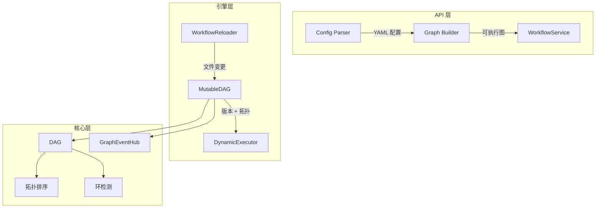
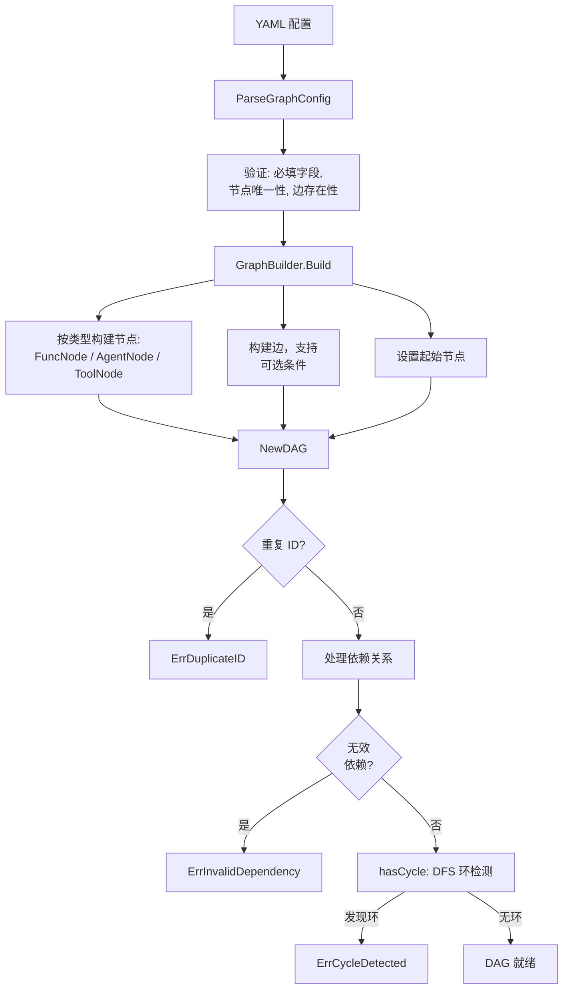
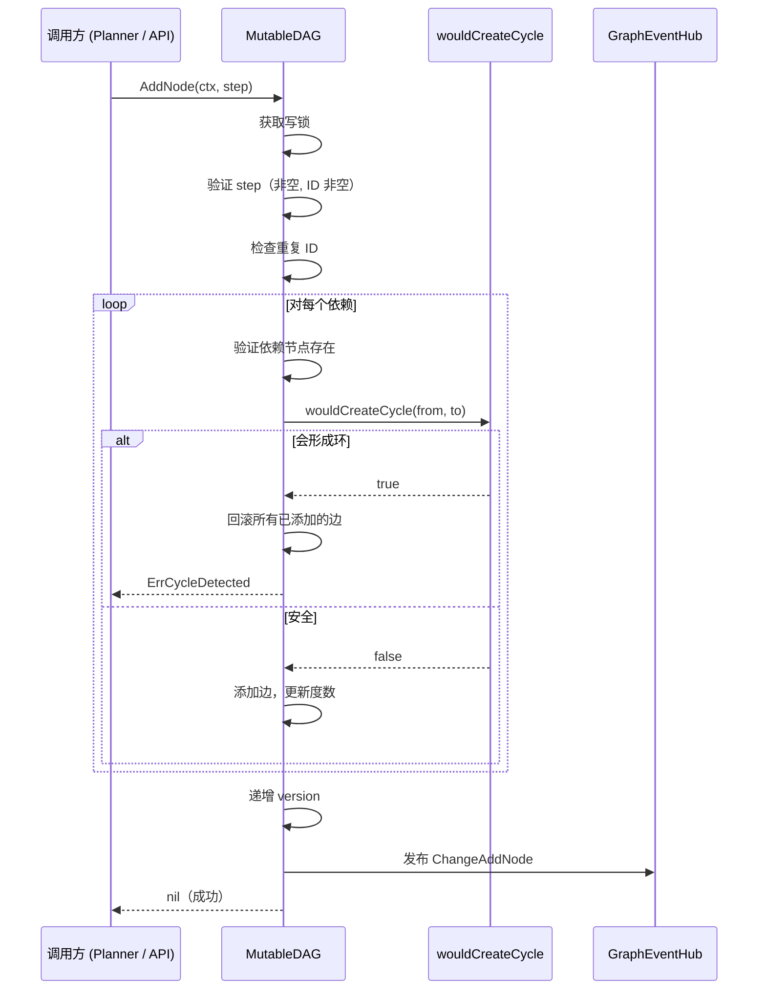
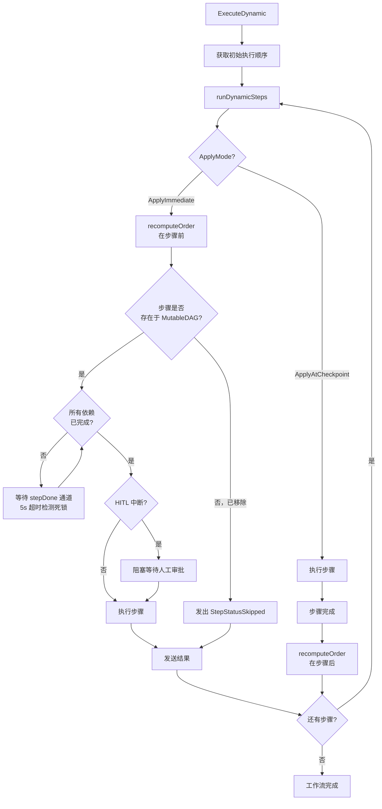
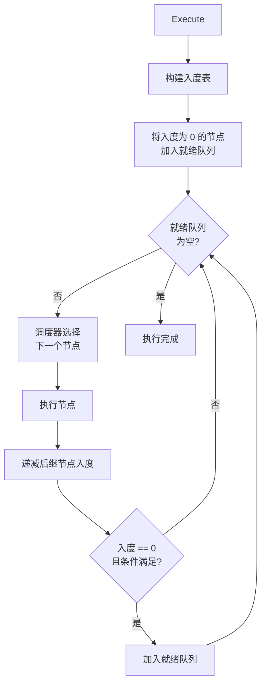
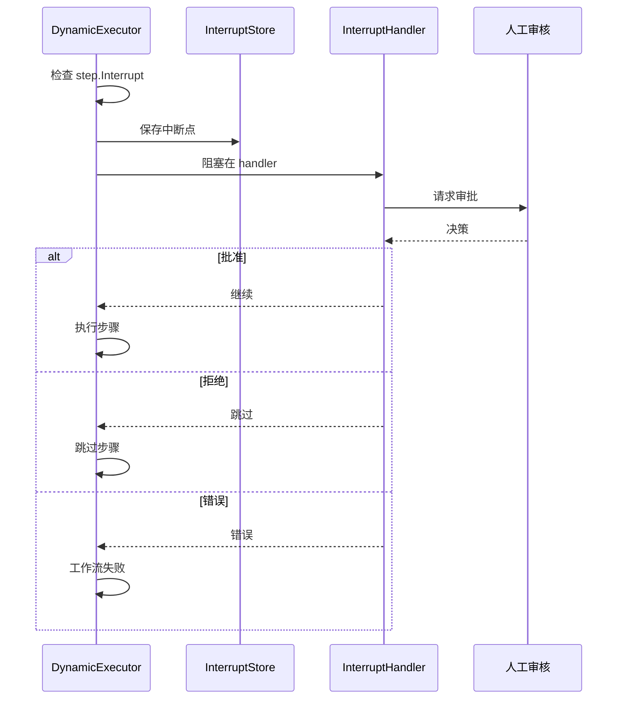

# 动态图

ares 支持运行时图变更 -- 在工作流执行过程中添加节点、删除边、从 YAML 热重载。`DynamicExecutor` 在步骤之间重新计算拓扑排序，无需停止即可应用变更。

## 架构

动态图系统分为三层：



## 核心数据结构

### DAG

不可变图表示（`internal/workflow/engine/types.go`）：

- `Nodes map[string]*DAGNode` -- 节点注册表
- `Edges map[string][]string` -- 邻接表
- 每个 `DAGNode` 跟踪 `InDegree` 和 `OutDegree` 用于拓扑排序

### MutableDAG

线程安全包装器（`internal/workflow/engine/mutable_dag.go`）：

```go
type MutableDAG struct {
    mu      sync.RWMutex
    dag     *DAG
    steps   map[string]*Step
    version uint64
    hub     *GraphEventHub
}

func NewMutableDAG(steps []*Step) (*MutableDAG, error) {
    dag, err := NewDAG(steps)  // 验证 + 环检测
    if err != nil {
        return nil, err
    }
    stepsMap := make(map[string]*Step, len(steps))
    for _, s := range steps {
        stepsMap[s.ID] = s
    }
    return &MutableDAG{dag: dag, steps: stepsMap, hub: NewGraphEventHub()}, nil
}
```

### Step

工作流步骤，包含 `ID`、`Name`、`AgentType`、`Input`、`DependsOn []string`、`Timeout`、`RetryPolicy`、`Interrupt`（HITL 配置）和 `Status`。

## 图生命周期

### 1. 构建



`NewDAG` 运行 `hasCycle()` -- 带递归栈的 DFS。如果当前 DFS 路径中的节点被重新访问，说明存在环。

`GetExecutionOrder()` 使用 Kahn 算法（基于 BFS 的拓扑排序，`internal/workflow/engine/types.go:227-249`）：

```go
func (d *DAG) GetExecutionOrder() ([]string, error) {
    inDegree := make(map[string]int)
    for node := range d.Nodes {
        inDegree[node] = d.Nodes[node].InDegree
    }

    queue := make([]string, 0)
    for node, degree := range inDegree {
        if degree == 0 {
            queue = append(queue, node)
        }
    }

    result := make([]string, 0, len(d.Nodes))
    for len(queue) > 0 {
        node := queue[0]
        queue = queue[1:]
        result = append(result, node)

        for _, neighbor := range d.Edges[node] {
            inDegree[neighbor]--
            if inDegree[neighbor] == 0 {
                queue = append(queue, neighbor)
            }
        }
    }

    if len(result) != len(d.Nodes) {
        return nil, ErrCycleDetected
    }
    return result, nil
}
```

### 2. 运行时变更

所有变更操作都获取写锁，并在应用前验证：



**增量环检测**（`wouldCreateCycle`）：从 `to` 开始 BFS，沿出边遍历。如果 `from` 可从 `to` 到达，则添加边 `from->to` 会形成环。

AddNode 带回滚的实际代码（`internal/workflow/engine/mutable_dag.go:80-123`）：

```go
for _, dep := range step.DependsOn {
    if _, exists := m.dag.Nodes[dep]; !exists {
        // 回滚：移除节点和已添加的边
        delete(m.dag.Nodes, step.ID)
        for _, e := range addedEdges {
            m.removeEdgeFromSlice(e.from, e.to)
            m.dag.Nodes[e.from].OutDegree--
            m.dag.Nodes[e.to].InDegree--
        }
        return ErrInvalidDependency
    }

    // 添加边之前检查环
    if m.wouldCreateCycle(dep, step.ID) {
        // 回滚
        delete(m.dag.Nodes, step.ID)
        for _, e := range addedEdges {
            m.removeEdgeFromSlice(e.from, e.to)
            m.dag.Nodes[e.from].OutDegree--
            m.dag.Nodes[e.to].InDegree--
        }
        return ErrCycleDetected
    }

    m.dag.Edges[dep] = append(m.dag.Edges[dep], step.ID)
    m.dag.Nodes[step.ID].InDegree++
    m.dag.Nodes[dep].OutDegree++
    addedEdges = append(addedEdges, addedEdge{from: dep, to: step.ID})
}

m.steps[step.ID] = step
m.version++
```

BFS 环检测代码（`internal/workflow/engine/mutable_dag.go:407-431`）：

```go
func (m *MutableDAG) wouldCreateCycle(from, to string) bool {
    visited := make(map[string]bool)
    queue := []string{to}

    for len(queue) > 0 {
        current := queue[0]
        queue = queue[1:]

        if current == from {
            return true  // from 可从 to 到达 -> 会形成环
        }

        if visited[current] {
            continue
        }
        visited[current] = true

        for _, neighbor := range m.dag.Edges[current] {
            if !visited[neighbor] {
                queue = append(queue, neighbor)
            }
        }
    }
    return false
}
```

四种变更操作：

| 操作 | 验证 | 回滚 |
|------|------|------|
| `AddNode` | 重复 ID、依赖存在、环检测 | 移除所有已添加的边 + 节点 |
| `RemoveNode` | 无依赖者（`ErrNodeHasDependents`） | N/A（快速失败） |
| `AddEdge` | 两端节点存在、无重复边、环检测 | N/A（快速失败） |
| `RemoveEdge` | 两端节点存在、边存在 | N/A（快速失败） |

### 3. 带变更的执行

`DynamicExecutor` 支持执行过程中的图变更：



**ApplyMode** 控制变更何时生效：
- `ApplyAtCheckpoint`（默认）：每个步骤完成后重新计算顺序
- `ApplyImmediate`：每个步骤开始前重新计算顺序

**recomputeOrder** 是变更集成点。实际代码（`internal/workflow/engine/dynamic_executor.go:576-615`）：

```go
func (e *DynamicExecutor) recomputeOrder(
    mutableDAG *MutableDAG,
    lastVersion *uint64,
    currentOrder *[]string,
    completed map[string]bool,
    processed map[string]bool,
    mu *sync.Mutex,
) {
    // M9 修复：在整个 version 检查和更新期间持有 mu
    // 防止并发调用检测到相同的 version 变更并追加重复步骤
    mu.Lock()
    defer mu.Unlock()

    currentVersion := mutableDAG.Version()
    if *lastVersion == currentVersion {
        return
    }

    newOrder, err := mutableDAG.GetExecutionOrder()
    if err != nil {
        slog.Warn("recomputeOrder failed, keeping existing order", "error", err)
        *lastVersion = currentVersion  // 防止重复检测
        return
    }

    *lastVersion = currentVersion

    // 找出 newOrder 中不在 currentOrder 中的步骤
    existing := make(map[string]bool, len(*currentOrder))
    for _, id := range *currentOrder {
        existing[id] = true
    }
    for _, id := range newOrder {
        if !existing[id] {
            *currentOrder = append(*currentOrder, id)
        }
    }
}
```

`mu` 锁防止两个并发的 `recomputeOrder` 调用都检测到相同的 version 变更并追加重复步骤。

### 4. 热重载

`WorkflowReloader` 监听目录中的文件变更：


- `fsnotify` 实时文件变更事件
- 如果 fsnotify 不可用，回退到 5 秒轮询
- 写锁下的原子交换防止 TOCTOU 竞态
- 传递给回调前深拷贝 workflow map，防止共享状态被修改

## 图执行引擎（基于状态）

`Graph.Execute(ctx, state)` 方法（`internal/workflow/graph/executor.go`）：



三种节点类型：
- **AgentNode** -- 包装 `base.Agent`，调用 `Process(ctx, input)`
- **ToolNode** -- 包装 `core.Tool`，调用 `Execute(ctx, params)`
- **FuncNode** -- 包装 `func(context.Context, *State) error`

三种可插拔调度器：
- **DefaultScheduler** -- FIFO
- **PriorityScheduler** -- 最高优先级优先
- **ShortJobScheduler** -- 最短预估时间优先

条件求值：`hasAnySatisfiedEdge` 防止幽灵执行（所有条件为 false）和静默节点丢失。

## 图事件中心

每次变更通过 `GraphEventHub` 发布 `GraphEvent`：

```go
type GraphEvent struct {
    Change  GraphChange
    Success bool
    Error   error
}

type GraphChange struct {
    Type      ChangeType  // ChangeAddNode, ChangeRemoveNode, ChangeAddEdge, ChangeRemoveEdge
    NodeID    string
    FromID    string
    ToID      string
    Step      *Step
    Timestamp time.Time
}
```

- `Subscribe()` 返回带缓冲的通道（缓冲区大小 64）
- `Publish()` 非阻塞：订阅者缓冲区满时丢弃事件
- `Unsubscribe()` 移除并关闭通道

## HITL（人机协作）

`DynamicExecutor` 在分发每个步骤前检查 `step.Interrupt`：



`InterruptStore` 持久化中断状态用于崩溃恢复。`MemoryInterruptStore` 是内存实现。

## YAML 配置

图配置示例：

```yaml
graph:
  id: my-workflow
  start_node: analyze

  nodes:
    - id: analyze
      type: agent
      description: 分析输入

    - id: decide
      type: function
      description: 根据分析结果路由

    - id: search
      type: tool
      description: 搜索知识库

    - id: generate
      type: agent
      description: 生成回复

  edges:
    - from: analyze
      to: decide

    - from: decide
      to: search
      condition: "confidence < 0.8"

    - from: decide
      to: generate

    - from: search
      to: generate

  agents:
    - id: analyzer
      type: llm
      model: gpt-4

    - id: generator
      type: llm
      model: gpt-4
```

## 配置常量

| 参数 | 默认值 | 说明 |
|------|--------|------|
| `DefaultMaxParallel` | 10 | 最大并行步骤数 |
| `DefaultStepTimeout` | 10s | 单步超时 |
| `DefaultWorkflowTimeout` | 5min | 工作流总超时 |
| `DefaultMaxWorkflowSize` | 100 | 每个工作流最大步骤数 |
| `DefaultMaxDependencies` | 10 | 每个步骤最大依赖数 |
