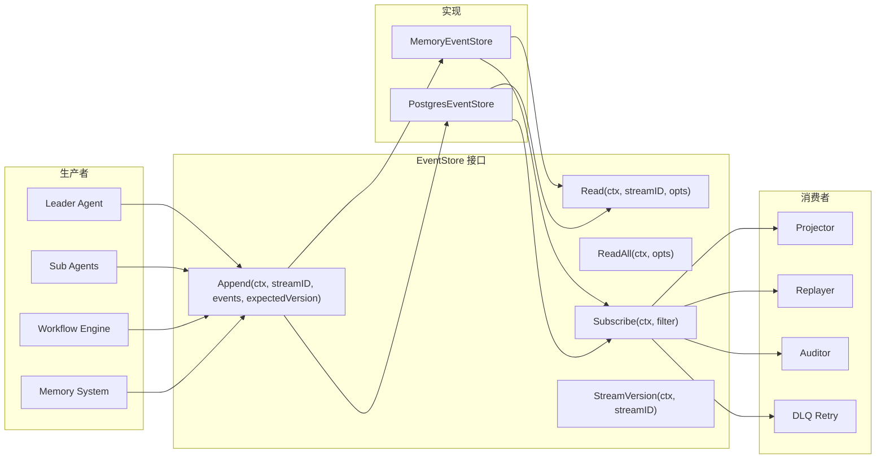
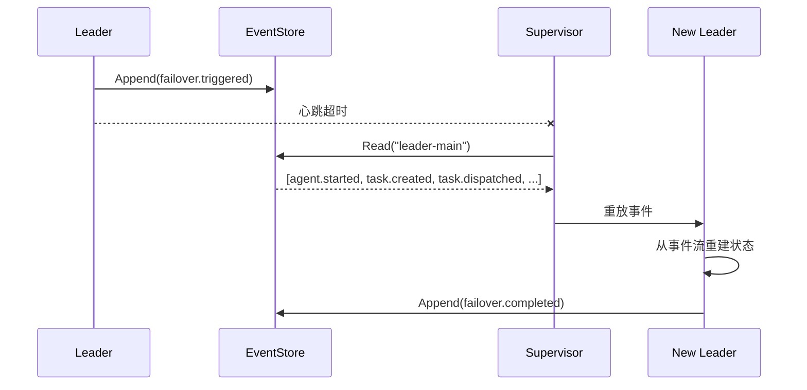

# Event Sourcing

**更新日期**: 2026-06-11

## 概述

Event Sourcing 将每次状态变更记录为不可变事件。系统不覆写当前状态，而是将事件追加到有序日志。当前状态通过重放事件流（从头或从快照）派生。

对 Agent 系统而言，Event Sourcing 的价值在于：

- **可审计性**：每个决策、任务分发、故障转移都带有时间戳和版本号。
- **可重放**：通过重放事件流重建任意 Agent 的状态。对 Leader 故障转移和 Agent 复活至关重要。
- **解耦**：生产者（Leader、Sub-agent、Workflow）独立写入事件。消费者（Projector、Auditor、DLQ）异步订阅和响应。
- **乐观并发控制**：基于版本的冲突检测，防止多 Agent 写入同一 Stream 时静默数据损坏。

## 架构



## Event Types

共 20 种事件类型，按领域分组：

### Agent 生命周期

| 事件 | Type | 说明 |
|------|------|------|
| Agent Started | `agent.started` | Agent 实例启动 |
| Agent Stopped | `agent.stopped` | Agent 正常停止 |
| Agent Failed | `agent.failed` | Agent 遇到致命错误 |
| Agent Recovered | `agent.recovered` | Agent 从故障中恢复 |

### Task 生命周期

| 事件 | Type | 说明 |
|------|------|------|
| Task Created | `task.created` | Leader 创建新任务 |
| Task Dispatched | `task.dispatched` | 任务分发给 Sub-agent |
| Task Completed | `task.completed` | 任务执行成功 |
| Task Failed | `task.failed` | 任务执行失败 |

### Session 与 Memory

| 事件 | Type | 说明 |
|------|------|------|
| Session Created | `session.created` | 新会话创建 |
| Message Added | `message.added` | 消息添加到会话 |
| Memory Distilled | `memory.distilled` | Memory 蒸馏管线完成 |

### Workflow

| 事件 | Type | 说明 |
|------|------|------|
| Workflow Started | `workflow.started` | DAG 工作流开始执行 |
| Step Completed | `step.completed` | Workflow Step 完成 |
| Step Failed | `step.failed` | Workflow Step 失败 |
| Step Skipped | `step.skipped` | Workflow Step 跳过（依赖失败） |

### Tool 与 LLM

| 事件 | Type | 说明 |
|------|------|------|
| Tool Called | `tool.called` | 工具被调用时触发 |
| Tool Failed | `tool.failed` | 工具调用失败时触发 |
| LLM Call | `llm.call` | LLM 被调用时触发 |

### Failover

| 事件 | Type | 说明 |
|------|------|------|
| Failover Triggered | `failover.triggered` | Leader 故障转移启动 |
| Failover Completed | `failover.completed` | 故障转移完成，新 Leader 上线 |

## 核心类型

### Event

```go
// Event represents something that happened in the system.
type Event struct {
    ID        string         `json:"id"`
    StreamID  string         `json:"stream_id"`
    Type      EventType      `json:"type"`
    Payload   map[string]any `json:"payload"`
    Metadata  map[string]any `json:"metadata,omitempty"`
    Version   int64          `json:"version"`
    Timestamp time.Time      `json:"timestamp"`
}
```

每个事件属于一个 **Stream**（由 `StreamID` 标识）。`Version` 字段在每个 Stream 内单调递增，用于乐观并发控制。

### EventStore 接口

```go
// EventStore defines the interface for appending, reading, and subscribing to events.
type EventStore interface {
    Append(ctx context.Context, streamID string, events []*Event, expectedVersion int64) error
    Read(ctx context.Context, streamID string, opts ReadOptions) ([]*Event, error)
    ReadAll(ctx context.Context, opts ReadOptions) ([]*Event, error)
    Subscribe(ctx context.Context, filter EventFilter) (<-chan *Event, error)
    StreamVersion(ctx context.Context, streamID string) (int64, error)
}
```

### 哨兵错误

| 错误 | 含义 |
|------|------|
| `ErrVersionConflict` | Append 时乐观并发冲突 |
| `ErrStreamNotFound` | 请求的 Stream 不存在 |
| `ErrEventStoreClosed` | Store 已关闭，拒绝操作 |

## 用法

### 创建和追加事件

```go
store := events.NewMemoryEventStore()

// 创建事件
evt := &events.Event{
    Type:    events.EventTaskCreated,
    Payload: map[string]any{"task_id": "task-1", "description": "analyze data"},
}

// 追加到 Stream（expectedVersion=0 表示新 Stream）
err := store.Append(ctx, "leader-main", []*events.Event{evt}, 0)
if err != nil {
    log.Fatal(err)
}
```

### 读取事件

```go
// 读取 Stream 的所有事件
evts, err := store.Read(ctx, "leader-main", events.ReadOptions{})

// 分页和过滤
evts, err := store.Read(ctx, "leader-main", events.ReadOptions{
    FromVersion: 5,
    Limit:       10,
    Direction:   events.ReadAscending,
})

// 读取指定时间之后的事件
evts, err := store.Read(ctx, "leader-main", events.ReadOptions{
    Since: time.Now().Add(-1 * time.Hour),
})

// 跨 Stream 读取
allEvts, err := store.ReadAll(ctx, events.ReadOptions{
    Direction: events.ReadDescending,
    Limit:     100,
})
```

### 订阅事件

```go
filter := events.EventFilter{
    Types: []events.EventType{
        events.EventTaskCompleted,
        events.EventTaskFailed,
    },
}

ch, err := store.Subscribe(ctx, filter)

go func() {
    for evt := range ch {
        fmt.Printf("Task event: %s at %v\n", evt.Type, evt.Timestamp)
    }
}()
```

### 乐观并发控制

```go
// 读取当前版本
version, _ := store.StreamVersion(ctx, "leader-main")

// 带预期版本追加 - 如果其他写入者已变更 Stream 则失败
err := store.Append(ctx, "leader-main", newEvents, version)
if errors.Is(err, events.ErrVersionConflict) {
    // 重新读取并重试
}
```

## 实现

### MemoryEventStore

用于开发、测试和原型验证的内存存储。不适用于生产环境。

```go
store := events.NewMemoryEventStore()
defer store.Close()

// 所有操作线程安全（内部使用 sync.RWMutex）
_ = store.Append(ctx, "stream-1", events, 0)
evts, _ := store.Read(ctx, "stream-1", events.ReadOptions{})
```

特性：
- 通过 `sync.RWMutex` 保证线程安全
- 非阻塞订阅通知（缓冲区满时丢弃事件）
- `Close()` 时自动清理所有订阅 channel

### PostgresEventStore

基于 PostgreSQL 的生产级存储，支持事务写入。

```go
pool, _ := postgres.NewPool(ctx, cfg)
store := events.NewPostgresEventStore(pool)

// 相同接口，持久化存储
_ = store.Append(ctx, "leader-main", events, 0)
```

特性：
- 事务性追加，行级锁定
- `UNIQUE(stream_id, version)` 约束在数据库层面捕获并发冲突
- 基于轮询的订阅（1 秒间隔），使用游标分页
- 错误时自动回滚

需要 `events` 表：

```sql
CREATE TABLE events (
    id          TEXT PRIMARY KEY,
    stream_id   TEXT NOT NULL,
    type        TEXT NOT NULL,
    payload     JSONB NOT NULL DEFAULT '{}',
    metadata    JSONB,
    version     BIGINT NOT NULL,
    created_at  TIMESTAMPTZ NOT NULL DEFAULT NOW(),
    UNIQUE (stream_id, version)
);
CREATE INDEX idx_events_stream_version ON events (stream_id, version);
CREATE INDEX idx_events_created_at ON events (created_at);
```

## 与 Leader 故障转移的集成

Event Sourcing 用完整的事件日志替代基于 Checkpoint 的恢复。不再依赖周期性快照，而是记录每次状态转换：



新 Leader 重放事件流以重建：
- 哪些任务已分发但未完成
- 哪些 Agent 处于活跃状态
- 最后的会话状态

这比 Checkpoint 更可靠，因为快照之间的状态不会丢失。

## DLQ 自动重试

失败的消息处理与 `internal/ares_protocol/ahp/dlq.go` 中的 Dead Letter Queue (DLQ) 集成。`DLQProcessor` 在可配置的间隔内重试失败的条目：

```go
dlq := ahp.NewDLQ(10000)
processor := ahp.NewDLQProcessor(dlq)

// 注册特定失败原因的处理器
processor.RegisterHandler("timeout", func(ctx context.Context, entry *ahp.DLQEntry) error {
    // 重试消息
    return retryMessage(ctx, entry.Message)
})

// 启动后台自动重试（内部使用 errgroup）
processor.StartAutoRetry(ctx, 30*time.Second)
```

关键行为：
- `MaxRetries > 0` 的条目耗尽重试次数后被跳过
- `MaxRetriesUnlimited`（0）表示无限重试
- 成功处理的条目从 DLQ 中移除
- 通过 `processor.Stats()` 获取统计信息（已处理、失败计数）

## 可靠性

### 事件丢失防护

- **MemoryEventStore**：仅内存存储，进程崩溃时丢失。用于测试。
- **PostgresEventStore**：持久化到 PostgreSQL，带 WAL。崩溃后可恢复。用于生产。
- 订阅 channel 缓冲区大小为 1。缓冲区满时丢弃事件（非阻塞）。消费者必须及时消费。

### 版本冲突处理

当两个写入者并发追加同一 Stream 时：

1. 写入者 A 读取 version=5，准备事件
2. 写入者 B 读取 version=5，先追加（version 变为 6）
3. 写入者 A 以 expectedVersion=5 追加，收到 `ErrVersionConflict`
4. 写入者 A 重新读取（version=6），以 expectedVersion=6 重试

这是乐观并发控制。读-改-写周期内不持有锁。PostgreSQL 实现通过 `UNIQUE(stream_id, version)` 约束作为安全网。

## 性能数据

平台：darwin/arm64, Apple M3 Max, Go 1.26.4

| 操作 | ns/op | allocs/op | 说明 |
|------|-------|-----------|------|
| Append（单事件） | 489 | 7 | 单 Stream，100 个轮询 |
| Append（批量 100） | 4,349 | 1 | 每次追加 100 个事件 |
| Read（1000 事件） | 5,757 | 11 | 完整 Stream 扫描 |
| ReadAll（10,000 事件） | 36,391 | 3 | 10 Stream x 1000 事件 |
| Subscribe（100 订阅） | 118,892 | 799 | 100 个过滤订阅 |
| Concurrent Append | 707 | 6 | 并行写入，50 Stream |

以上均为 MemoryEventStore 的 benchmark。PostgreSQL 性能取决于连接池、磁盘 I/O 和索引配置。

## 配置

`MemoryEventStore` 无需外部配置。

`PostgresEventStore` 需要传入已有的 `postgres.Pool`：

```go
pool, err := postgres.NewPool(ctx, &postgres.Config{
    Host:     "localhost",
    Port:     5433,
    Database: "ARES",
    User:     "postgres",
    Password: "postgres",
})
if err != nil {
    log.Fatal(err)
}

store := events.NewPostgresEventStore(pool)
```

## 源码文件

| 文件 | 说明 |
|------|------|
| `internal/ares_events/types.go` | Event 结构体、EventType 常量、ReadOptions、EventFilter |
| `internal/ares_events/store.go` | EventStore 接口、NewEventID |
| `internal/ares_events/memory_store.go` | 内存实现 |
| `internal/ares_events/pg_store.go` | PostgreSQL 实现 |
