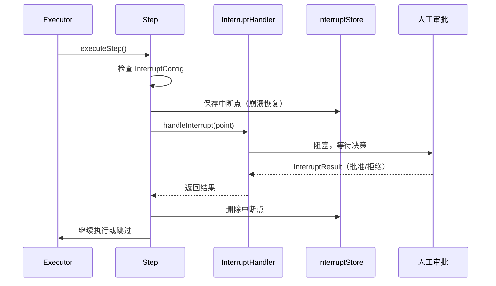

# Human-in-the-Loop（人机协作）

**更新日期**: 2026-06-11

## 概述

Human-in-the-Loop（HITL）允许工作流步骤暂停执行，等待人工审批后继续。适用于审批工作流、审查门禁以及任何需要人工监督的自动化决策场景。

## 架构图



## 核心组件

### InterruptConfig

标记步骤需要人工审批。定义在 `internal/workflow/engine/types.go` 的 `Step` 结构体上：

```go
type InterruptConfig struct {
    Message string         `json:"message"`
    Payload map[string]any `json:"payload,omitempty"`
}
```

在任意步骤上添加：

```go
step := &engine.Step{
    ID:        "deploy-production",
    Name:      "部署到生产环境",
    AgentType: "deployer",
    DependsOn: []string{"staging-test"},
    Interrupt: &engine.InterruptConfig{
        Message: "准备部署到生产环境，是否批准？",
        Payload: map[string]any{
            "environment": "production",
            "version":     "v2.1.0",
        },
    },
}
```

### InterruptPoint

表示暂停的执行点。当执行器到达带 `Interrupt` 配置的步骤时自动创建：

```go
type InterruptPoint struct {
    StepID  string         `json:"step_id"`
    Message string         `json:"message"`
    Payload map[string]any `json:"payload,omitempty"`
}
```

### InterruptResult

携带人工决策结果：

```go
type InterruptResult struct {
    Approved bool           `json:"approved"`
    Feedback string         `json:"feedback,omitempty"`
    Data     map[string]any `json:"data,omitempty"`
}
```

### InterruptHandler

执行到达中断点时调用的函数，阻塞直到人工输入：

```go
type InterruptHandler func(ctx context.Context, point *InterruptPoint) (*InterruptResult, error)
```

### InterruptStore

持久化中断状态以支持崩溃恢复。如果执行器在等待人工输入时崩溃，中断点可以存活并恢复：

```go
type InterruptStore interface {
    Save(ctx context.Context, executionID string, point *InterruptPoint) error
    Load(ctx context.Context, executionID string, stepID string) (*InterruptResult, error)
    Delete(ctx context.Context, executionID string, stepID string) error
    ListPending(ctx context.Context, executionID string) ([]*InterruptPoint, error)
    SaveResult(ctx context.Context, executionID string, stepID string, result *InterruptResult) error
}
```

内置 `MemoryInterruptStore` 用于开发和测试。

## 与 DynamicExecutor 集成

`Executor` 通过 Builder 方法支持 HITL：

```go
executor := engine.NewExecutor(registry).
    WithHitlHandler(func(ctx context.Context, point *engine.InterruptPoint) (*engine.InterruptResult, error) {
        // 发送通知给审批人
        fmt.Printf("步骤 %q 需要审批: %s\n", point.StepID, point.Message)

        // 阻塞直到人工响应（通过 API、Webhook 或 CLI）
        result := waitForHumanDecision(point)

        return result, nil
    }).
    WithHitlStore(engine.NewMemoryInterruptStore())
```

执行器在执行每个步骤前调用 `handleInterrupt`。如果步骤没有 `Interrupt` 配置，正常执行。如果人工拒绝，步骤标记为 `skipped`。

## 执行流程

1. 执行器到达带 `Interrupt` 配置的步骤
2. 中断点持久化到 `InterruptStore`（崩溃恢复）
3. 调用 `InterruptHandler`，阻塞直到人工输入
4. 批准：步骤正常执行，中断状态清理
5. 拒绝：步骤跳过，返回 `"rejected by human"` 错误
6. Handler 失败：步骤以 Handler 错误失败

## 使用场景

**审批工作流**
```go
Steps: []*engine.Step{
    {ID: "draft", Name: "生成草稿", AgentType: "writer"},
    {ID: "review", Name: "人工审查", AgentType: "reviewer",
     Interrupt: &engine.InterruptConfig{
         Message: "审查草稿并批准发布",
     }},
    {ID: "publish", Name: "发布", AgentType: "publisher",
     DependsOn: []string{"review"}},
}
```

**审查门禁**
```go
Steps: []*engine.Step{
    {ID: "code-gen", Name: "生成代码", AgentType: "coder"},
    {ID: "security-scan", Name: "安全扫描", AgentType: "scanner",
     DependsOn: []string{"code-gen"}},
    {ID: "deploy-gate", Name: "部署审批", AgentType: "deployer",
     DependsOn: []string{"security-scan"},
     Interrupt: &engine.InterruptConfig{
         Message: "安全扫描通过，是否批准部署？",
         Payload: map[string]any{"scan_result": "passed"},
     }},
}
```

## 错误处理

| 场景 | 行为 |
|------|------|
| 步骤无 `Interrupt` | 正常执行，不暂停 |
| `InterruptHandler` 为 nil | 步骤失败，返回 `ErrInterruptHandlerNil` |
| 人工拒绝 | 步骤跳过，返回 `ErrInterruptRejected` |
| Handler 返回 error | 步骤以 Handler 错误失败 |
| Handler 返回 nil result | 步骤失败，返回 "nil result" 错误 |
| Context 取消 | Handler 应监听 `ctx.Done()` |

## 配置参数

| 组件 | 位置 | 说明 |
|------|------|------|
| `InterruptConfig` | `Step.Interrupt` | 标记步骤需要 HITL |
| `InterruptHandler` | `Executor.hitlHandler` | 阻塞等待人工输入 |
| `InterruptStore` | `Executor.hitlStore` | 持久化中断状态 |
| `MemoryInterruptStore` | `engine` 包 | 内存存储（开发测试） |

## 注意事项

- 批准后中断状态自动清理，无残留数据
- `InterruptStore` 可选；传 nil 跳过崩溃恢复
- Handler 在步骤 goroutine 内运行，需响应 context 取消
- 生产环境建议实现持久化 `InterruptStore`（如 PostgreSQL）
