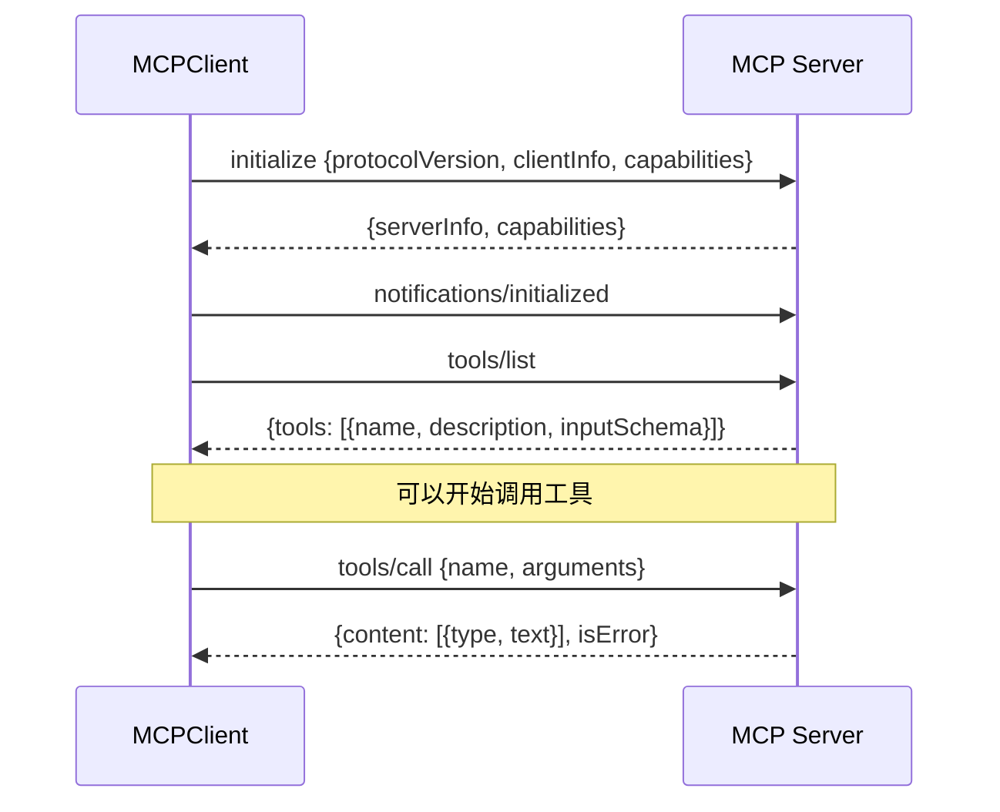
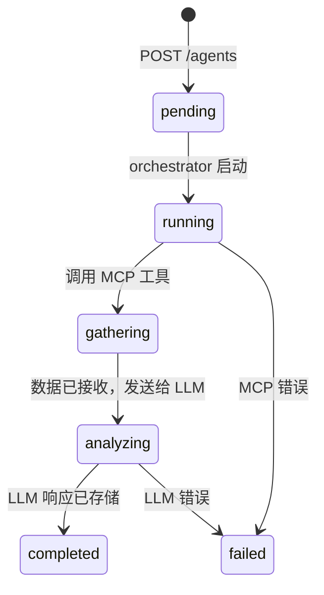
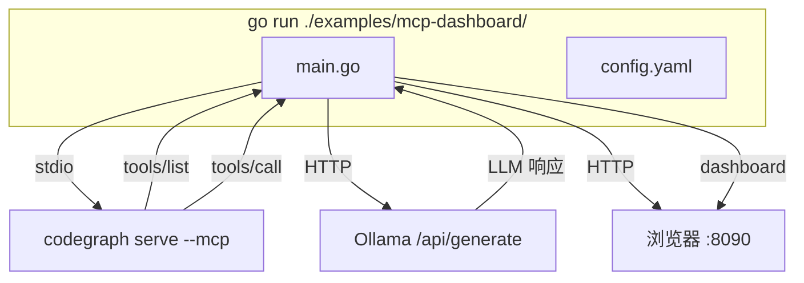

# MCP Client + Web Dashboard

## 1. 为什么这么设计

### 问题

ares agent 需要分析代码，但：
- 内置工具（calculator、datetime、text）无法理解代码库
- 硬编码工具集成意味着每个新数据源（GitHub、Jira、DB）都需要改代码
- 没有办法实时看到 agent 在做什么

### 思路

**MCP Client**：不重新造工具集成的轮子。MCP 是开放协议 — 任何实现它的服务器都能接入 ares。客户端自动发现工具，所以添加新数据源 = 运行新 MCP 服务器，零代码改动。

**Dashboard**：不构建复杂的监控系统。一个 HTTP 服务器 + 6 个端点 + WebSocket 覆盖了观测（agent 在做什么？）和交互（启动新 agent）。无数据库、无消息队列、无前端构建步骤。

### 取舍

| 决策 | 选择 | 备选方案 | 原因 |
|------|------|---------|------|
| 工具发现 | 通过 `tools/list` 自动发现 | 每个工具手动配置 | MCP 服务器比我们更了解自己的工具 |
| 工具命名 | `mcp.<server>.<tool>` | 扁平命名 | 防止两个服务器有同名工具时冲突 |
| 传输层 | stdio + SSE | 只用 stdio | SSE 支持远程服务器，stdio 对本地更简单 |
| Schema 桥接 | JSON Schema → ParameterSchema | 保留 JSON Schema | 现有校验管线期望 ParameterSchema，没理由改它 |
| Dashboard 后端 | 标准库 `net/http` | Gin、Echo、Fiber | 6 个端点不需要引入新框架 |
| Dashboard 前端 | 原生 JS、go:embed | React、Vue、构建工具 | SPA 约 200 行，不值得引入构建工具链 |
| 状态存储 | 内存 | PostgreSQL | Dashboard 是只读观测工具，不是数据库 |
| Agent 执行 | 每个 agent 一个 goroutine | Worker pool | Agent 是 I/O 密集型（MCP + LLM 调用），goroutine 很轻量 |

### 当前不支持的（及原因）

- **MCP resource/prompt 协议**：只实现了 tools。Resources 和 prompts 是 MCP 扩展，很少有服务器用。需要时再加。
- **传输层重连**：SSE 断开后客户端停止。重连增加复杂度（状态重放、重复检测）。有真实需求时再做。
- **Agent 持久化**：Agent 存在内存中。进程重启后历史丢失。这是有意的 — dashboard 是开发/调试工具，不是生产数据库。
- **多用户认证**：Dashboard 没有认证。设计用于本地开发。如需外部访问，加反向代理 + 认证。

---

## 2. MCP Client

### 2.1 协议流程



### 2.2 工具发现 vs 用户定制

**两者都支持。**

自动发现在连接时发生 — `tools/list` 返回服务器暴露的所有工具。不需要为单个工具做配置。

定制在 API 层发生 — 用户可以针对任何已发现的工具创建自定义 agent，指定参数和 prompt：

```bash
# 自动发现：直接用工具名
curl -X POST /agents -d '{"mcp_tool":"codegraph_search","mcp_args":{"search":"func main"}}'

# 自定义 prompt：覆盖 LLM 解读数据的方式
curl -X POST /agents -d '{"mcp_tool":"codegraph_context","mcp_args":{"task":"..."},"llm_prompt":"你的自定义分析指令..."}'
```

### 2.3 Schema 转换

MCP 用 JSON Schema 描述工具参数。ares 用 `ParameterSchema`。桥接：

```
JSON Schema                    ParameterSchema
─────────────────────────────  ─────────────────────────────
type: "object"            →    Type: "object"
properties.name.type      →    Properties["name"].Type
properties.name.enum      →    Properties["name"].Enum
properties.name.minimum   →    Properties["name"].Min
required: ["name"]        →    Required: []string{"name"}
```

这是有损转换 — JSON Schema 支持嵌套对象、数组、oneOf 等 ParameterSchema 不支持的。对于 MCP 工具（通常是扁平参数 schema），这够用。复杂 schema 需要更丰富的参数模型。

### 2.4 传输层选择

**stdio**：启动子进程。简单，无网络配置。用于本地工具如 codegraph。

**SSE**：基于 HTTP。支持远程服务器、认证头。用于 MCP 服务器在其他机器上的场景。

接口相同 — 换传输层是改配置，不是改代码。

### 2.5 添加自定义 MCP 服务器

任何通过 stdio 或 HTTP SSE 实现 MCP 协议的进程都能用。最小实现：

1. 响应 `initialize`，返回服务器信息
2. 响应 `tools/list`，返回工具定义
3. 响应 `tools/call`，返回结果

配置：

```yaml
mcp:
  servers:
    - name: my-server
      transport:
        type: stdio
        stdio:
          command: /path/to/my-mcp-server
          args: ["--config", "my-config.json"]
```

---

## 3. Dashboard 与 Agent 编排

### 3.1 API

```
GET  /                → {uptime, agents, mcp_servers, mcp_tools}
GET  /agents          → [{id, name, status, progress, mcp_tool, analysis, ...}]
POST /agents          → 创建 agent {template_id} 或 {name, mcp_tool, llm_prompt}
GET  /agents/{id}     → agent 详情，包含完整 LLM 分析文本
GET  /mcp             → [{name, connected, tools: [{name, description}]}]
GET  /ws              → WebSocket 实时更新
```

### 3.2 Agent 生命周期



每次状态变更通过 WebSocket 广播到 `agents` 频道订阅者。

### 3.3 前端编排 — 工作原理

Dashboard 的 Orchestrator 标签页提供：

**模板选择**：下拉菜单，预配置分析类型（Architecture Review、Error Handling、Concurrency、Impact、API Surface）。选择模板自动填充 MCP 工具。

**自定义 Agent 创建**：用户可以指定：
- Agent 名称（自由文本）
- MCP 工具（从已发现的工具中选择）
- LLM prompt（自由文本，支持 `{{.raw_data}}` 占位符）

**实时状态**：每个 agent 显示：
- 状态标签（pending/running/completed/failed）
- 进度条（10% → 50% → 100%）
- 耗时
- 点击 "View" 查看完整 LLM 分析

**WebSocket 更新**：agent 完成时，Agents 标签页自动刷新。无需手动轮询。

```mermaid
graph LR
    subgraph "浏览器"
        SELECT[选择模板]
        CLICK[点击 Launch]
        VIEW[查看结果]
    end

    subgraph "API"
        POST[POST /agents]
        GET[GET /agents/:id]
        WS[/ws WebSocket]
    end

    subgraph "后端"
        ORCH[Orchestrator]
        MCP[MCP Client]
        LLM[LLM]
    end

    SELECT --> CLICK --> POST --> ORCH
    ORCH --> MCP --> ORCH
    ORCH --> LLM --> ORCH
    ORCH -->|广播| WS --> VIEW
    VIEW --> GET
```

### 3.4 现在能做什么

| 操作 | 方式 |
|------|------|
| 查看所有 agent | Dashboard → Agents 标签页，或 `GET /agents` |
| 启动预置分析 | Dashboard → Orchestrator → 选模板 → Launch |
| 启动自定义分析 | `POST /agents`，指定 `mcp_tool` + `llm_prompt` |
| 观看 agent 进度 | Agents 标签页通过 WebSocket 自动刷新 |
| 阅读完整分析 | 点击已完成 agent 的 "View" |
| 查看 MCP 工具 | Dashboard → MCP 标签页，或 `GET /mcp` |
| 按状态过滤 agent | `GET /agents?status=completed` |
| 定期审查 | `go run . -interval 300`（每 5 分钟） |

### 3.5 可以扩展的功能

| 功能 | 工作量 | 价值 |
|------|--------|------|
| Agent 链式执行（A 的输出 → B 的输入） | 中 | 多步分析管线 |
| UI 中的 prompt 编辑器 | 低 | 无代码创建 agent |
| 结果对比（两次分析的 diff） | 中 | 跟踪代码质量变化 |
| Agent 取消 | 低 | 停止长时间运行的 agent |
| 导出结果（Markdown、JSON） | 低 | 分享分析报告 |
| 认证（API key 或 OAuth） | 中 | 多用户 / 外部访问 |

这些尚未实现。当前系统聚焦核心循环：发现工具 → 启动 agent → 查看结果。

---

## 4. 示例：Code Review 服务

### 4.1 功能

独立二进制。连接 codegraph MCP + Ollama，运行分析 agent，提供 dashboard。



### 4.2 Agent 模板

| 模板 | MCP 工具 | 分析内容 |
|------|---------|---------|
| Architecture Review | `codegraph_files` | 包组织、依赖流向、入口点 |
| Error Handling Review | `codegraph_context` | 错误包装模式、哨兵错误、被吞掉的错误 |
| Concurrency Review | `codegraph_context` | goroutine 管理、竞态条件、mutex 使用 |
| Change Impact Analysis | `codegraph_impact` | 接口变更会破坏什么、迁移策略 |
| API Surface Review | `codegraph_search` | 接口大小、命名一致性、构造器模式 |

### 4.3 运行

```bash
# 前置条件
ollama pull llama3.2
npm install -g codegraph && codegraph index /path/to/project

# 启动
make demo-mcp TARGET=/path/to/project ADDR=:8090

# 或直接运行
go run ./examples/mcp-dashboard/ -config ./examples/mcp-dashboard/config.yaml -target /path/to/project -interval 300
```

### 4.4 配置

```yaml
llm:
  provider: "ollama"              # "openai", "ollama", "openrouter"
  base_url: "http://localhost:11434"
  model: "llama3.2"
  timeout: 120

mcp:
  servers:
    - name: codegraph
      transport:
        type: stdio
        stdio:
          command: codegraph
          args: ["serve", "--mcp"]

dashboard:
  addr: ":8090"
```

依赖：codegraph 二进制 + 本地运行的 Ollama。无数据库。

---

## 5. 文件布局

```
internal/mcp/               # MCP 客户端实现
├── jsonrpc.go              # JSON-RPC 2.0 类型、编解码
├── transport.go            # Transport 接口
├── transport_stdio.go      # Stdio 子进程传输
├── transport_sse.go        # HTTP SSE 传输
├── types.go                # MCP 协议类型
├── client.go               # MCPClient（连接、握手、调用）
├── mcp_tool.go             # MCPTool（core.Tool 桥接）
├── schema.go               # JSON Schema → ParameterSchema
├── manager.go              # MCPManager（多服务器）
├── factory.go              # MCPToolFactory（PluginRegistry）
└── *_test.go               # 42 个测试

internal/dashboard/          # Dashboard + 编排
├── api.go                  # 统一 API v2（6 个端点）
├── orchestrator.go         # Agent 生命周期管理
├── service.go              # DashboardService（旧桥接）
├── types.go                # 视图类型
├── ws.go                   # WebSocket 消息类型
├── ws_hub.go               # WebSocket hub（频道发布/订阅）
├── event_bridge.go         # EventStore → WebSocket
├── static.go               # go:embed
├── static/                 # SPA（HTML + JS + CSS，无构建）
└── *_test.go               # 56 个测试

examples/mcp-dashboard/      # 独立服务
├── main.go                 # 连接 MCP + LLM，提供 dashboard
└── config.yaml
```
