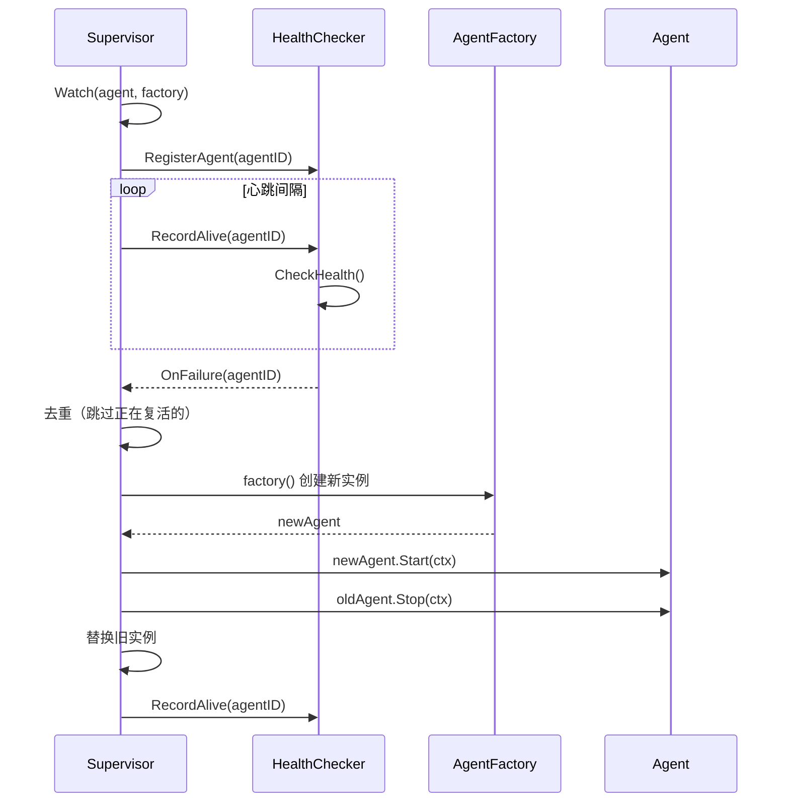

# Agent 复活插件

**更新日期**: 2026-06-11

## 概述

复活插件提供可插拔的 Agent 复活能力。任意 Agent 类型都可以被监控并在故障时自动重建。插件通过 `HealthChecker` 接口将健康检测与复活逻辑解耦。

## 架构图



## 核心组件

### HealthChecker 接口

抽象健康检测。实现可以是心跳监控、HTTP 探针或进程监控：

```go
type HealthChecker interface {
    RegisterAgent(agentID string)
    UnregisterAgent(agentID string)
    RecordAlive(agentID string)
    CheckHealth() []string
    OnFailure(fn func(agentID string))
}
```

### AgentFactory

创建新的 Agent 实例。每次调用必须返回新实例——复用旧实例可能携带过期状态：

```go
type AgentFactory func() base.Agent
```

### Supervisor

监控 Agent 并在故障时复活。仅依赖 `HealthChecker` 接口：

```go
type Supervisor struct {
    // 未导出字段
}
```

关键方法：
- `Watch(agent, factory)` — 注册 Agent 进行监控
- `Unwatch(agentID)` — 停止监控
- `Start(ctx)` — 启动监控循环
- `Stop()` — 优雅停止
- `Agent(agentID)` — 获取当前实例
- `Stats()` — Supervisor 统计信息

### HeartbeatAdapter

将 `ahp.HeartbeatMonitor` 桥接到 `HealthChecker` 接口，解耦复活插件与 AHP 包：

```go
type HeartbeatAdapter struct {
    mon       *ahp.HeartbeatMonitor
    onFailure func(agentID string)
}

func NewHeartbeatAdapter(mon *ahp.HeartbeatMonitor) *HeartbeatAdapter
```

### Config

```go
type Config struct {
    CheckInterval     time.Duration `yaml:"check_interval"`
    ResurrectTimeout  time.Duration `yaml:"resurrect_timeout"`
    MaxAttempts       int           `yaml:"max_attempts"`
    HeartbeatInterval time.Duration `yaml:"heartbeat_interval"`
}
```

| 参数 | 默认值 | 说明 |
|------|--------|------|
| `CheckInterval` | 10s | 健康探测间隔 |
| `ResurrectTimeout` | 60s | 单次复活超时 |
| `MaxAttempts` | 3 | 单次复活最大重试次数 |
| `HeartbeatInterval` | 5s | 心跳发送间隔 |

## 使用示例

```go
// 创建心跳监控
hbMon := ahp.NewHeartbeatMonitor(&ahp.HeartbeatConfig{
    Interval:  2 * time.Second,
    Timeout:   3 * time.Second,
    MaxMissed: 2,
})

// 创建复活插件（使用心跳适配器）
health := resurrection.NewHeartbeatAdapter(hbMon)
supervisor, err := resurrection.New(health, resurrection.Config{
    CheckInterval:     3 * time.Second,
    HeartbeatInterval: 2 * time.Second,
})

// 注册 Agent 和工厂函数
agent := newWorker("worker-1", models.AgentTypeBottom)
agent.Start(ctx)

supervisor.Watch(agent, func() base.Agent {
    return newWorker("worker-1", models.AgentTypeBottom)
})

// 启动监控
supervisor.Start(ctx)

// 故障时：Supervisor 通过 HealthChecker 检测，
// 调用工厂函数，启动新实例，停止旧实例。
```

<<<<<<< HEAD
完整示例：`examples/v2_demo/agent_resurrection/main.go`
=======
完整示例：`examples/advanced/agent_resurrection/main.go`
>>>>>>> 3f3093d ( feat(v2): runtime layer, event sourcing, dynamic workflow, HITL, pluggable vector store + 50 bug fixes)

## 复活流程

1. **检测**: `HealthChecker.CheckHealth()` 返回故障 Agent ID
2. **回调**: `OnFailure` 回调触发 Supervisor 的 `onFailure`
3. **去重**: 跳过正在复活的 Agent
4. **创建新实例**: 调用 `AgentFactory`，最多重试 `MaxAttempts` 次
5. **启动新实例**: 带超时调用 `newAgent.Start(ctx)`
6. **停止旧实例**: 调用 `oldAgent.Stop(ctx)` 释放资源
7. **替换**: 在 watched map 中用新实例替换旧实例
8. **记录存活**: 为新实例发送心跳

## 统计信息

```go
stats := supervisor.Stats()
// Stats{
//     Watched:    3,
//     Alive:      3,
//     Resurrects: 1,
//     Statuses:   map[string]string{"worker-1": "ready", "worker-2": "ready"},
// }
```

## 错误处理

| 场景 | 行为 |
|------|------|
| `HealthChecker` 为 nil | `New()` 返回 `ErrNilHealthChecker` |
| Factory 返回 nil | 重试最多 `MaxAttempts` 次，然后记录错误 |
| `Start()` 失败 | 重试最多 `MaxAttempts` 次 |
| 所有尝试耗尽 | 记录错误，Agent 保持 offline |
| Context 取消 | 停止复活尝试 |
| 已在复活中 | 跳过重复（去重） |

## 自定义 HealthChecker

实现 `HealthChecker` 接口用于非心跳的健康检测：

```go
type HTTPProbe struct {
    endpoints map[string]string
    onFailure func(string)
}

func (p *HTTPProbe) RegisterAgent(agentID string)    { /* ... */ }
func (p *HTTPProbe) UnregisterAgent(agentID string)  { /* ... */ }
func (p *HTTPProbe) RecordAlive(agentID string)      { /* ... */ }
func (p *HTTPProbe) CheckHealth() []string           { /* 探测端点 */ }
func (p *HTTPProbe) OnFailure(fn func(string))       { p.onFailure = fn }
```

## 注意事项

- 插件仅依赖 `HealthChecker` 接口，不依赖 AHP
- `HeartbeatAdapter` 将 AHP 的 `HeartbeatMonitor` 桥接到 `HealthChecker`
- 同一 Agent 的并发复活通过去重机制防止
- Supervisor 使用 `errgroup` 实现结构化并发
- 替换前旧 Agent 以 10 秒超时停止
