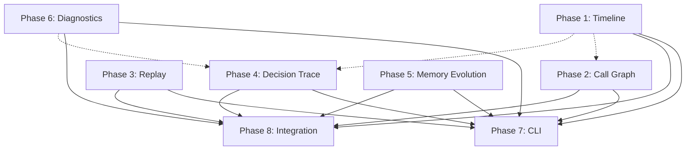

GoAgentX 已经有太多底层能力了，但还没有把这些能力“展示出来”。

说白了：

你已经有发动机
你已经有变速箱
你已经有底盘
但仪表盘还没做好

很多 Agent 框架的问题是：

能力弱
但演示效果好

而你的情况恰恰反过来：

能力很强
但用户感知不到

⸻

我看到了什么

如果只看你的描述：

Mutable DAG

运行时增删节点
增删边
热加载
动态执行

这已经比 CrewAI 强了。

⸻

Event Sourcing

17种事件
EventStore
乐观锁
DLQ
自动重试

很多 Agent 框架根本没有。

⸻

AHP 协议

心跳
进度
死信

已经是分布式系统思路了。

⸻

Checkpoint Recovery

Leader 挂了
恢复
继续执行

很多 Agent 框架直接任务丢失。

⸻

三级记忆

Session
Task
Distilled

也比大部分框架成熟。

⸻

所以我会得出一个结论：

你缺的不是 Agent 能力，而是 Runtime Intelligence（运行时智能）。

⸻

如果围绕

可观测
可解释
可调试

做特色

我会优先做下面几个。

⸻

第一名：Execution Timeline

这个性价比极高。

例如：

14:01:01 User Request
14:01:02 Leader Started
14:01:03 Search Agent Started
14:01:04 Search Tool Called
14:01:05 Tool Returned
14:01:06 LLM Invoked
14:01:09 Response Generated
14:01:10 Summary Agent Started
14:01:12 Workflow Completed

类似：

Chrome DevTools Timeline

⸻

因为用户经常会问：

为什么这么慢？

你直接给：

Tool占80%
LLM占15%
等待占5%

秒懂。

⸻

第二名：Agent Call Graph

这个和你 OmniScope 最接近。

例如：

Leader
 ├─ SearchAgent
 │    ├─ GoogleTool
 │    └─ VectorStore
 │
 ├─ CodeAgent
 │    └─ RustAnalyzer
 │
 └─ SummaryAgent

实时生成。

⸻

导出：

graph.ExportDOT()
graph.ExportMermaid()
graph.ExportJSON()

⸻

这玩意非常适合：

技术博客
项目宣传
调试

⸻

第三名：Agent Replay

这个我特别看好。

你已经有：

Event Sourcing
Checkpoint

实际上已经具备条件了。

⸻

例如：

goagentx replay task-123

直接看到：

Prompt
Memory
Tool
MCP
LLM
Output

逐步重放。

⸻

甚至：

goagentx replay task-123 --step=42

恢复到第42步。

⸻

这个对于生产问题定位非常爽。

⸻

第四名：Decision Trace

这是我觉得最有特色的。

Agent 最烦人的地方：

它做了
但不知道为什么这么做

⸻

例如：

Agent 选择 Tool A

记录：

{
  "decision":"tool_selection",
  "candidate_tools":[
    "google",
    "vector_search",
    "web_fetch"
  ],
  "selected":"google",
  "reason":"query contains current events"
}

⸻

然后 Dashboard 里展示：

Decision #17
选择 GoogleTool
原因：
涉及实时信息
置信度：
0.92

⸻

这就是：

Explainable Agent

⸻

这个方向很少人认真做。

⸻

第五名：Memory Evolution

你有蒸馏系统。

这是宝藏。

⸻

展示：

原始记忆
 ↓
提取
 ↓
分类
 ↓
评分
 ↓
去噪
 ↓
冲突消解
 ↓
长期知识

⸻

例如：

500条消息
 ↓
32条经验
 ↓
7条长期知识

⸻

用户会突然意识到：

原来 Agent 真在学习

⸻

第六名：Diagnostics

这个特别符合 Go。

例如：

Task Failed

系统自动分析：

失败原因
87%
Tool Timeout
9%
LLM Output Parse Error
4%
Memory Retrieval Failure

⸻

甚至自动生成：

建议：
提高 Tool Timeout
增加 Retry
开启 Fallback

⸻

我最喜欢的一个方向

其实不是 Prompt。

不是 RAG。

不是 Function Calling。

而是：

Agent Flight Recorder

灵感来自飞机黑匣子。

⸻

记录：

Prompt
Memory
Decision
Tool Call
MCP
Token
Cost
Latency
State

⸻

任务结束后：

goagentx inspect task-123

输出：

Task Timeline
Task Graph
Task Decisions
Task Cost
Task Replay
Task Failure Analysis

⸻

这东西和你的：

Event Sourcing
Checkpoint
AHP
Mutable DAG

天然契合。

别人需要重构。

你很多数据其实已经有了。

⸻

如果让我给 GoAgentX 定一个未来标签，我不会选：

Go Agent Framework

我会选：

Observable Multi-Agent Runtime for Go

或者更直接一点：

The Datadog / Jaeger of AI Agents, built into the runtime.

因为市场上 Agent 框架很多。

但真正能回答下面这些问题的很少：

Agent 为什么这么做？
Agent 为什么失败？
Agent 为什么慢？
Agent 花了多少钱？
Agent 学到了什么？
Agent 是如何协作的？

而你现有架构，其实已经有一半答案了。下一步不是再堆功能，而是把这些答案可视化、可查询、可回放。这样才会形成明显区别于 LangChain、CrewAI、AutoGen 的路线。
---

# Agent Flight Recorder — Task List

> Coding rules: `plan/rules/code_rules.md`
> Module: `goagentx`
> Style: all comments English, camelCase vars, PascalCase types, errgroup for goroutines, `%w` error wrapping

---

## Phase 1: Execution Timeline

Goal: Answer "why is this slow?" — show time distribution across Tool calls, LLM calls, waiting.

### 1.1 Timeline Event Types

```
Package: internal/flight/timeline.go
```

| Task | Description | Depends |
|------|-------------|---------|
| 1.1.1 | Define `TimelineEvent` struct: ID, ParentID, AgentID, Type, Name, StartAt, EndAt, Duration, Metadata | - |
| 1.1.2 | Define `EventType` constants: AgentStart, AgentEnd, ToolCall, ToolResult, LLMCall, LLMResult, Waiting, Error | - |
| 1.1.3 | Define `Timeline` struct: events slice, mu RWMutex, Add/Get/Filter methods | 1.1.1 |
| 1.1.4 | `NewTimeline()`, `Add(event)`, `GetByAgent(agentID)`, `GetByType(eventType)`, `Summary() TimelineSummary` | 1.1.3 |
| 1.1.5 | `TimelineSummary`: TotalDuration, ToolPercent, LLMPercent, WaitPercent, EventCount | 1.1.4 |
| 1.1.6 | Tests: add events, filter by agent/type, summary calculation, concurrent add | 1.1.4 |

### 1.2 Timeline Collector

```
Package: internal/flight/collector.go
```

| Task | Description | Depends |
|------|-------------|---------|
| 1.2.1 | Define `Collector` struct: timeline, eventStore, mu, Start/Stop methods | 1.1.3 |
| 1.2.2 | `Subscribe` to EventStore, convert events to TimelineEvents | 1.2.1 |
| 1.2.3 | Map EventStore event types to TimelineEvent types | 1.2.2 |
| 1.2.4 | `GetTimeline(agentID string) *Timeline` | 1.2.1 |
| 1.2.5 | Tests: collect from mock event store, filter by agent | 1.2.4 |

### 1.3 Timeline API + Dashboard

```
Package: internal/flight/api.go, internal/dashboard/static/app.js
```

| Task | Description | Depends |
|------|-------------|---------|
| 1.3.1 | `GET /timeline` endpoint: list all timelines | 1.2.4 |
| 1.3.2 | `GET /timeline/{agentID}` endpoint: single agent timeline | 1.2.4 |
| 1.3.3 | `TimelineView` JSON: events array + summary | 1.3.1 |
| 1.3.4 | Dashboard tab: timeline bar chart (Tool vs LLM vs Wait) | 1.3.2 |
| 1.3.5 | Tests: API endpoint returns correct structure | 1.3.1 |

---

## Phase 2: Agent Call Graph

Goal: Real-time agent → tool call hierarchy, exportable as Mermaid/DOT/JSON.

### 2.1 Graph Data Model

```
Package: internal/flight/graph.go
```

| Task | Description | Depends |
|------|-------------|---------|
| 2.1.1 | Define `GraphNode`: ID, Type (Agent/Tool/LLM), Name, ParentID, Children, StartAt, EndAt, Status, Metadata | - |
| 2.1.2 | Define `Graph` struct: root, nodes map, mu RWMutex | 2.1.1 |
| 2.1.3 | `NewGraph()`, `AddNode(node)`, `GetNode(id)`, `Children(id)`, `Depth() int` | 2.1.2 |
| 2.1.4 | `ExportMermaid() string`, `ExportDOT() string`, `ExportJSON() ([]byte, error)` | 2.1.3 |
| 2.1.5 | Tests: build graph, export formats, concurrent access | 2.1.4 |

### 2.2 Graph Builder

```
Package: internal/flight/graph_builder.go
```

| Task | Description | Depends |
|------|-------------|---------|
| 2.2.1 | `GraphBuilder` struct: graph, eventStore, mu | 2.1.2 |
| 2.2.2 | Subscribe to EventStore, build graph from events | 2.2.1 |
| 2.2.3 | Map agent.started → AgentNode, tool.call → ToolNode, llm.call → LLMNode | 2.2.2 |
| 2.2.4 | `GetGraph(agentID string) *Graph` | 2.2.2 |
| 2.2.5 | Tests: build graph from mock events, verify hierarchy | 2.2.4 |

### 2.3 Graph API + Dashboard

```
Package: internal/flight/api.go, internal/dashboard/static/app.js
```

| Task | Description | Depends |
|------|-------------|---------|
| 2.3.1 | `GET /graph/{agentID}` endpoint: return graph JSON | 2.2.4 |
| 2.3.2 | `GET /graph/{agentID}/mermaid` endpoint: return Mermaid text | 2.2.4 |
| 2.3.3 | Dashboard: render graph as SVG using Mermaid.js | 2.3.2 |
| 2.3.4 | Tests: API returns valid graph, Mermaid export renders | 2.3.1 |

---

## Phase 3: Agent Replay

Goal: `goagentx replay task-123 --step=42` — step-by-step task replay using Event Sourcing.

### 3.1 Replay Engine

```
Package: internal/flight/replay.go
```

| Task | Description | Depends |
|------|-------------|---------|
| 3.1.1 | `ReplaySession` struct: events, currentStep, totalSteps, snapshots | - |
| 3.1.2 | `NewReplaySession(eventStore, taskID) (*ReplaySession, error)` — loads all events for task | 3.1.1 |
| 3.1.3 | `Step() (*ReplayStep, error)` — advance one step | 3.1.2 |
| 3.1.4 | `StepTo(n int) (*ReplayStep, error)` — jump to step N | 3.1.2 |
| 3.1.5 | `Current() *ReplayStep` — current step info | 3.1.2 |
| 3.1.6 | `ReplayStep` struct: StepNum, EventType, AgentID, Input, Output, Duration, Snapshot | - |
| 3.1.7 | `Summary() ReplaySummary` — total steps, duration, agents involved | 3.1.2 |
| 3.1.8 | Tests: load events, step forward, jump to step, summary | 3.1.7 |

### 3.2 Replay API

```
Package: internal/flight/api.go
```

| Task | Description | Depends |
|------|-------------|---------|
| 3.2.1 | `POST /replay/{taskID}` endpoint: create replay session, return session ID | 3.1.2 |
| 3.2.2 | `GET /replay/{sessionID}/step` endpoint: advance one step | 3.1.3 |
| 3.2.3 | `GET /replay/{sessionID}/step/{n}` endpoint: jump to step N | 3.1.4 |
| 3.2.4 | `GET /replay/{sessionID}/summary` endpoint: replay summary | 3.1.7 |
| 3.2.5 | Tests: create session, step through, jump, summary | 3.2.4 |

---

## Phase 4: Decision Trace

Goal: Record WHY agents made decisions — explainable AI.

### 4.1 Decision Model

```
Package: internal/flight/decision.go
```

| Task | Description | Depends |
|------|-------------|---------|
| 4.1.1 | `Decision` struct: ID, AgentID, Type, Candidates []string, Selected string, Reason string, Confidence float64, Timestamp | - |
| 4.1.2 | `DecisionType` constants: ToolSelection, LLMModelSelection, MemoryRetrieval, RetryDecision, RoutingDecision | - |
| 4.1.3 | `DecisionLog` struct: decisions slice, mu RWMutex, Add/Get/Filter methods | 4.1.1 |
| 4.1.4 | `NewDecisionLog()`, `Add(d Decision)`, `GetByAgent(agentID)`, `GetByType(dType)` | 4.1.3 |
| 4.1.5 | Tests: add decisions, filter, concurrent access | 4.1.4 |

### 4.2 Decision Collector

```
Package: internal/flight/decision_collector.go
```

| Task | Description | Depends |
|------|-------------|---------|
| 4.2.1 | `DecisionCollector` struct: log, mu | 4.1.3 |
| 4.2.2 | `Record(decision Decision)` — add to log + emit event | 4.2.1 |
| 4.2.3 | Integrate with callbacks: hook into tool selection, LLM call | 4.2.2 |
| 4.2.4 | Tests: record decisions, verify event emission | 4.2.3 |

### 4.3 Decision API + Dashboard

```
Package: internal/flight/api.go, internal/dashboard/static/app.js
```

| Task | Description | Depends |
|------|-------------|---------|
| 4.3.1 | `GET /decisions` endpoint: list all decisions, filter by agent/type | 4.1.4 |
| 4.3.2 | Dashboard: decision list with candidate/selected/reason/confidence | 4.3.1 |
| 4.3.3 | Tests: API returns correct structure | 4.3.1 |

---

## Phase 5: Memory Evolution

Goal: Visualize memory distillation — 500 messages → 32 experiences → 7 long-term knowledge.

### 5.1 Memory Pipeline Model

```
Package: internal/flight/memory_pipeline.go
```

| Task | Description | Depends |
|------|-------------|---------|
| 5.1.1 | `PipelineStage` struct: Name, InputCount, OutputCount, Duration, Timestamp | - |
| 5.1.2 | `MemoryPipeline` struct: stages slice, mu RWMutex | 5.1.1 |
| 5.1.3 | `NewMemoryPipeline()`, `AddStage(stage)`, `Stages() []PipelineStage`, `Summary() PipelineSummary` | 5.1.2 |
| 5.1.4 | `PipelineSummary`: TotalInput, TotalOutput, CompressionRatio, TotalDuration | 5.1.3 |
| 5.1.5 | Tests: add stages, summary calculation | 5.1.4 |

### 5.2 Memory Pipeline Collector

```
Package: internal/flight/memory_collector.go
```

| Task | Description | Depends |
|------|-------------|---------|
| 5.2.1 | `MemoryCollector` struct: pipeline, memManager, mu | 5.1.2 |
| 5.2.2 | Hook into memory distillation events, record pipeline stages | 5.2.1 |
| 5.2.3 | `GetPipeline(sessionID string) *MemoryPipeline` | 5.2.2 |
| 5.2.4 | Tests: collect from mock memory manager | 5.2.3 |

### 5.3 Memory Pipeline API

```
Package: internal/flight/api.go
```

| Task | Description | Depends |
|------|-------------|---------|
| 5.3.1 | `GET /memory/pipeline` endpoint: list pipelines | 5.2.3 |
| 5.3.2 | `GET /memory/pipeline/{sessionID}` endpoint: single pipeline | 5.2.3 |
| 5.3.3 | Dashboard: pipeline visualization (funnel chart) | 5.3.2 |
| 5.3.4 | Tests: API returns correct structure | 5.3.1 |

---

## Phase 6: Diagnostics

Goal: Automatic failure root cause analysis — "87% Tool Timeout, 9% LLM Parse Error".

### 6.1 Failure Model

```
Package: internal/flight/diagnostics.go
```

| Task | Description | Depends |
|------|-------------|---------|
| 6.1.1 | `DiagnosticRecord` struct: ID, AgentID, TaskID, Category, RootCause, Timestamp, Duration, Context | - |
| 6.1.2 | `DiagnosticCategory` constants: ToolTimeout, LLMError, ParseError, MemoryError, NetworkError, Unknown | - |
| 6.1.3 | `DiagnosticsEngine` struct: records slice, mu RWMutex | 6.1.1 |
| 6.1.4 | `NewDiagnosticsEngine()`, `Record(f DiagnosticRecord)`, `GetByAgent(agentID)`, `Distribution() map[DiagnosticCategory]float64` | 6.1.3 |
| 6.1.5 | `Suggest(f DiagnosticRecord) []string` — return fix suggestions based on category | 6.1.2 |
| 6.1.6 | Tests: record failures, distribution calculation, suggestions | 6.1.5 |

### 6.2 Failure Collector

```
Package: internal/flight/diagnostics_collector.go
```

| Task | Description | Depends |
|------|-------------|---------|
| 6.2.1 | `FailureCollector` struct: analyzer, eventStore, mu | 6.1.3 |
| 6.2.2 | Subscribe to error events, classify failures | 6.2.1 |
| 6.2.3 | Auto-classify based on error message patterns | 6.2.2 |
| 6.2.4 | Tests: collect from mock events, verify classification | 6.2.3 |

### 6.3 Failure API + Dashboard

```
Package: internal/flight/api.go, internal/dashboard/static/app.js
```

| Task | Description | Depends |
|------|-------------|---------|
| 6.3.1 | `GET /failures` endpoint: list failures, filter by agent/category | 6.1.4 |
| 6.3.2 | `GET /failures/distribution` endpoint: category distribution | 6.1.4 |
| 6.3.3 | Dashboard: failure pie chart + suggestion list | 6.3.2 |
| 6.3.4 | Tests: API returns correct structure | 6.3.1 |

---

## Phase 7: Flight Recorder CLI

Goal: `goagentx inspect task-123` — unified CLI for all flight recorder features.

```
Package: cmd/flight/main.go
```

| Task | Description | Depends |
|------|-------------|---------|
| 7.1 | `goagentx inspect <taskID>` — print timeline + graph + decisions + failures | 1-6 |
| 7.2 | `goagentx inspect <taskID> --format=mermaid` — export graph as Mermaid | 2.1.4 |
| 7.3 | `goagentx inspect <taskID> --format=json` — export all as JSON | 1-6 |
| 7.4 | `goagentx replay <taskID>` — interactive step-by-step replay | 3.1.2 |
| 7.5 | `goagentx replay <taskID> --step=N` — jump to step N | 3.1.4 |
| 7.6 | Tests: CLI output format, replay flow | 7.5 |

---

## Phase 8: Integration + Dashboard

Goal: Unified Flight Recorder tab in dashboard, WebSocket real-time updates.

| Task | Description | Depends |
|------|-------------|---------|
| 8.1 | `FlightRecorder` struct: aggregates Timeline, Graph, DecisionLog, DiagnosticsEngine | 1-6 |
| 8.2 | `NewFlightRecorder(eventStore, memManager)` constructor | 8.1 |
| 8.3 | `Start(ctx)`, `Stop()` — subscribe/unsubscribe to event store | 8.2 |
| 8.4 | Dashboard "Flight" tab: timeline + graph + decisions + failures | 8.3 |
| 8.5 | WebSocket: broadcast flight events in real-time | 8.3 |
| 8.6 | `GET /flight/{taskID}` endpoint: unified flight data | 8.3 |
| 8.7 | Tests: integration test with mock event store | 8.6 |

---

## File Layout

```
internal/flight/
├── timeline.go           # TimelineEvent, Timeline, TimelineSummary
├── collector.go          # Timeline Collector (EventStore → Timeline)
├── graph.go              # GraphNode, Graph, export formats
├── graph_builder.go      # Graph Builder (EventStore → Graph)
├── replay.go             # ReplaySession, ReplayStep
├── decision.go           # Decision, DecisionLog
├── decision_collector.go # Decision Collector
├── memory_pipeline.go    # PipelineStage, MemoryPipeline
├── memory_collector.go   # Memory Collector
├── diagnostics.go            # DiagnosticRecord, DiagnosticsEngine
├── diagnostics_collector.go  # Failure Collector
├── recorder.go           # FlightRecorder (aggregates all)
├── api.go                # REST endpoints for all features
└── *_test.go             # Tests

cmd/flight/
└── main.go               # CLI: inspect, replay

internal/dashboard/static/
├── app.js                # Add "Flight" tab
└── index.html            # Add flight view div
```

---

## Dependencies Between Phases



Phases 1-6 can be parallelized. Phase 7 and 8 depend on all of 1-6.

---

## Estimated Effort

| Phase | Tasks | Estimate |
|-------|-------|----------|
| 1. Execution Timeline | 11 | 2d |
| 2. Agent Call Graph | 11 | 2d |
| 3. Agent Replay | 13 | 2.5d |
| 4. Decision Trace | 9 | 1.5d |
| 5. Memory Evolution | 11 | 2d |
| 6. Diagnostics | 13 | 2d |
| 7. CLI | 6 | 1d |
| 8. Integration + Dashboard | 7 | 1.5d |
| **Total** | **81** | **~14.5d** |
